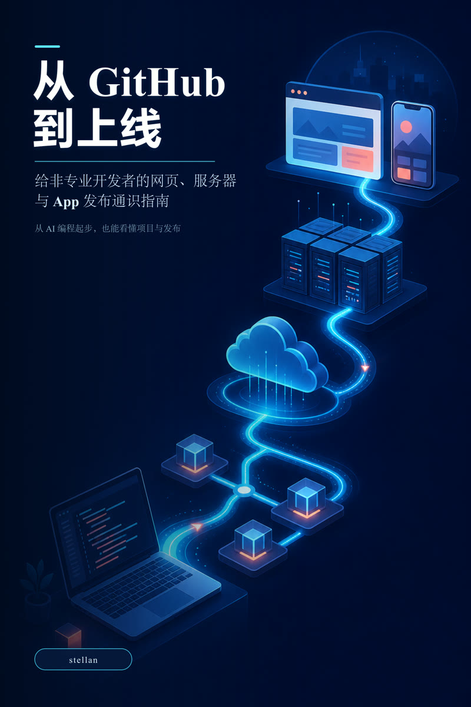

  

<h1 align="center">从 GitHub 到上线</h1>

给非专业开发者的网页、服务器与 App 发布通识指南

<strong>作者 stellan</strong>

AI Coding · Vibe Coding · GitHub · Web Deployment · Linux Server · Docker · Flutter · App Release

  <a href="CONTENTS.md">查看完整目录</a>

## 为什么写这本书

越来越多人的第一次编程经历，直接从一句交给 AI 的需求开始，他们此前没有经过课堂、教材或手写代码的训练。AI 可以在很短的时间里生成网页、后端、数据库配置和手机 App，也能继续修改错误、补充功能并完成部署。门槛确实降低了，新的问题也随之出现。一个人可能已经拿到看起来完整的项目，却不知道 GitHub 仓库保存了什么，不清楚 Commit 和 Push 的区别，也说不明白服务器、域名、环境变量、构建日志和运行日志分别处在什么位置。

当 AI 产出的内容无法运行，很多初学者只能继续把错误截图发给 AI，反复要求它再改一次。项目偶然上线以后，他们仍然难以判断修改是否安全、密钥有没有泄露、数据库能不能恢复、应用商店为什么拒绝上传。这里缺少的并不只是几条命令，而是一套足够支撑沟通、检查和决策的基础认识。

量化交易提供了一个很容易理解的参照。算法可以给出答案，长期观察市场形成的经验仍会影响一个人面对重大决策时的判断。AI 编程也有相似的一面。你不必重新走完专业程序员的全部训练，也不必拒绝 AI 带来的效率，但应该亲手经历仓库创建、版本提交、本地运行、部署、看日志、排错和恢复。做过这些事情以后，你才能知道一个成功状态究竟证明了什么，也能发现 AI 省略了哪些检查。

这本书因此选择补上 AI 生成代码与真实产品之间的空白。它不以培养专业程序员或运维工程师为目标，而是帮助缺少科班训练的 AI Coding 使用者建立一张完整的工程地图。读完以后，你应该更容易描述需求、理解术语、限制修改范围、核对验证证据，并把一个本地项目稳妥地推进到网页、服务器或应用商店。

## 它想解决的问题

- AI 修改了很多文件，却不知道哪些变化真正对应自己的需求
- 会让 AI 生成代码，却不会创建 GitHub 仓库、提交版本或恢复改坏的内容
- 分不清前端、后端、API、数据库、部署平台和服务器各自负责什么
- 网页打不开时，只知道继续改代码，不会检查 DNS、HTTP 状态码、构建日志和运行日志
- 会复制 SSH、Linux 或 Docker 命令，却不知道命令在哪里运行、成功后应看到什么
- 项目能启动，却无法判断密钥、权限、备份、端口和数据库暴露是否安全
- Flutter 项目已经生成，却不理解 Android 签名、AAB、TestFlight 和商店审核
- AI 声称任务完成以后，不知道应该检查 Diff、测试、日志、回滚方案还是实际用户路径
- 想把作品做成可长期维护的商用产品，却缺少成本、故障、安全和更新方面的基本判断

## 这本书写给谁

这本书主要写给从 AI 编程起步的人，也适合独立开发者、产品经理、设计师、内容创作者和需要与技术团队协作的创业者。你可以不会写复杂代码，但应该愿意亲手完成少量关键操作，并根据实际结果作出判断。

如果你正在使用 ChatGPT、Codex、Claude Code、Cursor、GitHub Copilot、Replit、Lovable、Bolt 或其他 AI Coding 工具制作网站和软件，书中的知识可以帮助你把提示词以外的环节连接起来。工具会变化，仓库、构建、网络、服务器、日志、安全和发布这些基本关系不会因为界面更新而消失。

## 全书讲什么

全书共十卷、104 章，正文约 67.8 万中文字符。内容从软件如何来到用户面前开始，逐步进入 GitHub、Web 系统、网页部署、后端和数据库、Linux 服务器、Docker、Flutter、应用商店、日志排错、安全维护，以及与 AI 协作时的工程判断。

| 分卷 | 核心内容 | 读完能够处理的事情 |
| --- | --- | --- |
| 第一卷 | 本地电脑、GitHub、部署平台、服务器和用户设备 | 看懂软件发布链路，知道问题可能发生在哪一层 |
| 第二卷 | Git、GitHub、GitHub Desktop、分支、冲突和秘密保护 | 保存版本、审查变化、同步项目并避免提交敏感信息 |
| 第三卷 | 浏览器、DNS、HTTP、Cookie、API 和 DevTools | 看懂网页请求，利用 Console 和 Network 定位问题 |
| 第四卷 | GitHub Pages、Cloudflare Pages、Vercel、Render 和域名 | 把网页发布到互联网，检查构建日志并完成回滚 |
| 第五卷 | 后端、身份认证、数据库、对象存储和 BaaS | 理解动态产品的数据流、安全边界和托管选择 |
| 第六卷 | VPS、SSH、Linux、systemd、防火墙和反向代理 | 登录服务器、查看服务和日志，理解长期维护责任 |
| 第七卷 | Docker、Dockerfile、Volume 和 Docker Compose | 部署多容器应用，处理日志、持久化、更新和清理风险 |
| 第八卷 | Flutter、Android 签名、AAB、Xcode 和 TestFlight | 理解 App 打包、测试、上传、审核和更新流程 |
| 第九卷 | 故障定位、日志、安全、备份、监控和维护 | 从现象找到故障层级，向 AI 提供完整证据并安全恢复 |
| 第十卷 | AI 协作、架构、测试、可靠性、方案选择和项目治理 | 检查 AI 的完成声明，控制范围、依赖和长期复杂度 |

完整章节名称见 [CONTENTS.md](CONTENTS.md)。

## 这本书怎样使用例子和配图

正文不把视频或图片当成解释的替代品。关键流程会先用文字讲清楚，再配合系统地图、请求流程、部署路线、Docker 数据持久化图、App 发布流程和故障树。需要观察界面变化的操作，才会推荐 GitHub Desktop、Chrome DevTools、SSH、Docker Compose、部署平台控制台和 Flutter 发布视频。

书中的练习既包括正常操作，也包括范围受控的失败场景。读者可以借此看到不同错误对应的日志和状态。例如网页返回 404 只能说明请求已经到达某个服务，不能证明数据库正常。容器显示正在运行，也不能证明用户能够完成登录。每个结果都要结合它能证明的范围来理解。

## 内容与阅读

当前版本为 `2.1.0`，全书使用适合手机、平板和电脑阅读的可重排版式制作。[完整目录](CONTENTS.md)列出了十卷、104 章的全部内容。

全书涵盖 AI 编程、Vibe Coding、GitHub 入门、GitHub Desktop、网站部署、域名与 DNS、Vercel、Cloudflare Pages、Linux 服务器、VPS、SSH、Docker、Docker Compose、PostgreSQL、Supabase、Firebase、Flutter、Android、iOS、TestFlight、App Store Connect、日志排错、网络安全、软件测试和独立开发。你可以按顺序通读，也可以从正在处理的问题进入对应章节。

## 反馈

如果你发现术语解释不清、操作界面已经变化、命令存在风险，或者 EPUB 在特定阅读器中显示异常，可以在仓库提交 Issue。反馈时请附上章节、设备或操作系统、软件版本、实际现象和已经尝试的步骤。这些信息能显著减少来回猜测。

## 书籍信息

- 书名　《从 GitHub 到上线》
- 副标题　给非专业开发者的网页、服务器与 App 发布通识指南
- 作者　stellan
- 当前版本　2.1.0
- 规模　十卷、104 章、约 67.8 万中文字符
