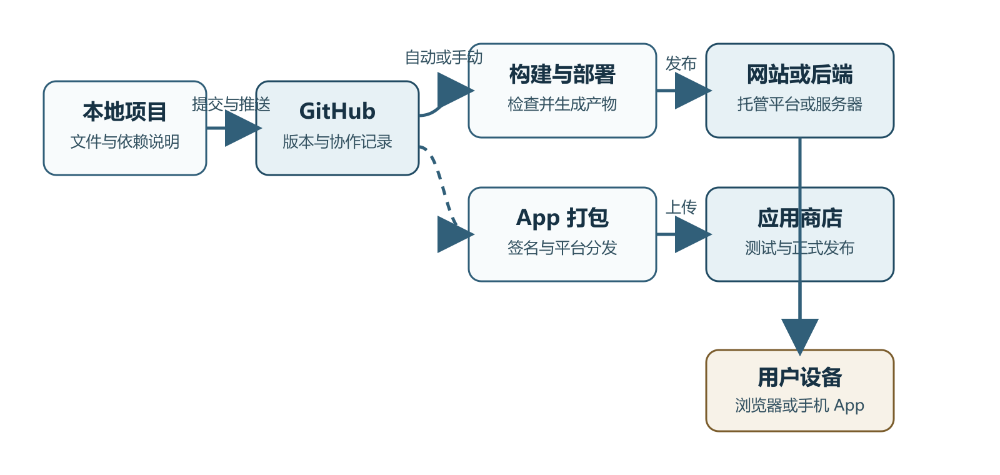
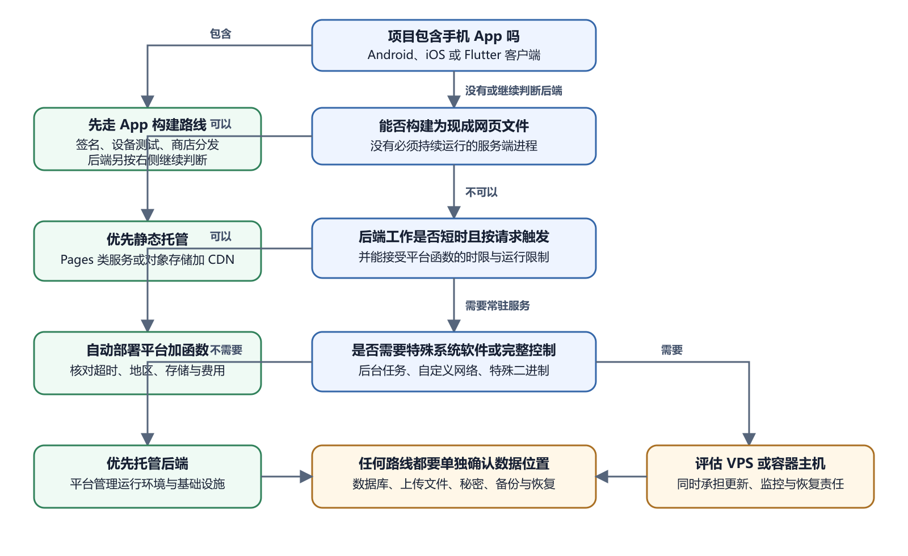

# 从本地文件到公开可用的产品

你让 AI 做出一个网页，屏幕上已经能看见按钮、图片和文字。项目文件也在电脑里，双击某个文件或者运行一条命令以后，网页确实能打开。事情做到这里，离别人能够稳定使用它还有一段路。这段路并不神秘。文件要先有一个可靠的版本记录，再交给某个地方构建或运行。用户输入域名以后，浏览器还要找到提供内容的机器，发出请求，收到响应，最后把得到的文件拼成页面。手机 App 多出打包、签名和分发几步。它安装到手机以后，若仍要登录、同步数据或调用 AI，远处的后端服务还得继续工作。

初学者常在这里失去方向，因为界面只展示眼前一步。GitHub 页面让人看见文件，部署平台显示一次构建，域名控制台显示几条记录，服务器终端里又是另一套命令。每个地方都像一件独立工具。把它们放回一条链路以后，许多问题会变得容易判断。

*项目从本地文件到用户设备的发布链路*

图中的文字关系可以这样读。本地项目经过提交和推送进入 GitHub。发布系统从 GitHub 取得指定版本，检查依赖并生成可运行的产物。网站产物被放到托管平台或服务器，用户通过域名和 HTTPS 访问。手机 App 的源代码经过平台工具构建、签名和测试分发，随后安装到用户设备。App 若依赖远程数据，还会继续向网站后端发请求。

## 先看一个发布现场

小林请 AI 做了一个活动介绍页；本地预览地址是 `http://localhost:5173`，页面看起来正常；他把这个地址发给朋友，朋友却打不开；`localhost` 表示“当前这台设备”。小林电脑上的 `localhost` 指向小林的电脑，朋友手机上的 `localhost` 指向朋友的手机。开发服务器只在小林本机运行，也没有一个可供公网访问的入口。这次失败与页面颜色、按钮代码和浏览器型号无关。缺少的是公开托管。

小林随后把项目上传到 GitHub，又把仓库页面地址发给朋友。朋友这次能看见文件列表，仍然没有看到网站。GitHub 仓库保存项目文件，仓库页面不会自动把任意项目当成网站运行。他还需要启用适合静态站点的发布服务，或者连接一个部署平台。

部署平台第一次构建失败，日志最后写着没有找到 `npm` 构建所需的 `package.json`。检查后发现，仓库最外层还有一层同名文件夹，真正项目在子目录中。平台从错误目录开始构建，所以找不到依赖清单。设置正确的 Root Directory 后，构建成功，平台给出一个公开地址。

这个小例子经过了四个位置；开发地址只在本机有效；GitHub 地址展示版本；部署平台把版本变成网站；公开地址才是朋友的浏览器可以使用的入口；错误提示也始终在告诉我们发生问题的位置；以后看到一串陌生名词，可以先问三个朴素问题。

1. 用户最终打开哪个地址或安装哪个文件。
2. 这个结果由谁生成，生成时读取哪些项目文件。
3. 失败后，哪个界面留下了最接近错误发生处的记录。

这三个问题能把很多“发布失败”缩小成可以观察的一步。

## 电脑里的文件还只是原料

一个项目最初通常只是某个文件夹。里面可能有 HTML、CSS 和 JavaScript，也可能有图片、配置、依赖清单、测试和说明文档。Flutter 项目还会包含 Dart 代码以及 Android、iOS 等平台目录。文件夹里的内容很重要，用户却不能因为这些文件存在就直接使用产品。

浏览器认识 HTML、CSS、JavaScript、图片和其他网页资源。它收到这些文件以后，会解析 HTML 的结构，应用 CSS 的样式，再执行 JavaScript 提供的交互。一个简单静态网站可以直接把这些文件交给浏览器。复杂项目往往要先运行构建工具，把源代码处理成浏览器更适合读取的文件。MDN 对网页加载过程的说明指出，一次页面访问通常会产生多个请求。浏览器先取得主要 HTML，解析过程中又发现样式、脚本和图片，于是继续请求这些资源。

这也解释了一个很常见的现象。你在电脑上双击 `index.html`，页面能打开，上传后却少了图片。页面文件本身可能没有坏，图片路径在新位置失效了。另一种项目只能通过开发命令打开，直接双击 HTML 得不到正常页面。它可能依赖构建工具、开发服务器或运行时。只看到文件扩展名，判断不了完整运行方式。

源代码和构建产物需要分开理解。源代码方便人和工具修改。构建产物是构建过程生成、准备交给浏览器或操作系统运行的结果。有些静态项目的源代码本身就接近最终产物。有些前端项目会把许多源文件转换、合并和压缩，再放进 `dist`、`build` 或项目自己指定的输出目录。目录名没有统一保证，必须看项目说明和构建配置。

手机 App 的距离更长。Flutter 官方的架构说明写得很明确。开发阶段的 Flutter 应用运行在支持热重载的虚拟机中，发布时则会为目标平台编译。不同平台还要通过各自的嵌入层接入窗口、输入、无障碍和系统服务。电脑里的一组 Dart 文件不会自动变成 Android 安装包，也不会自动成为可以提交给 Apple 的应用版本。

## GitHub 负责保存可以追溯的版本

项目在本地能够运行以后，下一步通常是进入 Git 仓库，再同步到 GitHub。Git 记录文件怎样变化。GitHub 保存远程仓库，也提供网页查看、协作、自动化和发布等功能。把代码放到 GitHub 有几个直接作用。电脑损坏时，远程仓库能保留已经推送的版本。你让 AI 修改项目以后，可以查看这次到底改了哪些文件。部署平台能够从一个明确的仓库和分支取得代码。出现问题时，还可以找到最近一次正常提交，对比故障前后发生了什么。

远程仓库并不自动等于线上网站。一个仓库可以一直存在，却没有任何公开网页。也可能有一个网站已经上线，仓库后来被设为私有。GitHub 保存的是项目及其版本关系。让用户访问，需要额外的发布步骤。GitHub Pages 是 GitHub 提供的一条静态网站发布路线，其他平台也可以连接 GitHub 仓库，在每次推送后重新构建和发布。

Commit 和 Push 在这条链路上承担不同工作。Commit 把一组本地改动记录成一个版本。Push 把本地已有的提交发送到远程仓库。文件保存成功，不代表已经提交。提交成功，也不代表已经推送。部署平台若只监听远程仓库，本地那次修改没有 Push，它就看不到。

这些词听起来像 Git 的专业知识，眼前只需要抓住一件事。一个可追溯的项目需要知道哪一批文件属于同一次修改，以及这次修改有没有送到远程。更复杂的分支、合并和冲突处理会在第二卷展开。

## 构建系统把项目变成能发布的结果

部署平台连接仓库以后，通常要完成几件事。它取得某个提交，准备运行环境，安装依赖，执行构建命令，再把输出目录中的文件发布出去。动态应用还可能启动持续运行的后端进程。这几步中任何一步失败，用户都可能只看到一个笼统的部署失败提示。真正原因往往在构建日志里。Node.js 版本不合适、依赖安装失败、构建命令写错、环境变量缺失、输出目录填错，都发生在用户访问网站以前。此时查 DNS 没有帮助，因为网站产物还没有生成。

构建和运行也要分开。构建发生在准备发布版本时。它把代码和资源变成产物，失败以后通常没有新版本可用。运行发生在用户访问期间。后端已经成功部署，后来因为数据库断开、内存耗尽或第三方接口失败而报错，属于运行阶段。部署平台经常分别提供 Build Log 和 Runtime Log，正是因为两个阶段的问题不同。

静态网站没有持续运行的业务后端，发布以后主要是把文件交给浏览器。动态应用需要在请求到来时执行服务端代码，查询数据库，检查登录状态，处理上传或调用第三方服务。MDN 的客户端与服务器说明用一个很直观的过程解释动态请求。浏览器把请求送到服务端应用，应用根据请求读取数据库或完成其他工作，再返回 HTML 或数据。

你可以把网站交给 GitHub Pages、Cloudflare Pages、Vercel、Render 等托管平台，也可以租一台 VPS 自己部署。两条路线最后都要解决几个共同问题。

- 代码或构建产物放在哪里
- 用什么运行环境
- 用户请求从哪里进入
- 域名怎样找到服务
- HTTPS 怎样建立加密连接
- 日志在哪里查看
- 数据怎样保存和备份
- 新版本失败时怎样回到旧版本

托管平台把其中一部分工作做成控制台选项。你连接仓库，填写构建命令和环境变量，平台负责准备机器、运行构建、分配访问地址，有时也自动处理证书。自建服务器把更多责任交回给使用者。你要登录 Linux，安装软件，配置服务持续运行，设置反向代理、防火墙和备份，还要处理系统更新与磁盘空间。

两条路线没有适用于所有项目的固定胜负。一个只有几页文字和图片的静态网站，托管平台通常更省事。一个需要特殊系统软件、长期后台任务或完全控制运行环境的服务，可能更适合自建服务器。若项目包含数据库，也可以把网页托管、后端和数据库分别交给不同服务。

Docker 出现在这里，是因为应用常常依赖特定运行环境。Docker 官方把容器说明为一种相对隔离的运行环境，可以把应用所需内容一起打包和运行。它能减少环境差异，仍然不会替你完成域名、备份、秘密管理和服务监控。容器也不会让错误的配置自动正确。

## 选择发布路线时先减少责任

初次发布时，不必从工具名开始选。先看项目需要什么，再选择承担相应工作的服务。

*个人项目发布路线决策树*

这幅决策树可以用白话读完；手机 App 先完成客户端构建、签名和设备测试；App 若有远程后端，后端再按网页服务继续判断；网页能够构建成现成文件时，优先考虑静态托管。它需要在请求到来时运行少量服务端代码，可以考虑平台函数。需要常驻进程而又没有特殊系统要求时，托管后端通常减少系统管理工作。只有确实需要完整系统控制时，再认真评估 VPS。

“减少责任”不等于选择功能最少的平台。它表示把与产品目标无关、但必须长期完成的工作交给可靠服务。静态托管通常替你处理文件分发与证书。托管数据库通常替你处理数据库进程和部分备份能力。你仍要管理账户权限、数据结构、费用和恢复验证。

例如，一个餐厅菜单网站只有文字和图片。租 VPS 后，你还要更新 Linux、配置 Web 服务器、处理证书和监控磁盘。静态托管已经能完成用户目标，额外服务器责任不会让菜单更好用。另一个例子是图片转码服务。它要运行特定二进制程序，处理任务可能持续数分钟，还要保存大量文件。某些短时函数平台会限制执行时间、内存或临时磁盘。此时常驻容器服务或 VPS 可能更合适。选择依据来自工作负载，不来自哪个控制台看起来更专业。

数据位置要单独决定。网页放在静态托管，不妨碍账号和数据放在 Supabase 或其他后端。后端运行在 VPS，也不要求数据库一定装在同一台机器。把组件拆开可以减少单台机器故障的影响，也会增加账户、网络和费用管理。初学者应先选能说清责任的位置组合。

> 一句话结论
>
> 先选能完成当前目标、又让你承担最少长期系统工作的路线。需要更多控制时，再增加服务器和容器责任。

## 一张发布前的责任清单

准备让别人使用以前，把下面每项写出负责人和检查入口。负责人可以是你、团队成员或平台。写“平台负责”时，还要知道平台控制台在哪里显示结果。

| 项目 | 需要回答的问题 | 最小证据 |
| --- | --- | --- |
| 源代码 | 正式版本保存在哪里 | 远程仓库与提交编号 |
| 构建 | 谁执行构建命令 | 成功日志与产物目录 |
| 运行 | 程序在哪个环境运行 | 部署记录或服务状态 |
| 域名 | 名称指向哪个入口 | DNS 记录与公开访问 |
| HTTPS | 证书由谁申请和续期 | 浏览器安全连接与证书状态 |
| 数据 | 数据库和上传文件放在哪里 | 存储配置与恢复记录 |
| 秘密 | 密钥由哪个受控位置保存 | 变量名称和权限，不记录真实值 |
| 日志 | 构建和运行错误在哪里看 | 日志入口与最近时间 |
| 费用 | 哪些资源可能收费 | 官方账单页面与预算提醒 |
| 下线 | 不再使用时怎样停止 | 域名、服务、数据和账号清单 |

这张表会暴露一个常见空白。项目能部署，但没人知道数据怎样恢复。此时不要等到数据库出错后再研究备份。先做一次不影响生产的恢复测试，才能把“平台显示已备份”变成可用证据。

网站已经发布后，平台通常先给一个默认地址。绑定自定义域名时，需要在域名的 DNS 设置中加入记录，让查询者知道这个名称应该指向哪个平台或服务器。浏览器得到目标地址以后，再建立网络连接并发送 HTTP 请求。

HTTPS 在 HTTP 外增加加密和身份验证所需的 TLS 机制。它保护浏览器与服务之间传输的内容，不能保证网站代码没有漏洞，也不能保证经营者值得信任。证书配置成功以后，浏览器地址栏通常会显示安全连接标志。配置错误、证书过期或域名指向错误时，浏览器可能阻止访问或给出警告。

域名和服务必须续费或保持账户有效。DNS 记录也可能因为迁移平台而改变。网站文件没有改，域名到期后同样会打不开。反过来，域名解析正常，后端进程停止了，用户仍会得到错误响应。后面排错时，我们会反复回到这条链路，判断问题发生在域名、网络、入口、应用还是数据层。

## App 发布多出平台签名与审核

手机 App 也从源代码开始，却不能像静态网页一样把文件放到一个公开目录就结束。Android 发布通常要生成签名后的 APK 或 AAB。APK 可以用于某些安装和测试场景，Google Play 发布通常围绕 App Bundle、测试轨道和商店资料展开。iOS 发布需要 macOS、Xcode、签名身份、描述文件以及 App Store Connect 中的应用记录。

签名让系统能够识别发布者和后续更新之间的连续关系。包名、Application ID、Bundle ID、版本号和构建号也参与识别应用。随意更换这些标识，可能让更新被当成另一个应用，或导致上传失败。

应用商店处理的是客户端分发。后端部署处理的是远程服务。两者可以在不同时间更新。App 已经通过审核并安装到手机上，后端停机后，依赖登录、同步和在线内容的功能仍会失效。一个完全离线、只保存本地数据的 App，受到的影响会少一些。

因此 App 出错时要先问位置。应用打不开，可能是客户端崩溃。登录失败，可能是后端、网络或认证服务。商店拒绝上传，可能是签名、版本号、权限声明或商店政策。所有错误都显示在手机上，不代表错误都发生在手机里。

## 两个产品走完发布过程

先看一个静态知识页。它使用 HTML、CSS 和少量 JavaScript，内容来自仓库中的 Markdown 文件。开发者在本地预览，确认导航和手机布局，再提交并推送。静态部署平台执行构建，把 Markdown 转为 HTML，将输出目录发布到默认域名。开发者随后添加自己的域名，平台申请 HTTPS 证书。

这条路线没有业务数据库，也没有持续运行的应用进程；维护重点是源代码、构建、域名和外部链接；一次更新失败时，旧部署仍可继续服务；查看构建日志能判断新版本为什么没有生成；再看一个预约 App。Flutter 客户端显示可选时间，后端检查时段是否仍空闲，数据库保存预约，邮件服务发送确认。客户端代码要分别生成 Android 和 iOS 构建。后端则部署到能持续处理请求的平台，数据库由托管服务运行。

用户点击预约时，手机先向后端发请求。后端不能只相信手机显示的时间仍可用，它要再次查询数据库，并以能够避免重复预约的方式写入。写入成功后，才返回预约编号。邮件发送可以稍后完成，失败时应留下可重试记录。

这个产品有至少四类成功。App 安装成功，说明客户端构建和签名可用。后端健康检查成功，说明服务能响应指定请求。测试预约写入成功，说明 API 与数据库能协作。确认邮件到达，说明外部邮件服务也可用。只验证第一项，不能宣称整个预约流程已经上线。

两个例子都使用 GitHub，却需要不同发布安排。知识页的最终产物是网页文件。预约产品包含两个商店客户端和多个远程服务。先画清组件，再选平台，会比照抄一份部署教程可靠。

## 发布状态要用时间和版本描述

“已经上线”这句话太宽。一次准确交接应写明版本、环境、时间和验证结果。例如，“提交 `a1b2c3d` 已于 2026 年 8 月 5 日发布到生产环境，公开首页与登录流程已在 Chrome 和手机浏览器验证，邮件通知尚未验证”。

提交编号可以使用能唯一辨认的短段，正式记录最好保留完整值。部署平台还可能生成独立部署编号；App 使用版本名和构建号；数据库使用迁移编号；这些标识让后来的人能找回当时的真实组合；时间也要带时区。服务器日志常用 UTC，读者所在地区可能使用北京时间。比较 GitHub 提交、部署日志和用户报错时，先确认显示时区，避免把先后顺序看反。

验收记录允许写未完成。未知项写清楚，比用一句“应该没问题”更有用。没有 Mac 时，iOS 构建就标记为未实机验证。没有真实域名时，只验证平台默认域名。证据边界会告诉下一位维护者还要做什么。

团队常把 Deploy 译为部署；它通常表示把一个版本放入某个环境；这个环境可以是预览，也可以是生产；一次部署成功，只能说明目标环境接收了版本；Publish 常译为发布，具体含义由平台决定。它可能表示把预览版本切换到生产，也可能表示把 App 版本提交给测试用户或商店。按钮写着 Publish 时，先看目标对象和官方说明。

“上线”是日常说法，本书用它表示目标用户已经能通过预定入口使用，并且关键流程完成验收。因此部署成功后，还要检查生产域名、真实设备和必要的后端功能。这样记录能避免把平台的一步成功扩大成整个产品成功。

## 发布完成需要用户能够真实使用

工程工具经常给出多个含义不同的成功状态。

- 命令退出码为零，说明这次命令没有报告失败
- 测试通过，说明现有测试覆盖的行为符合预期
- 构建成功，说明构建产物生成了
- 部署成功，说明平台接受并发布了一个版本
- 健康检查通过，说明指定检查在当时得到预期响应
- 用户可用，说明真实设备、真实地址和主要操作经过验收

这些状态互有关联，不能互相替代。构建成功以后，环境变量可能在运行时缺失。部署平台显示成功，DNS 可能仍指向旧地址。首页能打开，登录请求可能返回 500。AI 说已经完成，只能说明它作出了这个判断，还要看命令输出、测试结果、部署日志和实际访问。

本书以后使用一条稳定的验收方法。先确认这一阶段应该产生什么可见结果，再到真实位置检查。上传 GitHub以后查看远程文件和提交；部署以后用公开地址访问；修改环境变量以后重新部署并检查运行日志；打包 App 以后在测试设备安装；备份以后做一次受控恢复，确认备份真的能用。

## 先认位置，再看一次真实结果

刚接触发布时，先把几个位置认清。文件在本地电脑，提交可以送到远程仓库，构建工具会生成发布文件，平台或服务器负责把它们交给用户。知道这些名称以后，找一个很小的任务亲手走一遍。比如只改一句首页文字，确认本地文件已经保存，GitHub 上出现了对应提交，部署日志指向同一个提交，最后再用公开地址看到新文字。

这次练习会给后面的检查留下具体印象。以后 AI 一次修改很多文件时，你可以先看 Diff 是否符合任务；平台说部署完成时，你会继续核对提交和公开页面。读者无需背下每个按钮，只要记住一次变化经过了哪里，每个位置留下了什么。

一次打开成功还可能受到旧缓存、临时配置或测试账号权限影响。准备正式交付时，再用目标地址、普通测试账号和真实关键操作检查一遍，并记下版本与时间。涉及重要数据，还要单独测试备份能否恢复。这样写下来的“成功”有明确范围，下一位维护者也能照着复查。

## 现在可以做的最小练习

先不安装服务器，也不用写代码。找一个你已经有的项目文件夹，完成下面的观察。

1. 找到项目根目录，看看里面有没有 `README.md`、`package.json`、`requirements.txt`、`pubspec.yaml`、`.gitignore` 或 `.env`。
2. 不要打开 `.env` 给别人看，也不要把里面内容贴给 AI。这里只确认文件是否存在。
3. 找出源码目录和可能的构建输出目录。找不到时，只记录不知道，不要猜。
4. 打开 README，寻找安装、运行、构建和部署说明。
5. 如果项目已经在 GitHub，比较本地最新修改与远程页面。确认它是否已经 Commit 和 Push。
6. 如果项目已经上线，记下公开地址、部署平台、构建日志入口和运行日志入口。

这项练习的结果是一张位置清单。它不要求你修复任何问题。只要能指出文件在哪里、版本在哪里、程序在哪里运行、用户从哪里进入，后面的命令和控制台就有了坐标。

AI 可以读取项目目录，解释主要文件，找出可能的运行命令、构建命令和输出目录。它也可以根据配置推测项目属于静态网站、动态网站、后端服务或 Flutter App，并列出还需要核对的地方。

让 AI 先做只读检查。要求它引用具体文件和命令来源。项目存在多个部署配置时，让它说明每一种配置是否仍被使用，不要让它直接删除看不懂的文件。

你要确认 AI 读的是正确项目，命令运行在正确目录，远程仓库属于正确账户，部署平台连接的是正确分支。任何涉及密钥、付费、域名转移、生产数据库、签名证书和应用商店发布的操作，都要在真实控制台里亲自确认目标。

这一章只搭好链路。下一章会把本地电脑、GitHub、部署平台、服务器和用户设备分别放到图上，回答一个更具体的问题。每一份文件和每一段代码究竟运行在哪里。
