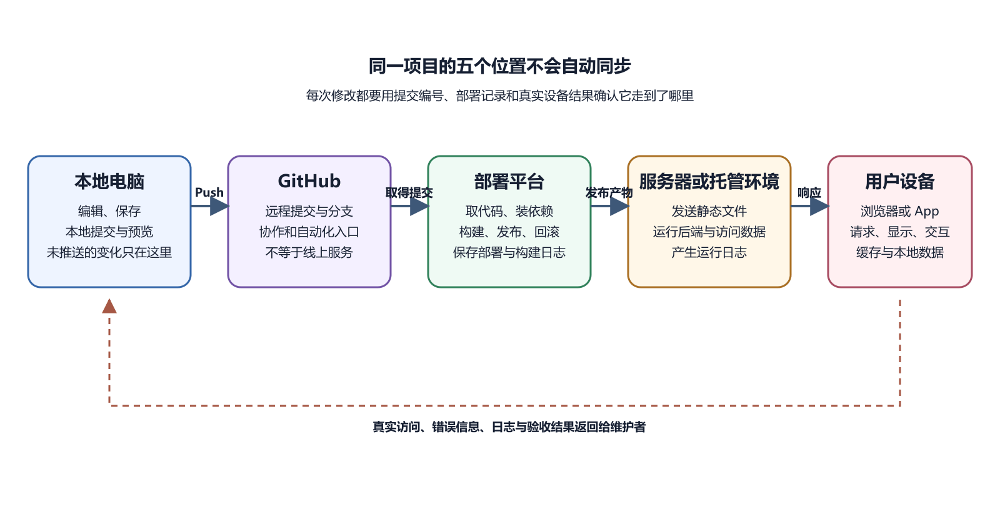

# 本地电脑、GitHub、部署平台、服务器和用户设备

同一个项目会同时出现在几个地方。电脑里有正在修改的文件，GitHub 上有已经推送的版本，部署平台保存构建记录，服务器运行后端，用户设备又保存浏览器缓存或 App 数据。它们可能来自同一份源代码，却不是随时完全相同的副本。

理解这些位置的意义，是发布工作的第一项基本能力。以后看到“我明明改了，为什么线上没有变化”，先不要急着怀疑代码。要先确认改动停在本地、提交、远程仓库、构建产物、正在运行的版本，还是用户设备的缓存中。

*项目在五个位置之间移动*

图中从左到右的实线表示版本和产物怎样前进。虚线表示用户看到的结果、浏览器错误和运行日志怎样返回给维护者。同一项目在五个位置中留下不同证据。任何一处没有更新，后面的地方都可能继续使用旧版本。

## 本地电脑是编辑和验证的起点

本地电脑上通常有项目根目录。根目录是观察项目的起点，不一定是磁盘最上层目录。它指包含项目主要配置、说明和源码目录的那一层文件夹。Node.js 项目常在这里放 `package.json`，Flutter 项目常放 `pubspec.yaml`，Git 仓库会有一个通常隐藏的 `.git` 目录。

你在编辑器里修改文件，变化首先只发生在本地。编辑器显示的圆点、文件标签颜色或 Source Control 数字，都可能表示尚未保存或尚未提交。保存文件只把内容写入本机磁盘。Git Commit 再把选中的变化记为本地版本。Push 才把已有提交发送到远程仓库。

本地还承担第一次验证。网页项目可以在开发服务器中预览，后端可以在测试配置下运行，Flutter App 可以在模拟器或测试设备中启动。开发环境往往比生产环境宽松。它可能自动刷新，显示详细错误，使用本地数据库，或者读取只存在于电脑中的环境变量。因此“本地能运行”是一项有用证据，还不能证明线上必然可用。

本地目录也可能有多个副本。下载 ZIP 会得到一个没有远程同步关系的快照。Clone 会创建与远程仓库有关联的本地 Git 仓库。复制整个项目文件夹又会产生另一个独立位置。它们名字相同，路径不同，内容就可能逐渐分叉。运行命令前应先确认当前路径，避免在旧副本中修好问题，却在另一个副本里部署。

## GitHub 保存远程版本和协作记录

GitHub 上的仓库位于某个账户或组织下，并通过分支组织提交历史。部署平台通常连接其中一个仓库、一个分支，有时还限定一个子目录。它不会自动读取你电脑上尚未推送的文件。GitHub Desktop 把这组关系放到图形界面里。GitHub 官方说明中，应用可以创建、添加和克隆仓库，查看文件变化，生成提交，再把提交推送到 GitHub。这对不熟悉命令行的读者很重要，因为提交的内容可以在点击前逐项检查。

GitHub 同时保存协作信息。Issue 记录问题，Pull Request 展示准备合并的改动，Actions 可以运行自动化任务，Release 可以标记供人下载的版本。这些信息不等于正在运行的生产系统。一个提交通过了 Actions，仍可能因为部署平台配置不同而上线失败。一个 Release 被发布，也不说明服务器已经切换到它。

远程仓库的可见性也要与网站可见性区分。公开仓库允许他人查看代码。私有仓库限制代码访问。网站是否公开，由托管、访问控制、域名和应用本身共同决定。公开网站完全可以来自私有仓库，公开仓库也可以从未部署。

部署平台通常在收到新的远程提交后开始一次部署。它会取得代码，选择运行环境，安装依赖，执行构建命令，再把产物交给静态托管或运行服务。控制台显示的每一次部署，都应能追溯到一个提交或一次人工触发。

平台常提供三个容易混淆的地址；项目控制台地址用于管理；平台分配的默认域名用于访问；自定义域名是用户最终看到的入口；控制台能打开，只说明账户和项目还在。默认域名可用而自定义域名不可用，问题更可能位于 DNS 或域名配置。两个访问地址都报错，才应继续检查部署状态和应用日志。

自动部署也有明确边界。平台可以根据配置执行命令，不能知道一条错误命令原本想做什么。它能注入已经保存的环境变量，不能替你恢复从未配置的密钥。它能保留构建日志，却不能保证第三方数据库一直可用。

部署记录是连接源代码与线上版本的关键证据。一次排错至少要看四项信息。

- 部署对应哪个仓库和分支
- 使用的是哪个提交编号
- 构建什么时候开始和结束
- 当前生产域名指向哪个部署

如果线上显示旧内容，先比较生产部署的提交编号与 GitHub 最新提交。两者不同，问题发生在触发或发布阶段。两者相同，再检查构建是否用了缓存、输出目录是否正确，以及浏览器是否仍保存旧资源。

## 服务器是程序实际持续运行的位置

“服务器”有两种常见含义。一种是网络中的角色，只要某个程序响应客户端请求，它就在承担服务端角色。另一种是租用或自有的计算机，例如 VPS。托管平台背后也使用服务器，只是大部分系统管理被平台隐藏起来。

静态网站的服务器主要按请求发送文件。动态应用的服务器还要执行代码，验证身份，读取数据库或调用其他服务。MDN 对客户端和服务端的说明强调，浏览器只知道请求与响应，并不直接读取服务端文件或数据库。服务端选择可以返回什么，浏览器再处理收到的内容。

程序部署到 VPS 后，关闭自己电脑通常不会让服务停止。它已经在远程机器上运行。反过来，只在本地终端启动的后端，在电脑休眠、网络变化或进程退出后就会消失。把本地开发地址发给别人，通常也不能形成稳定公开服务。

服务器内部还有多个位置。源代码可能放在 `/srv/app`，运行进程由 systemd 管理，Nginx 或 Caddy 监听公网入口，Docker 容器在隔离环境中执行应用，数据库数据存放在卷或独立服务中。后面的 Linux 和 Docker 卷会把这些位置逐一展开。现在只需记住，登录服务器以后看到的项目文件，与 GitHub 仓库和本地文件仍是不同副本。

Docker 能让镜像携带应用及其运行依赖，并由容器执行。Docker 官方架构中，客户端把命令交给守护进程，守护进程管理镜像、容器、网络和卷。这些组件都在运行环境中承担具体工作。GitHub 上的一份 Dockerfile 只是构建说明，只有完成镜像构建并启动容器，应用才真正运行。

## 用户设备保存最后一段状态

用户设备可能是电脑浏览器、手机浏览器、Android 手机或 iPhone。浏览器收到 HTML、CSS、JavaScript 和图片以后，在本地解析并呈现页面。MDN 对加载过程的说明指出，浏览器往往会为页面中的不同资源分别发出请求。因此首页 HTML 成功返回，不代表每张图片和每个接口都成功。

浏览器还会保存缓存、Cookie、本地存储和 Service Worker 等数据。它们能加快访问、保持登录或支持离线体验，也会让新旧状态同时存在。部署完成后只有某一台设备显示旧页面，使用无痕窗口或另一台设备进行对照，往往比连续重新部署更有效。

手机 App 的客户端代码安装在设备上。Flutter 的发布构建会转为目标平台可以运行的程序，并通过平台嵌入层使用系统能力。已安装版本不会因为 GitHub 代码变化而自动改写。开发者要生成新构建，经过测试和分发，用户再更新应用。

App 的本地数据和远程数据也要分开。设置、草稿或下载内容可能只保存在手机。账号资料、订阅状态和跨设备同步通常位于后端。删除 App 可能清除本地数据，却不会必然删除服务端账号。服务端恢复备份，也不会恢复从未上传的本地草稿。

## 一次修改经过哪些边界

假设你把网站首页按钮文字从“开始”改为“立即开始”。完整链路可能是这样。

1. 在本地正确项目中修改并保存文件。
2. 用本地预览确认按钮文字和布局符合预期。
3. 检查 Git Diff，确认没有意外修改或秘密文件。
4. 创建 Commit，把这一项变化记入本地历史。
5. Push 到部署平台监听的远程分支。
6. 等待部署平台取得提交并完成构建。
7. 确认生产环境切换到新部署。
8. 使用公开域名和另一种浏览器状态检查结果。

每一步都产生可见证据。文件内容、Diff、提交编号、远程分支、部署日志、生产部署编号和真实页面共同形成一条证据链。只凭其中一个绿色图标，无法覆盖整条链路。若第七步已经指向正确提交，第八步仍旧显示旧字样，可以查看浏览器 Network 面板请求的文件、缓存状态和响应内容。若生产部署根本没有新提交，就不应先清浏览器缓存。这种按位置排查的方法能避免无目的操作。

第一种发生在本地副本；阿青电脑里有 `site` 和 `site-copy` 两个目录；编辑器打开前者，PowerShell 却停在后者；她修改的是新目录，运行的仍是旧目录；两边文件名一样，页面就像拒绝更新；检查方法很短；在编辑器中复制当前文件的绝对路径，再在终端运行 `Get-Location`。两个路径若不属于同一项目，先停掉旧进程，切换到正确目录再启动。不要继续修改两份副本，让差异越来越大。

第二种发生在远程分支；小周在 `feature-home` 分支提交并推送了首页变化；部署平台监听 `main` 分支，因此生产环境没有触发部署。GitHub 页面能看见新提交，生产部署记录却仍对应 `main` 的旧提交。此时要按团队流程把变化合并到 `main`，或者在确认用途后调整部署分支。不要为了让变化立即出现，把不完整功能直接推到生产分支。分支解决的是版本组织问题，部署环境解决的是哪些版本对用户开放。

第三种发生在用户设备。网站已经发布正确提交，同事的无痕窗口能看见新页面，自己常用浏览器仍显示旧图标。Network 面板显示图片来自内存缓存。这时才有理由刷新缓存状态或检查缓存规则。

三个案例的现象相同，处理方式完全不同。目录错了要纠正运行位置，分支错了要纠正版本流向，缓存旧了要检查客户端取得的响应。先比较证据，可以少做许多无效重启。

## 版本差异也可能是有意设计

预览环境与生产环境保留不同版本，往往是正常安排。预览地址用于让维护者检查新提交，生产域名继续服务稳定版本。确认预览无误后，平台再把这次部署提升为生产版本。移动 App 的版本差异更长。开发者设备可能安装当天构建，内部测试人员使用上周版本，商店公开用户仍在更早版本。后端不能假设所有客户端同时更新。修改 API 时，应保留兼容期，或者用清楚的最低版本提示引导升级。

数据库结构也有版本。新代码开始读取一列数据以前，生产数据库必须完成相应迁移。若代码先上线，应用会报“列不存在”。若数据库先删除旧列，尚未更新的 App 又可能继续请求它。数据库迁移、代码部署和客户端更新需要安排顺序。

版本差异是否合理，要看它有没有被记录。预览部署写清提交编号，App 显示版本号，数据库保存迁移历史，维护者才能判断用户正在使用哪一代系统。

同一个人可能有个人 GitHub 账户、组织账户、两个部署平台团队和多个云服务项目。控制台页面外观相同，账户不同，能看到的资源就不同。一个常见现场是“仓库明明存在，部署平台却找不到”。原因可能是平台授权只允许访问个人仓库，没有获得组织仓库权限。另一个现场是变量已经填写，应用仍提示缺失。变量可能写在预览环境，生产部署没有读取。

排查账户问题时，记录对象名称，不记录秘密。至少确认当前登录邮箱或账户名、团队或组织名、项目名、环境名和仓库分支。授权范围由控制台实际显示为准；权限应满足当前工作，又避免无关范围；只需要读取一个仓库时，不要给工具访问全部组织资源；只需要查看日志时，不必授予删除项目权限。离开协作的人要移除访问权限，机器令牌也要有到期与轮换安排。

> 你必须亲自检查
>
> AI 可以读你提供的页面内容，却无法知道浏览器另一个标签是否登录了不同账户。涉及发布、删除、付费和权限授予时，亲自读出账户、项目和环境名称，再确认按钮。

## 文件与秘密跨位置时要减法思考

并非本地所有文件都应进入 GitHub，也并非 GitHub 所有内容都应进入构建产物。编辑器缓存、下载目录、构建缓存和本地数据库常应留在本机。`.env` 可能包含密钥，通常不能提交。测试资料可能可以进仓库，却不需要发布给浏览器。

前端构建产物会被用户下载。任何写入前端 JavaScript 的秘密，都可能被查看。把变量放进部署平台控制台，只能改变保存位置，不能把原本要发送给浏览器的值变成秘密。真正的私密凭据应由后端持有，浏览器通过受控接口请求结果。

服务器上的生产数据也不应随意复制回个人电脑。排错需要样本时，应先删除身份信息或使用专门测试数据。GitHub、部署平台和服务器分别有访问权限，权限边界应跟责任匹配。

没有位置地图时，求助通常会停在“代码已经改了，为什么线上没变”。画出五个位置以后，这句话会自然拆开。本地文件是否保存，修改是否进入提交，提交是否到达远程分支，部署平台是否构建了这次提交，生产域名是否指向这次部署，用户设备是否仍在使用缓存。每多认出一个位置，便多出一项可以核对的事实。

地图也会暴露未知项。你可能知道网站在 Vercel，却不知道数据库由谁托管；知道服务器 IP，却不知道域名账户属于哪个邮箱。这些空白不需要立刻用猜测填上。把它们写成待确认问题，并标明需要配置文件、控制台还是账号持有人回答。能够准确指出不知道什么，往往比给出一个听起来完整的架构更有用。

AI 可以帮助从仓库和日志中推导候选链路，但它看不见的控制台、私有账号和线下约定仍然存在。让它把已确认事实、根据证据作出的推断和无法验证的项目分开写。这样提问范围会随着地图扩大，同时保留对未知条件的警觉。

## 画出自己的五个位置

为一个现有项目画一张最简单的位置表。没有某一项时写“无”，不知道时写“待确认”。

| 位置 | 要记录的内容 | 可以看到的证据 |
| --- | --- | --- |
| 本地电脑 | 项目绝对路径与当前分支 | 文件、Git 状态、本地预览 |
| GitHub | 账户、仓库、分支 | 最新提交编号与文件列表 |
| 部署平台 | 项目、生产部署 | 构建日志与部署编号 |
| 服务器 | 主机、运行方式、数据位置 | 服务状态、运行日志、备份记录 |
| 用户设备 | 浏览器或 App 版本 | 实际页面、Network 请求、应用版本号 |

这张表的目标不是收集密码。不要在表里写访问令牌、SSH 私钥、数据库密码或签名口令。它只记录名称、位置和验证入口。

排错时，找一个能够形成对照的对象。旧设备与新设备、默认域名与自定义域名、预览环境与生产环境、旧提交与新提交，都可以帮助确定差异从哪里开始。下面这张表给出一些常见对照结果。它们是起点，不是无需检查的最终诊断。

| 对照结果 | 更可能的位置 | 下一项检查 |
| --- | --- | --- |
| 本地预览正常，远程构建失败 | 构建环境 | 依赖版本、构建命令、环境变量 |
| 平台默认域名正常，自定义域名失败 | 域名入口 | DNS 记录、域名绑定、证书状态 |
| 预览部署正常，生产域名仍旧 | 发布选择 | 当前生产部署与提交编号 |
| 无痕窗口正常，常用窗口陈旧 | 用户设备 | 缓存、Service Worker、扩展程序 |
| 网页打开，登录请求 500 | 后端运行 | API 运行日志、数据库连接 |
| 只有一位用户失败 | 账户或本地状态 | 账号权限、请求内容、设备版本 |
| 所有用户同时失败 | 公共服务 | 域名、入口、服务状态、第三方依赖 |
| App 旧版可用，新版失败 | 客户端变化 | 版本差异、权限、API 请求 |

例如，默认域名能打开，说明部署平台至少能提供页面。自定义域名返回“找不到服务器”，就先查 DNS，不必重新安装依赖。若两个域名都打开同一页面，但登录一起报 500，DNS 已经完成指路，应转向 API 运行日志。

对照也要控制变量。用另一台设备测试时，访问同一个 URL。比较两个部署时，确认使用相同环境变量和数据库。一次同时更换域名、平台和代码，会让结果难以解释。

## 把一次排错写成可复用记录

小孟发现生产首页没有新图片。本地预览正常，GitHub 最新提交也包含图片。部署平台显示构建成功，生产部署的提交编号与 GitHub 一致。他用无痕窗口访问，图片仍返回 404。查看构建产物后，发现代码引用 `Logo.png`，实际文件名是 `logo.png`。Windows 本地文件系统没有暴露大小写差异，Linux 构建环境把它们视为不同名称。

修复记录可以写成六行。

1. 现象是生产图片请求返回 404。
2. 影响范围是所有首次访问的用户。
3. 正常对照是本地 Windows 预览。
4. 异常从生产构建产物开始出现。
5. 原因是引用路径与文件名大小写不一致。
6. 修复是统一名称并提交，验证是新部署中请求返回 200。

这样的记录保留了判断过程。下次出现图片 404，可以先查路径、构建产物和大小写。它没有把所有 404 都归因于同一原因，仍要求用状态码和产物确认。记录中还应写日期、环境、提交编号和验证人。若修复只是临时回滚，也要写出后续任务。日志或截图涉及用户信息时，使用受控存储并删除不必要的个人数据。

## 日志从不同位置讲述同一次请求

用户点击登录后，浏览器 Network 面板记录请求地址、状态码和响应。反向代理可能记录请求到达时间。后端日志记录身份校验与数据库调用。数据库日志记录连接或查询错误。它们共同描述一次操作。

可以给请求附加一个不含个人信息的 Request ID，也就是请求编号。后端把同一编号写入日志并返回给客户端。用户提供编号后，维护者能在大量日志中找到相应请求。很多平台本身也会生成请求或追踪编号，先使用已有能力。

时间是第二个连接点；用户说“大约下午三点”，范围仍很宽；让用户记录准确时间和时区，再按对应时间查看日志；不要要求用户提供密码、完整令牌或银行卡资料；日志可能含邮箱、IP、请求参数和内部错误；分享给 AI 或社区前先删除秘密与个人信息。用于公开 Issue 时，保留能复现技术问题的最小内容。

## 位置清单也要记录所有者

个人项目容易在不同邮箱和账户之间分散。域名在一个注册商账户，GitHub 在个人账户，部署平台在旧团队，数据库又由另一个邮箱创建。项目还能运行时，这种分散不明显。需要续费、恢复或移交时，所有权问题会立即出现。

为每个服务记录用途、账户标识、账单责任、恢复方式和退出步骤。账户标识可以是经过遮盖的邮箱或团队名，不保存密码。两步验证恢复码应放在安全位置，不能写进公开仓库。若项目属于组织，应尽量避免只有一个人的个人账户拥有关键资源。域名、商店应用、云账单和生产数据库都应有清楚的组织归属与至少一种受控恢复方式。具体权限数量要根据风险决定，不应为了“多人备份”给所有人管理员权限。

日志写着 `config.json` 出错，项目里却有三个同名文件。只说文件名无法确定目标。应同时记录相对于项目根目录的路径，例如 `web/config.json` 或 `server/config.json`。文件内容完全相同，也不能证明它们承担同一作用。一个可能被构建工具读取，另一个可能是示例。修改前先从 README、导入语句或构建日志确认实际引用位置。

需要严格对比时，可以计算文件哈希。哈希是根据内容得到的识别值，内容变化后值通常会改变。哈希相同能支持“内容相同”，仍不能说明路径、权限和用途相同。初学阶段先学会提供完整路径，已经能解决大量误会。

## 出错先看改动停在哪里

本地改动没有保存时，预览可能还是旧内容；保存了却没有 Commit，远程历史不会变化；Commit 后没有 Push，GitHub 不会变化；Push 到错误分支，自动部署不会触发；构建失败，线上继续保留旧版本。构建成功但没有提升为生产版本，默认预览地址可能是新的，自定义域名仍是旧的。部署正确而单个设备陈旧，最后再查缓存和 App 版本。

这组顺序以后会成为通用故障树。它从最接近改动的位置开始，一层一层向用户移动。每一层只根据证据进入下一层。

AI 可以只读扫描本地目录，识别 Git 仓库、配置文件和构建输出。它可以读取远程仓库页面或部署日志，帮助对比提交编号，也可以把五个位置整理成清单。AI 无法仅凭本地文件确认生产平台当前连接的账户，也不能仅凭配置文件证明 DNS 已经生效。涉及控制台状态时，要给它最新截图或导出的非敏感日志，并保留人工核对。

账户归属、付费项目、生产域名、真实用户数据和商店版本必须由你亲自确认。执行 Push、切换生产部署、重启服务、恢复数据库或发布 App 前，都要再次核对目标位置。下一章会比较静态网站、动态网站、服务器程序和手机 App。它们经过相似的发布链路，却把代码和数据放在不同位置。
