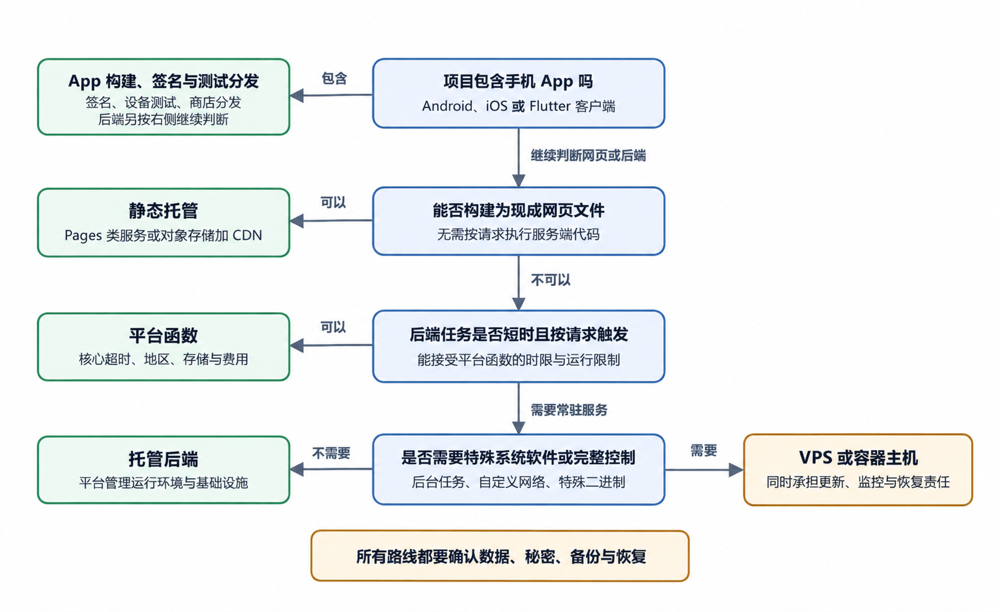

# 静态网站、动态网站、服务器程序和手机 App

选择发布方法以前，先要知道手里的项目属于哪一类。项目名称中写着“网站”或“App”仍然不够。部署方式取决于代码在什么地方执行、用户数据存在哪里、收到请求时是否需要服务端继续计算。

现实项目经常是组合体。一个产品可以有静态营销页、动态管理后台、独立 API、PostgreSQL 数据库和 Flutter 客户端。分类帮助我们逐项辨认组成部分，并为每一项找到运行位置。

## 静态网站把现成文件交给浏览器

静态网站发布后，服务器主要发送已经准备好的 HTML、CSS、JavaScript、图片和字体等资源。不同用户请求同一个文件，得到的文件通常相同。页面中的 JavaScript 仍然可以在浏览器里产生交互，也可以调用外部 API。这里的“静态”描述服务端怎样提供文件，不表示页面只能显示不动的文字。

一个个人介绍页就是典型例子。服务器返回 `/index.html`，浏览器再请求样式、脚本和图片并组装页面。

静态网站的优点来自较少的运行组件。没有持续执行的业务后端，部署更简单，攻击面和维护工作通常更小。文件可以由内容分发网络缓存，访问速度也容易稳定。限制也具体。仅靠静态文件不能安全保存数据库密码，不能执行需要私密凭据的支付请求，也不能在服务器上核对用户权限。联系表单、账号登录、个性化数据和 AI 调用，需要连接另一个服务，或者使用部署平台提供的函数能力。

识别静态项目时，可以找最终输出目录。里面若只有可以直接发送给浏览器的文件，且发布说明只要求上传这些文件，静态托管通常适合。源码使用 React、Vue 或其他前端工具，也可能在构建后成为静态网站。框架名字本身决定不了运行类别。

## 动态网站在请求到来时生成结果

动态网站会在服务端根据请求执行代码。用户打开商品页，服务端可能读取数据库、检查地区和库存，再返回 HTML 或 JSON。用户登录后打开个人页，服务端会根据身份只返回属于该用户的数据。静态资源可以直接从文件系统返回；动态请求会交给 Web 应用，应用读取数据库并生成响应。

动态服务要有持续可用的运行环境。部署平台可以用常驻服务、无服务器函数或边缘函数执行代码。VPS 可以直接运行进程，也可以用 Docker 容器运行。无论哪种形式，都需要知道启动命令、监听端口、环境变量、日志和数据依赖。

动态网站发布成功以后仍会发生运行故障。数据库连接数量耗尽、认证服务不可用、第三方接口超时、内存不足，都可能让一部分请求失败。首页静态资源仍能打开，登录或保存却报错，是前端可用而后端异常的常见表现。

## 服务器程序不一定有网页界面

服务器程序是运行在远程或本地环境中、为其他程序提供能力的软件。API 服务会接收请求并返回数据。定时任务按计划生成报表。队列工作进程在后台处理邮件、图片或视频。它们可能没有供普通用户直接访问的网页。

“后端”和“服务器程序”常有重叠。后端强调它处在用户界面之后，负责业务规则、数据和权限。服务器程序强调它持续运行并响应其他组件。一个命令行工具偶尔执行一次，通常不算持续服务；把它放进定时计划后，它又成为后台工作的一部分。

API 服务常返回 JSON。浏览器前端或手机 App 发出请求，服务器检查参数和身份，读取数据库，再返回结构化数据。即使界面完全由 Flutter 构建，远程 API 仍然可以是整个产品的后端。

后台工作进程通常不监听公开端口。它从队列、数据库或计划任务接收工作。若部署时只启动 Web 服务，没有启动工作进程，用户可能可以提交任务，却永远等不到处理结果。此类故障要看进程状态和队列日志，不能只检查网页。

## 手机 App 是安装到设备的客户端

手机 App 的主要界面和一部分业务逻辑在用户设备上运行。Android 和 iOS 有不同的构建、签名和分发体系。Flutter 允许一套 Dart 源码共享大量界面与逻辑，最终仍要为目标平台编译和打包。发布产物会真正进入各个平台的运行环境。

App 可以完全离线。例如一个只在手机上进行计算、不上传数据的换算工具。它也可以强烈依赖网络，例如聊天、网盘和在线商城。后一类 App 通常只是客户端，账号、消息、文件和订单仍在远程后端。

网页更新与 App 更新有一个关键差别。静态网站重新部署后，用户下次刷新通常就能取得新资源。App 新版本要经过构建、签名、测试分发或商店审核，用户还要安装更新。服务端接口不能只兼容开发者手里的最新 App，生产环境可能同时存在多个客户端版本。

App 还会使用设备权限和系统能力。相机、相册、位置、通知和后台运行都受到平台规则限制。代码调用成功之前，应用要声明用途、请求授权并处理拒绝。商店审核会检查一部分声明和行为。网页上的同名功能不一定具有相同权限模型。

微信小程序容易让人误判，因为它既像网页，又像 App。它的界面代码运行在微信提供的客户端环境中，发布要经过微信开发者工具、体验版、审核和线上版本管理。它可以调用微信登录、支付、订阅消息、位置和文件能力，也要按微信平台规则声明用途。若小程序只展示静态内容，责任接近前端发布；若它读取订单、会员、积分或聊天记录，后端、数据库、对象存储和权限检查仍然要单独设计。把小程序当成“上传几个网页文件”会漏掉审核、版本、账号主体和平台接口限制；把它当成完整原生 App，又会高估本地系统权限和商店流程。判断时先问三件事。哪些能力来自微信，哪些服务由自己维护，用户数据最终保存在哪里。

验收小程序时，也要把证据分开。开发者工具预览只能说明本地包能运行，体验版能说明指定用户可试用，审核通过才说明平台接受当前版本。线上发布后，还要用真实微信账号完成主要流程，并核对后端日志和数据记录。若小程序调用自己的服务器，还要确认域名、HTTPS、备案或平台要求已经满足。不要只看二维码能打开。发布前还要知道旧版本怎样退回，以及由谁操作。

## 前端与后端是一条边界

前端是用户设备上直接呈现和交互的部分。网页前端在浏览器中运行，App 前端在移动操作系统中运行。后端在用户设备之外处理需要集中管理或保密的工作。这条边界最重要的判断是信任。用户能够查看、修改或伪造客户端发出的请求；前端隐藏一个按钮，不能阻止用户直接调用接口。价格、账户归属、管理员权限和付费状态等关键规则必须由后端重新检查。

前端也不能安全持有服务器密钥。打包进网页或 App 的值最终会到达用户设备。即使经过压缩或混淆，也只能增加查看难度。需要保密的第三方 API 密钥应保留在受控后端，由后端限制允许的操作、频率和用户权限。

边界并不要求所有逻辑都移到服务器。表单即时提示、界面状态和离线草稿适合在客户端处理。后端保留最终权威判断。合理分工可以减少延迟，也能避免把安全责任交给不受控制的设备。

静态发布文件通常能从源码重建，用户上传、账号和订单则要进入数据库或对象存储。某些托管平台的本地磁盘是临时的，重启或重新部署后可能消失；一次上传成功不能证明永久保存。App 的本地数据库、偏好和缓存也不会自动进入后端备份。代码、数据库、用户文件与签名密钥需要不同恢复方式。

## 五个小案例

| 产品 | 组成与关键责任 |
|---|---|
| 作品集 | 静态文件；若加入联系表单，再承担邮件、隐私与滥用防护 |
| 活动报名 | 静态前端 + API + 数据库；管理名单需要身份与权限 |
| 图片处理 | 上传接口 + 队列 + 工作进程 + 对象存储；网页可用不代表任务完成 |
| 离线习惯 App | 数据只在手机；构建、签名、兼容和用户导出决定可恢复性 |
| 跨设备笔记 | 本地库 + 身份 + 远程库 + 冲突规则；商店正常不代表同步正常 |

案例没有固定技术栈。先由需求、数据后果和维护责任确定组成，再选择框架。

## 如何判断一个陌生项目

打开项目说明和配置，按下面顺序观察。

1. 是否有构建命令，以及构建后生成什么目录。
2. 是否有启动命令，程序是否要持续监听端口。
3. 是否连接数据库、对象存储、认证或第三方 API。
4. 是否包含 Android、iOS 或 Flutter 平台目录。
5. 是否有 Dockerfile、Compose 文件或服务器服务配置。
6. 环境变量分别由浏览器、构建过程和服务器中的谁读取。

若项目只生成浏览器资源，没有持续服务端进程，它可能适合静态托管。若启动后持续监听端口并处理请求，它包含服务器程序。若需要 `flutter build`、Gradle 或 Xcode 生成安装包，它包含 App 客户端。不要仅凭目录名决定。`server` 目录可能只是开发辅助工具，`api` 目录在某些部署框架中会被转换为函数。最可靠的证据是项目说明、实际配置、构建输出和运行日志。

*个人项目发布路线决策树*

决策树不是平台排行榜。它从运行要求出发，把项目带到一类服务。纯静态网站先选 GitHub Pages、Cloudflare Pages 或其他静态托管。少量平台函数可以放在支持函数的自动部署平台，同时弄清函数限制和数据位置。持续运行的后端需要能运行对应语言与启动命令的托管服务，或者使用 VPS。Flutter App 先在本地设备完成 Debug 和 Release 验证，再进入 Android 或 iOS 发布流程。若 App 依赖后端，后端至少要在测试环境可用。

Docker 适合解决运行环境打包与多服务编排。它不会把没有域名、数据库或备份的应用自动变成完整产品。Kubernetes 针对更大规模的容器调度问题，本书只帮助读者识别它，不把它作为个人项目发布的默认起点。

## 平台函数是一种服务端运行方式

自动部署平台常提供 Function、Serverless Function 或 Edge Function。中文可以暂称平台函数。开发者提交一个处理请求的函数，平台在需要时准备运行环境并执行它。你不用长期管理一台完整服务器。

联系表单可以把姓名、邮箱和留言发给平台函数，由函数校验并用服务端邮件凭据发送。它仍是后端，要限制滥用、记录错误并保护秘密。函数的执行时间、内存、并发、地区和临时磁盘限制会变化；长视频处理、持续连接或本地持久数据未必适合普通短时函数。

表格计算、图片预览和界面筛选可以留在浏览器。价格、权限和私密 API 调用必须由后端判断。若前端把 100 元改成 1 元，服务器仍应按商品和优惠重新计算；若把 AI 供应商密钥写进前端，任何用户都可能提取并消耗额度。“能运行”只描述技术可能性。“应该放哪里”还要考虑秘密、权限、费用、延迟、离线需求和维护责任。

## 用一张表拆开组合项目

面对一个陌生产品，可以把组成部分写进表中。下面以预约服务为例。

| 组成部分 | 运行位置 | 保存什么 | 失败时先看哪里 |
| --- | --- | --- | --- |
| 介绍页 | 浏览器与静态托管 | 公开文字和图片 | 静态部署与 Network |
| 预约表单 | 浏览器 | 用户当前输入 | Console 和表单提示 |
| 预约 API | 托管后端或服务器 | 校验与业务规则 | 运行日志和状态码 |
| 数据库 | 托管数据库 | 预约记录与账户 | 数据库日志和连接状态 |
| 提醒任务 | 后台工作进程 | 待发送任务状态 | 队列与工作进程日志 |
| 管理 App | 手机与远程后端 | 本地会话与远程预约数据 | App 日志、网络请求、后端日志 |

表格写完后，部署范围会清楚很多。介绍页上线成功，只验证了第一行。预约 API 返回 200，也不能证明提醒任务运行。每个组成部分都需要自己的最小验收。

一个“上传 PDF 后提问”的页面至少可能包含前端、上传接口、对象存储、解析任务、数据库、问答 API 与用量系统。“上传成功”可能只表示文件传完，解析仍在排队；界面应区分已上传、处理中、可提问和失败。用户点击一次按钮，系统可能跨越多个服务，排错时要拆成状态变化。

> 常见误解
>
> 后端并不等于一台服务器。它可以由 API、数据库、对象存储、身份认证、后台任务和第三方服务共同组成。每个组件都可能由不同平台托管。

## 什么时候暂时不需要后端

学习项目容易过早加入账号和数据库。一个计算器、作品集、活动说明页或只在本机使用的表格工具，可能靠静态文件和浏览器本地数据就能完成目标。暂时不建后端，可以减少账户安全、数据库备份、服务器费用和隐私政策等责任。等到确实需要跨设备同步、多人共享、集中权限或私密凭据时，再增加远程服务。

浏览器本地保存也有边界。换设备、清除网站数据或使用隐私模式后，内容可能消失。若产品承诺长期保存，就应明确提供导出、导入或远程同步。一个简单判断是，数据是否必须由多个用户或设备共同看见，规则是否需要防止用户自行修改，是否要使用不能公开的凭据。三项都没有时，静态方案值得优先尝试。

人们常把浏览器中使用的产品都叫网站，也会把安装到电脑的程序叫客户端。名称方便交流，部署时仍要看实际组成。“博客”可以是静态站点，也可以在每次访问时查询数据库。微信小程序运行在微信提供的客户端环境中，也可能依赖自己的后端、数据库和文件存储；它从开发版经过体验与审核到线上版，不等于普通网页上传或应用商店安装。具体交付清单见[《微信小程序开发、体验、审核与发布参考》](../../references/wechat-miniprogram.md)。

拿到项目后，先找构建命令、启动命令、网络请求和数据位置。它们给出的证据比产品宣传名称可靠。若 README 写“全栈应用”，还要继续找前端与服务端各自的目录和部署方式。

## 什么时候要把工作放到后台

用户请求适合尽快返回。发送邮件、生成缩略图、处理视频和建立文档索引可能耗时较长。让请求一直等待，容易遇到超时，也让用户不知道进度。后台任务会先记录工作，再由工作进程处理。接口可以快速返回任务编号，客户端随后查询状态或接收通知。任务失败时保留错误和重试次数。

加入队列后，系统多出新的状态与维护责任。要确认任务是否重复执行、失败是否重试、重启后任务是否保留，以及同一操作重复点击会不会产生两份订单或两封邮件。个人小项目工作很短时，可以先同步处理，不必为了术语完整而加入队列。

后台任务没有公开网页，不代表它不需要健康检查。工作进程停止后，接口可能继续接受任务，待处理数量不断增加。监控队列长度与最老任务等待时间，比只看 Web 首页更能发现此类故障。

状态表示系统需要记住的内容。静态文件本身是一种发布状态，浏览器缓存是设备状态，登录会话是认证状态，数据库记录是业务状态，队列中的任务是后台状态。用户刷新页面后输入消失，可能是表单只存在于内存。换手机后能登录同一账号，不代表旧设备的会话和本地草稿也已同步；需要分别检查认证服务、设备迁移与同步机制。重新部署后上传图片消失，可能是文件写在临时磁盘。

每加入一种状态，就回答三个问题。谁负责写入，重启或重新部署后是否保留，发生误删时从哪里恢复。无法回答时，发布还缺少维护设计。静态站点也可能有状态，例如浏览器用 Local Storage 保存主题偏好；它只属于当前浏览器，清除站点数据后会消失。

## 成功结果与常见误判

静态网站的最小成功结果，是公开地址能取得全部页面资源，内部链接有效，控制台没有阻止核心功能的错误。动态网站还要验证关键 API、数据库写入和权限。服务器程序要检查进程状态、端口、健康响应和日志。App 要在目标设备安装，完成主要流程，并验证后端异常时的提示。

常见误判包括把本地开发服务器当成线上服务器，把前端环境变量当成秘密，把 GitHub 仓库页面当成网站，把数据库控制台能打开当成应用连接正常，以及把商店上传成功当成审核和用户更新都已完成。

AI 可以根据项目结构和配置给出组成部分清单，标出前端、后端、数据库和 App 目录，并找出构建与启动命令的来源。要求 AI 对不确定项使用“待验证”，并引用实际文件。若它只根据项目名称断言部署类别，应让它继续检查配置。

你要在真实环境确认服务是否持续运行、数据是否持久化、域名是否指向正确入口、App 是否能在目标设备安装。涉及用户数据、秘密、支付、商店账号和生产发布的边界，不能交给项目结构推断。
