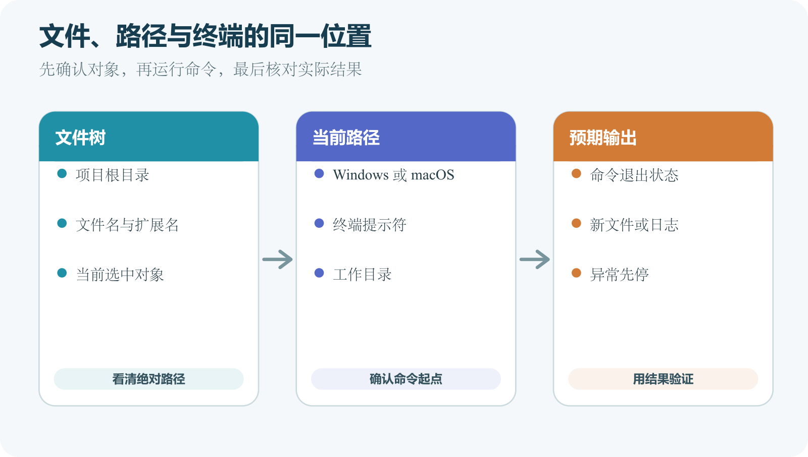

# 文件、路径、终端和图形界面的最低限度知识

发布教程里最容易被忽略的前提，是读者能准确找到文件，并让命令在正确目录运行。命令本身可能只有一行，路径错一层，结果就完全不同。图形界面也没有消除这个问题，它只是把路径、当前项目和选中对象放到窗口标题、侧栏或下拉菜单中。

这一章不要求熟练使用命令行。读者只要先抓住三件事。正在操作哪个文件，命令会作用于哪个目录，成功以后应该出现什么。



*文件树、当前路径和终端预期输出的对应关系*

## 文件名包含名称和扩展名

`index.html` 是一个完整文件名。`index` 是名称，`.html` 是扩展名。扩展名帮助操作系统和应用判断文件类型。Windows 默认可能隐藏已知文件的扩展名，于是一个实际名为 `index.html.txt` 的文本文件会看起来像 `index.html`。上传后浏览器不会把它当成正确 HTML。

在 Windows 文件资源管理器中，应打开“查看”相关设置并启用“文件扩展名”。macOS Finder 也可以在设置中显示全部扩展名。保存配置文件后，要回到文件列表核对真实名称。以点开头的文件常用于配置，例如 `.gitignore` 和 `.env`。系统隐藏文件看不到不代表不存在，需要确认时先调整显示选项，不要创建第二个同名文件。

路径描述文件或文件夹的位置。绝对路径从明确起点写到目标，Windows 常以盘符开始，例如 `C:\Projects\site\index.html`；macOS 和 Linux 使用 `/` 作为顶层起点，例如 `/Users/mei/Projects/site/index.html`。相对路径从当前目录开始。若当前目录是项目根目录，`src/main.js` 表示进入 `src` 再找到 `main.js`。`./` 表示当前目录，`../` 表示上一级目录。相对路径能让项目移动到另一台电脑后继续使用，前提是内部层级保持一致。

网页里的路径还受到 URL 规则影响。Windows 文件路径使用反斜杠，网页地址使用正斜杠。不要把 `C:\images\logo.png` 写进准备发布的网页。项目中的图片应通过相对 URL 或公开 URL 引用。

路径包含空格时，终端会把空格当成参数分隔。命令通常要用引号包住完整路径。PowerShell 中可以这样写。

```
Set-Location 'C:\Projects\My Site'
```

运行位置是 Windows PowerShell。`Set-Location` 切换当前目录，引号保护带空格的路径。成功时 PowerShell 通常不输出文字，提示符前的路径会改变。若显示路径不存在，先复制实际路径，再检查拼写和盘符。

macOS 或 Linux 终端中使用 `cd`。

```
cd '/Users/mei/Projects/My Site'
```

运行位置是 macOS Terminal 或 Linux shell。成功时通常也没有输出。随后运行 `pwd` 可以显示当前绝对路径。

## 项目根目录是命令的常用起点

许多工具会从当前目录寻找配置。`npm install` 查找 `package.json`，Flutter 命令查找 `pubspec.yaml`，Git 查找当前目录或父目录中的 `.git`。在错误目录运行，可能得到“找不到项目”之类错误，也可能误操作另一个项目。项目根目录常有这些迹象。

- README 位于这一层，并说明怎样运行项目
- 依赖清单位于这一层
- 源码目录和配置文件从这一层展开
- GitHub 仓库网页的顶层文件与这一层大致对应

目录名没有统一规定。一个仓库也可能包含多个子项目，每个子目录有自己的依赖清单。部署平台中的 Root Directory 设置正是为这种结构准备。执行教程命令前，应确认教程指的是仓库根目录还是某个应用子目录。

终端窗口接收文字命令，shell 负责解析并启动程序。Windows 常见 PowerShell 和命令提示符，macOS 默认终端常使用 zsh，Linux 发行版常使用 bash 或其他 shell。同一目的在不同 shell 中可能有不同命令和语法。教程若只写“打开终端”，你还要确认它假定哪个系统。`dir`、`ls`、`Get-ChildItem` 都能列出目录内容，但所属环境和参数并不完全相同。

终端提示符附近通常显示当前路径。命令运行后，可能出现输出、错误和新的提示符。新的提示符出现，表示这次前台命令已经结束。服务器进程持续占用窗口时，提示符不会回来，直到进程结束或转到后台。

命令退出并且没有红字，也不自动等于业务成功。要看预期结果。创建文件后检查文件是否存在，构建后检查输出目录，启动服务后访问指定地址，部署后看平台记录与公开页面。

## 一条命令由程序、参数和目标组成

看到长命令时，可以先拆成三部分。下面这条 PowerShell 命令只读取一个文件的前二十行。

```
Get-Content -Encoding UTF8 -TotalCount 20 '.\README.md'
```

`Get-Content` 是要运行的程序命令。`-Encoding UTF8` 和 `-TotalCount 20` 是参数，最后的 `'.\README.md'` 是目标文件。运行位置是 Windows PowerShell，并且当前目录要包含 README。成功时，窗口显示文件开头内容，不会修改文件。若提示找不到路径，先运行 `Get-Location` 和 `Get-ChildItem`，不要改成管理员权限。

同一个词出现在不同位置，含义可能不同。`--version` 常让程序显示版本，`--force` 常表示强制执行，具体行为仍由程序定义。看到陌生参数，应查这个程序的官方帮助。命令中的引号把含空格的文本保留成一个参数。单引号与双引号在不同 shell 中对变量展开的处理不同，本书示例会按运行环境选择。

管道符会把前一个命令的结果交给后一个命令。重定向符可能把结果写入文件。复制含有 `|`、`>` 或 `>>` 的命令时，要先弄清最终写到哪里。

## 安装软件与解压项目是两件事

从 GitHub 下载 ZIP 后，通常得到项目文件快照。解压只把文件放到某个目录，不会自动安装编程语言、数据库或依赖。双击 ZIP 内的文件直接运行，也可能因为路径临时、权限或资源不完整而失败。

先把压缩包解压到一个明确的普通目录，再阅读 README。项目要求 Node.js、Python、Flutter 或 Docker 时，要分别安装对应工具，并核对支持版本。安装完成后，已经打开的终端未必自动取得新的环境变量。关闭终端并重新打开，再运行官方提供的版本检查命令。版本号看起来更新，也可能与老项目不兼容，因此锁文件和项目说明仍要保留。

## 用一个路径错误理解报错

假设项目真实结构如下。

```
C:\Projects\hello-site\
  README.md
  web\
    package.json
    src\
```

README 要求在 `web` 目录运行 `npm install`。读者打开 PowerShell 后停在 `C:\Projects\hello-site`，命令提示找不到 `package.json`。这个错误没有说明 npm 损坏。当前目录中确实没有依赖清单。先运行下面命令。

```
Set-Location '.\web'
Get-ChildItem
```

第一行进入 `web` 子目录，第二行列出内容。看到 `package.json` 后再按 README 继续。若依然看不到，项目结构与文档可能不一致，需要确认下载版本或 README 所指分支。类似错误还会出现在部署平台。真正网页在 `web` 时，平台若没有设置 Root Directory，就会从外层寻找依赖。修复位置应在平台项目设置，不需要移动所有文件。

## 图形界面中的保存、应用和发布

控制台常用三个不同动作。Save 保存表单。Apply 让配置应用到服务。Deploy 或 Publish 生成并发布新版本。具体平台可能合并其中几步，也可能要求重新部署才读取新的环境变量。

例如，你在部署平台新增 `API_URL` 后点击 Save。设置页已经显示变量，当前运行版本却仍在旧环境中。平台文档若说明变量在构建或启动时注入，就要触发新部署。DNS 记录保存成功，也不表示全球所有查询立即得到新结果。应用商店控制台还会区分上传构建、选择构建、提交审核和正式发布。界面显示“处理完成”时，要读清它处理的是哪个对象。

## 从三个安全命令开始

Windows PowerShell 中可以使用下面三条只读命令。

```
Get-Location
Get-ChildItem
Get-ChildItem -Force
```

`Get-Location` 显示当前目录。`Get-ChildItem` 列出当前目录内容。`-Force` 让隐藏项目也参与显示，因此可能看到 `.git` 等目录。它们不会修改文件。macOS 或 Linux 终端中的对应观察命令是下面这些。

```
pwd
ls
ls -la
```

`pwd` 显示当前目录；`ls` 列出普通内容；`ls -la` 也显示隐藏项目和详细信息；它们同样是只读观察。看到 `.git` 后不要手动编辑里面的文件，这个目录保存 Git 内部数据。

## 图形界面也有当前上下文

GitHub Desktop 窗口顶部会显示当前仓库和当前分支。左侧 Changes 列表显示这个仓库中的未提交变化。切换仓库后，相同按钮会作用于新的目标。点击 Commit 或 Push 前，先读一遍仓库名、分支名和文件列表。

这套界面减少了记忆命令的负担，但不会替使用者判断仓库、分支和秘密文件。完整操作见[《Git 与 GitHub 操作参考》](../../references/git-github.md)。

编辑器也有工作区概念。Visual Studio Code 可以同时打开一个文件、一个文件夹或多根工作区。看到编辑器侧栏中的项目，不要推断终端必然还在同一目录，运行 `Get-Location` 或 `pwd` 即可确认。

部署平台控制台中的当前上下文可能由账户、团队、项目、环境和部署共同组成。Environment Variables 页面如果分 Preview 与 Production，写入错误环境后，测试部署和生产部署会读取不同值。图形界面越完整，越需要先读当前对象名称。

## 复制命令前先读四件事

第一，命令在哪个系统运行。PowerShell、macOS 终端、Linux 服务器和容器内部不是同一个位置。第二，当前目录应该是什么。教程若要求项目根目录，就先用只读命令确认配置文件存在。第三，命令会修改什么。安装依赖会创建或改动文件，删除与清理命令可能不可恢复，数据库命令可能触及生产数据。第四，成功结果是什么。只给命令不给结果的教程不适合直接照做。

本书后续命令会标注运行位置、权限、预期结果和常见错误。若一条长命令为了移动阅读器显示而换行，会说明哪些换行只是排版。

短命令也可能危险。删除目录、覆盖文件、重写 Git 历史、修改防火墙和恢复数据库都可能在很短的文本中完成。看到 `remove`、`delete`、`drop`、`reset`、`force`、`prune`、`clean` 等含义时，先停下来确认目标和恢复方案。管理员权限会放大影响范围。服务器上的 `root` 拥有广泛权限，不要为了省事把文件改成人人可写或关闭防火墙。

> 高风险操作
>
> 本书不会让读者直接复制未解析目标的递归删除命令。需要删除或覆盖时，会先列出绝对路径、确认备份或可重建性，再执行最小范围操作。

## Windows、macOS 与 Linux 的几个稳定差异

Windows 路径有盘符，通常使用反斜杠。文件系统常对大小写不敏感，所以 `Logo.png` 与 `logo.png` 在本机可能指向同一文件。Linux 服务器通常区分大小写。图片在 Windows 正常、部署到 Linux 后 404，文件名大小写不一致是常见原因。macOS 的默认文件系统配置也常对大小写不敏感，生产 Linux 环境却会区分。团队应让代码中的路径与真实文件名完全一致。

环境变量的设置语法也不同。PowerShell 当前进程可用 `$env:NAME='value'`，bash 或 zsh 可用 `export NAME='value'`。部署平台通常用控制台保存变量。三种方式的生效范围不同，不能把某个终端窗口中的临时变量当成永久配置。

先看提示符，再运行只读命令，最后把输出与图形界面中的文件夹对照。AI 给出长命令时，不必先背下所有参数，也能检查运行位置、目标、权限与预期结果。第一步不符就停住，并明确说明“后续尚未执行”，不要让连锁操作扩大影响。

## 一个最小目录练习

选一个无敏感信息的练习文件夹。不要使用正在运行的生产项目。

1. 创建 `publish-practice` 文件夹。
2. 在其中创建 `README.md` 和 `index.html`，并确认扩展名可见。
3. 复制文件夹绝对路径，打开普通终端并切换过去。
4. 使用只读命令显示当前位置和目录内容。
5. 用编辑器在 README 中写一句说明，保存后回到终端重新列出目录。

成功结果是终端显示的绝对路径与图形界面一致，列表中能看到两个文件。若终端找不到目录，常见原因是路径含空格却没有加引号、复制了文件路径而非文件夹路径，或当前 shell 使用了另一种语法。这项练习不要求用终端创建文件，因为眼前重点是位置判断。

## 保存可以复现的错误材料

在练习目录中用图形界面重命名 `README.md`，再重新运行目录列表。新名称出现，说明两个界面指向同一路径；仍显示旧名时，先重新运行命令，再比较绝对路径。终端始终位于具体目录。

遇到错误先保留原始文字，不只截最后一行。第一条错误常比后续连带错误更接近原因。一份有用的求助材料包括这些内容。

- 使用的操作系统与版本
- 运行的终端类型
- 当前目录，但要遮盖个人用户名和敏感路径
- 完整命令，秘密值替换为 `[REDACTED]`
- 从第一条错误开始的输出
- 预期看到的结果
- 已经尝试的操作和实际变化

例如 `npm run build` 报“找不到脚本”，应附当前目录和 `package.json` 的 `scripts` 部分，别直接断言 npm 损坏。不要上传 `.env`。截图保存界面上下文，文字便于搜索；两者都先检查终端历史、标签和通知中的个人信息。

## 给 AI 路径时先做隐私处理

Windows 路径常带本机用户名，项目目录还可能带客户或公司的名称。求助前可以把无关部分替换为稳定占位符，例如把 `C:\Users\真实姓名\客户甲\site` 写成 `C:\Users\USER\PROJECT\site`。替换后要保持层级关系。若错误与空格或中文路径有关，就保留等价特征，例如 `C:\Users\USER\我的 项目\site`。不要把所有路径都改成同一个词，否则 AI 无法判断两个目录是否不同。

私钥路径可以说明文件存在和权限状态，不要提供文件内容。`.env` 中只保留变量名，值改为 `[REDACTED_SECRET]`。报错若意外打印了令牌，应先撤销或轮换令牌，再清理材料。

同一台电脑可以同时运行许多网络程序。端口号帮助系统把请求交给正确程序。本地开发地址 `http://localhost:5173` 中，`5173` 就是端口。开发服务器启动后通常会打印地址；浏览器能打开，说明这个端口上有程序响应；关闭终端进程后再刷新，页面可能无法连接。文件仍在电脑里，负责响应的程序已经停止。

“端口被占用”表示另一个进程已经监听同一入口。它可能是上一次开发服务器没有停止，也可能是其他程序。先查看占用者，再决定停止旧进程或使用新端口，不要用管理员权限强行解决。服务器上还要考虑防火墙和监听地址。程序监听 `127.0.0.1` 时，通常只接受本机连接；监听公网地址会扩大可访问范围。现在不要为了让远程访问成功就开放所有端口。

## 编码、换行与文件名

编码不匹配会让中文乱码。Windows 与 Unix 换行不同，也可能让 Diff 看起来每行都被修改。此时先停止提交，检查编辑器编码、换行和仓库约定，不要把机械变化混进业务修改。脚本还依赖解释器声明、执行权限和具体 shell，不把两套系统命令混用。中文文件名通常可用，但旧工具或打包链可能处理不一致；源码目录可选稳定的英文小写名称，用户可见标题继续使用中文。

“找不到文件”先检查绝对路径、文件扩展名和大小写。“不是内部或外部命令”或“command not found”先检查软件是否安装，以及当前 shell 能否找到它。“没有权限”先确认目标是否需要管理员权限，不要立即提高整个终端权限。

“不是 Git 仓库”先运行位置命令，再看当前目录或父目录是否有 `.git`。“找不到 package.json”或“找不到 pubspec.yaml”通常表示当前目录错了，或者项目下载不完整。“地址已在使用”说明某个进程已经占用端口，需要先找到进程。错误信息要完整保留。截图应包含执行的命令、当前路径和第一段错误。复制文字时不要包含密钥。

## 文件与命令仍要落到真实位置

AI 可以解释目录结构、命令参数和错误信息，也可以给 Windows 与 macOS 分别生成操作步骤。让它先使用只读命令确认路径，再提出修改方案。AI 看到一个相对路径时，不一定知道你的当前目录。提供路径上下文，或者让它明确列出假设。不要把真实 `.env`、私钥或含个人资料的目录完整上传。

执行前亲自看当前路径、当前仓库和目标账户。涉及删除、覆盖、管理员权限、服务器 root、生产数据库和签名文件时，还要核对备份和恢复方法。第一卷到这里完成了发布地图。第二卷从 Git、GitHub、项目文件夹和仓库开始，把版本这条线拆开讲清楚。
