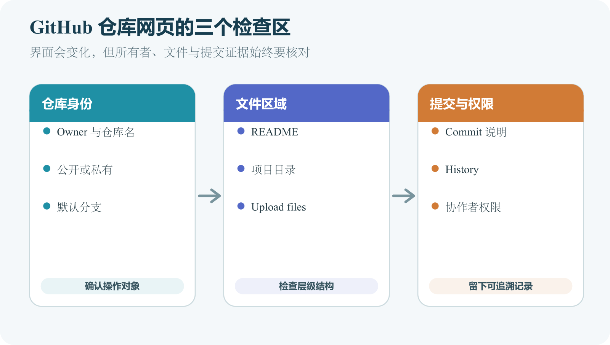

# GitHub 账号、公开仓库、私有仓库和网页上传

GitHub 网页能创建仓库、编辑文本和上传少量文件，适合第一次认识远程仓库，也适合不需本地测试的小型文档修改。项目进入日常开发后，GitHub Desktop 或 Git 更容易审查大量变化。本章关注对象与风险；会变化的按钮位置统一放在[《Git 与 GitHub 操作参考》](../../references/git-github.md)。

*图 6-1　网页操作前先确认所有者、仓库、分支与文件范围；界面成功只证明本次远程提交完成。*

## 账号决定所有权与操作身份

个人账号代表登录身份，Organization 让多人和团队共同管理项目。仓库 URL `github.com/owner/repository` 中的 `owner` 可能是个人，也可能是组织。创建仓库先读 Owner，避免把工作项目放进个人账号或把练习放进正式组织。

账号启用强密码与两步验证，恢复材料放在 GitHub 之外的安全位置。令牌、恢复码和 Cookie 不写进 README、示例配置或截图。显示名称与用户名可以不同，交接资料应记录稳定仓库 URL，不只写昵称。

个人练习和个人作品可以由个人账号拥有；公司、社团或长期多人项目更适合组织。判断标准是成员离开后谁继续拥有项目、支付费用和处理安全事件。组织资源不应为了绕过规则复制到个人账号。

## Public 与 Private 只描述仓库可见性

公开仓库通常让任何人读取代码、可达历史和公开协作内容；私有仓库只让授权账户访问。公开可读不自动授予复制、修改和分发许可，许可证另行说明使用权。

私有也不是秘密保险箱。协作者、自动化和授权应用可能读取内容，仓库还可能被误公开。真实密钥应在秘密系统中；一旦进入提交历史，改成 Private 或删除最新文件都不能使密钥失效。

仓库可见性与产品可见性分开。私有源码可以构建公开网站，公开前端也可以连接需要登录的后端。改变可见性不能替代网站、API 和数据权限；反过来，给网站加登录也不会隐藏 GitHub 的公开历史。

## 创建练习仓库的最短流程

使用无工作资料、无个人信息、无密钥的练习内容。

1. 新建仓库，确认 Owner、名称和说明。
2. 选择 Public 或 Private，理解它只控制仓库访问。
3. 初始化 README，创建后核对 URL、可见性和初始提交。
4. 在网页修改 README，预览 Markdown，写清提交说明。
5. 提交后打开 Diff，确认内容与目标分支。

组织策略阻止某项选择时，联系管理员，不把代码转到个人账号规避。网页预览只验证文字渲染，不能运行项目测试；大量源码修改应回到本地验证。

README 至少说明用途、维护状态、前提和最短运行路径。公开入口还可以链接贡献与安全报告方式。徽章、截图与链接不含秘密、真实用户和内部域名，并提供可访问文字。

## 网页上传先确认文件和层级

准备两份无敏感内容的文本，上传前查看真实扩展名。操作系统隐藏扩展名时，`notes.txt.exe` 可能看似文本；压缩包也可能夹带无关数据。页面列出的文件只是将要提交的范围，不代表内容适合公开。

拖入文件夹会保留层级。若本地结构是 `my-site/my-site/index.html`，上传外层后仓库顶层可能多套一层，部署工具就找不到首页。先找 README、依赖清单或主要配置所在的项目根，再选择上传范围。完整项目层级错误更适合在本地移动并查看整体 Diff。

Windows 和部分 macOS 文件系统可能不区分大小写，GitHub 与生产 Linux 常区分。代码引用 `images/logo.png` 时，仓库中的真实名称必须完全一致。

上传前至少排除这些内容。

- `.env`、令牌、私钥、签名与凭据文件；
- 数据库导出、用户列表、日志和真实测试数据；
- 合同、证件、内部地址与带位置元数据的照片；
- 没有明确来源或授权的代码、字体、图片与图标；
- 依赖目录、构建缓存和不需版本管理的大型产物。

文件名搜索和秘密扫描只能提供线索。值也可能写在源码、旧提交、Actions 日志或 Release 资产中。示例使用无法工作的占位符，不保留真实密钥的头尾展示格式。

普通文件传错可以用后续提交删除；真实密钥传错，先撤销或轮换，再调查暴露范围和历史处理。个人数据或合同公开还需要按适用责任处理，不能只改回私有后假设无人复制。

## 协作者与应用使用最低权限

邀请前通过独立渠道确认 GitHub 用户名，不凭头像猜身份。只需读取的人不获得管理、删除或组织 Owner。个人账号拥有的私有仓库向协作者授予的是读写访问，不能直接设为只读协作者；需要按 Read、Write 等角色区分成员时，应评估组织仓库的权限设置。外部部署平台只授权目标仓库；机器人只获得创建 Pull Request 或读取内容所需的权限。项目结束后移除成员、过期邀请、应用和令牌。

私有仓库访问返回 404，可能是邀请未接受、登录错账号或组织要求额外认证。不要通过改成 Public 解决权限问题。

转移仓库会改变所有者路径，并可能影响权限、Pages、Actions、Secrets 与部署连接。旧 URL 即使有重定向，也不能证明所有集成正常。转移前列依赖，转移后逐项重新验证。

## 改变可见性先审查完整范围

Private 改 Public 前检查所有分支、Tag、Issue、Pull Request、Actions 日志与 Release 资产，不只看默认分支当前文件。检查秘密、个人数据、版权、许可证和安全讨论，再记录审查范围与日期。

Public 改 Private 会改变外部读取、Fork、Pages 和部分集成，具体行为以确认对话框与当日官方资料为准。两种方向都要验证自动部署和机器人是否仍有正确权限。可见性变化属于外部状态改变，应由仓库所有者或授权人员确认。

一个作品仓库曾在历史中出现 `.env`。维护者先轮换旧密钥，再检查所有分支、Release 和 Actions 日志；照片去掉无关位置元数据，第三方图标保留许可说明，README 使用无效示例。公开后，用未登录窗口检查真实可见范围。这个案例的关键在公开边界，范围要覆盖历史与旁边的协作资产。

## 网页动作同样会创建提交

网页编辑、重命名、上传和删除会直接在远程分支创建提交。本地协作者之后需要取得这些变化。删除 README 会影响入口说明，删除工作流会停止自动化，业务影响不会被网页按钮自动判断。

普通误删可以从历史找回并创建恢复提交。删除仓库、转移所有权和安全设置影响更大，只在准确 Owner 与仓库名下执行。正式仓库的恢复演练不在唯一生产来源上进行。

Public 允许读取，不表示外部人员能直接修改默认分支。他们通常通过 Fork 和 Pull Request 提议变化，维护者审查后合并。分支规则可以要求评审和检查，但设置后要用测试分支验证实际效果。

Fork 保留与原仓库的协作关系，Template 用模板创建新项目，ZIP 只取得一次文件快照且没有正常 Git 历史。未来要持续更新或贡献时使用 Clone；只看某一时刻文件时 ZIP 更简单。

## 创建或上传后的验收

1. URL 中 Owner 和仓库名正确。
2. 可见性符合计划。
3. 目标分支与最近提交可辨认。
4. 文件层级和项目根一致。
5. README 写清用途与前提。
6. 没有秘密、用户数据和未授权资源。
7. 公开仓库用未登录窗口检查；私有内容不应泄露。

网络慢或上传中断时，先保留本地内容，再确认远程是否已产生提交，不连续创建同名仓库。来源不明的镜像或加速服务会接触仓库请求，私有内容和令牌不交给它们。

AI 可以只读检查准备上传的文件名和 Diff，草拟 README，提示常见秘密模式，但不能保证覆盖所有凭据、个人信息和许可问题。最终由人选择 Owner、可见性与协作者；公开、转移、删除或改变权限时，先核对目标、影响和恢复入口。
