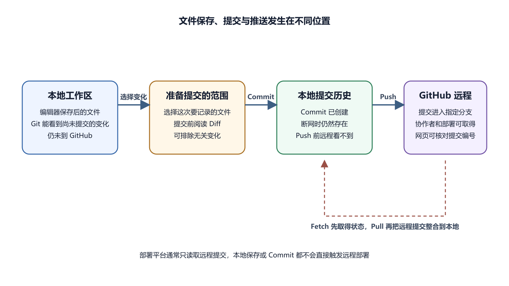

# Commit、Push、Pull、Clone 和 Sync

Git 操作难记，常因为教程把动词放在一起，却没有说明变化从哪里移动到哪里。先记住四个位置。工作文件在本地目录，Commit 在本地历史，远程提交在 GitHub，用户看到的是部署后的版本。

Commit、Push、Pull 和 Clone 都在这些位置之间工作。Sync 是某些工具把拉取与推送组合起来的便捷操作。它没有取消先后顺序，也不能自动决定冲突内容。

*工作文件、暂存、提交和远程仓库之间的变化流向*

## 一张动词对照表

| 动作 | 起点 | 结果位置 | 是否通常需要网络 | 会不会直接改远程 |
| --- | --- | --- | --- | --- |
| Save | 编辑器内容 | 本地文件 | 否 | 不会 |
| Commit | 本地已选变化 | 本地 Git 历史 | 否 | 不会 |
| Push | 本地提交 | 远程分支 | 是 | 会增加远程提交 |
| Fetch | 远程状态 | 本地远程记录 | 是 | 不会 |
| Pull | 远程提交 | 本地分支和文件 | 是 | 不会 |
| Clone | 远程仓库 | 新本地仓库 | 是 | 不会 |
| Sync | 本地与远程 | 双方按工具流程同步 | 是 | 可能 Push |

Fetch 常被漏掉。它只更新本地对远程状态的认识，适合先看看别人是否已经提交。Pull 通常包含取得远程提交和整合到当前分支，因此会改变本地文件。

Commit 前要先看 Diff。选中属于同一工作的文件，写清楚说明，再创建提交。GitHub Desktop 官方流程把审查变化放在提交之前。假设你修复登录按钮文字，同时 IDE 自动改动二十个格式文件。把它们一起提交会让审查者难以判断真正修复。可以先确认格式变化是否必要，不必要就安全恢复自己刚产生的格式化改动，或者分成独立提交。

提交说明可以使用动词与结果，例如“修复登录失败后的提示”“补充 Windows 安装步骤”。说明文字不需要写“我修改了”，提交本身已经表达发生了修改。Commit 成功后，History 出现记录。此时拔掉网络，提交仍在本地。它可以继续作为后续比较和恢复点。

## Push 把本地提交送到远程

Push 的目标由远程地址和分支共同决定。GitHub Desktop 的 Push origin 会把当前分支提交发送到名为 origin 的远程。origin 是常见默认名称，仓库也可能配置其他名称。

Push 前先 Fetch。远程没有新变化时，Push 通常直接完成。远程已经前进时，GitHub 会拒绝覆盖式推送，要求先整合。官方 GitHub Desktop 说明也要求远程有新提交时先 Fetch 和 Pull。

Push 成功的证据是 GitHub 网页对应分支出现相同提交编号和文件内容。网络错误、认证过期和仓库权限都会让 Push 失败。本地提交仍在时，不要重新复制文件或重复 Commit。Force Push 会让远程分支历史按本地强制改写，可能使他人的提交消失。初学者与共享分支不应使用。确有历史维护需求时，要先备份、通知协作者并明确恢复方案。

开始 Pull 前保存文件，并查看是否有未提交变化。Changes 为空时，结果更容易检查。点击 Fetch origin 后，若远程领先，界面会显示可拉取提交数量。Pull 成功后，History 顶部出现远程新提交，本地文件也会更新。若你本地与远程改了不同文件，Git 常能自动合并。改到同一位置时，Pull 可能停在冲突状态。

例如，小李在 GitHub 网页修改 README，小王本地只改了 CSS。小王 Pull 后，两项变化可以同时存在。两人都改 README 同一句时，Git 无法替他们选择最终文字，需要人工解决。

Pull 不是“下载整个项目重新覆盖”。Git 根据提交关系整合变化。直接删除本地目录再 Clone，会丢失未提交工作，也失去理解问题的机会。

## Fetch 适合先观察

Fetch 会联系远程并更新分支状态，通常不改变当前工作文件。准备开始一天工作、准备 Push 或准备切换分支时，可以先 Fetch。看到“远程领先两个提交”后，先打开 History 或 GitHub 页面，查看谁改了什么。涉及数据库迁移、依赖更新或配置变化时，Pull 后可能还要重新安装依赖或执行说明步骤。

Fetch 成功不表示本地已有远程内容。它只让 Git 知道远程状态。需要本地文件更新，仍要 Pull 或选择相应分支整合。

Clone 从远程取得仓库文件、提交历史和分支信息，并设置远程地址。适合新电脑、第一次参与项目或需要重新建立干净工作目录。Clone 之前决定本地父目录。不要把 `project-b` 克隆进 `project-a` 的仓库内部。也不要选中已有同名非空目录。成功后先读 README，再安装依赖。

Clone 不会自动安装项目需要的软件，也不会取得没有提交到仓库的 `.env` 与生产数据。团队应提供 `.env.example` 或配置说明，真实秘密通过安全渠道配置。公开仓库允许 Clone，不等于允许 Push。Push 需要远程写权限。没有权限但要贡献时，常见路线是 Fork 到自己的账户，Clone Fork，创建分支，再向原仓库提交 Pull Request。

## Sync 是便利按钮，不是新版本规则

GitHub Desktop 某些状态会显示 Fetch、Pull、Push 或同步相关按钮。其他编辑器可能用 Sync Changes 把 Pull 与 Push 组合。点击前要看图标或提示说明将取得和发送多少提交。

本地领先一个提交、远程没有变化时，Sync 主要执行 Push。双方都前进时，它会先整合远程，再发送本地结果。冲突仍需要人工处理。对生产仓库，分开 Fetch、检查、Pull、验证、Push 更容易控制。便利按钮适合状态清楚的小变化，不能替代查看 Diff 和分支。

假设你在台式机与笔记本管理同一项目。开始在台式机工作前先 Fetch 和 Pull，修改后 Commit，再 Push。换到笔记本时，也先 Fetch 和 Pull，再开始编辑。容易出错的顺序是两台电脑同时离线修改同一文件。台式机先 Push，笔记本后来 Push 会被拒绝。笔记本应 Fetch 和 Pull，解决可能的冲突，运行验证，再 Push 合并结果。

未提交文件不会跟随 Push 到另一台电脑。刚在台式机保存却没有 Commit，笔记本不可能 Pull 到。新建文件若被 `.gitignore` 排除，也不会同步。项目依赖和生成文件应按仓库约定处理。锁文件通常需要提交，依赖安装目录通常忽略。在新电脑 Pull 依赖清单后，需要重新安装依赖。

## 多人协作先约定谁能改主分支

小团队可以要求功能分支通过 Pull Request 合并到 `main`，并让至少一人审查。仓库规则还能要求 Actions 通过。规则的具体能力与账户类型会变化，以 GitHub 当前文档为准。保护主分支的目的，是让生产入口的变化有记录和检查。它不会自动发现错误需求。审查者仍要读 Diff、运行验证并理解影响。

紧急修复也应留提交与说明。可以缩短审查流程，不能让修复只存在某个人电脑。故障结束后补充原因、验证和后续预防。多人同时工作前约定格式化工具和换行规则。一个人保存文件自动格式化，另一个人使用不同规则，会产生大量无业务意义的 Diff，增加冲突。

Pull Request 常缩写为 PR，中文常称拉取请求。它是 GitHub 上请求把一个分支变化合并到另一个分支的协作对象。Pull 是本地取得并整合远程提交的 Git 操作。名称相似，方向不同。你 Push 功能分支后创建 PR，请团队审查。PR 合并到 `main` 后，本地电脑再 Pull `main`，取得合并结果。

PR 页面包含说明、提交、检查结果和 Files changed。合并前确认 Base 是目标分支，Compare 是来源分支。方向选反会展示意外的大量变化。PR 关闭但未合并时，目标分支不会获得变化。分支提交仍可能存在。合并后删除来源分支前，确认本地没有未推送工作。

## 提交领先与落后怎样读

本地 Ahead 表示本地有远程没有的提交，通常可以 Push。Behind 表示远程有本地没有的提交，需要 Fetch 和 Pull。Diverged 表示双方各有新提交，需要合并或变基。初学者遇到 Diverged 时优先使用普通合并流程。它保留双方历史，冲突处理也更直观。Rebase 会重放提交并改变提交标识，适合有明确团队规则的场景，本书不把它作为默认同步方式。

看到数量时还要读提交内容。落后十个纯文档提交与落后一个数据库迁移，风险不同。Pull 前打开远程历史和变更说明。

视频、数据集和构建包进入普通 Git 历史后，每次 Clone 可能都要传输历史版本。删除当前文件也不能自动缩小旧历史。Git LFS 可以把大文件内容放到专门存储，并在 Git 中保留指针。它有配额、费用和平台支持要求，使用前查当前官方文档。已经进入历史的大文件迁移仍会影响协作者。

Release 资产适合发布构建好的安装包，不需要每次进入源码提交。数据库备份和用户上传应使用专门存储。选择位置时考虑更新方式和恢复责任。

## 网络不稳定或离线时保留本地记录

Commit 是本地动作，可以先完成并核对 History。Push 失败后保留提交，记录错误。网络恢复时 Fetch，确认远程变化，再重试。网页显示加载失败时，不要连续提交同一表单。刷新仓库 History，确认操作是否已经创建提交。重复网页编辑会产生多条相同提交。

旅途中可以继续编辑和 Commit，每项完成工作形成独立提交，不把几天变化都留在工作区。恢复网络后先 Fetch；远程未变化就 Push，远程已经前进则先读提交、Pull 并验证。多个本地提交会一起发送，不需要重做。大仓库 Clone 中断时按官方方案重试；浅克隆缺少部分历史，不一定适合调查和贡献，私有仓库不经过不可信镜像。

依赖安装与在线 API 可能无法离线验证。提交说明或任务记录中标记未完成的验证。联网后补测，失败就用新提交修复。离线设备丢失时，未 Push 内容没有远程副本。重要工作应在网络可用时及时同步，并配合设备备份。Git 的本地历史不能保护整台设备失窃。

仓库转移或改名后，先确认新 Owner，再更新远程 URL。HTTPS 与 SSH 只改变认证方式，不改变提交。一个仓库还可能同时有自己的 Fork 与原项目远程；`origin`、`upstream` 只是约定，操作前看实际 URL。推到错误远程后，删除不能证明内容未被读取；秘密按泄露处理。

## 同步后的验收清单

Pull 后查看 History，确认预期远程提交存在。运行依赖安装或迁移说明，再执行关键测试。Push 后在远程对应分支检查提交编号。自动部署触发时，继续看 Build Log 和生产版本。同步 Git 成功只证明代码进入远程。运行状态属于后续环境。

协作任务完成后，Pull Request、Issue 和提交互相链接。交接人可以从 Issue 看到原因，从 PR 看到审查，从提交看到文件，从部署看到上线结果。同步失败时保存完整错误和当前状态。不要为了让按钮消失而反复执行不同工具操作。先确认失败发生在认证、网络、分支关系还是冲突。

Git 还记录部分文件模式。Windows 与 Linux 对换行、可执行权限和大小写的处理不同；Diff 突然显示整份文本变化，先查换行，不把无意转换混进业务提交。脚本权限与仅改变大小写的重命名要用 Git 确认，并在目标 Linux 环境验证。

## 同步前先暂停自动生成工具

开发服务器、代码生成器、格式化器和本地数据库可能持续写文件。同步前停掉相关进程，保存工作并让 Changes 可解释；Pull 后按新版本重新生成。网页编辑、Actions 与依赖机器人也会让远程前进，作者是机器人仍要审查锁文件、配置与测试结果。

## Clone、Fork 与 ZIP 下载的选择

GitHub 官方下载说明把 Download ZIP、Clone 与 Fork 分别用于不同需要。只想读源码或取得某个版本，ZIP 快照够用。要在本地保留历史、获取后续更新，选择 Clone。没有原仓库写权限，又准备贡献修改，选择 Fork 后 Clone 自己的副本。

ZIP 解压目录没有正常远程关系。里面可能有 `.github` 等点目录，却通常没有 `.git` 历史。不要因为看到项目文件就直接使用 Pull。Fork 在 GitHub 端创建关联副本。原仓库后续更新不会自动进入你的默认分支，需要同步上游。大型项目的贡献说明会规定具体方式，应优先阅读。

用无敏感内容的练习仓库完成一轮同步，开始时 Changes 应为空：

1. Fetch origin，确认远程状态。
2. 修改 README，检查 Diff，创建说明清楚的 Commit。
3. 在 History 核对，再 Push；网页比较分支与提交 SHA。
4. 在网页另改一行，生成远程提交。
5. 回到 Desktop Fetch、Pull，检查本地内容与 History。

整个练习不制造冲突。成功结果是本地与远程 History 能看到两条新提交，README 内容一致。若第八步后 Desktop 没显示 Pull，确认网页修改的是同一仓库和分支，再执行 Fetch。

成功结果是本地与远程 History 能看到两条新提交，README 内容一致。若没显示 Pull，先确认网页修改的是同一仓库和分支，再 Fetch。还可在另一个空目录 Clone，独立比较仓库地址、分支、SHA 与文件，证明远程真正收到提交。不要复制旧目录覆盖新目录。

自动部署只监听远程仓库，Commit 留在本地不会触发。远程 SHA 与本地一致，也只证明代码已推送，不证明平台完成构建和业务验证。部署失败后用新提交修复，不重写公开历史掩盖错误。

## 常见错误

Push 后网页没变化，先比较仓库、分支和提交编号。Pull 后本地项目不能运行，查看新提交是否修改依赖清单、环境变量要求或数据库迁移。Clone 很慢或中断，保留错误信息，检查网络和仓库大小。不要使用来源不明的代理传输私有凭据。

Sync 按钮转圈，先等当前操作结束并查看状态。重复关闭应用可能留下未完成合并。必要时使用只读 Git 状态确认仓库处于什么阶段。出现冲突后不要继续 Push。先解决冲突、运行验证并创建合并提交。下一章会详细说明。

AI 可以读取 Git 状态与日志，解释本地领先或落后，建议安全顺序。它也可以根据提交列表生成交接摘要。让 AI 执行同步前，先要求它报告当前路径、分支、远程地址、未提交文件和双方提交差异。没有这些信息时，不允许使用强制参数。

Push、Pull 与 Sync 前确认仓库和分支。Force Push、删除远程分支、覆盖本地未提交工作和处理生产配置时，必须亲自判断并准备恢复。下一章会处理分支、合并、冲突、撤销与恢复。重点是怎样保留已经存在的工作，再选择最终内容。
