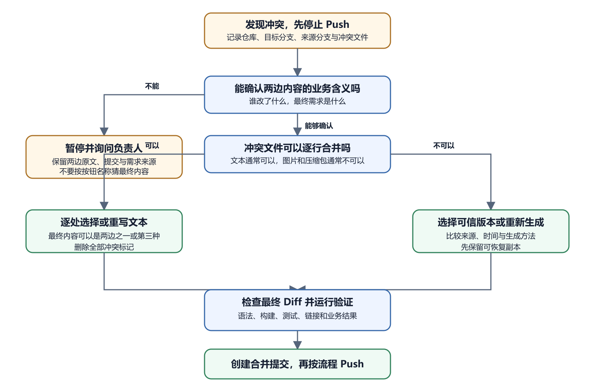

# 分支、合并、冲突、撤销与恢复

版本管理真正有价值的时刻，往往发生在改动不顺利以后。新功能做了一半，线上发现旧版本更稳定，两个人改了同一句文字，或者刚提交的配置需要撤回。此时先保护已有工作，再决定最终版本。分支与提交给恢复提供坐标。它们不会自动理解业务意图。Git 能指出两份内容冲突，最后保留哪句话仍要由人决定。

## 分支把试验与稳定版本分开

分支是指向提交序列的名称；默认分支通常承担稳定基线，功能分支用于一项改动；创建分支很快，也不会复制一份完整项目文件夹；假设 `main` 已经部署；你准备重做导航，可以创建 `nav-redesign`；本地切到新分支后修改、提交并推送；部署平台若支持预览，可以为这个分支生成独立地址；确认后再合并到 `main`。

切换分支会让工作目录呈现目标分支的文件状态。切换前要查看未提交变化。它们可能跟随切换，也可能因为会被覆盖而阻止操作。首次学习时，先提交一项完整工作，或安全保存明确的临时内容，再切换。

分支名应说明用途，例如 `fix-login-message` 或 `docs-windows-setup`。个人项目可以用简短英文，团队应遵守共同命名规则。不要把秘密、用户姓名或内部事件写进公开分支名。

Merge 译为合并；它把一个分支的变化整合到另一个分支；通常先切到接收变化的目标分支，再合并来源分支。GitHub 上的 Pull Request 也围绕这个过程工作。两条分支修改不同文件时，Git 通常能自动合并。即使自动合并成功，也要运行测试和查看最终 Diff。两个独立改动可能在业务上互相影响，例如一个分支修改 API 字段，另一个分支仍按旧字段渲染。

GitHub Hello World 与 Introduction to GitHub 练习会创建分支、提交变化、打开 Pull Request 再合并。它们适合安全认识流程，不需要在真实项目上制造冲突。

合并完成后，来源分支可以在确认不再使用时删除。删除分支名通常不会删除已经进入目标分支的提交。未合并工作则要先确认是否仍需保留。

## 冲突表示 Git 无法自动选择



*合并冲突处理决策图*

图中的顺序从“停止 Push”开始。先确认两边的业务含义。无法确认就暂停并询问。能够确认后，文本可以逐处选择或重写，二进制文件要选择可信版本或重新生成。最终都要检查 Diff、运行验证，再创建合并提交。

Merge conflict 译为合并冲突。GitHub 官方说明指出，当不同分支在同一文件的同一区域产生相互竞争的变化，或者一个分支删除文件而另一个分支修改它时，可能出现冲突。冲突解决前无法完成合并。

假设 `main` 的 README 写着“活动周六开始”。分支 A 改为“活动周日上午开始”，分支 B 改为“活动周六下午开始”。两个改动都来自同一句，Git 不知道哪个时间正确。冲突不是文件损坏。两边内容通常都还在，等待维护者选择。危险来自未经理解就点击 Accept、删除标记或强制覆盖。

## 冲突标记怎样读

文本冲突可能在文件中出现类似标记。

```
<<<<<<< current
活动周日上午开始
=======
活动周六下午开始
>>>>>>> incoming
```

上半段与下半段来自不同版本，中间线分隔它们。标记名称会因工具和操作方向不同而变化。不要只按 Current 或 Incoming 这个词判断业务正确性，要查看对应分支、提交和原始需求。最终文件必须删除所有冲突标记，并留下正确内容。正确结果可能选上半段、选下半段，也可能重写成第三种文字。若真实活动时间无法确认，就暂停合并并询问负责人。

图片、压缩包和数据库文件等二进制内容通常不能逐行合并。需要从两个版本中选择一个，或由源文件重新生成。选择前保留可恢复副本。

## 用 GitHub 网页解决简单冲突

GitHub 提供网页冲突编辑器处理一部分简单行冲突。官方步骤要求打开 Pull Request 的冲突解决入口，编辑文件，标记已解决，再提交合并结果。开始前先阅读 Pull Request 的提交与文件变化，确认目标分支。进入编辑器后逐个冲突处理。完成时搜索文件中是否还有 `<<<<<<<`、`=======` 与 `>>>>>>>`。

网页显示可以合并，只说明文本冲突已处理。仍要检查语法、链接和业务内容。复杂冲突、重命名、二进制文件或需要运行测试时，应在本地解决。若按钮不可用，可能是冲突过于复杂、仓库规则限制网页编辑或你没有写权限。不要把仓库改为公开或关闭保护规则来绕过。

Pull 或 Merge 遇到冲突时，GitHub Desktop 会列出冲突文件，并允许用外部编辑器打开。先记录当前分支、来源分支和未冲突文件。用编辑器逐个解决，保存后回到 Desktop。确认冲突文件状态已解决，再查看完整 Diff。创建合并提交前运行项目的最小测试。

如果发现方向选错，可以在尚未完成合并时使用工具提供的 Abort merge，也就是中止合并。具体按钮与恢复行为要按当前 GitHub Desktop 实测。中止前不要删除 `.git` 或手动移动大量文件。

冲突处理中途需要求助，可以提供冲突文件的非敏感片段、两个分支目标和期望业务结果。不要让 AI只根据“保留 Current”作选择。

## 撤销要先判断变化处于哪一层

尚未保存的编辑器内容，可以使用编辑器撤销。已经保存但尚未提交的变化，GitHub Desktop 可查看 Diff并丢弃选中变化。已经 Commit 但尚未 Push，可以创建修正提交，也可能在明确无他人依赖时调整本地历史。

已经 Push 到共享分支的错误，优先使用 Revert。Revert 会创建一个新提交，用相反变化撤销目标提交。旧提交仍留在历史中，协作者不用重建自己的版本关系。部署已经上线时，还要区分代码撤销与生产回滚。平台可以先把生产流量切回已知正常部署，为用户恢复服务。代码仓库随后用 Revert 或修复提交恢复一致。只回滚平台不处理仓库，下一次自动部署可能再次带回错误。

| 变化所在位置 | 更安全的常见入口 | 先确认什么 |
| --- | --- | --- |
| 编辑器尚未保存 | 编辑器撤销 | 当前文件与光标范围 |
| 已保存、未 Commit | 查看 Diff 后恢复选中变化 | 文件是否有别人或工具的工作 |
| 已 Commit、未 Push | 新修正提交，必要时调整本地历史 | 是否只有自己使用 |
| 已 Push 到共享分支 | Revert 或后续修复提交 | 提交范围与协作者状态 |
| 已部署到生产 | 平台回滚加仓库修复 | 数据与配置是否兼容 |
| 已迁移数据库 | 专门恢复或向前修复 | 备份、迁移可逆性、客户端版本 |

表格给出常见方向，实际还要看数据影响。例如一个提交新增了数据库列，Revert 代码可能很简单。数据库列是否删除却要谨慎，旧 App 或报表仍可能使用。撤销前记录现象与版本，撤销后再运行关键流程。若用户故障仍存在，说明原因可能不只来自这个提交。

## 删除文件与移动文件的恢复例子

小夏整理项目时，把 `public/logo.svg` 移到 `assets/logo.svg`，却忘了修改页面路径。提交并 Push 后，网页图片 404。最小修复可以更新页面引用，再创建新提交。若移动本身也是错误，也可以把文件移回原位。两种方案都保留原提交，不需要 Reset 整个仓库。

如果文件被真正删除，先从最近正常提交查看内容。恢复时把旧版本提取到当前工作区，检查它是否仍与新代码兼容，再提交恢复。不要把整个项目退回旧提交，只为找回一个文件。图片或配置在部署平台还有副本时，也不要把线上产物直接当成唯一源码。产物可能经过压缩或替换。Git 历史中的来源更清楚，必要时与备份比对哈希。

Git 操作可能停在 Merge、Rebase、Cherry-pick 或 Revert 中途。Git 状态会说明当前过程和待解决文件。不要在不理解阶段时继续启动另一种历史操作。如果合并方向或前提错了，并且尚未提交结果，可以考虑中止当前合并。中止目标是回到开始前状态。未提交工作是否能完整恢复，要看操作前状态，因此开始前保持干净工作区很重要。

已经解决一半的冲突需要暂停时，记录已处理文件和依据。不要把冲突标记留在源码后当作普通提交。CI 可以增加检查，阻止典型标记进入默认分支。工具崩溃后重新打开，先读状态和 History。不要重复点击 Merge。已有合并提交时，第二次操作会产生不同结果。

## 二进制冲突怎样决定

两位设计者分别修改同一个 PNG，Git 不能合并像素。先取得两个版本并以不同文件名保存，比较尺寸、内容、来源和对应需求。如果图片来自可编辑源文件，例如 SVG、Figma 导出或设计工程，应回到可信源重新生成最终产物。生成过程与版本也要记录。直接选修改时间较新的文件可能丢掉另一边正确内容。

大型二进制文件频繁冲突，说明版本与协作方式需要调整。可以明确唯一编辑者、拆分资源、使用专门资产管理，或选择 Git LFS。方案要匹配团队规模，不要把所有图片移出版本管理后失去来源。数据库文件也属于不适合逐行合并的对象。SQLite 数据库出现在仓库中时，通常应提交迁移与种子数据，不直接合并多人运行后的数据库文件。第三十二章会详细讲迁移和备份。

合并提交说明可以写明冲突区域和最终选择。Pull Request 讨论中链接需求、截图或测试结果。以后出现回归时，维护者能知道这段内容经过何种取舍；例如两个分支修改登录超时；最终采用 30 分钟，不应只写“解决冲突”。记录“采用安全评审确认的 30 分钟，并补充过期测试”更有用。具体数值还应来自配置或政策来源。

冲突数量很多时，可以按文件类型分组，先处理自动生成文件的源，再重新生成产物。不要在生成文件和源文件中分别手改两遍。

## 回滚后的生产观察

平台切回旧部署后，检查公开地址、关键 API 和错误率。旧代码可能仍连接已经迁移的新数据库。若数据结构不兼容，代码回滚不能恢复服务。回滚期间用户可能已经写入新数据。恢复数据库备份会覆盖这段时间写入，需要评估与保全。重大事故应有明确指挥和时间记录。

服务恢复后，仓库默认分支、生产部署和文档要重新一致。若生产临时指向旧提交，在下一次正常发布前写清现状，避免自动部署再次触发故障版本。

甲在 `main` 修正安装命令，乙在分支补充 macOS 步骤，丙在另一个分支重排全部 README。甲先 Push。乙合并时只有不同段落变化，自动成功。丙的重排触及大部分行，随后合并出现多处冲突。丙不能机械保留自己的整份文件，因为会丢掉甲和乙的新内容。更安全的做法是从最新 `main` 新建分支，重新应用结构调整，或者逐项把两边内容放进最终文档。

大范围格式化和重排容易放大冲突。团队可以先合并业务修复，再单独做格式提交。格式提交期间通知其他人减少同一文件改动。最终 Pull Request 要显示安装修复、macOS 步骤和新结构都存在。文档链接检查通过后再合并。

## 冲突不是越少越好

完全没有冲突可能因为团队提前分工，也可能因为某个人一直覆盖远程历史。应结合提交与审查记录判断。正常冲突暴露了两个有效意图相遇。处理过程把最终选择写清楚，反而能避免静默丢失。危险的是为了保持“无冲突”而让所有人共享一个本地目录，或强制推送覆盖别人。

减少无意义冲突可以统一格式工具、拆分超大文件、缩短分支生命周期和及时同步。业务冲突仍需要负责人决策。

团队可以定期在临时 Clone 中练习找回一个文件、Revert 一个无数据变化的提交，以及从已知部署回滚。不要在生产默认分支制造故障。数据库恢复使用脱敏测试数据和独立实例。

第一次可以只练 README。在临时分支增加一句练习文字并提交，记下提交编号。随后使用 Revert 创建反向提交，检查 History 中同时保留原提交和 Revert 提交，README 回到原内容。把分支切回再打开一次文件，确认恢复结果没有依赖编辑器未保存状态。整个练习不使用 Reset，也不强制 Push。

演练记录要写仓库地址、临时分支、两个提交编号、执行时间和实际结果。若文档中的按钮已经改名、权限不足或远程保护规则阻止操作，记录真实路径并更新说明。完成后先确认没有独立工作和需要保留的证据，再按项目规则处理临时分支与目录。恢复文档经过另一人照做成功以后，才适合在事故中使用。

## 用 Bisect 思想缩小故障范围

当十几个提交之间某处开始失败，可以选择中间版本测试，再根据结果缩小范围。Git 提供 Bisect 工具自动辅助这种二分查找，本书只讲判断思路。先确定一个已知正常提交和一个已知故障提交。每次在隔离环境测试同一操作，记录结果。环境、数据库和输入要尽量一致。

找到第一个故障提交后，阅读 Diff 与需求。提交可能只是暴露环境问题，不一定是唯一原因。修复前仍要复现和验证。生产仓库中切换历史测试时使用临时分支或新 Clone，不在有未提交工作的目录反复移动。涉及数据库迁移时，不要让旧代码连接生产数据库。

确认目标与来源分支，阅读全部提交和 Files changed。检查是否误入秘密、构建产物和无关格式变化。运行自动测试，并亲手验证改变的主要行为。数据库、权限、依赖和部署配置变化单独标记。准备回滚与监控。审查评论未解决时，不急着合并。

合并后观察默认分支 Actions 和预览。生产发布由另一步触发时，保留批准记录。删除分支前确认提交已在目标历史中。

## Revert 一个提交前看清范围

假设提交“更新首页与数据库配置”造成故障。Revert 整个提交会同时撤销两类变化。若数据库已经发生不可逆迁移，直接撤销代码可能产生新的不兼容。先打开提交 Diff，列出它修改的文件与外部动作。只包含静态文字时，Revert 通常直接。包含依赖、数据库、文件存储或基础设施配置时，要制定相应恢复顺序。

Revert 也可能冲突。如果后来提交继续修改相同行，Git 无法直接应用相反变化。此时要人工决定当前状态应保留什么，并重新测试。

Reset 可以移动本地分支指向，并根据模式影响暂存区和工作文件。不同模式后果差异很大。Force Push 又可能把重写后的历史发送到远程。这些操作不适合用一条无条件命令教给初学者。本书遇到“回到旧版本”时，先使用新分支检查旧提交、平台部署回滚或 Revert。必须重写历史的特殊场景会明确备份、协作者状态和恢复方法。

删除含秘密的历史是特殊事故。GitHub 官方提醒，重写历史会影响 Fork、Clone、Pull Request 和协作者，需要协调清理。更重要的第一步是撤销或轮换已经泄露的凭据。

> 高风险操作
>
> 不要从网络复制 `reset --hard`、`clean` 或 Force Push 命令到有未提交工作的仓库。先列出绝对路径、Git 状态、未跟踪文件和远程差异，并建立可恢复副本。

## 恢复前先做只读审计

遇到误删或错分支，先停止自动格式化、构建清理与同步。它们可能继续改变工作目录。记录仓库路径、当前分支、Git 状态和最近提交。查看目标文件是否已提交、已推送、存在于另一分支、系统回收站、编辑器本地历史或独立备份。不同来源的可信度不同，恢复后还要比较内容。

不要先删除当前仓库再 Clone。未推送提交、未跟踪文件和本地配置可能只有这一份。即使准备重建，也先复制当前目录到明确的安全位置，并记录时间与哈希。恢复出的文件先放到新分支或独立检查目录，运行验证后再合并。恢复成功的标准是目标内容完整、项目可运行、历史关系清楚，而非“文件重新出现”。

## 一个安全冲突练习

使用 GitHub 官方 Hello World 练习仓库，不要使用生产项目。先在 `main` 的 README 某一行写一个时间并提交。创建练习分支，把同一行改成另一个时间并提交。再回到 `main` 修改同一行并提交，然后合并练习分支。此时可能产生文本冲突。读清两边内容，最终写成一个第三种、明确正确的练习句子，删除冲突标记，完成提交。

成功结果是 README 只留下最终一句，文件没有冲突标记，History 保留两边提交和合并结果。完成后删除练习仓库即可。删除前确认它确实没有工作资料。

解决冲突后项目出现语法错误，说明文本标记清掉了，最终组合仍不合法。运行格式检查、构建与测试。Revert 后线上仍有故障，检查生产是否发布了 Revert 提交，以及数据库或缓存是否需要兼容处理。切回旧部署时记录当前数据变化。

切换分支后“文件消失”，先看该文件是否只存在于另一分支。不要立即创建一个同名空文件覆盖线索。

## 让 AI 处理冲突时保留选择权

AI 可以解释冲突两边来自哪些提交，提出候选合并内容，列出撤销方案的影响。它也能检查文件是否还残留冲突标记。让 AI 修改前，要求它保留两边原文、说明业务依据，并在独立分支工作。没有业务信息时，它不能替你决定活动时间、价格、权限和生产数据。

选择冲突最终内容、撤销共享历史、生产回滚和秘密事故处理必须亲自确认。涉及数据库迁移和用户数据时，代码版本只是恢复的一部分。下一章会看 GitHub 仓库中代码之外的内容。README、Release、Issue、Actions 和许可证共同说明项目怎样使用、是否维护以及自动化是否成功。
