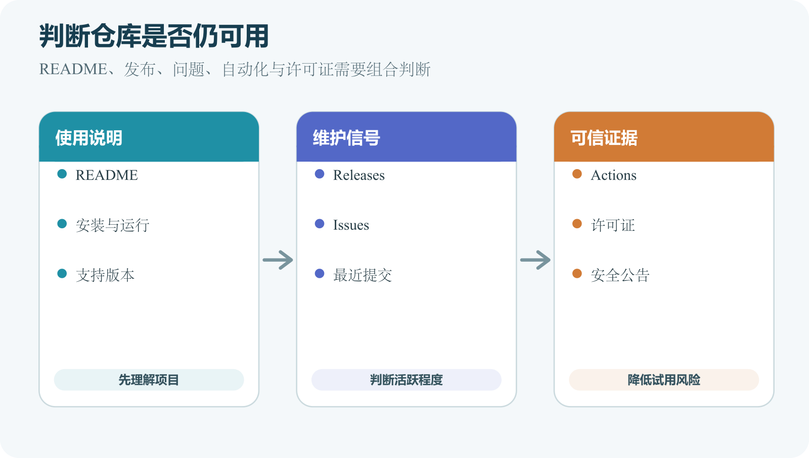

# README、Releases、Issues、Actions、许可证和项目维护状态

打开陌生仓库时，文件数量最多的目录未必最先看。README 告诉你项目是什么，Release 告诉你维护者打包了哪些版本，Issue 展示已知问题，Actions 展示自动化记录，许可证说明允许怎样使用。

这些信息不能单独证明项目可靠。把它们放在一起，可以减少“下载后才发现无法运行”或“公开使用后才发现没有授权”的情况。



*README、Release、Issue、Actions 和许可证组成的仓库维护信号*

## README 是项目入口说明

README 通常使用 Markdown 编写。GitHub 会在仓库首页和目录页面的常见位置渲染相应 README。文件名常写作 `README.md`。一个实用 README 先说明项目解决什么问题，再给当前支持范围。随后列出前置软件、安装、运行、构建、配置、测试和部署。项目含截图时要提供替代文字，含秘密配置时只给变量名与示例值。

README 不应把所有技术细节塞在一页。复杂项目可以链接到 `docs` 目录、贡献指南、安全政策和变更记录。入口页保留读者第一次运行所需的最短路径。例如，一个项目只写“运行 `npm start`”，却没说明需要哪个 Node.js 版本、在哪个目录运行、成功后打开什么地址。读者无法判断命令报错来自环境还是项目。

可以使用下面结构起步。

```
# 项目名称

一句话说明用途与目标读者。

## 当前状态

说明可用功能、已知限制和最后验证环境。

列出操作系统、运行时与必要账号。

逐步写出目录、命令、预期地址和常见错误。

写出构建命令、输出目录和部署入口。

## 配置与秘密

只列变量名和安全配置方法。

链接到 LICENSE 文件。
```

模板只提供顺序。没有数据库的项目不用硬写数据库章节。无法验证的系统不要写“完全支持”，可以写“尚未验证”。README 中的命令要能复制，也要解释运行位置。项目升级依赖后同步更新文档。

GitHub Release 建立在标签之上，可以包含版本说明、二进制文件与其他下载资产。GitHub 也会提供对应源码压缩包。Tag 译为标签，用一个稳定名称指向某个提交，例如 `v1.2.0`。Release 在这个版本上增加面向使用者的说明。仓库最新提交可能正在开发，最新稳定 Release 可能更适合普通用户。

下载工具时，先看 Release 标题、发布日期、Pre-release 标记、支持系统和校验信息。Assets 中的文件名可能区分 Windows、macOS、Linux 与处理器架构。选错架构会导致程序不能启动。

源码 ZIP 与已经构建的安装包不同。源码需要开发环境才能构建，安装包或可执行文件通常准备给最终用户。Release 也不能自动证明安全。优先使用项目官方链接，核对签名或哈希，查看异常公告。

## 为自己的项目制作一次 Release

发布前先选择已经通过验证的提交。为它创建版本标签，编写面向使用者的说明。说明应包括新增、修复、已知问题、升级要求和验证环境。如果提供安装包，文件名写清系统、处理器和版本。生成哈希或签名时，把校验方法写进说明。公开仓库发布后，从未登录环境打开 Release，确认资产可下载、链接有效；私有仓库则使用具备读取权限的测试账号验证，并确认未授权访问被拒绝。

不要在发布页临时手工修改一个与源码不一致的二进制文件。构建产物最好能追溯到标签提交和自动化记录。Draft Release 只保存在发布准备状态，Pre-release 向使用者明确它仍在测试。最终 Publish 前读清目标仓库和标签。版本错误可以发布修正版，不能假定下载者会自动得到替换文件。

Release notes 中避免只写“若干优化”。用户需要知道是否要备份、重新登录、迁移数据库或重新配置。破坏兼容的变化要放在显眼位置。

高质量 Issue 标题描述现象，例如“Windows 路径含空格时构建找不到配置”，正文写版本、系统、shell、脱敏路径、复现步骤、预期、实际和第一段错误。修复进入 Release 后再验证；Issue 关闭也可能表示重复、无法复现或不在范围。

## Actions 日志怎样从第一处失败读起

一次工作流可能有多个 Job。先看失败 Job，再展开第一个失败 Step。安装依赖失败后，后面的测试找不到命令属于连带结果。日志中常能看到运行系统、工具版本、命令与退出码。比较本地环境，找出差异。项目本地使用 Node.js 20，Actions 使用另一个主要版本，构建差异就有具体线索。

重新运行失败工作流适合排查偶发网络错误，不能替代修复确定性错误。连续重跑十次偶尔成功，说明流程仍不稳定。工作流生成 Artifact，也就是运行产物时，下载前确认来源 Run、提交和保留期限。Artifact 适合测试报告与临时构建，Release 资产承担正式发布时，应有清楚分工。

Badge 只代表所链接工作流和分支的最近状态，不能概括全部质量。仓库、工作流或默认分支改名后检查链接；覆盖率、下载量和版本徽章也要注明来源与范围。

## 许可证的三个小场景

阅读思路后独立实现、直接复制代码、使用图片、字体和数据，会产生不同许可问题。保留来源，检查根 LICENSE、文件头、素材元数据和原站条款；代码许可证不自动覆盖素材、商标或数据。声明冲突时请维护者澄清，重要项目咨询专业人士。

提交频率不等于维护质量。稳定项目可能很久不改，机器人频繁更新的项目也可能无人处理真实故障。结合目标功能、稳定 Release、安全回应、文档和迁移责任判断；选择不活跃项目就要有人承担修复与内部发布。

## 安全问题不要先开公开 Issue

漏洞细节公开后可能帮助攻击者利用。先查看仓库的 Security 页面、`SECURITY.md` 或官方安全联系方式。按维护者指定的私密渠道报告。报告仍要包含受影响版本、复现条件、影响与最小证据。不要访问不属于你的数据来证明漏洞。设定合理披露节奏应与维护者和适用规范协调。

仓库没有安全渠道时，选择低风险联系方式并避免公开关键利用细节。严重问题需要组织安全人员或专业机构协助。

维护者容易在已有环境中写安装说明，漏掉全新用户需要的步骤。用新目录或干净测试环境按 README 从头执行，可以发现隐含前提。每条命令记录运行目录和输出。若第一步要求复制 `.env.example`，说明哪些值必须配置、从哪里取得。

Windows 与 macOS 步骤不同就分开写。不要把 bash 与 PowerShell 混在一个代码块。Linux 服务器命令单独标注远程位置和权限。文档验证也要进入版本记录。README 与代码同一提交更新，可以减少新功能上线而说明仍旧的时间差。

## Release、Tag 与部署版本怎样对应

仓库 Tag 指向源码提交，Release 围绕 Tag 提供说明和资产，部署平台又有自己的部署编号。三者要能互相追溯。例如 Release `v1.2.0` 对应提交 `abc123`，Windows 安装包由同一提交的 Actions 构建，生产部署也记录 `abc123`。用户报错时提供版本号，维护者能找到源码和日志。

如果安装包由另一个未记录目录手工构建，版本名相同也可能内容不同。可重复构建、签名和哈希能减少这种不确定。紧急修复发布 `v1.2.1` 后，说明受影响版本与升级建议。不要悄悄替换旧资产，让已经下载的人无法确认内容。

社区 Issue 可补充真实故障，但要记录版本、系统、日期、维护者结论和修复所在 Release。旧回复或高赞命令只是线索，不能获得管理员权限；平台事实仍以当前官方资料为准。

## CHANGELOG 与 Release notes 的关系

CHANGELOG 是仓库中的版本变更记录，Release notes 是某次 GitHub Release 面向使用者的说明。项目可以从同一材料生成两者，也可以分别维护。变更记录按版本列出新增、修改、修复、弃用与安全事项。不要逐条复制所有内部提交。用户更关心行为变化、升级动作和兼容风险。

尚未发布的变化可以放在 Unreleased。发布时移动到确定版本并写日期。修改旧记录要保留原因，不能静默删除曾经公布的破坏性变化。自动生成记录能减少遗漏，提交说明质量不足时也会生成难读列表。最终 Release 仍需人工整理。

Issue 与 Pull Request 模板可以提醒版本、复现、测试、迁移和秘密检查，字段与真实风险匹配，不要求粘贴令牌、完整配置或私人数据，并提供脱敏和安全报告入口。

## 版本号提供相对顺序

许多项目使用类似 `1.4.2` 的版本号，通常分别表示主要版本、次要版本和修复版本。是否严格遵守语义化版本由项目决定，不能仅凭数字断言兼容。Pre-release 常用于测试版本，可能包含新功能，也可能有未解决问题。生产环境应按项目说明选择稳定版本，并在升级前查看变更与迁移要求。

Latest 标签是 GitHub 界面或维护者设置的一种提示。自动工具选择版本时，还要结合是否为预发布、系统架构和项目自己的发布政策。Issue 用于缺陷、任务和可执行反馈。提交前搜索版本与日期相近的开放和关闭结果；提供最小示例时排除秘密、个人信息与受限内容。

## Discussion 与 Issue 的分工

项目启用 GitHub Discussions 后，可以把问答、想法和社区交流放在那里。Issue 更适合可执行的缺陷与任务。具体分工由仓库维护规则决定。使用前先读 CONTRIBUTING、Support 或 Issue 模板。有些项目要求安全漏洞通过私密安全渠道报告，公开 Issue 会扩大风险。

提问时链接所用文档和版本。不要在多个频道同时重复发布同一问题，维护者需要额外合并信息。

Actions 在仓库事件后运行测试、构建或部署工作流。绿色只表示配置中的步骤成功，不能覆盖未配置的测试；失败时从第一个失败 Step 和第一段具体错误读起。Actions 可能使用仓库 Secrets，日志和脚本不能主动打印秘密。来自不可信 Fork 的工作流需要谨慎授权。第三方 Action 是外部供应链代码，选择可信维护者，固定审查过的版本并关注公告。

## 许可证说明别人可以做什么

代码默认受到版权保护。GitHub 官方说明指出，没有许可证时，通常适用默认版权规则，他人没有得到一般性的复制、分发或创作衍生作品许可。公开可见不等于开放授权。常见开源许可证对使用、修改、分发、署名、相同方式开源和专利等有不同条件。选择许可证属于法律决定，本书只解释阅读位置。

使用第三方项目时，打开仓库根目录的 `LICENSE` 或 `COPYING`，再查依赖与素材各自许可证。项目整体许可证不会自动覆盖来源不同的图片、字体、数据和商标。复制一段代码也可能触及许可。保留来源和许可证记录，按要求附带声明。商业项目、闭源分发或多许可证组合存在疑问时，应咨询有资格的专业人士。

维护状态要结合最近 Release、目标分支、Issue 响应、Actions、安全公告和文档版本，没有一个活动数字能单独回答。README 中写 Archived，或 GitHub 页面显示仓库已归档，通常表示只读保存。Fork 仍可研究，但原维护者不再接受常规修改。生产项目继续依赖时，要评估自己维护、迁移或寻找替代的成本。

## 一个陌生项目的十分钟检查

第一分钟确认所有者、官方链接与仓库是否归档；接着读 README 的用途、系统要求和支持版本；查看最新稳定 Release 与发布日期；打开 Actions 看最近默认分支结果。搜索与你系统和目标功能相关的 Issue，例如 Windows、Apple Silicon、Docker 或具体错误。打开许可证，确认使用范围。最后查看安装命令会执行哪些脚本，是否需要管理员权限或外部下载。

十分钟检查只能筛掉明显不合适的项目。准备用于生产、处理个人数据或安装高权限组件时，还要审查依赖、构建来源、安全记录和更新责任。

README 可以明确写 Active、Maintenance、Experimental 或 Archived，并用中文解释含义。标出最后验证的系统与版本，列出已知限制。发布新版本时写变更内容、升级步骤、破坏性变化与回滚方法。Issue 模板要求最小复现。Actions 至少运行构建或关键测试。添加安全报告方式，避免漏洞直接公开。

项目停止维护时，更新 README 和仓库描述，说明最后可用版本、已知风险与替代方向。不要继续显示会误导用户的“正在积极开发”。

## 常见误解

Stars 表示用户收藏或关注，不能直接证明代码安全、持续维护或适合你的场景。Fork 数量也可能来自课程练习或长期旧版本。README 的安装成功截图不能替代当前版本测试。Release 文件名写 Stable 也要看发布来源。Actions 通过不能覆盖未配置的测试。

许可证文件存在，仍要确认它适用于哪些目录和资产。没有许可证时，不要从公开仓库大量复制代码用于自己的产品。

AI 可以汇总 README、Release notes、Issue 和 Actions 状态，列出版本风险与缺失文档。它还能把一份模糊报错整理成完整 Issue 草稿。要求 AI 链接到原始条目并保留日期。它不能根据 Star 数或 README 语气直接判断项目安全，也不能替你作法律结论。

下载文件来源、执行权限、许可证适用性、生产依赖与安全风险要亲自确认。发布 Release、公开 Issue 中的日志和改变项目维护状态时，也要审查影响。下一章会把这些线索用于一次完整任务。下载、检查并运行别人的项目，同时保护本机、账号和现有文件。
