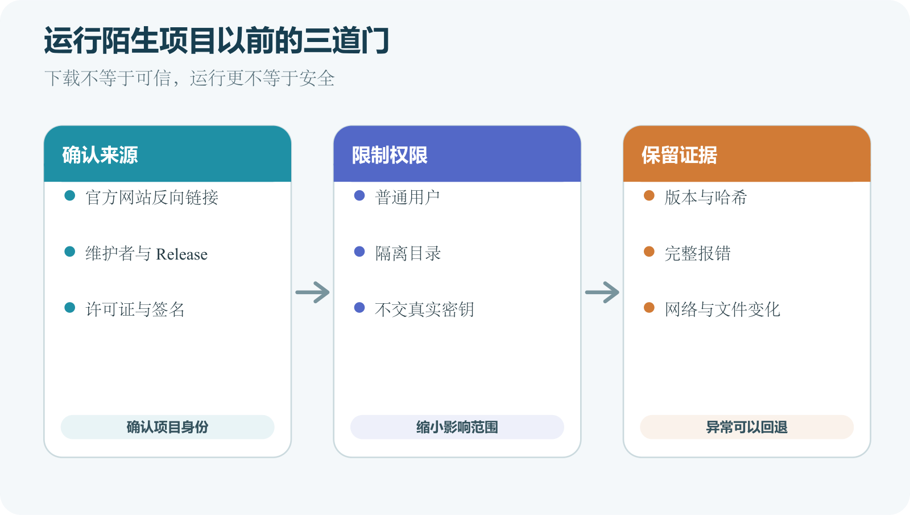

# 下载、检查并运行别人的项目

GitHub 上的公开代码可以帮助学习，也可能包含过时依赖、安装脚本、恶意代码或不适合你系统的配置。下载按钮只完成文件传输，不会替你判断来源、授权与运行风险。安全顺序是先确认项目身份，再读文档和代码，随后选择取得方式。安装依赖与运行程序应放在隔离的普通用户环境，看到管理员权限、密钥和外部下载要求时再次停下来检查。

*运行陌生项目前确认来源、限制权限和保留证据的三道门*

## 从项目身份开始

很多仓库名称相同或相似。先从软件官方网站、维护者公开主页或可信文档进入 GitHub 仓库，不要只凭搜索结果第一项。确认仓库所有者、URL、是否归档、最近 Release 与 README。GitHub 显示 Verified Organization 等标记时，也要理解它只证明平台所声明的身份关系，不能替代代码审查。

查看 README 中是否链接官方网站，网站又是否反向链接同一仓库。若一个热门工具突然由陌生账号发布“修复版”，先查原项目公告、Issue 和 Release，不要因为版本号更高就运行。浏览器下载的文件还可能来自 Release 的外部链接。核对最终域名与文件名。遇到短链接、网盘和要求关闭杀毒软件的说明时，风险显著提高。

README 告诉你项目用途、前置条件和运行方式。找到支持的操作系统、运行时版本、硬件要求、配置文件与已知限制。Release 页面说明维护者准备好的版本与资产。普通使用者可能应该下载构建好的安装包，开发者才需要 Clone 源码。Pre-release 不适合直接替代稳定版本。

Issue 中搜索你的系统、处理器和准备使用的功能。例如 Windows、ARM、Apple Silicon、Docker 或某个错误文本。重点看最近版本的真实报告和维护者回应。

许可证决定允许怎样使用、修改和分发。没有许可证时，不要把公开可见理解为可以加入商业产品。依赖、模型、数据和素材还可能有各自条款。

## 判断项目会接触哪些资源

运行前列出项目需要的权限与数据。

- 是否读取你选择的文件，还是扫描整个磁盘
- 是否需要网络，以及连接哪些域名
- 是否要求 GitHub、云平台或数据库令牌
- 是否启动本地服务器和监听端口
- 是否安装系统服务、驱动或浏览器扩展
- 是否写入用户配置、启动项或系统目录
- 是否上传文件、日志或遥测数据

一个 Markdown 预览器要求读取所选文档很合理，要求管理员权限和完整云账号令牌就需要解释。一个 Docker 管理工具访问 Docker 守护进程也意味着它可能控制容器和卷，不能只按普通网页工具对待。

README 没有说明数据去向时，可以搜索代码中的网络请求、遥测配置和隐私说明。无法判断的高权限项目不要在主力电脑和真实数据上试运行。

## 先写一个简单威胁清单

Threat model 可以译为威胁模型。对个人试用，它不必是一份复杂安全报告。写清要保护什么、程序能访问什么、最坏结果是什么，就能决定隔离程度。假设项目要整理照片。需要保护的是私人照片、位置元数据、云盘令牌和原始文件。程序需要读取选中目录并写入输出目录。最坏结果包括原图被覆盖、照片被上传、令牌泄露或程序留下后台进程。

据此可以采取具体限制。复制几张公开测试图，只挂载测试目录，不提供云盘令牌，关闭不必要网络，检查输出后再决定是否扩大范围。若项目目标本身需要联网，例如调用 AI API，就不能简单断网。改用测试密钥、额度限制、独立账户和非敏感输入。安全措施要保留核心功能所需能力，又限制无关访问。

先看依赖清单和脚本定义。Node.js 项目查看 `package.json`，Python 项目查看 `pyproject.toml` 或 `requirements.txt`，Flutter 项目查看 `pubspec.yaml`。确认安装、启动、构建与清理脚本。再找程序入口、网络请求、文件读写和命令执行。关键词只能提供线索，动态加载或第三方依赖可能隐藏行为。大型项目无法快速审完时，不要把粗略搜索写成“代码已安全审计”。

检查 CI 如何构建 Release。若发布二进制由可查看的工作流从标签生成，来源更容易追溯。维护者手工上传也可能正常，需要额外签名或发布说明。依赖数量多会增加审查范围。查看锁文件是否存在、是否出现直接指向陌生 Git 仓库的依赖，以及安装脚本是否访问外部地址。不要为了减少警告随意升级全部依赖，可能改变项目行为。

## Windows 可执行文件的最小检查

开启文件扩展名，确认下载的是 `.exe`、`.msi`、`.zip` 或其他预期类型。右键属性可查看数字签名与发布者信息，具体入口随 Windows 版本变化。有效签名能支持文件来自证书对应发布者且签名后未被修改。它不保证程序没有漏洞，也不说明发布者可信。无签名也不自动等于恶意，开源小项目可能没有签名成本。

SmartScreen 或安全软件警告时记录文件哈希、下载 URL、签名状态和警告文本。到项目官方渠道核对。不要把文件上传到未经批准的公开扫描服务，商业软件或私人文件可能因此外泄。安装程序请求管理员权限时，Windows 会显示发布者与目标。若 README 没说明为什么需要，取消并调查。普通用户目录中的便携程序通常不需要修改系统范围。

确认下载适合 Apple Silicon、Intel 或通用架构。打开应用时，macOS 会检查签名与公证等安全信息，具体提示取决于系统版本。系统阻止应用时，不要直接使用移除隔离属性或关闭 Gatekeeper 的网络命令。先查官方发布说明、签名、公证和 Issue。开发者提供的绕过步骤也要理解风险。

应用要求完全磁盘访问、辅助功能、屏幕录制或输入监控时，权限范围很广。只在功能确实需要且来源可信时授予，用完后评估是否撤销。命令行工具可能通过 Homebrew 等包管理器安装。确认 Formula 或 Cask 的维护来源、版本和下载 URL。不要把第三方 Tap 当成 Homebrew 核心仓库。

## 容器运行陌生项目的权限清单

查看 Compose 文件和 `docker run` 参数。挂载 `C:\`、`/`、用户主目录或 Docker socket 都会给容器很大访问范围。`privileged` 模式与添加系统能力也要有明确原因。端口映射 `127.0.0.1:8080:8080` 通常只从本机访问，绑定所有网络接口会扩大范围。语法因工具与平台而异，最终用 Docker 实际状态确认。

Volume 中可能保存数据库。删除容器不一定删除 Volume，清理 Volume 又可能永久删除数据。试运行前使用专门测试卷，完成后列出资源再删除。镜像标签 `latest` 会随维护者更新，难以复现。测试记录应保存实际镜像摘要或明确版本。公开镜像仍要核对发布者与 Dockerfile 来源。

项目写“完全本地”时，检查它是否加载在线字体、更新检查、崩溃报告或遥测。它们不一定上传用户文件，仍会产生网络请求。浏览器工具可以用 DevTools Network 观察。桌面程序可使用系统认可的网络监控方法。看到请求后记录域名、时间、数据类型与关闭选项。

隐私声明应说明收集什么、用途、保留时间和第三方。页面没有更新日期或与代码行为不一致时，需要向维护者询问。处理健康、财务、身份和客户资料时，个人试验标准不够。还要遵守组织政策、合同与适用法律，并选择经过批准的工具和部署位置。

## 运行后检查电脑发生了什么

比较运行前后的进程、服务、启动项、网络监听、项目目录和用户配置。普通工具可能创建缓存与配置，这些变化应与文档一致。程序退出后端口仍在监听，说明后台进程没有结束。找到进程和启动来源，按官方方式停止。不要随机结束系统进程。

输出目录以外出现大量文件时，记录路径与用途。清理前区分可重建缓存、用户结果和共享依赖。只删除已确认由这次试运行产生且不再需要的内容。试用结论要写明版本和范围。例如“在 Windows 11 普通账户中，用公开 PNG 验证压缩功能，未提供云账号，未检查完整依赖安全”。这样不会把一次小测试夸大成全面安全认证。

第一次下载来自官方，不代表以后更新一定沿用同一安全路径。查看自动更新会连接哪个域名、怎样验证签名、是否允许关闭和回滚。开发项目通过 Pull 更新时，默认分支新提交可能尚未发布。生产使用应固定 Tag、Release 或经过验证的提交。依赖版本也用锁文件固定。

更新器要求管理员权限时，说明它能修改系统范围。普通应用若每次更新都要求广泛权限，需要确认安装位置与设计原因。项目停止维护后，自动更新可能不再修复安全漏洞。继续使用就要隔离数据与网络，或者迁移替代工具。不能把“还能启动”当作仍然安全维护。

## 浏览器扩展需要单独审查

扩展可以读取和修改网页，具体能力取决于权限声明。有些扩展要求访问所有网站，有些只在点击后访问当前页面。安装前看商店发布者、官方网站、隐私政策、更新时间和权限。源码在 GitHub 时，商店版本是否对应同一提交还要确认。

扩展更新后权限可能变化。浏览器提示新增权限时重新评估。处理密码、网银和后台管理的浏览器应尽量减少扩展。卸载扩展后，外部账户中已上传的数据未必删除。查看服务的数据删除与账号关闭说明。

项目源码有开源许可证，模型权重可能使用另一许可证，训练数据又有额外限制。Release 中的大模型文件不能只按代码 LICENSE 判断。运行模型要看硬件内存、磁盘、推理框架与量化格式。下载几 GB 文件前确认来源、哈希和存储空间。不要把模型缓存误当成可随意删除的普通日志，重新下载可能耗费时间和费用。

调用云端 AI 时，输入会离开本机。查数据保留、训练使用、地区和账户设置。敏感资料使用组织批准的服务与配置。AI 输出还需验证，仓库 README 中的演示效果不能保证你的语言、设备和数据得到相同结果。

## 选择 ZIP、Clone 或 Release 资产

GitHub 官方下载说明区分了 ZIP 快照、Clone 和 Fork。只阅读某个版本的源码，可以下载 ZIP。它没有 Git 历史，更新时通常重新下载。需要修改、查看历史或持续获取更新，选择 Clone。准备向没有写权限的项目贡献，通常先 Fork 再 Clone。

普通用户想运行已经发布的软件，应优先看 Release 资产。Windows 可能有安装包或压缩版，macOS 可能有适合不同处理器的包，Linux 可能有多种发行格式。选择文件前读 Release notes。

源码自动生成的 ZIP 与 Release 中维护者上传的二进制资产要区分。前者通常需要自己安装开发工具并构建。后者应核对签名、哈希或维护者提供的验证方法。

把文件放进一个明确的新目录。不要直接在浏览器下载临时目录、邮件附件预览或压缩包内部运行。查看文件扩展名和实际类型。Windows 开启扩展名显示，避免把 `readme.txt.exe` 当成文本。压缩包解压后检查是否多套一层目录，是否包含链接、脚本或可执行文件。

杀毒软件提示要保留原文。项目文档声称“误报”不能自动证明安全。查询项目的官方 Issue 与发布签名，必要时停止使用。不要关闭系统防护来完成安装。有哈希时，在本地计算下载文件哈希并与官方发布值比较。哈希一致说明文件内容与发布者给出的值一致。它仍需要可信的官方哈希来源，也不说明发布者代码本身无害。

## 读安装脚本再运行

README 可能提供一条安装命令，把网络下载结果直接交给 shell。这样的命令很方便，也让下载和执行连在一起。先打开脚本 URL，确认域名、脚本内容和版本固定方式。检查脚本会下载哪些文件、写入哪些目录、是否使用管理员权限、是否添加环境变量或启动项，以及怎样卸载。脚本内容过长时，可以下载到新目录后静态检查，再按官方校验方法确认。

依赖安装也会执行代码。npm、Python、Flutter 和系统包管理器都可能在安装期间运行钩子或构建步骤。锁文件能固定许多依赖版本，不能保证每个依赖安全。不要在含生产密钥的终端环境运行陌生项目。先清理当前进程中的敏感变量，使用专门测试账号和最小权限令牌。

最简单的隔离是新建普通目录、使用普通用户账户和测试数据。不要以管理员或 root 运行。项目需要语言依赖时，使用对应的虚拟环境或项目本地依赖目录，避免污染其他项目。容器可以隔离一部分文件和依赖，但挂载宿主目录、Docker socket 或高权限模式会扩大访问能力。恶意容器若能控制 Docker 守护进程，隔离价值会大幅下降。

虚拟机提供更完整的操作系统边界，适合高风险试验。仍要控制共享剪贴板、共享文件夹、网络和真实账号。完成后可以删除虚拟机快照，前提是没有把敏感信息交进去。来源不明、需要驱动或高权限内核组件的项目，不适合只靠容器试运行。应等待可信审计或使用专门测试设备。

## 第一次运行只给最小输入

项目通过初步检查后，使用公开、无敏感的小样本运行。不要把整个照片库、公司目录或生产数据库交给它。记录运行命令、当前目录、软件版本和输出。程序启动本地网页时，确认地址与端口。它若要求打开公网、防火墙或路由器端口，先停止并理解用途。

成功结果应来自项目说明。例如命令输出版本、测试通过、浏览器打开本地页面或生成一个示例文件。观察进程结束后是否留下服务、计划任务或启动项。第一次运行不要同时安装多个相似工具。出现故障时，单一变化更容易追踪。

小何想试用一个图片压缩项目。官方 README 说明需要 Node.js，运行后在本地端口打开网页，文件不上传。仓库有近期 Release，Actions 通过，许可证清楚。他 Clone 到新的测试目录，查看 `package.json` 中脚本和依赖，使用普通账户安装。运行时只选择一张公开示例图。Network 面板显示页面只请求本地地址，没有外部上传。生成文件保存在测试输出目录。

这次检查支持“该版本在这台测试电脑、对这一张示例图按说明工作”。它不能证明所有依赖无漏洞，也不能证明未来版本行为相同。准备处理私人照片前，还要评估更新来源和隐私边界。

## 运行失败时先判断失败层级

找不到命令，先查运行时是否安装以及终端是否重新打开。找不到依赖清单，先查当前目录；依赖安装失败，记录第一个错误和版本；程序启动后页面打不开，查输出地址、端口与进程状态；项目要求 `.env` 时，先找 `.env.example`；只填写测试凭据，不要使用生产密钥。报错声称“认证失败”时，检查变量名、环境和权限，不要把令牌打印到 Issue。

构建失败可能来自不支持的新运行时。项目文档若指定版本，应在隔离环境使用对应版本。不要全局降级主力电脑的重要工具来迎合一个陌生项目。

开始使用前找更新方式。Clone 项目可能通过 Pull 更新，Release 软件可能有自动更新器，包管理器安装的软件由包管理器升级。混用方式会出现重复安装。更新前查看变更说明、备份用户数据和配置。依赖锁文件变化时重新安装，数据库迁移时先准备回滚。生产项目不要自动跟随默认分支最新提交。

卸载说明应列出程序文件、用户数据、配置、缓存、服务和环境变量。删除程序目录不一定删除后台服务。清理前先列出确切路径，并保护自己的输出和项目数据。

## GitHub 模板不能整库复制

GitHub 维护了一组常见 `.gitignore` 模板。选择与实际语言、工具和操作系统相符的内容。模板可能同时忽略缓存、构建结果和本地配置，仍要逐条理解。复制一个陌生项目的 `.gitignore` 到自己的项目，可能把应提交的文件隐藏。依赖目录在某个语言中应忽略，在另一个项目中可能就是交付内容。忽略规则需要配合项目构建与恢复方式。

## 常见危险信号

项目要求关闭防火墙、杀毒软件或系统签名检查，却不给具体原因。安装命令使用管理员权限写入广泛目录。README 要求提交真实令牌。Release 来自与官方仓库无关的账号。二进制没有源码对应版本或校验信息。

这些信号不必自动判定恶意，却足以暂停。寻找官方解释、独立审计和社区验证。无法确认时选择其他工具。

AI 可以只读汇总仓库结构、依赖、安装脚本、权限需求和网络端点，生成风险清单。它还能把 README 步骤改写成适合你的系统的验证计划。不要让 AI直接运行陌生脚本或使用真实密钥。先要求它引用具体文件与行，区分已确认行为和推测。

下载来源、许可证、高权限要求、账号授权和数据范围必须亲自决定。程序触及真实用户数据、生产系统、钱包、浏览器凭据或系统驱动时，应采用更严格审计。下一章会专门处理不应进入仓库的文件，以及秘密已经进入 Git 历史后的正确处置顺序。
