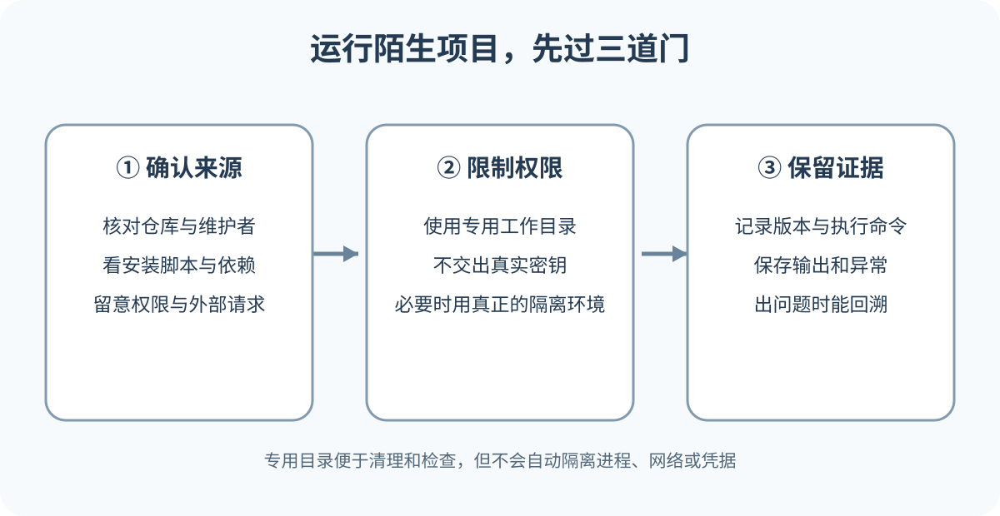

# 下载、检查并运行别人的项目

GitHub 上的公开代码可以帮助学习，也可能包含过时依赖、安装脚本、恶意代码或不适合你系统的配置。下载按钮只完成文件传输，不会替你判断来源、授权与运行风险。安全顺序是先确认项目身份，再读文档和代码，随后选择取得方式。安装依赖与运行程序应放在隔离的普通用户环境，看到管理员权限、密钥和外部下载要求时再次停下来检查。

*运行陌生项目前确认来源、限制权限和保留证据的三道门。专用工作目录只便于清理和检查；如果需要限制程序能访问的文件、网络或凭据，还要另行配置真正的隔离环境。*

## 从项目身份开始

从官网、维护者主页或可信文档进入仓库，不凭搜索第一项。交叉核对所有者、URL、官网反链、归档状态与最近 Release；平台身份标记不替代代码审查。陌生账号的“更高版本”、短链接、网盘或要求关闭防护的说明都应暂停，先核验最终域名与原项目公告。

README 告诉你项目用途、前置条件和运行方式。找到支持的操作系统、运行时版本、硬件要求、配置文件与已知限制。Release 页面说明维护者准备好的版本与资产。普通使用者可能应该下载构建好的安装包，开发者才需要 Clone 源码。Pre-release 不适合直接替代稳定版本。

Issue 中搜索你的系统、处理器和准备使用的功能。例如 Windows、ARM、Apple Silicon、Docker 或某个错误文本。重点看最近版本的真实报告和维护者回应。

许可证决定允许怎样使用、修改和分发。没有许可证时，不要把公开可见理解为可以加入商业产品。依赖、模型、数据和素材还可能有各自条款。

## 判断项目会接触哪些资源

运行前列出项目需要的权限与数据。

- 是否读取你选择的文件，还是扫描整个磁盘
- 是否需要网络，以及连接哪些域名
- 是否要求 GitHub、云平台或数据库令牌
- 是否启动本地服务器和监听端口
- 是否安装系统服务、驱动或浏览器扩展
- 是否写入用户配置、启动项或系统目录
- 是否上传文件、日志或遥测数据

一个 Markdown 预览器要求读取所选文档很合理，要求管理员权限和完整云账号令牌就需要解释。一个 Docker 管理工具访问 Docker 守护进程也意味着它可能控制容器和卷，不能只按普通网页工具对待。

README 没有说明数据去向时，可以搜索代码中的网络请求、遥测配置和隐私说明。无法判断的高权限项目不要在主力电脑和真实数据上试运行。

## 先写一个简单威胁清单

Threat model 可以译为威胁模型。对个人试用，它不必是一份复杂安全报告。写清要保护什么、程序能访问什么、最坏结果是什么，就能决定隔离程度。假设项目要整理照片。需要保护的是私人照片、位置元数据、云盘令牌和原始文件。程序需要读取选中目录并写入输出目录。最坏结果包括原图被覆盖、照片被上传、令牌泄露或程序留下后台进程。

据此可以采取具体限制。复制几张公开测试图，只挂载测试目录，不提供云盘令牌，关闭不必要网络，检查输出后再决定是否扩大范围。若项目目标本身需要联网，例如调用 AI API，就不能简单断网。改用测试密钥、额度限制、独立账户和非敏感输入。安全措施要保留核心功能所需能力，又限制无关访问。

先看依赖清单和脚本定义。Node.js 项目查看 `package.json`，Python 项目查看 `pyproject.toml` 或 `requirements.txt`，Flutter 项目查看 `pubspec.yaml`。确认安装、启动、构建与清理脚本。再找程序入口、网络请求、文件读写和命令执行。关键词只能提供线索，动态加载或第三方依赖可能隐藏行为。大型项目无法快速审完时，不要把粗略搜索写成“代码已安全审计”。

检查 CI 如何构建 Release。若发布二进制由可查看的工作流从标签生成，来源更容易追溯。维护者手工上传也可能正常，需要额外签名或发布说明。依赖数量多会增加审查范围。查看锁文件是否存在、是否出现直接指向陌生 Git 仓库的依赖，以及安装脚本是否访问外部地址。不要为了减少警告随意升级全部依赖，可能改变项目行为。

## Windows 可执行文件的最小检查

显示真实扩展名，确认 `.exe`、`.msi` 或压缩包符合预期；记录下载 URL、哈希、签名发布者和安全警告。有效签名支持来源与完整性，不保证没有漏洞；无签名也不自动等于恶意。README 未解释为何需要管理员权限时，取消授权并继续核查。文件不上传到未经批准的公开扫描站。

macOS 还要核对 Apple Silicon / Intel 架构、签名与公证。系统阻止时不照抄关闭 Gatekeeper 或移除隔离的命令。完全磁盘、辅助功能、屏幕录制和输入监控权限很广，只在功能确需且来源可信时授予。包管理器条目也要确认维护来源、版本与最终下载 URL。

## 容器运行陌生项目的权限清单

查看 Compose 文件和 `docker run` 参数。挂载 `C:\`、`/`、用户主目录或 Docker socket 都会给容器很大访问范围。`privileged` 模式与添加系统能力也要有明确原因。端口映射 `127.0.0.1:8080:8080` 通常只从本机访问，绑定所有网络接口会扩大范围。语法因工具与平台而异，最终用 Docker 实际状态确认。

Volume 可能保存数据库。删容器不一定删卷，删卷却可能永久丢数据。只用测试卷，记录镜像摘要，不依赖会移动的 `latest`。项目声称“完全本地”时仍检查在线字体、更新、崩溃报告与遥测，记录域名和数据类型。隐私声明应与行为一致；健康、财务、身份和客户资料只交给组织批准的工具与位置。

## 运行后检查电脑发生了什么

比较运行前后的进程、服务、启动项、网络监听、项目目录和用户配置。普通工具可能创建缓存与配置，这些变化应与文档一致。程序退出后端口仍在监听，说明后台进程没有结束。找到进程和启动来源，按官方方式停止。不要随机结束系统进程。

输出目录以外出现大量文件时，记录路径与用途。清理前区分可重建缓存、用户结果和共享依赖。只删除已确认由这次试运行产生且不再需要的内容。试用结论要写明版本和范围。例如“在 Windows 11 普通账户中，用公开 PNG 验证压缩功能，未提供云账号，未检查完整依赖安全”。这样不会把一次小测试夸大成全面安全认证。

更新要重新核对域名、签名与回滚。生产固定 Tag、Release 或验证过的提交与依赖锁，不自动跟随默认分支。更新器要求管理员权限说明它能修改系统范围；项目停止维护后，即使还能启动，也要隔离、接管维护或迁移。

## 浏览器扩展需要单独审查

浏览器扩展可能读取或修改页面。安装前看商店发布者、官网、隐私、更新与权限，并确认商店包是否对应源码。新增权限时重新评估；处理密码、网银和后台管理的浏览器尽量少装。卸载不等于外部账号数据已删除。

模型权重、训练数据与代码可能使用不同许可证。下载大文件前核对来源、哈希、硬件、格式和空间。云端 AI 输入会离开本机，要查保留、训练使用和地区；敏感资料使用获批配置，演示效果不保证适用于你的数据。

## 选择 ZIP、Clone 或 Release 资产

只读某版源码用 ZIP；需要历史和更新用 Clone；准备贡献且无写权限时先 Fork。普通用户优先看稳定 Release 资产，区分源码压缩包与构建好的系统/架构产物，并核对签名或哈希。下载到明确新目录，解压后检查真实扩展名、目录层级、链接、脚本和可执行文件，不从临时预览或压缩包内部直接运行。

安全软件提示要保留原文，“误报”声明不能自证安全。哈希一致只说明文件与可信发布值相同，不说明发布者代码无害；无法解释时停止，不关闭系统防护。

## 读安装脚本再运行

README 可能提供一条安装命令，把网络下载结果直接交给 shell。这样的命令很方便，也让下载和执行连在一起。先打开脚本 URL，确认域名、脚本内容和版本固定方式。检查脚本会下载哪些文件、写入哪些目录、是否使用管理员权限、是否添加环境变量或启动项，以及怎样卸载。脚本内容过长时，可以下载到新目录后静态检查，再按官方校验方法确认。

依赖安装也会执行代码。npm、Python、Flutter 和系统包管理器都可能在安装期间运行钩子或构建步骤。锁文件能固定许多依赖版本，不能保证每个依赖安全。不要在含生产密钥的终端环境运行陌生项目。先清理当前进程中的敏感变量，使用专门测试账号和最小权限令牌。

先新建测试目录，只放测试数据，并使用专门的低权限测试账户。不要以管理员或 root 运行。项目需要语言依赖时，使用对应的虚拟环境或项目本地依赖目录，避免污染其他项目。新目录和 Python 虚拟环境都不提供文件访问或网络隔离，程序仍可能读取当前账户有权访问的文件。容器可以隔离一部分文件和依赖，但挂载宿主目录、Docker socket 或高权限模式会扩大访问能力。恶意容器若能控制 Docker 守护进程，隔离价值会大幅下降。

虚拟机提供更完整的操作系统边界，适合高风险试验。仍要控制共享剪贴板、共享文件夹、网络和真实账号。完成后先检查并保存必要的测试结果，再恢复到试验前的干净快照，或移除这台一次性测试虚拟机。单独删除快照通常只清理快照数据，不会撤销当前系统中的改动；恢复快照也无法收回已经传到外部的数据。来源不明、需要驱动或高权限内核组件的项目，不适合只靠容器试运行。应等待可信审计或使用专门测试设备。

## 第一次运行只给最小输入

项目通过初步检查后，使用公开、无敏感的小样本运行。不要把整个照片库、公司目录或生产数据库交给它。记录运行命令、当前目录、软件版本和输出。程序启动本地网页时，确认地址与端口。它若要求打开公网、防火墙或路由器端口，先停止并理解用途。

成功结果应来自项目说明。例如命令输出版本、测试通过、浏览器打开本地页面或生成一个示例文件。观察进程结束后是否留下服务、计划任务或启动项。第一次运行不要同时安装多个相似工具。出现故障时，单一变化更容易追踪。

以试用图片压缩项目为例，假设 README 说明需要 Node.js，运行后在本地端口打开网页，并声称文件不上传。仓库有近期 Release，Actions 通过，许可证清楚。小何 Clone 到新的测试目录，查看 `package.json` 中脚本和依赖，使用专门的普通测试账户安装。运行时只选择一张公开示例图。打开 DevTools 后，Network 面板记录到的页面请求都指向本地地址，生成文件保存在测试输出目录。这只能说明此次观察到的页面请求没有直接访问外部地址，Node.js 后端或子进程仍可能联网，需要另查进程的网络活动，并按测试需要限制出站访问。

这次检查支持“该版本在这台测试电脑、对这一张示例图按说明工作”。它不能证明所有依赖无漏洞，也不能证明未来版本行为相同。准备处理私人照片前，还要评估更新来源和隐私边界。

## 运行失败时先判断失败层级

找不到命令，先查运行时是否安装以及终端是否重新打开。找不到依赖清单，先查当前目录；依赖安装失败，记录第一个错误和版本；程序启动后页面打不开，查输出地址、端口与进程状态；项目要求 `.env` 时，先找 `.env.example`；只填写测试凭据，不要使用生产密钥。报错声称“认证失败”时，检查变量名、环境和权限，不要把令牌打印到 Issue。

构建失败可能来自不支持的新运行时。项目文档若指定版本，应在隔离环境使用对应版本。不要全局降级主力电脑的重要工具来迎合一个陌生项目。

开始使用前找更新方式。Clone 项目可能通过 Pull 更新，Release 软件可能有自动更新器，包管理器安装的软件由包管理器升级。混用方式会出现重复安装。更新前查看变更说明、备份用户数据和配置。依赖锁文件变化时重新安装，数据库迁移时先准备回滚。生产项目不要自动跟随默认分支最新提交。

卸载说明应列出程序文件、用户数据、配置、缓存、服务和环境变量。删除程序目录不一定删除后台服务。清理前先列出确切路径，并保护自己的输出和项目数据。

## GitHub 模板不能整库复制

GitHub 维护了一组常见 `.gitignore` 模板。选择与实际语言、工具和操作系统相符的内容。模板可能同时忽略缓存、构建结果和本地配置，仍要逐条理解。复制一个陌生项目的 `.gitignore` 到自己的项目，可能把应提交的文件隐藏。依赖目录在某个语言中应忽略，在另一个项目中可能就是交付内容。忽略规则需要配合项目构建与恢复方式。

## 常见危险信号

项目要求关闭防火墙、杀毒软件或系统签名检查，却不给具体原因。安装命令使用管理员权限写入广泛目录。README 要求提交真实令牌。Release 来自与官方仓库无关的账号。二进制没有源码对应版本或校验信息。

这些信号不必自动判定恶意，却足以暂停。寻找官方解释、独立审计和社区验证。无法确认时选择其他工具。

AI 可以只读汇总仓库结构、依赖、安装脚本、权限需求和网络端点，生成风险清单。它还能把 README 步骤改写成适合你的系统的验证计划。不要让 AI 直接运行陌生脚本或使用真实密钥。先要求它引用具体文件与行，区分已确认行为和推测。

下载来源、许可证、高权限要求、账号授权和数据范围必须亲自决定。程序触及真实用户数据、生产系统、钱包、浏览器凭据或系统驱动时，应采用更严格审计。下一章会专门处理不应进入仓库的文件，以及秘密已经进入 Git 历史后的正确处置顺序。
