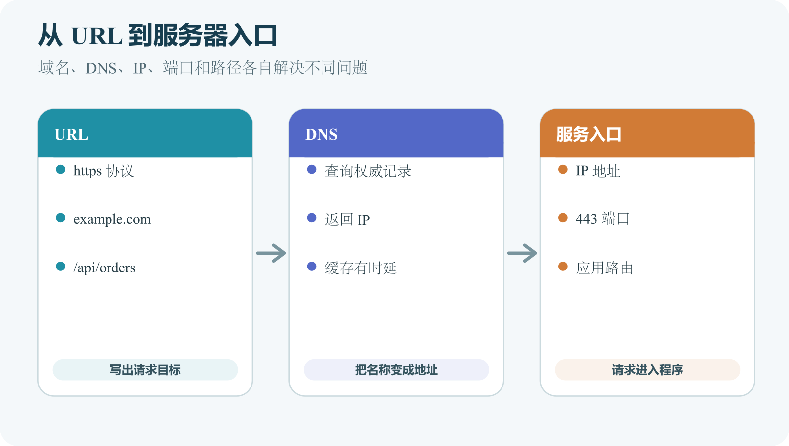

# IP、域名、DNS、端口和 URL

浏览器要发请求，先要知道去哪里。人记住的是 `example.com` 这样的域名，网络连接最终会落到某个地址和服务入口。DNS 负责把名称查成记录，IP 标识网络位置，端口区分同一地址上的服务，URL 把协议、主机、路径和参数写在同一个地址里。

这几个词常一起出现，但它们解决的问题不同。域名能解析，不代表应用进程正在运行；端口有程序监听，不代表 HTTPS 证书正确；URL 路径写错，服务器可达也会返回 404。排错时按层拆开，别用“域名坏了”概括所有现象。



*URL 经过 DNS 查询进入 IP、端口和应用路径的过程*

图中 URL 先提供 Scheme 和 Host。Host 是域名时，浏览器通过缓存或 DNS 查询取得入口地址；URL 显式指定端口时使用该端口，否则按协议使用默认端口。连接到入口后，路径和查询参数再交给 Web 服务器或应用路由处理。图中箭头表示定位顺序，DNS 不转发后续 HTTP 请求。

## IP 标识网络位置，不标识业务

IP Address 译为 IP 地址。IPv4 常写成四段数字，IPv6 更长。设备可以有多个 IP，也会因网络变化而改变。家庭电脑通常有私有 IP，只在本地网络内可见；路由器对互联网使用公网入口；云服务器可能有公网地址，也可能有仅内部可访问的私有地址。

`127.0.0.1` 是回环地址，通常指当前设备自身。`localhost` 常解析到回环地址。开发服务器只监听 `127.0.0.1` 时，其他设备不能直接访问。`0.0.0.0` 在监听配置中常表示所有 IPv4 接口，不是普通用户该输入浏览器的目标地址。把服务监听到所有接口会扩大暴露面，需要防火墙、认证和日志。

不要把某次查到的 IP 写死进 App、小程序或前端配置。平台迁移、CDN、负载均衡和故障切换都会改变目标。受控域名让你在不更新客户端的情况下调整后端入口。同一个域名也可能返回多个 IP，不同地区和网络查到的答案不完全相同。

IP 也不是稳定用户身份。家庭共享、企业出口、移动网络、VPN 和代理都可能让多人共用或频繁变化。风控和限流可以把 IP 当线索，认证仍应依靠账号、凭据和权限规则。

## 域名是分层名称，也是资产

`www.example.com` 可以从右往左看。`.com` 是顶级域，`example.com` 是注册域名，`www` 是子域。裸域也称 Apex domain，例如 `example.com`。`www.example.com`、`api.example.com` 和 `status.example.com` 可以指向不同平台。

注册商负责域名注册关系、续费和联系人。DNS 托管商负责 Nameserver 和记录管理。两者可能是同一家公司，也可能分开。注册商处配置的权威 Nameserver 决定谁回答该域名的 DNS 查询。只在旧 DNS 控制台改记录，而注册商已经指向新 Nameserver，公网不会看到这次改动。

域名控制权很重要。开启两步验证、自动续费和到期提醒，使用组织可恢复账户。联系人邮箱失效、域名过期或转移码泄露，都会影响业务连续性。迁移 DNS 前先导出现有记录，特别是邮件、验证、支付和第三方服务记录，不要只复制网站 A 记录。

下线项目时要清理 DNS。CNAME 仍指向已删除的第三方项目时，攻击者可能在该平台重新认领并通过你的子域提供内容。正确顺序通常是先移除 DNS 或解绑域名，再删除外部资源。发现疑似可接管域名时私密报告，不自行接管他人资产。

## DNS 返回记录，缓存会让结果不同步

DNS 是 Domain Name System 的缩写。浏览器访问域名时，会通过系统和解析器查询记录。A 指向 IPv4，AAAA 指向 IPv6，CNAME 设置名称别名，MX 处理邮件，TXT 常用于验证和策略。部署平台会给出精确的 Type、Name、Value 和 TTL。

控制台里的 Name 写法要看当前提供商。有的填 `www`，有的接受完整 `www.example.com`；根域可能写 `@`、留空或显示域名本身。保存成功只表示控制台接受记录，不代表全球用户马上得到新答案。

TTL 表示解析器可以缓存答案的时间。人们说“DNS 正在传播”，更准确地说，是权威记录已经改变，但一些解析器还在使用未过期的旧缓存。改动前降低 TTL 只有在旧高 TTL 过期后才有帮助；改动后立刻调低，不能让已经缓存的旧答案提前失效。

排查 DNS 时先查权威 Nameserver，再查公共解析器和本机结果。记录查询时间、网络、解析器和返回值。不要反复删除重建记录，会让现象更难解释。确认目标值正确后，保留配置并等待缓存过期，同时让新旧入口在切换期都能服务兼容请求。

## 端口把同一地址上的服务分开

Port 译为端口，用数字区分同一地址上的服务入口。HTTP 常用 80，HTTPS 常用 443；开发服务器常见 3000、5173、8000 等端口，但这些只是工具习惯，真正端口以启动日志和配置为准。

程序监听端口后，操作系统才会把连接交给它。防火墙、云安全组、负载均衡和代理还可能阻止或转发流量。端口开放、进程监听、应用健康是三项不同检查。数据库有自己的端口，但不应因为 App 要联网就直接暴露公网；后端应通过私有网络或本机连接数据库，用户只访问 Web 入口。

监听地址要和端口一起看。`127.0.0.1:3000` 表示只监听当前机器；同机反向代理可以访问，远程用户不能直接连。`0.0.0.0:3000` 表示监听所有 IPv4 接口，是否能从公网访问还要看网络边界和认证。

Docker 会增加一层。容器内部监听 3000，宿主机可以映射为 8080。用户访问宿主机 8080，Docker 转给容器 3000。代理和应用在不同容器时，`localhost` 指当前容器，不指另一个容器。第七卷会展开容器网络，这里先记住一件事。排错时要写清哪个进程在什么网络空间监听什么地址和端口。

## URL 写清一次访问的目标

URL 是 Uniform Resource Locator 的缩写。看下面这个例子。

```text
https://api.example.com:8443/v1/orders?status=open#recent
```

`https` 是 Scheme，决定访问方式；`api.example.com` 是 Host；`8443` 是显式端口；`/v1/orders` 是路径；`status=open` 是查询参数；`recent` 是片段标识。片段通常由浏览器本地使用，不会作为普通 HTTP 请求目标发给服务器。

查询参数会进入历史、日志和分析系统，不能放密码、长期令牌和隐私内容。中文和空格等字符会被 URL 编码，显示成百分号形式。编码让 URL 可以传输，不是加密。前端应使用标准 URL API 生成参数，避免手工拼接时让 `&`、`=`、`#` 改变结构。

Path 由 Web 服务器或应用路由处理，不一定对应磁盘文件。静态网站里 `/images/logo.png` 常映射到发布目录中的文件；动态应用里 `/users/42` 可以由程序查询数据库。路径大小写行为受平台影响，开发时统一精确大小写最安全。

绝对 URL 包含协议和主机。相对 URL 根据当前页面计算。根相对路径 `/images/logo.png` 从网站根开始，普通相对路径 `images/logo.png` 从当前目录开始。前端 API 地址若写成 `http://localhost:3000`，发布后用户浏览器会请求用户自己的电脑，这是很常见的生产事故。

## 域名、证书和重定向不是一回事

域名注册保证名称归属。DNS 告诉查询者去哪里。HTTPS 证书证明当前连接的服务控制对应名称并保护传输。三者缺一都会影响访问。域名能解析但证书过期，浏览器仍会警告；证书准备好了但 DNS 指错平台，自定义域名仍无法验证。

DNS 不处理 `/old` 到 `/new` 的路径跳转。路径重定向由 Web 服务器、CDN 或应用返回 HTTP 3xx。想让 `example.com` 跳到 `www.example.com`，要先让两个域名都能解析到提供证书的入口，再配置 HTTP 重定向。用 Network 查看状态码和 Location，避免只靠页面外观判断。

证书必须覆盖实际访问的域名。`*.example.com` 通常不自动覆盖裸域，也不覆盖更深层级，具体按证书规则和证书机构实现。反向代理要为每个站点选择正确证书。自动证书仍要监控续期失败，不能把今天地址栏有锁当作永久保证。

面向中国大陆提供公开网站时，域名、服务器位置、备案和内容要求可能涉及法规与服务商政策。这些规则会变化，部署前查当时官方主管部门和服务商说明，并记录日期。不要把旧博客里的结论写成永久规则。

## 两个定位例子

默认平台域名能打开，`www.example.com` 显示“找不到服务器”。部署控制台提示自定义域名等待验证。维护者发现 DNS 记录加在旧托管商控制台，而注册商当前 Nameserver 指向另一个 DNS 平台。代码和构建一直正常，问题在权威 DNS。把记录加到实际权威 DNS 后，等待缓存更新，平台验证通过并申请证书。

另一个例子来自 502。用户访问域名得到 502。后端启动日志显示监听 `127.0.0.1:3000`，Caddy 配置却转发到 `localhost:3001`。应用没坏，代理连错端口。修复上游端口并验证公开域名即可，不需要把应用改成公网监听，也不应为了“试一下”开放 3000 防火墙。

这两个例子说明，地址问题先固定证据位置。默认域名、自定义域名、权威 DNS、公开解析器、端口监听、代理配置和证书状态分别回答不同问题。

## 本章验收清单

能拆解完整 URL，区分 Scheme、Host、端口、路径、查询和片段。能解释 `localhost` 为什么只指当前设备。知道 DNS 记录、TTL、Nameserver 和证书各自负责什么。不会为修网站误删邮件记录，也不会把数据库端口直接暴露公网。

最小练习选一个公开网页。抄写完整 URL，标出每一部分。若自己有域名，只读查看注册商 Nameserver，再在实际 DNS 控制台找网站相关记录，不修改。记录名称、类型、目标和 TTL。不要对不属于你的服务器做端口扫描。

AI 可以解释脱敏后的 URL、DNS 查询结果、监听日志和代理配置，帮你画出“域名到入口”的路径。不要交出注册商登录、转移码、完整验证令牌或私有 DNS 区域。开放端口、删除记录、转移域名和忽略证书警告必须人工确认。下一章沿着已经找到的 URL，说明 HTTP、HTTPS 和 TLS 如何完成请求与响应。
