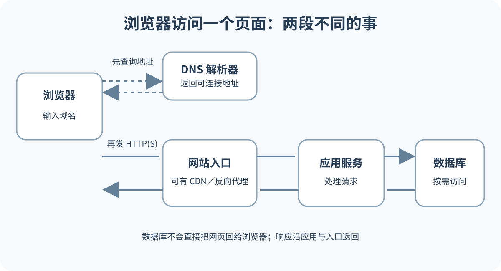

# HTTP、HTTPS、TLS、请求与响应

浏览器找到入口之后，还要用双方都理解的规则交换信息。HTTP 规定请求和响应怎样表达。HTTPS 表示 HTTP 运行在 TLS 保护的连接上。TLS 负责加密传输并验证服务器身份。地址栏的锁形标志说明这条连接通过了相应验证，但不能证明业务逻辑正确、代码没有漏洞或网站一定可信。

*浏览器发出 HTTP 请求并经过 HTTPS 连接收到服务器响应。DNS 只负责解析，HTTP 请求不经过 DNS 服务转发；数据库结果先返回应用，再由应用经入口响应浏览器。*

本章只回答一次交换如何读证据。方法表示意图，URL 表示目标，Headers 表示附加规则和能力，Body 承载内容，状态码和响应头说明结果。完整浏览器操作放在第十九章，平台部署和代理配置放在参考资料。

## HTTP 是应用层通信格式

HTTP 是 Hypertext Transfer Protocol 的缩写。浏览器、手机 App、小程序、命令行工具和服务器之间都可以按它发送请求。一次请求通常包含 Method、URL、Headers 和可选 Body。一次响应通常包含 Status、Headers 和可选 Body。

HTTP 只规定“怎么说”，不替项目定义“谁能做什么”。`/api/orders` 返回哪些字段、哪些用户能读取、错误如何表达，是 API 设计和服务端权限的责任。攻击者可以自己构造请求，所以服务器不能因为前端按钮没显示就认为操作不可能发生。

GET 按语义用于读取，不应创建订单或扣款。浏览器、代理和预加载机制可能重试或提前请求读取资源。POST 常用于创建或提交处理，PUT 常表示替换，PATCH 表示部分更新，DELETE 表示删除。这些语义帮助设计和缓存，但不是安全边界。每一种写操作仍要认证、授权、校验和审计。

查询参数可以筛选和分页，例如 `/products?category=book&page=2`。URL 会进入历史、日志和分析系统，不能放密码、访问令牌和隐私内容。提交 JSON 或文件时，敏感内容也要控制日志范围，不能因为放在 Body 就默认安全。

## 状态码先分层，再看业务

状态码由三位数字组成。2xx 属于成功类，但 202 Accepted 只表示已接受处理，任务可能尚未完成。3xx 属于重定向类，其中 304 用于缓存验证，不要求跳转到另一个 URL。4xx 通常表示请求、身份或权限不满足；5xx 表示服务端或上游处理失败。这个分类帮助你决定下一步去看客户端输入、登录权限、路由配置，还是服务端日志。

常见状态的含义要和项目文档一起读。200 OK 表示请求成功，具体结果还要结合方法和响应内容判断。201 Created 表示资源已创建。204 No Content 表示成功但没有正文。301、302、307、308 都是重定向，方法保留行为不同。400 表示请求格式或内容有问题，401 表示缺少有效认证凭据，403 表示服务器理解请求但拒绝执行，不能据此断定用户已经登录。404 表示目标未找到，也可能用于隐藏资源存在。

409 常表示冲突，例如唯一约束或状态不允许；429 表示请求过多；500 表示应用内部错误；502 表示网关没有从上游得到正常响应；503 表示服务暂不可用；504 表示网关等上游超时。不要从一个数字直接猜数据库坏了。状态码给方向，日志和响应正文给细节。

Fetch 有一个容易误解的特点。服务器返回 404 或 500 时，网络层通常已经收到了 HTTP 响应，Promise 可能仍会完成。前端代码要检查 `response.ok`、状态码和错误结构。把所有失败都显示“网络异常”，会让用户和维护者都失去线索。

## Headers 描述上下文和规则

Request Headers 可能包含 Host、Accept、Content-Type、Authorization、Cookie、Origin 和 User-Agent。Response Headers 可能包含 Content-Type、Cache-Control、Set-Cookie、Location、Vary 和安全策略。Header 名称通常大小写不敏感，但值的语义由具体字段定义。

Content-Type 要和正文一致。返回 JSON 时通常是 `application/json`，返回 HTML 时是 `text/html`。错误的类型会让浏览器拒绝脚本、错误解析 JSON，或把内容当下载文件。上传文件时，浏览器可能自动生成 multipart 边界；手工覆盖错误 Content-Type 会让服务端解析失败。

Authorization 和 Cookie 可能携带认证信息。日志、截图、HAR 和聊天记录中不要公开完整值。排查时可以保留 Header 名称、是否存在、Cookie 属性和脱敏后的前几位摘要。响应里的 Set-Cookie 也不能整段分享。

Accept、Accept-Language 和 Accept-Encoding 让客户端说明能处理什么。服务器据此返回语言、媒体类型或压缩结果时，缓存要用 Vary 标出哪些请求头影响响应。遗漏 Vary 可能让共享缓存把错误语言或错误格式交给其他用户。

## Body 承载内容，也承载风险

HTML、JSON、图片、文件和空响应都是正文的不同形态。204 没有正文是正常结果，前端若仍强行解析 JSON 会报错。304 Not Modified 也没有完整正文，浏览器会使用本地缓存副本。调试时不要看到空 Response 就断定数据丢失。

提交 JSON 时，客户端把对象序列化成文本，服务端解析后还要做类型、范围和业务校验。字段格式正确不等于用户有权修改目标资源。文件上传要限制大小、类型和数量，隔离存储，并检查实际内容。只看扩展名不安全。

下载响应可用 Content-Disposition 提示浏览器内联显示或保存文件。用户文件名要安全编码，避免头部注入。私有文件先授权，再返回短期 URL 或流式响应。签名 URL 在有效期内可能被转发访问，不应进入公开日志。

大响应会影响移动网络和渲染。分页、压缩、缓存和流式传输都可以改善体验，但要基于测量。AI 输出、导出下载和视频播放可能使用流式响应或 Range 请求。Network 里长时间 Pending 不一定是卡死，也可能是流仍在打开。

## HTTPS 保护传输，不替代权限

HTTPS URL 使用 `https` Scheme。客户端先和服务器完成 TLS 握手，协商加密参数并验证证书。证书包含域名、公钥、有效期和签发关系，服务器持有对应私钥。证书公开不是泄密，私钥必须保密。

TLS 失败常见原因包括证书过期、域名不匹配、证书链不完整、系统时间错误和客户端协议不兼容。浏览器安全警告意味着身份或保护没有通过验证。不要让用户点击“继续访问”生产登录页，也不要为了测试关闭 TLS 验证后忘记恢复。

TLS 完成后，应用仍可能返回 404、401、500。安全连接和业务成功是两项检查。反过来，HTTP 页面即使功能看似正常，也不适合承载登录、支付和隐私内容。生产会话 Cookie 通常应要求 Secure，只通过 HTTPS 发送。

TLS 可能在 CDN 或反向代理终止。应用内部收到的连接可能是 HTTP，代理用受信任的 Header 告诉应用原请求是 HTTPS。应用未配置可信代理时，可能生成错误回调 URL，或把 HTTPS 反复重定向到自己。只信任来自自己代理的转发信息，客户端可以伪造普通 Header。

## 重定向会改变路径和证据

网站常把 HTTP 重定向到 HTTPS，把裸域转到 `www`，或把旧路径转到新路径。响应状态和 Location 告诉客户端下一地址。重定向链过长会增加延迟，也可能形成循环。浏览器报 Too many redirects 时，检查 CDN、代理和应用是否互相来回转换协议或域名。

登录流程也常用重定向去身份服务，再带授权结果返回。Return URL 必须验证，避免攻击者把用户引向任意外部地址。永久重定向可能被浏览器和搜索引擎缓存，测试阶段使用临时重定向更容易回滚。

用 Network 检查重定向时要保留日志，否则只看到最后一个请求。每一步记录状态、Location、协议、主机和路径。不要根据地址栏最后结果推断中间都正确。

## 代理和上游会产生自己的状态

浏览器请求可能先到 CDN，再到负载均衡或反向代理，最后到应用。应用还会请求数据库、对象存储或第三方 API。每一层都可能生成状态码。CDN 找不到源站可能返回 502，代理等待应用超时可能返回 504，应用主动拒绝权限可能返回 403。

响应中的 Server、Via 或平台头可以提供线索，但不能完全依赖。可靠证据是各层日志和请求编号。入口日志记录时间、方法、路径、状态、响应大小和耗时；应用日志记录 Request ID、业务错误和上游调用；数据库日志记录连接、慢查询和约束失败。时间需要统一时区，分享前脱敏。

一个反向代理可访问而后端进程停止的例子很典型。用户打开域名，TLS 正常，代理返回 502。代理错误日志显示连接上游被拒绝。应用服务日志显示启动失败，原因是环境变量名拼错。修复后从公开域名验证关键 API，不只在服务器上访问 `localhost`。

## 幂等和超时保护重复操作

幂等表示同一操作重复执行，最终效果和执行一次相同。GET、PUT 和 DELETE 按语义通常应幂等，实际业务仍要正确实现。创建订单的 POST 如果在网络超时后直接重试，可能生成两份订单。客户端和服务端可以使用 Idempotency Key 识别同一业务请求。

网络超时时，客户端不知道服务器是否已经完成。更安全的做法是查询任务或订单状态，或用同一幂等键重试。支付供应商通常有自己的幂等规则，以官方文档为准。键的生成、保存、过期和日志都要设计。

客户端、代理、应用和第三方 API 都有超时。最短的一层先结束，用户看到的状态可能由它产生。例如 AI 请求需要 90 秒，代理只等 30 秒，用户看到 504，但应用可能仍在后台完成。解决方式可能是优化任务、改成后台工作、提供任务 ID，或在合理范围调整超时，不能无限延长等待。
