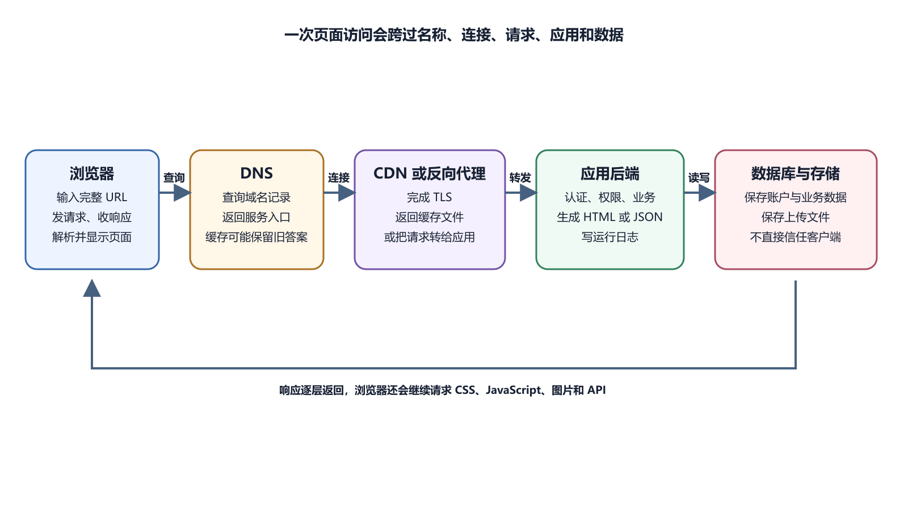

# HTTP、HTTPS、TLS、请求与响应

浏览器找到服务器以后，要用双方都理解的规则交换信息。HTTP 规定请求与响应怎样表达。HTTPS 在 HTTP 传输外使用 TLS 加密并验证服务器身份。看到 HTTPS 锁形标志，可以确认当前连接受到相应保护。它不能证明网站业务可靠、代码没有漏洞，也不能阻止登录后的用户访问自己有权看到的数据。

*浏览器发出 HTTP 请求并经过 HTTPS 连接收到服务器响应*

## HTTP 是应用层通信规则

HTTP 是 Hypertext Transfer Protocol 的缩写，中文常译为超文本传输协议。浏览器、App 与 API 客户端可以按它发送请求，服务器按它返回响应。一次请求包含方法、目标 URL、协议版本、Headers 和可选 Body。Headers 译为头部，保存内容类型、缓存、身份和客户端能力等信息。Body 译为正文，可能包含表单、JSON 或上传文件。

响应包含状态码、响应头和可选响应正文。浏览器根据 Content-Type 等信息判断正文是 HTML、JSON、图片还是下载文件。HTTP 只规定通信形式，项目自己定义 `/api/orders` 返回哪些字段、谁能访问和错误怎样表示。这部分属于 API 设计。

用户打开 `https://example.com/products/42`。浏览器通常发送 GET，请求取得这个资源。服务器验证路径，读取数据，再返回 HTML 或 JSON。GET 按语义用于读取，不应因为重复打开而产生新的订单或扣款。代理和浏览器可能重试或预取读取请求，服务端设计要遵守方法语义。

查询参数可以筛选，例如 `/products?category=book&page=2`。URL 会进入历史和日志，不放密码、访问令牌和隐私内容。浏览器输入 URL 与前端 JavaScript 使用 Fetch 都能产生 GET。MDN Fetch API 说明用 Request 和 Response 对象处理 HTTP 请求。

## POST、PUT、PATCH 与 DELETE

POST 常用于创建或触发处理，例如提交订单；PUT 常表示用给定表示替换目标资源；PATCH 用于部分更新；DELETE 请求删除资源；这些是常见语义，不是权限；攻击者也能发送 DELETE；服务器必须认证用户、检查权限和验证目标。

删除请求成功后，服务端可以返回不同状态与正文。项目要保持一致，并在 API 文档中说明。高风险删除还要有可恢复设计和审计。浏览器表单原生常用 GET 与 POST，JavaScript 可以发送其他方法。代理、防火墙和 CORS 也可能影响。

HTTP 状态码由三位数字组成。MDN 参考把它们分为五类。1xx 表示信息，2xx 表示成功，3xx 表示重定向，4xx 表示客户端请求问题，5xx 表示服务器处理失败。200 OK 表示请求成功并有正常响应。201 Created 常表示资源创建。204 No Content 表示成功但没有响应正文。

301 与 308 常用于永久重定向，302 与 307 常用于临时重定向，具体方法保留行为不同。浏览器会根据 Location 继续请求新地址。400 表示请求格式或内容有问题。401 通常表示需要认证或认证无效。403 表示服务器理解身份却拒绝权限。404 表示目标资源未找到，也可用于隐藏资源存在性。

429 表示请求过多。500 表示服务器内部错误。502 常表示网关从上游得到无效响应，503 表示服务暂不可用，504 表示网关等待上游超时。

## 状态码不能单独讲完错误

同一个 400 可以由缺少字段、格式错误或业务校验失败造成。响应正文可能提供错误代码和可读信息。日志保存服务端原因与请求编号。API 不应把数据库堆栈和内部路径直接返回给用户。客户端需要稳定错误标识，维护者在受控日志中查看细节。

前端收到 401，可以引导重新登录。收到 403，应提示没有权限。把所有错误都显示“网络异常”，会让用户和维护者无法判断。Fetch 有一个常见特点。服务器返回 404 或 500 时，Promise 通常仍会完成，因为网络传输得到了 HTTP 响应。代码要检查 `response.ok` 或状态码。

Request Headers 可能包含 Host、Accept、Content-Type、Authorization、Cookie 和 User-Agent。Response Headers 可能包含 Content-Type、Cache-Control、Set-Cookie、Location 与安全策略。

Content-Type 要与正文一致；返回 JSON 时常用 `application/json`；上传表单和文件会使用相应媒体类型；错误类型可能让浏览器拒绝脚本或按下载处理；Authorization 常携带认证信息；日志与截图不应公开完整值；Cookie 也可能包含会话标识。

Headers 名称通常大小写不敏感，但值的语义由字段定义。自定义头常用明确项目前缀，避免与标准冲突。

## Body 承载实际内容

HTML 响应正文是页面文本；JSON 是结构化数据；图片正文是二进制字节；204 响应没有正文。提交 JSON 时，客户端设置 Content-Type，并把对象序列化为文本。服务端解析失败会返回 400 一类错误。字段类型正确还要做业务校验。

文件上传可能使用 multipart 表单，服务端要限制大小、类型和数量。只相信扩展名不安全，要检查实际内容并隔离存储。大响应会影响移动网络和渲染。分页、压缩与缓存可以降低传输，具体优化要基于测量。

浏览器请求可能先到 CDN，再到负载均衡或反向代理，最后到应用。应用还会请求数据库与第三方 API。每一层都可能产生状态码。CDN 找不到源站，可能返回 502。代理等待应用超时，可能返回 504。应用主动拒绝权限，返回 403。

响应中的 Server、Via 或平台头可以提供线索，不能完全信任或依赖。最可靠的是各层日志与请求编号。中间节点也会修改头、压缩响应和终止 TLS。应用需要正确理解代理提供的客户端协议与 IP，避免错误重定向和安全判断。

## HTTPS 是在受保护连接上使用 HTTP

HTTPS URL 使用 `https` Scheme。客户端先与服务器完成 TLS 握手，协商加密参数并验证证书。成功后，HTTP 内容在加密连接中传输。TLS 是 Transport Layer Security 的缩写，中文常译为传输层安全协议。它保护传输不容易被旁路读取或修改，并让客户端验证正在连接的域名。

证书包含域名、公钥、有效期和签发关系等信息。服务器持有对应私钥。浏览器通过受信任的证书链和域名匹配验证身份。证书公开不是泄密，私钥必须保密。私钥泄露要撤销或更换证书与密钥，并调查使用情况。

证书过期、域名不匹配、证书链不完整、系统时间错误和客户端协议不兼容都可能导致失败。浏览器会显示安全警告，通常不会进入普通 HTTP 页面流程。开发者应查看证书域名、有效期、签发链和服务器配置。托管平台自动证书仍可能因 DNS 验证失败而卡住。

不要让用户点击“继续访问”生产登录页。警告意味着身份或保护没有通过验证。临时测试证书应只用于受控环境，并让测试设备明确信任。TLS 完成后应用仍会返回 404、500 等状态。安全连接与业务成功是两项检查。

## 重定向怎样改变请求路径

网站常把 HTTP 重定向到 HTTPS，把裸域转到 `www`，或把旧路径转到新路径。响应状态与 Location 共同告诉客户端下一地址。重定向链过长会增加延迟，也可能形成循环。浏览器报 Too many redirects 时，检查代理、应用和 CDN 是否互相把 HTTP 与 HTTPS 或不同域名来回转换。

登录流程常用重定向去身份服务，再带授权结果返回。Return URL 必须验证，避免攻击者把用户引向任意外部地址。永久重定向可能被浏览器和搜索引擎缓存。测试错误配置时用临时状态，确认后再使用永久策略。

访问日志常包含时间、方法、路径、状态、响应大小、耗时和客户端信息。不同服务器格式不同。`GET /api/orders 200 42ms` 可以说明接口在 42 毫秒返回 200。它不证明响应数据正确，也不说明用户有权看到这些订单。500 请求要结合应用日志；相同 Request ID 能把代理记录与应用错误关联；时间需要统一时区。

日志中 URL 查询、Cookie 和 Headers 可能含敏感信息。配置记录范围与保留，分享前脱敏。

## 内容协商决定返回哪种表示

客户端用 Accept 表示能处理的媒体类型，Accept-Language 表示语言偏好，Accept-Encoding 表示压缩能力。服务器可以据此选择响应。同一 URL 返回不同表示时，缓存要用 Vary 说明哪些请求头影响结果。遗漏会让共享缓存把错误语言或压缩格式交给其他客户端。

API 通常固定 JSON，错误响应也保持同一类型。浏览器请求页面则返回 HTML。Content-Type 是最终判断依据。语言选择还可以由 URL 或用户设置决定。只依赖浏览器语言会让分享链接难以稳定复现。

服务器或 CDN 可以使用 gzip、Brotli 等压缩文本资源。浏览器声明支持，响应头说明实际编码。图片和视频通常已经压缩，再压收益小。HTML、CSS、JavaScript 与 JSON 常有明显收益。压缩消耗处理资源，平台会自动平衡。

Network 的 Size 与 Transferred 可以显示资源原始与传输差异。内容很小或来自缓存时表现不同。代理压缩配置错误可能造成 Content-Length 不一致或重复压缩。用真实响应头与解码结果检查。

## 幂等让重试更安全

幂等表示同一操作重复执行，最终效果与执行一次相同。GET、PUT 和 DELETE 按 HTTP 语义通常应幂等，实际业务仍要正确实现。创建订单的 POST 重试可能生成两份。客户端与服务端可以使用 Idempotency Key，也就是幂等键，识别同一业务请求。

网络超时时，客户端不知道服务器是否已经完成。不能直接提示用户反复点击。先查询订单状态或使用同一幂等键重试。支付供应商通常有自己的幂等规则，以官方文档为准。键的生成、保存与有效期也要设计。

某些跨源请求前，浏览器先发送 OPTIONS 预检，询问服务器是否允许来源、方法和头部。预检成功后才发送真实请求。Network 中只有 OPTIONS 失败，没有 POST，说明真实业务请求尚未发出。检查代理是否转发 OPTIONS、服务端 CORS 响应与状态。

预检可以缓存，配置更新后旧结果短时存在。开发与生产域名分别允许，不使用任意来源加凭据。CORS 由浏览器执行。命令行客户端不受同样限制，因此 API 认证不能依赖预检。

## HSTS 强制后续使用 HTTPS

HSTS 是 HTTP Strict Transport Security 的缩写。服务器通过响应头告诉浏览器，在一定时间内只用 HTTPS 访问该域名。它能降低用户误用 HTTP 和降级风险。错误配置会让没有有效证书的子域无法访问，IncludeSubDomains 与预加载需要谨慎。

启用前确认所有目标域名长期支持 HTTPS、证书自动续期可用。测试域名与生产域名分开。浏览器缓存 HSTS 后，临时改回 HTTP 不会恢复。排错应修复 TLS，不让用户清除安全策略作为常规方案。

| 用户现象 | 状态 | 先看哪里 |
| --- | --- | --- |
| 创建成功 | 201 | Response 中新资源标识 |
| 保存成功但无正文 | 204 | 前端是否错误解析 JSON |
| 地址自动变化 | 3xx | Location 与重定向链 |
| 表单字段错误 | 400 或 422 | Payload 与字段错误码 |
| 登录失效 | 401 | Cookie 或 Token 与过期 |
| 已登录仍禁止 | 403 | 角色与资源归属 |
| 资源不存在 | 404 | URL、方法、版本与权限隐藏 |
| 冲突或重复 | 409 | 当前资源状态与唯一约束 |
| 请求过多 | 429 | 限流范围、重试提示 |
| 应用异常 | 500 | Request ID 与运行日志 |

项目可能选用不同状态，客户端以 API 文档为准。不要从数字直接猜业务原因。

## 流式响应与普通响应

普通响应准备好正文后返回。流式响应可以边生成边传输，适合下载、事件和 AI 输出。Network 中请求长时间 Pending 可能是流仍打开，不一定超时。看已接收数据、Content-Type 和协议。

代理会有缓冲和超时配置。它若等待完整正文，客户端看不到逐步输出。CDN 也可能不支持某种流式方式。客户端断开后，后端是否停止生成要实现取消信号。付费 AI 调用继续运行会产生费用。

文件上传使用 multipart 或直接对象存储。浏览器自动生成 multipart boundary 时，不要手工写错 Content-Type。代理、后端和平台各有请求体大小限制。最小的一层先拒绝，状态可能 413 Payload Too Large。

大文件使用分片或直传，显示进度并支持取消。服务端仍验证完成对象与所有者。错误 Response 若由代理生成，格式可能不是应用 JSON。前端按状态和 Content-Type处理。

## 下载响应的安全细节

Content-Disposition 可以提示浏览器内联显示或下载，并提供文件名。用户文件名要安全编码，防止头部注入。Content-Type 与 `X-Content-Type-Options` 帮助浏览器正确处理。用户上传 HTML 不应在主站域名直接执行。

私有下载先授权，再返回短期 URL 或流式响应。URL 泄露期间可被访问，应限制时间和对象。日志记录对象 ID 与结果，不记录完整签名 URL。

Content-Security-Policy 限制页面可以加载与执行哪些来源。Strict-Transport-Security 强制 HTTPS。X-Content-Type-Options 减少类型嗅探。

Referrer-Policy 控制导航或请求携带多少来源 URL。Permissions-Policy 限制页面和嵌入内容使用部分浏览器能力。这些头没有一条“最安全通用复制值”。现有第三方脚本、子域和嵌入会影响。先报告模式观察，再逐步收紧。

用浏览器 Console 与安全扫描验证。头部配置在 CDN、代理或应用的哪一层要明确，避免互相覆盖。

## 代理后的 HTTPS 判断

TLS 在 CDN 或反向代理终止后，应用内部收到的连接可能是 HTTP。代理用受信任信息告诉应用原请求是 HTTPS。应用未配置可信代理时，会不断把 HTTPS 重定向到 HTTPS，形成循环，或生成错误 HTTP 回调 URL。

只信任来自自己代理的 Forwarded 或 X-Forwarded-Proto。客户端可以伪造普通头。公开验证重定向、Cookie Secure 与回调 URL。服务器本地直连测试不能覆盖代理层。

HTTP/1.1、HTTP/2 与 HTTP/3 改善连接与多请求传输方式。浏览器和平台通常自动协商。页面不需要为了使用新版本改 API 路径。代理、CDN 与源站之间也可能使用不同版本。排错关注实际协商、连接失败与平台支持，不根据宣传假定所有用户一致。防火墙或网络可能让 HTTP/3 回退。

性能优化先测资源、缓存与后端，再决定协议。错误的缓存和大图片不会被新协议自动消除。

## API 错误结构应稳定

可以返回机器可读 `code`、用户可读 `message`、字段错误和 Request ID。不同状态使用一致 JSON 外形；前端根据 `code` 决定界面，不解析英文句子；message 可以翻译，内部堆栈留日志；未知错误返回通用提示和 ID；权限错误不暴露资源存在；校验错误精确到字段。

错误规范进入 API 文档和测试。网关自己生成错误时，前端仍要处理不同 Content-Type。

## 本章验收清单

能从请求方法、状态、Headers 和 Body 读出一次 HTTP 交换。知道 HTTPS 保护传输，不保证业务正确。能区分 401 与 403、500 与 502、响应失败与没有 HTTP 响应。会从 Request ID 找日志。

不把秘密放 URL，不忽略证书警告，不用返回 200 掩盖所有错误。上传、下载和重试都有风险检查。

客户端可用 Range 请求部分字节，服务器以 206 Partial Content 返回。视频拖动和大文件续传会使用。服务器不支持时可以返回完整 200。对象存储与 CDN 通常处理，应用代理不要破坏 Range 与 Content-Range。

私有文件每次范围请求仍需授权。签名 URL 有效期要覆盖合理下载时间，又不长期开放。日志中的多条 206 可能属于一次播放，不直接算多次完整下载。

## 304 没有正文却是正常结果

客户端带缓存验证头，资源未变时服务器返回 304 Not Modified。浏览器使用本地正文。前端代码若直接调用 API，通常由浏览器缓存层处理。调试看到 Response 空，不要认为数据丢失。

304 要带合适缓存头，与之前 200 表示保持一致。用户数据接口是否允许验证缓存按隐私设计。Disable cache 后再请求常得到完整 200，用于形成对照。

客户端有等待上限，代理有上游超时，应用调用数据库或第三方也有超时。最短的一层先结束，用户看到的状态可能由它产生。例如 AI 请求需要 90 秒，代理只等 30 秒。应用最终完成，代理已返回 504。解决可以优化任务、改为后台工作或在合理范围调整超时，不能只无限延长。

客户端取消请求后，服务端任务是否停止取决于实现。重复点击可能创建多个任务。接口要考虑幂等与任务编号。超时日志应记录上游名称和耗时，不记录请求秘密。

## 一个登录错误例子

浏览器 POST `/api/login`，请求 JSON 包含邮箱和密码。服务器返回 401，Response 是“凭据无效”。Network 证明请求到达服务端并得到认证拒绝。若所有正确账户同时失败，检查认证服务和数据库。只有一个账户失败，检查账号状态与输入。

不要在 Console 或日志打印密码。服务端错误提示不应暴露“邮箱存在但密码错”之类可用于枚举账号的信息，具体策略按安全设计。登录成功后响应设置安全会话 Cookie，浏览器随后请求账户接口。若 Cookie 未保存，下一请求仍会 401。第十六章继续说明。

反向代理可访问，后端进程停止。用户请求域名时，TLS 正常，代理却无法连接上游，于是返回 502。检查顺序是域名与证书已通过，代理访问日志有请求，代理错误日志显示连接被拒绝。随后查看应用服务状态与运行日志。

重启应用前先查停止原因。配置错误、端口冲突、内存不足和依赖服务失败都可能让它再次退出。应用恢复后，从公开域名验证 API 和关键业务。只在服务器上访问 localhost 不足以覆盖代理与 TLS。

## 最小 Network 练习

打开公开网页的 DevTools Network，刷新。选择主文档，记录 Method、Status、Request Headers、Response Headers 与 Response。找到一个 2xx 资源和一个 3xx 或 4xx 请求。如果当前页面没有错误，不要故意攻击网站。可以使用自己的练习站点制造一个不存在图片路径。

检查重定向时打开 Preserve log，再刷新。成功结果是能沿状态与 Location 看见地址变化。不要复制 Authorization、Cookie 或含个人信息的 Response 到公开位置。

> 拿你的项目试一下
>
> 在自己的页面完成一次低风险操作，例如打开公开列表。找到对应请求，记录 Method、URL、Status 和 Response 中一个不含个人信息的字段。返回 200 只能证明服务器用成功状态回应了这次请求。还要核对页面是否显示了正确数据，写操作则要继续确认数据库或后续查询中的实际结果。若请求根本没有出现，先回到前端事件和 Console；若请求出现但失败，再沿状态码和服务端日志继续查。

AI 可以解释请求导出、状态码与 Headers，比较代理和应用日志，并生成最小复现。它也能指出 Fetch 代码是否遗漏状态检查。AI 不能从 500 单独断定数据库坏了。需要应用日志与时间。提供 HAR 时先清理 Cookie、Token 和响应数据。

证书警告、身份凭据、用户响应与生产日志要亲自处理。不要关闭 TLS 验证、把秘密写进 URL 或为了消除 CORS 使用全开放配置。下一章会解释浏览器和服务端怎样保留状态，以及缓存与 CDN 为什么会让同一 URL 在不同时间返回不同结果。
