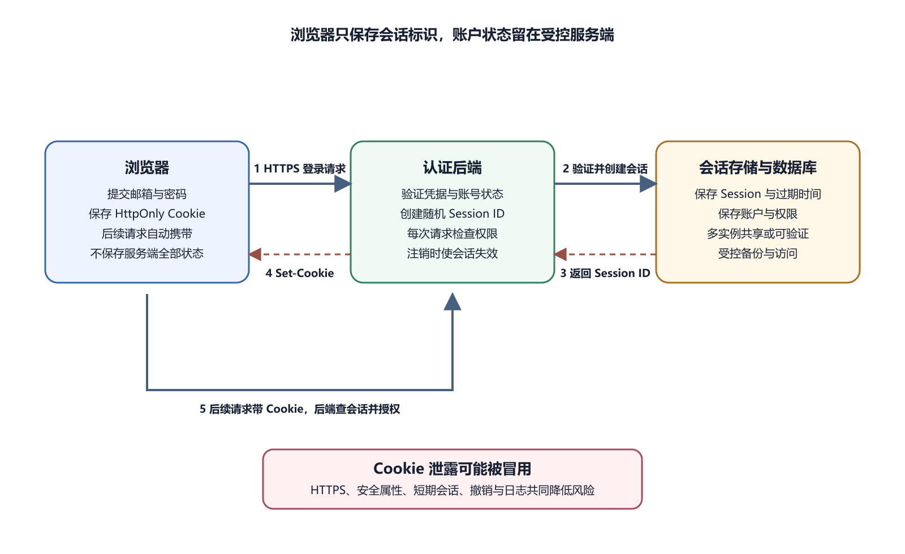

# Cookie、Session、Token、缓存和 CDN

HTTP 请求本身通常彼此独立。用户第一次打开登录页、提交密码、进入账户页，是多次请求。服务器要在这些请求之间认出同一个用户，就需要浏览器和服务器共同保存状态。Cookie、Session 和 Token 解决身份与状态传递；缓存和 CDN 解决重复内容复用与网络距离。它们都会让“同一个地址”在不同人、不同设备、不同时间显示不同结果。

## Cookie 是浏览器按规则保存的小段数据

服务器在响应中使用 Set-Cookie，浏览器按域名、路径、安全属性和过期时间保存。之后访问符合条件的请求时，浏览器自动带上 Cookie。Cookie 常用于会话标识、偏好和有限状态；容量有限，并且会随请求发送，不适合保存大段业务数据。

Cookie 包含名称和值，也可以设置 Domain、Path、Expires 或 Max-Age、Secure、HttpOnly 和 SameSite。Domain 和 Path 决定发送范围。Secure 要求通过 HTTPS 发送。HttpOnly 阻止普通页面 JavaScript 读取 Cookie，降低部分脚本窃取风险。SameSite 控制跨站请求时是否带 Cookie，有助于减少 CSRF 风险。

这些属性各自解决一部分问题，不能替代服务端权限检查。攻击脚本即使读不到 HttpOnly Cookie，也可能代表用户发请求。浏览器自动带 Cookie，也不证明请求来自你的前端页面。服务端每次仍要认证、授权、验证输入和审计关键操作。

Cookie 值可能就是会话凭据。截图、HAR、日志和聊天记录中不要公开完整 Set-Cookie 或 Cookie。排查时记录是否存在、属性、过期时间、Domain/Path 是否匹配即可。

## Session 把权威状态留在服务器

*Cookie 与服务端 Session 登录流程*

图中浏览器通过 HTTPS 提交凭据。后端验证后在服务端创建 Session，并只把随机会话标识放入安全 Cookie。后续请求自动带 Cookie，后端查会话并检查权限。注销时，服务端使会话失效并删除客户端 Cookie。

Session 译为会话。用户登录成功后，服务器生成难以猜测的会话标识，把账户、过期时间、权限摘要和其他状态放在服务端存储。浏览器只保存标识。后续请求带标识，服务器查到会话后得到用户身份。注销、密码修改或管理员撤销时，服务器要使对应会话失效。

会话可以放在内存、数据库或专门缓存服务中。单实例内存最简单，但服务器重启后用户会掉线；多实例部署时，请求可能落到另一台机器，需要共享会话存储或粘性会话。多台实例使用不同会话密钥，会造成偶发登录失败。高风险操作还可以要求重新验证身份。

客户端删除 Cookie 只是本地消失。若服务端没有撤销会话，泄露副本仍可能继续使用。单设备注销、全部设备注销、修改密码后的会话处理，是产品安全策略的一部分。用户安全页可以显示大致设备、最近时间和撤销入口，但设备名称和位置只能作为线索。

## Token 是携带访问能力的字符串

Token 译为令牌。API Key、访问令牌、刷新令牌和一次性验证码都属于不同形式。有些 Token 只是随机标识，服务端查存储得到状态；有些签名 Token 自带用户、过期时间和权限声明，服务端验证签名后读取。JWT 是常见签名 Token 格式，但其中的 Header 和 Payload 通常只是编码，不是加密。

Token 泄露后，持有者可能在有效期内冒充用户或服务。短期访问令牌减少泄露窗口，Refresh Token 可以换取新的访问令牌，因此更敏感。刷新流程要能撤销、轮换并处理并发请求，不能收到 401 就无限刷新循环。

浏览器网站常使用 HttpOnly Cookie 保存会话。移动 App、小程序和服务端 API 常使用 Authorization Header 或平台推荐的登录态机制。Session 容易立即撤销，但需要服务端存储；自包含 Token 减少查会话次数，但权限变更和撤销更复杂。不要按“现代”或“无状态”选，按客户端类型、撤销需求、多设备、跨域、权限变化和基础设施选。

公开客户端标识和服务端秘密要分清。某些平台提供 Publishable Key 或小程序 AppID，设计上可出现在客户端；Secret Key、AppSecret、数据库服务角色密钥和支付后台密钥不能进入浏览器、App 或小程序前端。泄露后按所属平台轮换并审计。

## 登录循环要按步骤拆

一次登录大致分为几个步骤。打开登录页；提交凭据；服务器验证账号状态；创建 Session 或签发 Token；客户端保存 Cookie 或 Token；后续请求携带凭据；服务器每次验证并检查权限；注销或过期后凭据失效。

用户输入正确密码，页面短暂进入主页又跳回登录页。Network 显示 POST `/login` 返回 200，响应有 Set-Cookie；随后 GET `/account` 没带 Cookie，返回 401。先查 Cookie 的 Domain、Path、Secure、SameSite 和浏览器提示。开发环境用 HTTP，却设置 Secure，可能导致本地不发送。

如果请求带 Cookie 仍然 401，就查服务端会话是否保存、是否过期、签名密钥是否一致、时间是否正确。多个用户同时失败，优先看全局会话配置、认证服务、数据库或密钥轮换；只有一个用户失败，再看账号状态和设备设置。不要在日志打印密码、Cookie 或完整 Token。

跨域登录更容易出错。前端在 `app.example.com`，API 在 `api.example.com` 时，Cookie Domain、SameSite、CORS、Fetch credentials 和服务端允许来源都要匹配。不要把 CORS 设置成任意来源并允许凭据。CORS 只控制浏览器读取响应，不替代认证。

## 缓存保存可复用响应

Cache 译为缓存。浏览器可以保存资源，下次直接使用或询问服务器是否变化。Cache-Control 控制最大新鲜时间、是否重新验证、是否允许共享缓存等。ETag 和 Last-Modified 帮助条件请求。资源未变时，服务器可以返回 304 Not Modified，浏览器继续使用本地副本。

缓存不是一个地方。浏览器 HTTP 缓存、Service Worker 缓存、企业代理、CDN、应用内存缓存和数据库读副本都可能让用户看到旧内容。先看 Network 里的响应头、Size/Transferred、Age、Cache-Control 和是否来自 Service Worker，再决定查哪一层。不要一上来清空所有缓存，那会丢证据，也可能增加源站压力。

静态资源适合版本化。脚本、样式和图片如果文件名带内容哈希，内容变化就生成新 URL，可以长期缓存。HTML 入口通常要更频繁重新验证，以便引用新资源。若 `app.js` 文件名不变又设置一年缓存，老用户可能长期运行旧代码。

用户数据接口要谨慎。账户、订单、支付和管理响应通常不应进入公共缓存。`private` 表示只适合私有缓存，`no-store` 表示不存储，`no-cache` 表示可存但使用前要重新验证。名称容易误解，具体组合要按 HTTP 规则和平台行为测试。

## CDN 是靠近用户的共享层

CDN 是 Content Delivery Network 的缩写。它在多个节点缓存静态资源，用户请求由较近或合适节点响应。第一次没有内容时，CDN 会向 Origin，也就是源站，请求并缓存。命中缓存可以减少源站负载和网络距离。

CDN 也可能终止 TLS、压缩资源、执行安全规则、转发请求或提供边缘函数。不同平台能力不同，不能把所有 CDN 当成同一种产品。响应头中的 Age、缓存状态和节点信息可以提供线索。源站日志没有请求，不一定表示用户没访问，可能是 CDN 已经直接响应。

把个性化 API 标记为公共缓存是严重风险。CDN 可能把甲用户资料返回给乙用户。发现这种事故，先停止共享缓存或绕过 CDN，清除受影响缓存键，修复响应头，再调查访问记录。动态个性化内容通常使用 private 或 no-store，并让缓存键包含必要的 Host、路径、查询和 Header。

Set-Cookie 响应被 CDN 缓存尤其危险。平台通常有默认保护，但仍要用两个测试账户、未登录窗口和不同设备验证。不要用真实用户数据做缓存试验。

## Cookie、缓存和安全边界会互相影响

CSRF 与 Cookie 有关。用户已登录某网站时，恶意页面可能诱导浏览器向该网站发送请求，并自动带 Cookie。SameSite 可以减少部分风险，服务端还可使用 CSRF Token、检查 Origin、要求自定义头和再次确认高风险操作。GET 不应执行转账、删除和状态改变。

XSS 是把不可信内容当脚本执行。HttpOnly Cookie 不易被脚本直接读取，但攻击脚本仍可能在站点上下文发请求。把长期 Token 放在 Local Storage 后，XSS 脚本更容易读取并外传。存储位置不是唯一答案，要结合 XSS、CSRF、撤销和客户端类型设计。

时间也会影响认证。客户端或服务器时钟错误，可能刚登录就过期，证书也可能显示无效。服务器要使用可靠时间同步，日志统一 UTC 或明确时区。验证 Token 可允许很小合理偏差，不能无限放宽。

隐私窗口能帮助对比 Cookie、缓存和扩展影响。隐私窗口正常、常用窗口失败时，检查扩展、站点数据、Service Worker 和本地存储。它不会隐藏网络活动，也不会绕过服务器日志和公司代理。用测试账号排查，不在共享电脑登录生产管理员。

## 两个账户测试缓存隔离

甲登录查看资料，记录响应状态和缓存头，然后注销。乙在同一浏览器新会话登录，不能看到甲资料。再用另一台设备或未登录窗口请求相同 URL，共享 CDN 不应返回甲内容。检查 Age、Cache-Control、Vary 和 Set-Cookie。

若发现串用户数据，立即停止对应缓存规则，清除受影响内容，保留日志并启动事件响应。修复后用不同地区、设备和账户重复验证。缓存命中率高不代表策略好，串数据的高命中是事故。

发布新前端后一部分用户仍旧，先比较 HTML、脚本文件名、响应头和 CDN 状态。HTML 是新版本但脚本来自 disk cache，说明资源命名或缓存头有问题。CDN 仍返回旧文件时，按平台清除指定 URL 或发布新文件名。Service Worker 仍提供旧缓存时，检查它的更新和激活策略。

## 本章验收清单

能解释 Cookie、Session 和 Token 分别存在哪里、证明什么、怎样失效。知道 HttpOnly、Secure、SameSite、CORS 和 CSRF 不是同一层防护。能识别浏览器缓存、Service Worker、CDN 和应用缓存。不会让账户响应进入公共缓存。

最小练习从 DevTools Network 开始。访问一个公开静态资源，观察 Cache-Control、ETag、Age 和 Size/Transferred。刷新一次，比较是否来自 memory cache、disk cache 或 304。只观察，不清生产 CDN。完整浏览器路径见第十九章。

AI 可以检查脱敏后的 Set-Cookie 属性、Cache-Control、CDN 头和登录循环证据，设计两个账户隔离测试。不要提供 Cookie、Token、签名 URL、真实用户响应和服务端秘密。认证策略、会话撤销、生产缓存清除和用户数据事故需要人工确认。下一章回到页面代码，说明 HTML、CSS、JavaScript、前端和后端如何分工。
