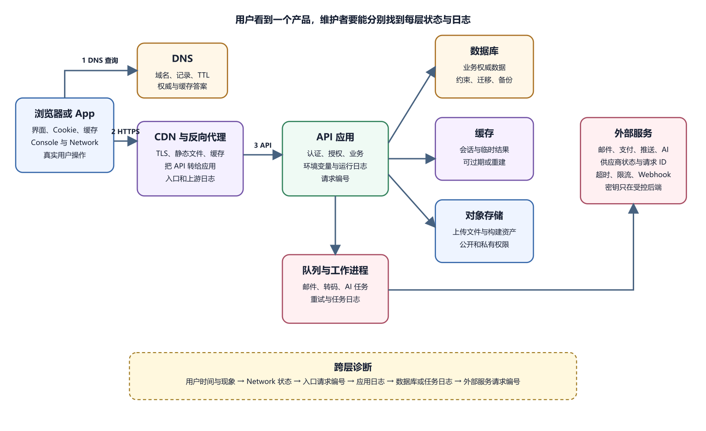

# 动态应用的完整架构图

前面分别认识了浏览器、域名、HTTP、会话、前后端、API、数据库和文件存储。动态应用把它们连在一起。用户只看到一个页面、App 或小程序，背后可能跨过多个组件。画架构图的目的，是让每个请求、数据、秘密、日志和故障都有位置。供应商标志只是附带信息。

*动态应用完整架构与日志位置*

图中用户设备先取得 DNS 解析结果，再直接连接 CDN 或反向代理，网页请求不由 DNS 服务转发。入口提供静态文件并转发 API。应用读写数据库、缓存和对象存储，把慢任务交给工作进程。工作进程再调用外部服务。底部给出一条跨层日志关联顺序。

## 从一个用户动作开始画

不要从服务器清单开始。先选择一个具体动作，例如“登录后上传头像”。写出用户设备、公开入口、后端、数据库和对象存储。用户输入账号，客户端 POST 登录；后端验证数据库，创建会话；用户选择图片，客户端请求上传授权；对象存储接收文件；后端更新数据库头像 Key。

每条箭头都写协议或数据。浏览器到入口用 HTTPS，后端到数据库使用数据库连接，后端到对象存储使用服务 API，外部服务回调用 Webhook。箭头没有说明权限时，图还不完整。标出匿名用户、普通用户、管理员和服务角色。前端看得见的公开标识和后端保存的秘密要分开。

可以把组件分成五层。用户设备层包含浏览器、App、小程序、本地缓存和界面；边缘入口层包含 DNS、CDN、TLS、负载均衡和反向代理；应用层包含静态前端、API、后台任务和实时服务；数据层包含数据库、对象存储、缓存和队列；外部服务层包含邮件、支付、地图、推送和 AI API。

小项目可以由一个平台提供多层能力，逻辑位置仍存在。Supabase、Firebase、Cloudflare、Vercel 或自建 VPS 的控制台不同，但用户设备、入口、应用、数据和外部服务这些责任仍要能指出。

## 一次页面加载的数据流

用户打开动态页面，常见路径如下。设备查询域名 DNS；浏览器连接 CDN 或平台入口并完成 TLS；请求 HTML；浏览器继续请求 CSS、JavaScript 和图片；JavaScript 启动并请求 API；API 验证会话；后端查询数据库；返回 JSON；前端更新页面。

每一步都能单独失败。DNS 错误时没有 HTTP 状态。HTML 404 时前端不启动。脚本 200 但执行异常时 API 不发出。API 401 指向登录或凭据，403 指向权限，500 指向应用内部，502/504 常指入口和上游。静态页面正常不能证明后端正常，API 正常也不能证明数据库内容正确。

登录流程跨过身份边界。密码从客户端通过 HTTPS 到后端。后端验证凭据，不把明文存入数据库。成功后创建 Session 或签发 Token。Cookie 设置 Secure、HttpOnly 和合适 SameSite。后续请求带会话，后端取得用户身份并检查资源权限。认证回答“你是谁”，授权回答“你能做什么”。

文件上传跨过存储边界。客户端预览不代表服务器接受。后端验证身份、配额和元数据，生成安全对象 Key 与临时授权。客户端直接上传可以减少后端带宽。上传完成后，后端验证对象并创建记录。后台任务扫描、转码或生成缩略图。对象、数据库、缓存和备份都要进入删除和恢复流程。

## 慢任务和外部 API 要单独画

发送邮件、转码和生成 AI 摘要可能慢。API 把任务写入队列，立即返回任务 ID；工作进程从队列取得任务；任务成功后更新数据库，失败记录错误和重试；实时服务或轮询把状态告诉客户端。Web API 正常而工作进程停止时，用户能提交任务，进度却永远不变。

外部 API 是系统边界。后端调用邮件、支付或 AI 服务时，外部故障会进入自己的用户体验。设置超时、重试、限流和降级。重试适合暂时网络失败，不适合所有错误。支付请求重复可能重复扣款，要使用供应商幂等机制和本地业务记录。

Webhook 是外部服务回调你的后端。支付平台发送付款事件，后端验证签名、时间和事件 ID，将事件可靠保存到任务表或持久队列后，再快速确认接收。工作进程随后处理慢任务，重复事件要幂等。日志记录供应商请求 ID，不保存完整支付正文和秘密。

同一数据会出现在数据库、缓存、搜索索引、客户端和报表。需要指定 Source of Truth，也就是权威来源。订单状态通常以交易数据库为准。缓存可以过期重建，搜索索引用于查找，客户端只是显示副本。多个系统都能独立改订单，就会产生冲突。

## 环境分开，结构相似

Local、Preview、Staging 和 Production 是常见环境。Local 在开发电脑，Preview 对应分支，Staging 接近生产验证，Production 服务真实用户。环境应该有独立域名、数据库、密钥和存储。预览环境不应默认读取生产用户数据。测试邮件发到沙盒，支付使用测试模式。

结构相似帮助发现差异，资源不必同规模。配置要明确来源，不能靠某个人电脑隐藏文件。部署记录写出环境与提交，日志带环境标签，避免在测试错误时重启生产。

秘密只沿需要的箭头流动。数据库密码从秘密系统注入后端，只用于后端到数据库。对象存储管理密钥留在后端。浏览器、小程序和移动 App 得到公开配置或受限临时授权。支付、AI、邮件和 Webhook Secret 都在后端。图中不写真实值，分享给外部时简化内部拓扑。

紧急修复常会在控制台手工加变量、开端口或新建存储，图和仓库没有更新。定期比较架构图、基础设施配置、平台资源和账单。无主资源先调查，不直接删除。发现漂移时先保存证据和恢复值，再纳入受控配置。

## 故障域决定影响范围

Failure Domain 译为故障域，表示一个故障能同时影响哪些组件。数据库不可用会影响读写它的 API，静态首页仍可能打开。同一台 VPS 上运行 API、数据库和上传目录，机器故障会一起中断。托管服务减少共同机器故障，也增加网络和供应商依赖。

画图时圈出共同账号、地区、平台和单点。邮件服务故障应只影响通知，不应让已经创建成功的预约事务失败；数据库故障则不能假装保存成功。多个组件来自同一平台时，不要把它们误画成完全独立。

容量也沿层变化。静态资源由 CDN 扩容，API 可以增加实例，数据库扩容连接和计算，队列增加 Worker。API 增实例前，Session 和本地文件不能只在单机。数据库连接池总量要控制。首页慢可能来自大图片，与数据库无关；数据库慢也可能因为缺索引，不需要盲目加服务器。

成本同样沿组件产生。CDN 按流量或请求，应用按运行时间与资源，数据库按实例、存储和备份，对象存储按容量和传输，外部 API 按调用。价格、免费额度和政策会变化，具体数值以上线当日官方控制台为准。图旁记录账单所有者、预算提醒和关闭入口。

## 责任表补充架构图

图说明连接，责任表写谁管理。每个组件至少记录所有者、账号、部署方式、日志入口、备份方式、账单和下线条件。数据库由平台运行，项目仍负责表结构、权限和恢复验证。CDN 自动证书，项目仍负责域名续费和绑定。外部 API 由供应商维护，项目负责密钥、用量、失败降级和用户告知。

个人作品页允许短暂停机，支付、医疗和企业协作系统要求更高。先定义用户可接受的中断和数据丢失，再决定冗余与恢复。RTO 表示期望恢复时间，RPO 表示可接受的数据时间损失。数值由业务承担者批准，并通过演练验证。高目标会增加费用和复杂度。

监控从用户入口开始。外部探针请求公开 HTTPS 地址，覆盖 DNS、证书、入口和应用。内部健康指标补充数据库、队列和外部服务。只监控 CPU 会漏掉域名过期，只监控首页会漏掉登录和后台任务。告警要有负责人、严重度和静默规则，频繁误报会被忽略。

日志最小集合包括几类。入口记录请求数、状态和耗时；应用记录错误、版本和 Request ID；数据库记录连接与慢查询；队列记录积压与失败；外部服务记录供应商请求 ID。不要记录密码、Token、完整请求正文和用户文件。日志集中存储便于搜索，也扩大敏感范围，访问和保留要控制。

## 第一棵跨层故障树

用户说“网站打不开”。先问是否能解析域名；不能解析，查 DNS；能解析但 TLS 警告，查证书和域名；连接成功后看主文档状态；404 查路由和部署，5xx 查入口与应用；文档 200 但空白，查脚本请求和 Console。

页面显示但操作失败，查对应 API。4xx 查请求、认证和权限，5xx 查运行日志。API 正常但数据错，查数据库、缓存和业务规则。上传或后台任务卡住，查对象存储、队列和 Worker。只有单个用户失败，比较账号、客户端版本、本地缓存和浏览器状态。

同一个“登录按钮一直转圈”可能有三种证据。JavaScript 异常，Network 没有请求；API 504，后端调用身份服务超时；API 200，但 Cookie 未保存，随后账户接口 401。界面现象一样，证据不同。先看 Console 和 Network，再进入对应日志。

架构图要记录版本和事实边界。每幅图写明更新时间、适用环境和来源。推测连接用虚线或标为待确认。不要从 README 推断生产完全相同。无法访问数据库或控制台时，标记未验证。过时图比没有图更容易误导。

## 一个预约系统总例子

假设一个预约系统把静态前端放在 CDN，API 和工作进程运行在托管后端。PostgreSQL 保存用户与预约，对象存储保存商家图片，邮件服务发送确认。用户提交固定时段，API 在同一数据库事务中创建预约和待发送邮件任务，提交成功后返回预约编号。唯一约束覆盖商家、被预约资源和时段，防止同一资源重复预约；允许任意起止时间时，还要另外防止时间区间重叠。若采用独立消息队列，可由后台读取任务表再投递，并处理重复投递，避免预约已成功却丢失邮件任务。

Worker 发送邮件并更新状态。邮件失败后重试，用户页面仍能从数据库看到预约成功。邮件失败不回滚已经确认的预约。管理员 App 使用同一 API，不直接连接数据库。权限检查确保商家只能查看自己的预约。

若数据库故障，静态首页可能打开，但预约写入失败。若邮件服务故障，预约仍成功，通知延迟。若对象存储故障，商家图片可能无法显示，预约数据仍可读。若工作进程停止，用户提交成功但邮件状态卡住。这个例子说明，影响范围来自组件位置，不来自用户界面一句报错。

## 架构评审用四个动作

评审一张图时，不要只问“看起来完整吗”。选择登录、读取、写入和删除各一个用户动作，沿图检查身份、权限、失败、日志和恢复。登录动作检查凭据从哪里进入、会话在哪里保存、Cookie 或 Token 如何失效。读取动作检查普通用户只能读自己的数据，缓存不会串租户。写入动作检查数据库约束、事务和幂等。删除动作检查对象存储、缓存、索引和备份保留。

再选四个故障。数据库不可用、对象存储拒绝、外部 API 超时、客户端离线。每种故障都要有用户可理解的提示和维护者第一检查入口。用普通用户、管理员、未登录者和另一个租户做负面测试。甲租户不能访问乙租户，即使修改 URL、请求正文、实时频道或对象地址。

多端项目还要选一个网页、一个 App 或小程序动作做对照。它们可以使用不同界面和发布流程，但后端权限应一致。小程序服务器域名未配置、App 版本过旧、网页 CORS 报错，都是客户端边界差异；如果同一用户用任一客户端都能越权，那就是后端规则问题。评审结果形成待办、负责人和验证期限，不用一句“架构合理”结束。
