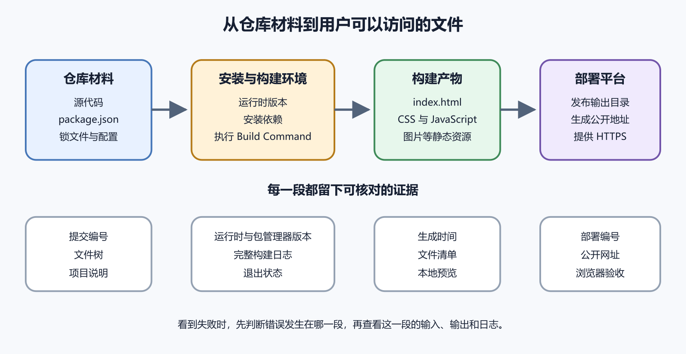

# 源代码、依赖、运行时、构建和构建产物

把网页项目上传到 GitHub，往往还不能直接得到一个网站。仓库里可能放着人读得懂的源文件，浏览器需要的却是另一批文件。中间少了一道构建工作。这一章先拆开五个容易混在一起的词。源代码是人维护的原材料，依赖是项目借用的现成能力，运行时是让程序能够执行的环境，构建是加工过程，构建产物是加工完成后可以交付的文件。

理解这五个位置以后，遇到“本地能开，上线失败”时就能问得更准确。究竟是源文件有误，依赖没装，运行时版本不同，构建过程失败，还是平台发布了错误的目录。



*从源代码到公开网站的构建流水线*

图中仓库内容先进入安装和构建环境。包管理器按清单与锁文件安装依赖，运行时执行构建工具，构建工具把结果写入输出目录，部署平台再把输出目录发布到互联网。每一段都有独立输入、输出和日志。

## 源代码是准备加工的材料

源代码包括你直接编辑的 HTML、CSS、JavaScript、图片、组件、页面模板和配置。它以方便维护为目标，不保证浏览器可以原样使用。一个只含 `index.html`、`style.css` 和图片的简单站点已经接近成品。这类项目可能不用专门构建，发布平台只要把文件送给浏览器。

另一个项目使用 Vue、React 或 TypeScript。仓库里可能有 `.vue`、`.tsx`、未压缩图片和分散的模块。浏览器最终收到的是普通 HTML、CSS、JavaScript 和静态资源。构建工具负责完成转换、组合与优化。

源代码与成品有时长得很像，有时差别很大。不要根据文件扩展名猜测，先读 README，再看 `package.json` 中的 `scripts`，最后在本地执行项目提供的构建命令。

开发者通常不会从头编写日期处理、界面组件和构建工具。他们把这些能力作为依赖装入项目。npm 文档把包描述为由 `package.json` 说明的文件或目录。可以把依赖理解成装修时买来的门锁。你的房屋设计没有包含门锁内部每个弹簧，但安装时需要拿到正确型号。项目也需要获得清单中指定的包。

在常见 JavaScript 项目中，`package.json` 是依赖与脚本清单，`package-lock.json` 记录更准确的依赖树，`node_modules` 是实际安装到本机的文件夹。这三者不能互相替代。只有清单，没有实际安装文件，程序可能无法运行。只有 `node_modules`，没有清单和锁文件，别人难以可靠重建环境。把数万个依赖文件全部提交到 GitHub，通常又会让仓库臃肿，并掩盖真正改动。

项目一般提交 `package.json` 和锁文件，把 `node_modules` 写入 `.gitignore`。新电脑或部署平台根据清单重新安装。具体项目如有不同约定，以项目说明和维护者配置为准。

## 运行时是让代码动起来的环境

运行时可以理解成电器需要的电压和插座。源文件存在，不代表电脑知道怎样执行。JavaScript 构建工具经常需要 Node.js，Python 项目需要 Python，Flutter 工具需要 Dart 与 Flutter SDK。

浏览器本身也是一种运行环境。浏览器执行前端 JavaScript，Node.js 可以在终端或服务器执行 JavaScript。它们支持的接口不同，所以一段浏览器代码不能因为同样叫 JavaScript 就直接放到 Node.js 中运行。

运行时还有版本。一个项目在 Node.js 20 下正常，不代表在很旧或很新的版本中都正常。`package.json` 可以用 `engines` 字段说明兼容范围，部署平台也可能通过设置或配置文件选择版本。版本不同会产生几类问题。旧运行时不认识新语法，新运行时移除了旧能力，原生依赖没有相应二进制文件，包管理器生成了不同格式的锁文件。错误日志里出现版本号时，要把它当作证据保存。

构建会根据项目不同完成若干任务。TypeScript 转换成 JavaScript，组件转换成浏览器脚本，多个文件被组合，图片与 CSS 被复制或压缩，文件名可能加入内容哈希，最终 HTML 引用这些新文件。

哈希文件名看起来像 `app.a31f9c.js`。内容改变，名称也改变，浏览器便能长期缓存旧资源，同时在新版本到来时请求新文件。构建还可能提前生成页面。静态站点生成器读取 Markdown 和模板，输出许多 HTML 文件。部署平台只需提供这些成品，不必在每次访问时重新计算。

构建并不天然等于测试。命令退出成功只能说明构建工具没有报告失败。页面可能仍有错链、内容缺失、环境变量错误和运行时异常。构建完成后还要预览并检查关键路径。

## 构建产物是准备交付的成品

构建产物通常位于 `dist`、`build`、`out` 或项目自定义目录。目录名没有统一标准。平台中的 Output Directory 或 Publish Directory 必须指向实际产物位置。Vite 默认把生产构建写入 `dist`，也提供本地预览构建结果的命令。其他工具可能使用完全不同的名称。复制网上示例时若盲填 `dist`，平台可能发布空目录或直接报错。

判断产物目录可以使用四项证据。

1. README 明确写出部署目录。
2. 构建配置声明输出位置。
3. 构建日志写出生成文件路径。
4. 执行构建后，某个新目录出现 `index.html` 和资源文件。

不要把整个仓库当作产物发布。仓库可能含源代码、测试、脚本、说明、`.env` 示例和内部配置。静态托管只需要浏览器应当下载的文件。

## 一家小店的两个网站

假设一家面包店有两个版本的菜单网站；第一个版本只有三个手写文件；店主修改 `menu.html` 后直接上传；这是一条无构建流程，源文件也是发布文件。第二个版本从一份商品数据生成中文页、英文页和打印页。图片在构建时缩小，CSS 被整理，页面由模板生成。店主编辑的是数据和模板，顾客收到的是 `dist` 中的 HTML、CSS、JavaScript 与图片。

两个网站都叫静态网站，发布路径却不同。第一个可以发布仓库根目录，第二个必须先运行构建，再发布产物目录。当第二个网站把仓库根目录误当成产物，浏览器可能下载到模板源文件，却找不到真正首页。修复重点是 Build Command 和 Output Directory，不是购买服务器。

下面的练习适用于已经安装 Node.js 与 npm 的 Windows、macOS 或 Linux 电脑。只在自己的练习项目中操作，不要在含未保存改动的工作项目中尝试。打开终端，切换到一个 Vite 练习项目的根目录。这里应当能看到 `package.json`。先执行依赖安装。

```
npm install
```

这条命令读取清单与锁文件，把依赖安装到 `node_modules`。正常结果是命令结束并返回终端提示符，项目根目录出现或更新 `node_modules`。若出现找不到命令，先检查 Node.js 和 npm 是否安装。若出现权限或网络错误，保留完整错误文本，不要立即用管理员权限重试。

接着执行项目定义的生产构建。

```
npm run build
```

`npm run` 表示执行 `package.json` 的脚本，`build` 是脚本名称。Vite 示例通常生成 `dist`。日志会列出处理的模块和产物大小。打开 `dist`，应看到 `index.html` 与资源目录。不要直接双击 HTML 作为唯一验收，因为有些路由和资源路径需要 HTTP 服务器。按项目说明启动预览。

```
npm run preview
```

终端通常显示本地地址。用浏览器打开，检查首页、刷新、链接、图片和主要交互。结束预览时回到终端按 `Ctrl+C`。如果项目没有 `build` 或 `preview` 脚本，npm 会明确报告缺少脚本。先打开 `package.json` 查看 `scripts`，不要自行假设命令名称。

## 构建日志怎样读

从日志底部向上找第一段明确错误。最后一行常是“构建失败”的汇总，真正原因可能在更上方。`command not found` 通常表示运行时或工具不可用。`Cannot find module` 常与依赖未安装、版本不合或导入路径错误有关。`ENOENT` 表示程序找不到文件或目录。权限错误说明当前账号不能读取或写入目标。

还有一类错误只在大小写敏感系统出现。Windows 上导入 `Logo.png` 可能碰巧找到实际文件 `logo.png`，Linux 构建环境会把它们视为两个名称。MDN 的文件课程也提醒文件名大小写与路径会直接影响网站。

记录错误时保留执行目录、完整命令、Node.js 版本、npm 版本、第一段错误与退出码。只截最后一行会丢掉原因。

这种现象通常说明两边环境有差异。依次比较运行时版本、包管理器版本、锁文件、环境变量、执行目录、操作系统大小写规则和构建命令。平台往往从全新环境开始，不拥有你电脑中全局安装的工具，也没有未提交文件。某个命令只因你全局安装过工具而成功，平台就会失败。把必要工具声明为项目依赖，并通过项目脚本调用。

被 `.gitignore` 排除的配置在本机存在，平台无法从仓库得到。秘密应通过平台环境变量设置，普通必需文件则应提交。不要为了省事把真实 `.env` 上传。平台的工作目录也可能错。若项目在仓库的 `web` 子目录，平台却在仓库根目录运行 `npm run build`，就会找不到对应的 `package.json`。下一章会专门解释根目录和锁文件。

## 构建成功而页面空白

先确认平台发布的是本次构建产物，而非仓库根目录或上一次目录。再打开浏览器开发者工具查看 Console 和 Network。HTML 返回 200，脚本返回 404，常见原因是基础路径错误。站点部署在 `/project/` 下，构建却假定资源位于域名根路径。按框架部署说明配置 Base Path，再重新构建。

所有资源 200，Console 出现 JavaScript 异常，说明文件已送到浏览器，但运行时出错。此时继续看错误栈与配置，不要反复修改 DNS。页面内容旧，核对本次提交、部署编号、构建时间与缓存。文件带内容哈希却仍旧时，可能是 HTML 没更新或域名仍指向另一项目。

没有统一答案。若平台每次从源码构建，通常忽略产物目录，减少重复文件和冲突。若 GitHub Pages 从专门分支或 `/docs` 直接发布，构建产物可能需要进入发布来源。判断依据应写入 README。说明产物是否提交、由谁生成、发布哪个目录。团队不应一部分人提交 `dist`，另一部分人又把它删除。

生成文件不能成为唯一副本。能重新构建的产物可以清理，源代码、内容数据与必要配置必须安全保存。

## 安装依赖时究竟发生了什么

执行安装命令后，包管理器先读取清单与锁文件，计算需要的版本，再从软件仓库下载压缩包，校验内容，展开到依赖目录。部分包还会运行安装脚本或编译本机组件。因此安装不是单纯复制文件。陌生项目的依赖脚本具有执行能力，先阅读项目声誉、清单和锁文件，再在隔离的练习环境运行。生产密钥不要提前放进安装环境。

下载慢与解析失败要分开。网络超时发生在取得包的阶段，版本冲突发生在选择兼容组合的阶段，本机编译失败又属于安装脚本阶段。保存第一段错误能区分它们。包管理器报告安装完成，也可能附带弃用或安全警告。弃用表示维护者不再推荐某个包或版本，安全警告表示已知问题的匹配结果。它们需要评估，不代表当前页面必然已经被攻击。

常见 npm 项目在日常开发中使用 `npm install`。它可以安装依赖，也会在需要时更新锁文件。持续集成与部署常使用 `npm ci`，要求清单与锁文件一致，并从干净依赖目录开始。`npm ci` 失败常把本机长期积累的环境问题暴露出来。例如维护者只改了 `package.json`，忘记提交锁文件。此时修复方式是在合适的本地环境重新安装、测试并提交同步变化。

不要为了让部署通过而把严格命令改成宽松命令。严格安装的价值是及早发现无法重现的依赖树。项目使用 pnpm 或 Yarn 时，读取对应工具的当前官方说明。不同包管理器的严格安装命令与锁文件名称不同。

## 开发依赖会不会上线

构建工具、格式检查和测试框架通常列为开发依赖。它们在构建阶段需要存在，却不一定进入用户下载的网页。前端构建平台若在云端执行构建，就要安装构建所需开发依赖。把平台设置成只安装生产依赖，可能直接找不到 Vite 或 TypeScript。

构建完成后，静态平台只发布输出目录。`node_modules`、测试工具和源代码通常不会作为网页资源提供。这也是发布精确目录的重要原因。动态 Node.js 服务的情况不同。服务运行时使用的包必须属于生产依赖。把数据库驱动误放进开发依赖，本机全量安装正常，生产精简安装便会启动失败。

构建工具可能读取站点地址、API 地址和功能开关，再把值写进生成文件。构建结束以后修改电脑环境变量，旧产物不会自己变化。可以做一个无秘密实验。为练习站点设置公开标题变量，构建一次并记录页面。修改变量但不重建，预览仍显示旧标题。重新构建后才更新。

这个现象解释了为什么平台变量修改通常需要新部署。它也提醒读者，任何进入前端产物的值都能被访问者读取。密钥扫描要同时看源文件和产物。源配置没有真实密钥，不代表某次旧构建产物没有残留。发布前可在产物目录搜索密钥格式与内部域名。

## Source Map 是什么

构建后的 JavaScript 可能被合并和压缩，错误行难以对应源代码。Source Map 记录生成代码与源文件的映射，帮助调试和错误监控。公开 Source Map 可能暴露较多源代码结构和注释。是否发布取决于项目风险、调试需要和监控平台的上传方式。不要因为文件名以 `.map` 结尾就随意删除，也不要默认全部公开。

检查构建配置和平台说明。需要上传到错误监控而不公开时，使用其受支持流程，并验证公网无法直接下载。Source Map 不会修复错误，它只让错误位置更容易读。生产日志仍要包含部署版本，才能找到对应映射。

构建结束后记录产物文件数、总大小和关键入口。突然从五兆变成五十兆，可能误把源图片、视频或依赖目录复制进去。突然只剩几千字节，可能内容生成失败。检查 HTML 引用的脚本与样式是否都存在。随机抽查图片和字体，确认文件大小合理。空文件也能通过“存在”检查。

把产物放到一个新临时目录预览，避免开发服务器从源目录补上缺失资源。浏览器 Network 中关闭缓存刷新，确认所有关键文件来自预览服务器。对需要离线路径的站点，再测试没有开发服务器辅助时的行为。Service Worker 会缓存旧资源，更新策略要单独验证。

## 构建可重现到什么程度

完全逐字节一致需要固定更多因素，包括运行时、包管理器、依赖、操作系统、时间戳和构建工具。个人项目不必一开始追求最高级别，但应能在全新目录得到功能相同的站点。最低记录包含源提交、锁文件、运行时版本、构建命令、环境名称和输出目录。发生事故时，这些信息能重建旧版。

若构建依赖在线获取未固定内容，例如每次下载一份实时数据，旧提交也会生成不同结果。把输入版本化或在构建记录中保存来源时间与校验值。外部图片链接不属于本地产物。对方删除文件，站点会缺图。核心资源应确认版权和许可后受控保存，或设计可接受的降级。

## 一棵简化故障树

命令未开始，检查工作目录、运行时与脚本名称。安装未完成，检查网络、锁文件、权限和依赖脚本。构建未完成，检查第一段编译错误与变量。构建完成但没有入口，检查配置与内容生成。产物本地正常而平台失败，比较平台环境和发布目录。平台地址正常而域名失败，再进入 DNS 与 HTTPS。

这棵树的价值在于让每次检查排除一层。不要同时升级依赖、换平台和改域名，否则无法知道哪项变化起作用。

构建工具可能压缩图片、生成多种尺寸，或把小图片嵌入 CSS。源目录中的一个文件，产物里可能变成多个带哈希名称的文件。预览时看清晰度、比例和文件大小。手机只下载桌面巨图会浪费流量，过度压缩又会让文字海报模糊。

字体要确认授权允许网页分发，并提供系统字体回退。构建成功无法证明字体许可合规。外链字体还受网络、隐私和地区可用性影响。核心中文正文不能因第三方字体失败而不可读。

## 从零审查一个陌生项目

先在文件管理器查看顶层文件，找 README、清单、锁文件和许可证。不要立即双击来源不明的安装器或脚本。阅读准备与构建部分，记录要求的运行时和包管理器。查看最近维护状态与安全说明，再决定是否在隔离环境安装。

安装后只运行项目列出的构建与测试命令。把首次成功日志保存，它是以后平台配置的基准。产物预览通过后，再考虑连接 Git 和部署平台。这样平台获得仓库权限之前，你已经知道项目会执行哪些主要脚本。

同一提交的构建从一分钟变成二十分钟，可能是缓存失效、依赖下载异常、资源暴增或脚本等待网络。记录各阶段耗时，先找增长发生在哪一段。安装慢与打包慢的解决方向不同。构建命令不应无限等待交互输入。云环境通常没有人按键确认，脚本要采用受支持的非交互方式。

超时后直接提高平台上限会推迟失败。先确认是否存在死循环、挂起网络或超大文件。

## 什么算本章完成

你能指出项目源目录、清单、锁文件、运行时要求、构建命令和输出目录。能在全新工作副本构建，并用生产预览打开成品。验证记录中有完整版本、提交、命令、产物位置和浏览器结果。失败时能说出阶段，而非只说“部署坏了”。

产物不含秘密和内部备份，核心图片与字体有明确来源。达到这些条件，才适合进入平台发布。

一位设计师从模板仓库下载作品集。她直接上传 `src` 到静态平台，首页只显示空白。仓库说明要求 Node.js、npm 和 Vite，生产文件实际要由 `npm run build` 生成。她先在新目录安装依赖，确认 Node.js 完整版本。构建日志显示 `dist/index.html`、两个脚本和压缩后的图片。使用 `npm run preview` 打开后，首页与三个作品详情页都正常。

第一次云构建仍失败。日志提示 `Logo.png` 不存在，仓库实际文件名是 `logo.png`。Windows 本机没有暴露大小写差异，Linux 构建环境严格区分。修正导入名称并提交以后，平台成功生成相同产物；随后页面样式又在项目子路径中丢失；Network 显示脚本请求去了域名根目录。按 Vite 当前部署说明设置正确 Base，重新构建后解决。

整个过程有三层原因。源代码文件名大小写错误，云构建环境与本机不同，产物假定了错误公开路径。购买 VPS 或更换域名都不会修复它们。最终验证记录写明源提交、Node.js 与 npm 版本、构建命令、`dist` 目录、预览地址和三项修复。下一次换平台时，这份记录可以直接提供配置基准。

## 现在只需要知道

看到 `package.json` 时，先把它当成项目说明的一部分；找到 `scripts`、依赖和运行时要求；看到锁文件时不要随意删除；看到 `dist` 或 `build` 时确认它是不是刚生成的交付目录。你暂时不用研究打包器内部算法，也不用比较每一种构建工具。对发布工作最重要的是能回答五个问题。原材料在哪里，依赖怎样得到，谁执行构建，构建命令是什么，成品写到哪里。

AI 可以阅读项目树、`package.json` 与构建配置，列出建议的安装命令、构建命令和输出目录。它也能解释一段构建日志，并指出需要核实的版本差异。让 AI 的结论带证据。例如指出脚本所在字段和配置所在文件。不要接受只凭框架名称猜出的 `npm run build` 或 `dist`。

亲自确认命令运行在正确项目和正确目录，构建无错误，产物由本次源文件生成，预览能完成关键操作。发布前检查产物中没有真实密钥、内部备份和不应公开的数据。下一章会继续拆解包管理器、锁文件、版本号和环境差异。它们决定另一台电脑能否重现你眼前的成功结果。
