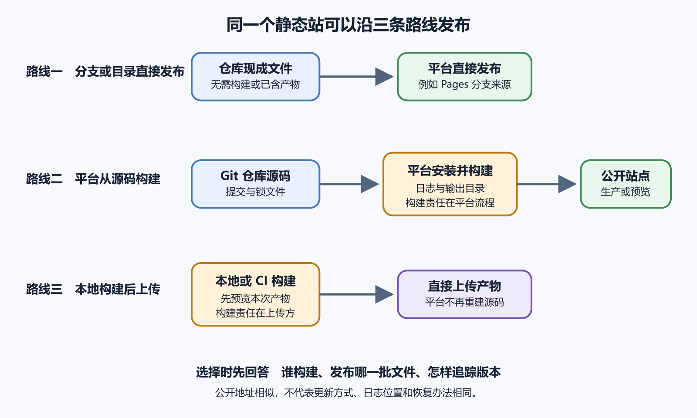

# GitHub Pages 与 Cloudflare Pages

GitHub Pages 和 Cloudflare Pages 都能把静态文件放到公开网址。前者贴近 GitHub 仓库与 Actions，后者提供独立的构建、预览与边缘发布流程。初学者先要弄清平台接收什么、何时更新、失败去哪里看。功能表、按钮位置和产品限制随时间变化，操作前看当前官方文档。

这一章使用一份无后端的练习站作为参照。它只有公开内容，不含登录、数据库写入和服务端秘密。动态后端不适合硬塞进纯静态发布路线。

*静态站的三种发布路线*

图中第一条路线从分支或目录直接发布，第二条由平台从源码构建，第三条由本地先构建再上传。三条路线都能得到公开站点，构建责任和更新方式不同。

## GitHub Pages 适合什么

GitHub Pages 从仓库取得静态内容，构建或部署后提供 `github.io` 地址，也可以连接自定义域名。它可以从分支发布，也可以通过 GitHub Actions 工作流发布。分支发布适合无须控制构建过程的内容，来源通常是某个分支根目录或 `/docs`。需要自定义构建时使用 Actions。

Pages 不运行长期服务端程序。浏览器端 JavaScript 可以调用外部 API，但密钥和权限不能因此放进前端。Pages 站点是公开网站，来源仓库是否私有不决定访问者能否打开站点。需要成员登录才能查看的内部页面，应选择带访问控制的服务。

从分支发布时最容易错的是发布来源。来源选了 `/docs`，仓库却没有该目录，部署会失败。入口文件不在发布来源顶层，也会找不到首页。项目站的路径带仓库名，资源若假设位于域名根目录，样式和脚本可能 404。框架项目按当前框架部署指南配置基础路径。

仓库保存的是框架源代码时，Actions 可以安装依赖、构建并上传 Pages 产物。初学阶段优先使用官方或框架维护者的当前模板。复制旧博客中的工作流时，Action 版本、权限和 Pages 机制可能已经改变。Actions 失败时点击失败运行，展开红色步骤，从底部向上找第一段明确错误。

## Cloudflare Pages 适合什么

Cloudflare Pages 可连接 GitHub 或 GitLab 仓库。选定生产分支后，推送到该分支产生生产部署，其他分支可产生预览部署。平台在自己的构建环境中运行命令并发布输出目录。它还提供 `pages.dev` 地址、部署记录、构建日志和自定义域名配置。

对框架项目而言，它把“GitHub 保存源代码”和“平台构建成品”清楚分开。Cloudflare 也支持 Direct Upload，把已经构建好的目录直接上传。Direct Upload 减少平台读取源码的权限，但每次更新要重建和上传。创建项目前要决定构建责任。

连接 Git 时只授权需要的仓库，不要无理由开放全部组织。选择仓库、生产分支、Root Directory、Build Command 和 Output Directory。无构建静态站按平台当前文档填写；框架站填写已经本地验证的命令和输出目录。首次部署后先看构建日志，再打开平台自带地址验收。

构建日志显示找不到 `package.json`，先检查根目录。构建成功却发布空白，检查输出目录。脚本与图片 404，检查基础路径和产物内容。平台自带地址未通过前，不要开始绑定自定义域名。

## 预览部署和生产部署

生产部署面向正式站点，通常来自指定生产分支。预览部署为其他分支或合并请求提供独立地址。预览地址适合让他人检查修改。它仍是互联网地址，不能放真实用户数据、未公开资料或生产管理能力。若页面尚未公开，要核对平台访问控制能力。

比较稳妥的流程很简单。创建修改分支，Push 后打开预览地址，完成检查，再合并到生产分支。生产部署成功后，用正式地址验收。预览成功不保证生产成功，生产环境变量、域名、缓存和分支内容都可能不同。

有个更新没有出现的案例很典型。维护者把新海报 Push 到 `feature-poster` 分支，正式站仍显示旧图。他以为缓存坏了，反复刷新。部署记录显示生产来源是 `main`，新提交只生成了预览部署；预览地址已经显示新图。合并到 `main` 后才触发生产部署。问题在分支与环境对应关系，不在图片文件和浏览器缓存。

另一种情况是生产分支已更新，部署却失败。正式站继续显示上一个成功版本很正常。此时打开失败日志，解决本次构建，不能用“网站还能开”判断发布成功。

## 选择平台先看责任

纯 HTML 项目已经放在 GitHub，想用最短路径公开，GitHub Pages 的分支发布很合适。需要每个分支有预览地址，希望平台管理框架构建，或准备使用 Cloudflare 的其他服务，可以考虑 Cloudflare Pages。

若项目依赖服务端长进程、私有网络、本地磁盘或数据库写入，这两个静态发布入口都不是完整答案。先画清后端需求，再选择动态托管或服务器。选择还要考虑账号权限、地区网络、域名管理、构建限制和费用。所有额度和价格都可能变化，本书不把当前免费层写成永久承诺。

Pages 可以提供前端文件、重定向和部分边缘能力，具体平台能力不同。需要数据库连接和长期后台任务时，要另外设计后端。把管理员密钥放进前端以绕过后端，会让每个访问者获得同等能力。用户上传也不能仅靠把文件写到站点目录，部署产物通常只读或会在新部署被替换。

## 日志和授权是完成证据

GitHub Pages 从分支发布也会显示 Actions 部署运行。站点没有更新时，从仓库 Actions 查最新 Pages 工作流，再对照 Pages 设置。Cloudflare Pages 在项目 Deployments 中显示每次构建。点击失败项查看阶段、提交和日志。

浏览器 404 只说明请求结果，不说明构建是否成功。平台日志证明发布过程，Network 证明用户实际请求，两份证据要配对。若平台状态页报告事故，保存事件链接和时间；仍要确认自己的故障窗口一致。

授权也要可解释。GitHub Actions 权限不应无理由扩大。Cloudflare 通过 GitHub App 访问仓库，练习项目只给目标仓库。组织仓库可能要求管理员批准 App。撤销 App 权限会使后续部署无法拉取代码，变更前准备影响清单。

每个分支都自动部署很方便，也可能消耗构建额度并暴露大量预览地址。根据项目隐私和费用设置预览分支规则。Pull Request 关闭后，旧预览地址可能仍存在一段时间。不要把地址难猜当作清理机制。

## 一个课程资料站

教师把课程讲义放进公开仓库。第一版只有 HTML、Markdown 和图片，GitHub Pages 从 `main` 根目录发布，操作路径很短。后来项目增加搜索和主题构建，仓库保存源码，产物位于 `dist`。继续从分支根目录发布，会暴露源码结构，也得不到正确首页。

团队有两种可靠选择。使用 GitHub Actions 按当前模板构建并部署 Pages，或连接 Cloudflare Pages 让平台构建 `dist`。两种方案都先在本地验证命令。他们选择 Cloudflare，限定 GitHub App 只读该仓库，生产分支为 `main`，功能分支生成预览。

一次新讲义没有上线，部署记录显示提交只在 `draft-week6` 分支。预览已经更新，生产没有错误。合并后才出现正式部署。团队把分支与环境关系写入 README，保留部署 ID。以后“没更新”会先查提交与分支，不再直接清浏览器缓存。

## 一张选择表

| 情况 | GitHub Pages | Cloudflare Pages |
| --- | --- | --- |
| 仓库已有现成静态文件 | 分支发布路径短 | 可用 Git 集成或直接上传 |
| 需要自定义云端构建 | 使用 GitHub Actions | 项目设置中直接配置 |
| 每个功能分支要独立预览 | 需自行设计工作流 | Git 集成提供预览部署 |
| 不希望平台读取源码仓库 | 仍在 GitHub 内 | 可选择直接上传成品 |
| 需要长期后端进程 | 不适合 | Pages 本身也不提供长期进程 |

这张表只做第一轮筛选。平台限制和产品边界会变化，正式选择前再看官方页面。仓库转移到组织、改名或改变可见性，也可能影响 Git App 授权、Pages 地址和构建触发。变更前记录当前 URL、发布分支、域名和平台项目；变更后触发一个无害部署，确认平台仍能读取仓库。

可以做一个双平台对照实验。把同一份无构建静态站分别发布到 GitHub Pages 和 Cloudflare Pages，只使用平台自带地址，不绑定域名。记录首次设置字段、部署提交、生成时间和地址。修改首页一句话并 Push，观察两个平台的触发时间和日志位置。实验重点放在证据上。你要画清“Push 后谁做了什么”。

README 可以显示构建或部署状态徽章，帮助维护者快速看到失败。徽章只反映对应工作流，不能证明网站业务正常。部署故障时点击进入原始运行记录，不能只看红绿颜色。

## README 要写清发布关系

静态站最容易把发布知识留在某个人脑子里。README 不需要复制平台按钮，但要写清维护者真正需要的关系。生产来源是哪一个分支或工作流；预览地址怎样产生；本地构建命令是什么；发布目录在哪里；自定义域名由哪个平台绑定；DNS 记录由哪个账号管理。新人接手时先读这一段，就能少走很多控制台岔路。

无构建站点可以写得很短。源码位于仓库根目录，GitHub Pages 从 `main` 分支发布，正式地址使用平台自带地址或某个自定义域名。框架站要多写一步。源码在 `web`，本地运行 `npm run build`，产物目录是 `dist`，Cloudflare Pages 的 Root Directory 填 `web`，Output Directory 填 `dist`。这些句子不替代平台设置，却能让设置变得可审查。

README 还要说明哪些内容不在仓库。域名注册、DNS、平台项目、环境变量和访问控制通常在外部账号里。只写“已经配置好”没有交接价值。更好的写法是列出负责人和确认入口，秘密值仍不写。公开仓库中只出现变量名称、用途和示例格式。

当平台迁移、仓库改名或生产分支变化时，先更新 README，再完成一次无害部署并记录部署 ID。若实际设置与 README 不一致，优先按真实控制台保护线上服务，然后补正文档。文档不是权威运行环境，但它能让下一次故障更快找到权威入口。

## 本章验收清单

能用平台自带地址发布一个无秘密静态站，指出生产来源与最新部署提交。能找到构建日志，解释预览和生产的区别。仓库授权限制在所需范围，发布目录只含公开文件。出现 404 时能区分入口文件、基础路径、发布分支和平台绑定。

AI 可以根据仓库结构填写候选 Build Command、Root Directory 和 Output Directory，解释失败日志，并整理 Pages 与 Cloudflare 的差异。它不能替你批准第三方读取全部仓库。授权页面要亲自查看范围，正式部署也要打开真实网址验收。下一章讨论 Vercel、Render 等自动部署平台，并说明静态托管与可运行后端服务的差别。
