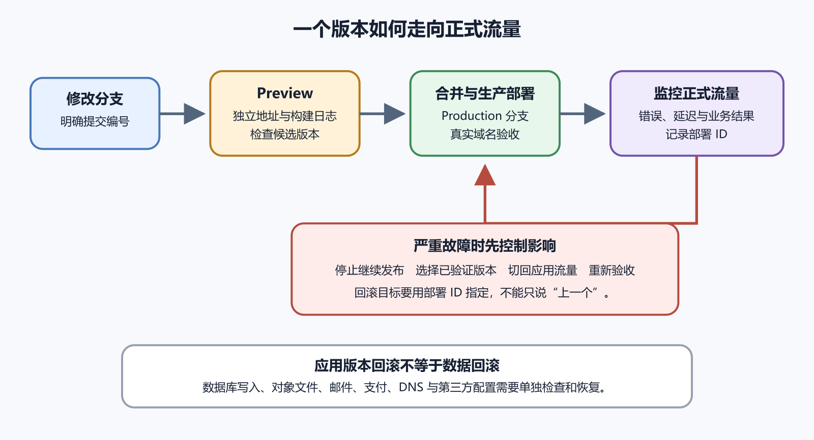

# Vercel、Render 等自动部署平台

自动部署平台把一条重复流程接到 Git 仓库。代码 Push 后，平台取得指定提交，准备环境，安装依赖，执行构建或启动命令，再把结果放到公开地址。Vercel、Render、Cloudflare Pages 等平台都提供这类能力，但擅长的工作负载并不完全相同。

平台减少了手工上传，却没有替你理解项目。命令填错、端口没有监听、数据写在临时磁盘、环境变量缺失、后台任务没有位置，自动化只会稳定地重复错误。

*从预览到生产再到回滚的部署时间线*

## 自动部署到底自动了什么

一次部署通常包含触发、取代码、准备环境、安装、构建、发布和健康检查。触发来源可能是生产分支 Push、合并请求、手动部署或 Deploy Hook。取代码阶段锁定提交编号；准备环境选择运行时与系统镜像；安装阶段读取清单和锁文件；构建阶段生成静态文件或编译应用；发布阶段把新版本接到网址。

每个阶段都有状态和日志。取代码失败，检查仓库授权、分支和子模块。安装失败，检查包管理器、锁文件、私有包凭据与运行时版本。构建失败，查看第一段错误、工作目录和环境变量。发布失败，检查输出目录是否存在以及是否包含入口文件。服务启动失败，检查 Start Command、监听地址、端口和运行时异常。

平台自带地址先于自定义域名验收。自带地址失败时，问题在项目或平台部署范围；自带地址成功而域名失败，才转向 DNS 和域名配置。不要在平台自带地址还不通时开始改域名。

> **跟做视频**
>
> 中文主入口：[B 站 Vercel 控制台演示](https://www.bilibili.com/video/BV11B4y1J7Rg)；备用入口见[视频索引](../frontmatter/videos.md)。用不含秘密的练习仓库完成一次导入、部署和自带地址验收。视频只负责帮你找到入口，生产分支、环境变量和账单告警仍要按自己的项目核对。

## 静态站和动态服务不是同一类

静态站发布后只需要提供文件。它适合 HTML、CSS、JavaScript、图片和预先生成的页面。采用常驻 Web Service 的动态服务，还要启动进程、监听平台要求的端口，并持续健康运行。动态计算也可以由平台函数承接，不能一概要求用户自己管理监听端口。需要服务端代码、数据库连接、认证回调或每次请求计算内容时，先确定对应的运行方式；后台任务还要有单独的执行安排。

Render 可以创建 Static Site，也可以创建持续运行的 Web Service。选择类型要看产物。只有前端文件，用 Static Site；需要 Node.js、Python 等后端进程处理请求，用 Web Service。Vercel 也可以部署静态前端、服务端渲染和函数，但具体能力、限制和推荐方式以当前官方文档为准。

有些框架既能输出纯静态站，也能使用服务端渲染。判断时不要只看框架名称。查看构建输出和启动方式。构建完成后得到一批可直接提供的文件，是静态路线；部署后还必须运行 `npm start` 一类长期进程，是服务路线。无服务器函数位于两者之间，适合某些短任务，不等同于任意长期服务器。

## 平台承担基础设施，不承担业务责任

托管平台通常承担构建机器、发布入口、TLS 证书、部署历史和基础运行设施。动态服务还可能提供健康检查、日志和伸缩选项。你仍负责源代码、依赖、配置、数据、权限、秘密、业务监控和费用。平台显示绿色，只说明它的部署检查通过，不代表注册、支付、备份和数据恢复可用。

供应商故障也可能影响网站。准备状态页、用户通知和恢复办法。重要数据要有独立备份，不能把部署历史当数据库备份。平台删除或账号出问题时，部署记录不能替代源代码、数据库备份和对象存储恢复。

价格、免费额度和休眠规则变化频繁。正式决策时打开官方定价与限制页，写明查询日期和预计用量，不沿用本书截稿时数字。面向中国大陆公众提供服务时，还要根据服务器位置、域名接入、网络质量和现行规则核对官方渠道，本书不会把全球平台的默认流程写成完整合规答案。

## 动态服务的关键边界

云平台通常通过环境变量提供端口。后端应读取该值，不能固定只监听本机开发端口。监听 `127.0.0.1` 只接受容器内部本机连接，平台代理可能无法访问。许多平台要求绑定对外可接入的地址，具体按当前运行时示例配置。不要为了测试随意开放云服务器防火墙端口；托管服务的公网入口通常由平台代理提供。

健康检查用于判断新实例能否接收流量。最小端点可以验证进程存活，较深检查还可能验证关键依赖。检查过浅时，进程活着但数据库完全断开仍显示健康；检查过深时，一个非关键外部服务抖动会让所有实例反复重启。个人项目先提供快速、无副作用的健康端点，详细原因进入受限日志。

某些计划会在空闲时暂停服务，下一次请求需要等待启动。是否存在、等待多久和适用计划会变化。访问慢不一定是代码性能问题。对照平台事件和实例启动日志，判断是否冷启动。需要稳定响应的业务应按当前官方计划评估资源和费用，不把免费层当生产保证。

## 数据不能随便放在本地磁盘

有些平台的服务文件系统是临时的。应用把上传图片写到 `uploads`，同一实例马上能读；新部署创建另一个实例后，目录可能为空。多实例时，用户随后请求甚至可能落到没有该文件的实例。生成缩略图、临时报表和缓存可以使用临时目录，前提是内容可重建且有空间清理。业务唯一副本不行。

SQLite 是单个文件数据库，放在临时盘会随实例消失。放在持久盘又涉及单实例、备份与并发限制。适合项目的数据服务应根据一致性、备份、区域和并发选择。第五卷会细讲数据库和对象存储。

后台任务也要有位置。发大量邮件、视频转码和长时间 AI 任务可能需要 Worker、队列或任务表。把长任务直接放在请求处理里，用户断开后任务可能继续、被中止或重复。平台重启也会丢失内存队列。任务服务必须记录任务 ID、状态、重试和结果。

## 权限、Hook 和账单

平台需要读取仓库，可能还会向提交或拉取请求写部署状态。只授权目标组织与仓库。构建过程能读取注入的环境变量。陌生分支和未审查 Pull Request 不应获得生产秘密。团队成员离开或账号被盗时，要能撤销仓库 App、平台成员和部署令牌。

Deploy Hook 是特殊 URL，请求它即可触发部署。适合内容系统通知平台重建，也可能被泄露后反复调用。把 Hook 当作秘密，不放进前端和公开仓库。泄露时生成新 Hook 或按平台方式撤销旧值。频繁异常部署时，检查 Hook 调用方、Git 推送和自动更新工具，找出真实触发源。

自动部署会消耗构建资源，爬虫和异常请求会消耗流量与函数执行。创建项目时查看官方计费维度，设置预算或用量告警。测试 Webhook 时避免循环触发部署。账单突然增长，先按服务、日期和用量类型拆分。不要立即删除生产资源，先限制异常入口并保存证据。

## 迁移平台前先做等价表

从一个自动部署平台迁到另一个平台时，别急着改 DNS。先让新平台用自带地址跑通，再确认它承担的责任与旧平台一致。迁移不是把仓库重新连接一次。旧平台可能同时提供静态文件、函数、环境变量、后台任务、重定向、域名证书和日志；新平台若只完成其中一半，页面会以很隐蔽的方式失败。

等价表至少写七项。仓库来源和生产分支是否相同；Root、Build、Output 或 Start 字段怎样对应；运行时版本与包管理器是否一致；环境变量名称、作用环境和秘密范围是否迁移；自定义域名、重定向和 HTTPS 谁负责；日志、监控和告警入口在哪里；费用、团队权限和停用旧平台的步骤由谁批准。

迁移期间保留旧平台只读证据。记录旧部署 ID、旧变量名称、旧域名绑定、旧重定向规则和最后一次成功验收。新平台自带地址通过后，再用测试域名或临时子域验证关键路径。正式域名切换前，通知相关人员不要同时修改代码、数据库和 DNS。一次只改变一个主要边界，失败时才知道该回到哪里。

动态服务还要处理数据和后台任务。新平台启动了 Web Service，不代表 Worker 已经运行；函数能响应，不代表定时任务和队列消费者存在。若旧平台有持久磁盘、计划任务或私有网络，新平台必须有明确替代方案。迁移后观察一段真实流量，再下线旧资源。下线前导出账单与日志入口，避免事故复盘时找不到旧证据。

## 一个前端加 API 的例子

假设开发者有一个前端页面和一个需要常驻进程的 Node.js API。前端构建成静态文件，API 根据编号查询数据库。把整个仓库建成 Static Site，却没有配置函数或 API 转发时，页面能开，`/api/query` 返回 404。一种处理方式是拆成一项静态站和一项 Web Service。前端公开变量指向 API 自带地址，API 使用服务端数据库连接，并为跨源请求配置明确的来源、认证和凭据规则。若同一后端也能提供前端静态文件，也可部署为一个 Web Service，无须为了分层理解强行拆成两个服务。

API 首次部署显示进程启动，平台健康检查仍失败。日志显示它固定监听 `localhost:3000`，没有读取平台提供端口。修改后健康检查通过。开发者又把查询缓存写到本地文件。受控重启后缓存消失，但数据仍可从数据库重建，这符合设计；用户预约本身从未放进临时盘。

最后记录前端与 API 的部署 ID、区域、变量名称、健康端点和重启结果。前端成功与 API 成功分别验收，避免一个绿灯覆盖另一项故障。
