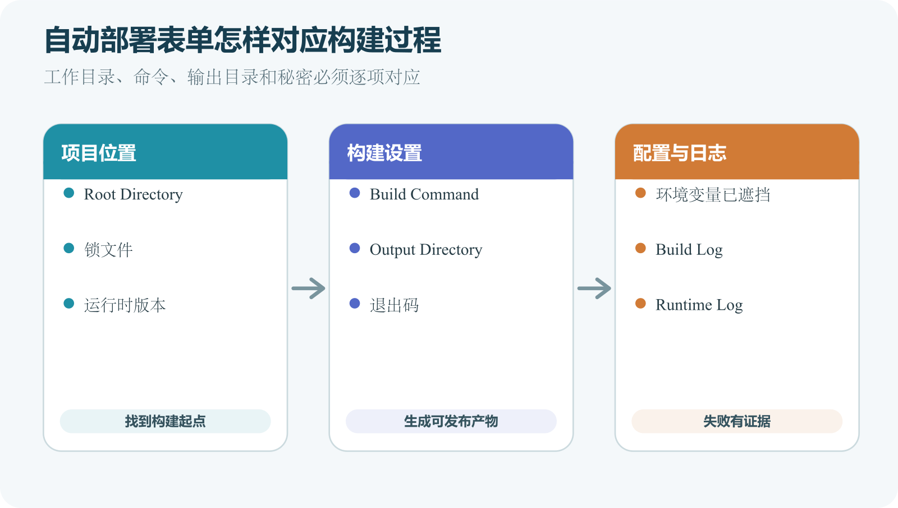

# Build Command、Output Directory 和环境变量

自动部署表单中最常见的三个字段，分别回答三个问题。在哪个目录工作，运行哪条命令，发布哪个目录。环境变量再向构建或程序提供仓库之外的值。字段名称在平台间略有差异。Root Directory、Build Command、Output Directory、Publish Directory 和环境变量的职责相对稳定。把输入和输出画清楚，比记住某个平台菜单更可靠。



*部署控制台中项目位置、构建设置、环境变量和日志的对应关系*

## Root Directory 是工作起点

Root Directory 指项目在仓库中的位置。仓库根目录本身就是项目时，通常留空或使用默认值。项目在 `web` 子目录时，填写 `web`。平台进入这个目录后寻找 `package.json`、锁文件和构建配置。它也是相对路径计算的常见起点。

不要把 `src` 当作 Root Directory，除非清单和构建配置确实都在 `src`。`src` 常只是源代码目录。判断方法是先在本机进入候选目录，确认从这里能按 README 执行安装和构建。

Build Command 告诉平台怎样从源材料得到可发布内容。常见值是 `npm run build`，实际名称取决于 `package.json` 中 `scripts`。若清单写有以下片段，平台执行的是 `vite build`。

```
{
  "scripts": {
    "build": "vite build"
  }
}
```

部署表单填写 `npm run build`，不是直接猜测隐藏命令。通过项目脚本可以让团队和平台使用相同入口。npm 官方参考说明 `scripts` 字段用于定义包生命周期和命令。纯静态项目可能不需要构建。此时按平台当前文档设置空命令或适用默认值，不要编造一个总是成功却什么也没做的命令来绕过检查。

命令成功要看退出状态与产物。只打印“完成”却没有生成目录，平台随后仍会失败。

## Output Directory 是交付箱

Output Directory 指构建后平台要发布的目录。Vite 默认使用 `dist`，其他工具可能使用 `build`、`out` 或自定义名称。这个目录相对于项目根目录解释。项目根是 `web`，产物在 `web/dist`，通常填写 `dist`，不是从仓库根写 `web/dist`。平台规则若有例外，以当前文档为准。

Cloudflare Pages 的构建配置把 Build command、Build output directory、Root directory 和环境变量列为独立设置。这说明它们不能互相补偿。

Root 填错，平台找不到清单。Build Command 填错，产物没有生成。Output 填错，构建成功也发布不到正确文件。

发布前写下四行。

```
仓库位置    web/
构建命令    npm run build
产物位置    web/dist/
平台输出框  dist
```

第一行从仓库根观察，第三行是构建后的真实路径，第四行按平台相对规则填写。四行对不上时，先在本地复现。再记录入口 `web/dist/index.html` 是否存在。若构建产生的是服务端程序而非静态目录，不应硬填静态 Output Directory。

## 环境变量进入哪个阶段

变量可能在构建阶段读取，也可能在运行阶段读取。静态前端的变量常在构建时被写入成品。修改变量以后必须重新构建才能改变页面。动态后端可在每次启动或请求时读取运行环境。平台如何注入、是否需要重启，由运行时和供应商决定。

Vercel 当前文档说明变量按环境配置，改动不会改变旧部署，要重新部署。Cloudflare Pages 也允许在项目构建配置中添加变量。变量名大小写要完全一致。代码读取 `API_URL`，平台设置 `Api_Url`，在大小写敏感环境中是两个名称。

前端需要知道公开 API 地址、站点名称和非秘密功能开关。这些值即使从环境变量注入，最终仍可能出现在可下载文件中。服务端数据库密码、支付私钥和管理令牌不能进入前端构建。变量名称带 `PUBLIC`、`NEXT_PUBLIC` 或 `VITE_` 一类前缀时，通常表示框架允许暴露到客户端。具体规则查当前框架文档。

不要把秘密直接写在 Build Command 中。命令会出现在设置、日志或进程信息中。使用平台秘密管理，并限制账号权限。环境变量排错时只确认名称、作用环境、是否存在和格式类别。不要把真实值放进截图、Issue 或 AI 对话。

## 预览与生产要分开

预览环境可连接测试 API，生产环境连接正式 API。两者使用同名变量，值不同，能减少代码分支。如果预览正常、生产失败，比较两边变量清单、部署分支和构建日志。不要把生产变量临时复制到预览来“验证”，这可能让测试页面操作真实数据。

反过来，生产站连接测试数据库也很危险。上线验收要创建一条可识别的测试记录，并确认它出现在预期系统中，完成后按流程清理。平台提供的预览 URL 有时被第三方访问。测试变量也应遵循最小权限和最小数据原则。

仓库中有 `apps/site` 和 `apps/admin` 两个前端，共享 `packages/ui`。要部署公开站，项目根可能是 `apps/site`，也可能由工作区工具要求在仓库根构建。不能只看 `package.json` 出现在哪里。阅读工作区配置和 README，在全新 Clone 中执行准确命令。若从仓库根运行 `npm run build --workspace site`，Root Directory 可能保持仓库根，Output Directory 指向 `apps/site/dist`。若项目设计允许在 `apps/site` 独立安装，才可能把它设为根。

共享包没有被安装或构建时，日志常出现无法解析工作区依赖。此时不应把共享源码复制进站点目录，应修正工作区构建路径。

## 构建缓存带来的误解

平台可能缓存依赖和构建结果以提高速度。缓存命中不是错误，旧缓存掩盖问题时需要受控地清理或触发无缓存构建。先确认提交、变量和配置确实改变。没有新部署时，清缓存不会让生产分支自动更新。

清理缓存会增加构建时间，也可能让隐藏的依赖问题暴露。保存此前日志，使用平台提供的明确功能，不执行来源不明的删除命令。构建结果依赖未提交文件时，本机缓存看似正常，全新云环境必然失败。全新 Clone 验证比频繁清缓存更能发现这种问题。

第一个现场显示 `Could not read package.json`。日志工作目录是仓库根，而清单在 `frontend`。修正 Root Directory 或按工作区命令构建。第二个现场构建成功，平台提示发布目录不存在。本地配置把输出从 `dist` 改成 `out`，控制台仍填旧值。对照构建日志里的实际路径。

第三个现场预览 API 正常，生产浏览器请求到 `undefined/users`。生产缺少公开 API 地址变量，或变量修改后没有重新部署。检查变量作用环境并创建新部署。三种错误分别属于工作起点、构建输出和环境输入。它们都不需要先改 DNS。

## Build Command 的安全边界

构建脚本是可执行代码。连接陌生仓库到平台，相当于允许其中脚本在构建环境中运行。平台令牌和环境变量的权限范围应尽量小。审查 `scripts`、安装脚本和工作流，尤其是来源不明项目。不要给练习项目注入生产密钥。

构建日志可能包含命令输出。脚本不应打印所有环境变量。发现泄露后撤销相关密钥，清理日志权限，并查明可见范围。

有的平台允许覆盖依赖安装命令。默认识别通常已经适合普通项目，只有项目明确要求时才覆盖。使用 npm 且提交锁文件的部署可以采用平台默认严格安装。私自改成忽略锁文件，会让每次部署解析到不同依赖。

工作区项目可能需要从仓库根安装，再到子项目构建。此时 Root Directory 与 Install Command 要一起设计，不能各自照抄不同教程。日志中先确认平台实际执行的命令。控制台字段为空不代表什么都不执行，可能使用框架预设。

## 框架预设做了哪些推断

平台识别 `package.json` 和配置文件后，可能自动选择框架、构建命令和输出目录。预设减少填写，也可能因非标准结构判断错误。导入时把预设值与本地验证记录比较。相同就保留，差异要理解原因。升级框架后，平台预设可能改变。生产项目应记录显式覆盖项，封版或迁移前重新核对。

不要为追求“自动识别成功”而移动项目文件。合理的 Monorepo 应通过平台工作区设置表达。

生产分支决定哪些 Git 事件进入 Production，环境变量决定该部署得到哪些值。两项配置共同影响结果。把生产分支从 `main` 改成 `release` 后，原本 Push `main` 只会生成预览或不部署。先把分支策略写进 README。

环境名称也可能由平台定义。Preview 不一定等于 Git 分支名，Production 也不等于代码中的 `NODE_ENV` 值。在构建日志记录平台环境名称，程序内部只使用确有需要的标准变量。不要用一个模糊变量同时控制数据库、调试和支付模式。

## 变量值中的 URL

API 地址要包含协议，并明确是否需要末尾斜杠。代码简单拼接时，`https://api.example.com/` 加 `/users` 会得到双斜杠。回调 URL 还要求路径和大小写精确。身份供应商常按完整 URL 白名单验证。测试值使用专用域名或平台预览地址，不把 `localhost` 留在生产。移动 App 访问 `localhost` 时指向设备自身，也不等于开发电脑。

验证时在浏览器 Network 查看最终 Request URL。页面显示“网络错误”时，实际请求地址更有价值。

证书、私钥和服务账号 JSON 可能包含换行。平台有时提供 Secret File，有时要求转义文本。按服务官方集成说明处理。不要为了方便删除私钥头尾或所有换行。错误 `invalid key` 可能来自格式，不一定是权限。用测试凭据在本地模拟相同注入方式，日志只输出解析成功与否。

需要 Base64 时，明确哪一端编码、哪一端解码。Base64 不是加密，编码文本仍按秘密保护。

## 变量轮换

密钥到期或泄露时需要轮换。较安全流程是先创建新密钥，在预览验证，再更新生产并部署，确认流量使用新值，最后撤销旧密钥。若供应商只允许一个密钥，安排维护窗口并准备回退。不要先删除唯一有效密钥再研究部署。

记录秘密名称、负责人、创建时间、用途和轮换状态，不记录明文。平台审计日志能补充操作者与时间。轮换以后搜索仓库历史、构建日志和工单，确认旧值没有长期暴露。

静态站产物至少要有可访问入口，以及入口引用的资源。若平台需要特定路由、头部或重定向文件，也应位于其规定位置。不应包含 `.git`、`node_modules`、源环境文件、测试截图和数据库备份。Source Map 是否包含按项目风险决定。

产物中 HTML 很少而 JavaScript 很大，不一定错误，可能是单页应用。仍要检查首屏性能和无脚本提示。平台发布前可以生成清单，记录相对路径和大小。部署后抽查关键 URL 与清单一致。

## Root Directory 的权限边界

Monorepo 中一个项目只需部分文件，平台 Git App 仍可能读取整个授权仓库。Root Directory 控制构建工作位置，不等于仓库读取权限。高度敏感项目要分仓库或使用平台提供的更细授权。不要把秘密文件留在仓库其他目录并认为构建看不到就安全。

构建脚本也可以通过 `..` 访问上级目录。审查陌生脚本，限制环境秘密。发布产物只选 Output Directory，能减少公开文件范围，但不能撤销构建过程已拥有的读取能力。

控制台设置不总在 Git Diff 中出现。修改 Root、命令、变量和生产分支后，团队可能无法从仓库知道原因。为每次配置变更留记录，包括旧值、新值、操作者、时间、原因、部署 ID 和回退步骤。秘密只写名称或版本。

平台支持配置文件时，可以把非秘密设置版本化。仍要理解配置文件与控制台谁覆盖谁。事故排查把代码提交与控制台变更放在同一时间线。代码未变而服务故障，配置与供应商状态就更值得查。

## 一次故意填错的练习

在练习项目把 Output Directory 从正确的 `dist` 暂时改为不存在的 `output-test`，触发预览部署。观察平台在哪个阶段失败，记录错误文本。不要在生产项目做这个实验。恢复 `dist` 并重新部署。确认新部署成功，旧失败记录仍可查看。

这个练习让读者看到“构建成功”和“发布成功”是两个状态，也熟悉恢复配置的位置。随后把练习项目的 Output Directory 恢复为原值并记录。不要打开生产项目，也不要改动生产分支和自动部署开关。

练习记录保留两次部署。失败部署对应错误目录，日志应指出找不到发布文件或目录无效；恢复后的部署对应正确目录，公开预览应再次显示页面。若恢复配置后仍失败，比较两次部署使用的提交、Root Directory、Build Command 和缓存，不要继续随机更换字段。

同一字段可能出现在框架配置、平台配置文件、项目设置和环境变量。最终值取决于覆盖顺序。出现“我明明改了”的情况，列出所有来源，不反复修改同一页面。构建日志有时会说明使用了哪个配置。删掉重复设置前先记录。保留一个权威来源，README 写明其他位置为何为空。

秘密继续放平台秘密系统，非秘密稳定配置可进入仓库，便于评审与重建。

## 环境变量命名

使用明确前缀区分服务，例如 `PUBLIC_API_URL`、`DATABASE_URL` 和 `MAIL_FROM`。不要用 `URL`、`KEY` 这类含糊名称。名称一旦公开给多个服务，修改成本会上升。统一大小写和下划线，避免近似拼写。示例文件为每个变量写用途、是否秘密、在哪个环境必需和示例格式。真实值不出现。

启动校验一次列出所有缺少名称，减少修一个再发现一个的循环。

生产秘密只给 Production。预览使用专用测试账号和数据库，权限也限制为测试范围。外部贡献者的分支可能运行构建脚本。平台如何处理来自 Fork 的秘密，要查当前安全说明。不要为让预览通过而把秘密直接写进工作流。无法安全提供时，让相关集成在预览中使用模拟或跳过，并明确显示。

合并前再由受信任环境完成完整集成测试。

## 配置验收表

| 字段 | 证据 | 预期结果 |
| --- | --- | --- |
| Root Directory | 清单与锁文件位置 | 平台能开始安装 |
| Install Command | 项目包管理器说明 | 依赖树可重现 |
| Build Command | scripts 与本地日志 | 命令成功生成新产物 |
| Output Directory | 构建配置与文件树 | 顶层有入口文件 |
| Runtime Version | 项目声明与平台日志 | 两边处于支持范围 |
| Environment Variables | 名称清单与环境 | 不缺失且无秘密暴露 |

每一行都要有实际证据。自动识别值也按同样标准检查。

读者能从仓库和构建日志填写四个核心字段，能解释它们为何不是同一目录。能区分构建变量与运行变量、公开值与秘密。生产与预览变量分开，设置变更有记录。故意填错的练习能从日志定位并恢复，未影响真实站点。

达到这些条件，部署失败就能从具体字段开始排查，避免在多个平台之间来回试错。

> 拿你的项目试一下
>
> 列出当前项目在 Local、Preview 和 Production 中使用的环境变量名称，只记录名称、用途和生效环境，不抄写真实值。任选一个无秘密的公开变量，在练习分支修改后创建新部署。检查构建日志、部署环境和页面结果是否都引用新值。平台保存变量只证明配置记录存在，新部署真正读取并呈现预期行为以后，才证明这次变更已经生效。

## 综合例子　四个字段错了三个

一个仓库把网页放在 `apps/web`。本地从该目录运行 `npm run build`，产物生成到 `build`。平台导入后默认在仓库根执行，并猜测输出为 `dist`。首次日志找不到根目录清单。开发者把 Root Directory 设置为 `apps/web`，安装开始成功。第二次构建完成，发布阶段又报告 `dist` 不存在。

他查看本地构建配置与云日志，把 Output Directory 改为 `build`。页面出现后，浏览器请求地址却是 `undefined/items`。代码要求 `PUBLIC_API_URL`，生产环境只设置了预览值。开发者在 Production 添加公开 API 地址并创建新部署，页面请求恢复。

最终四格记录写为 `apps/web`、`npm run build`、`build` 和 `PUBLIC_API_URL`。每项都有文件或日志证据。如果一开始同时更换平台、框架和 DNS，三处错误会混在一起。按阶段推进让每次部署都只暴露下一项具体问题。

AI 可以把仓库树转换成四格配置，解释每个字段的证据，并检查变量名是否在代码和平台记录中一致。让它标注推断与确认。例如“根据 Vite 默认值推测 dist，尚需执行构建确认”。没有真实构建时不能写成已验证。

亲自运行构建，查看新产物目录，确认环境变量的作用范围和秘密边界。平台部署后核对提交编号与生成地址。下一章会顺着部署记录区分 Preview、Production、部署日志和回滚，并说明回滚无法恢复哪些外部状态。
