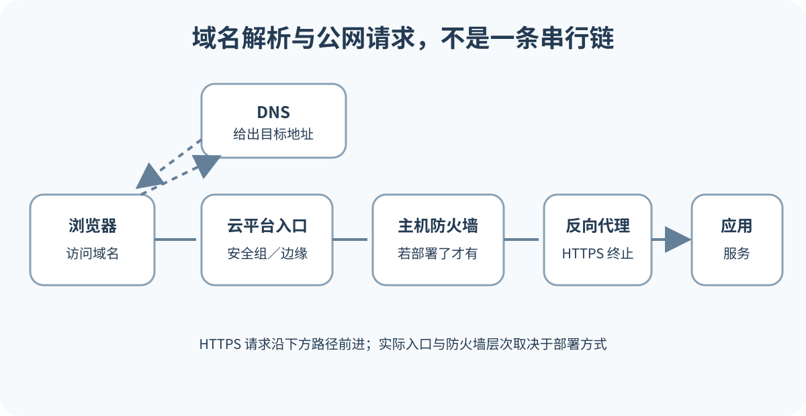

# 自定义域名、DNS、HTTPS、费用与地区差异

平台自带地址已经能打开以后，自定义域名只是把用户入口换成自己的名称。网站文件仍在托管平台，DNS 告诉访问者去哪里，HTTPS 保护浏览器与入口之间的传输。绑定域名同时跨过域名注册商、DNS 服务和部署平台。三处界面可能由同一家公司提供，也可能完全分开。排错时先画清谁负责哪一段。

*域名、DNS、HTTPS、反向代理和应用服务组成的公网入口，以自建服务器为例。图按排查环节排列，DNS 返回地址后，浏览器直接连接服务入口，HTTP 请求不经过 DNS 转发。托管平台不一定向用户暴露云防火墙或 UFW 配置。*

## 四个角色

域名注册商记录域名注册、续费和联系人。DNS 托管商保存解析记录。部署平台提供网站地址和域名绑定。证书签发机构参与 HTTPS 证书验证与签发。同一家公司可以承担多个角色，也可以完全分开。角色不清时，常在错误控制台修改记录。

`example.com` 常称根域或 Apex Domain，`www.example.com`、`app.example.com` 是子域。子域常用 CNAME 指向平台提供的目标名称。根域受 DNS 记录规则影响，平台可能要求 A、AAAA、ALIAS、ANAME 或供应商代理方式。不要把另一平台教程中的记录值照搬。

选择一个主访问地址，再把其他形式重定向过去。例如主站使用 `www.example.com`，根域跳转到 `www`。两边都显示相同内容却不重定向，会造成链接、缓存和搜索统计分散。

## 为什么先在平台添加域名

平台需要知道这个域名属于哪个项目，才能验证所有权、配置路由并申请证书。只改 DNS，平台可能收到请求却不知道送给谁。稳妥顺序先从平台自带地址开始。确认平台自带地址正常；在平台项目添加域名；阅读平台给出的当前 DNS 目标；去权威 DNS 创建或修改记录；返回平台等待验证和证书；最后用正式域名验收。

修改 DNS 前，先确认当前权威名称服务器。你可能在注册商页面看到 DNS 编辑器，但域名已经委托给另一家，此处修改不会生效。更换名称服务器等于迁移整套 DNS，网站、邮件、验证、子域和 API 记录都要复制。首次学习域名绑定时，不要同时更换名称服务器。

创建记录前检查同名旧记录。CNAME 与同名 A 记录通常不能并存。删除或替换会影响现有服务，先确认旧记录用途和恢复值。DNS 控制台有时自动补全域名，输入 `www` 即代表 `www.example.com`；确认最终显示值，避免重复成 `www.example.com.example.com`。

## DNS 等待期间保持证据稳定

DNS 记录带 TTL，递归解析器会缓存。修改后不同网络在一段时间内看到不同结果很正常。频繁删除重建会重置排错起点。先使用 DNS 查询结果确认权威记录与公共解析结果，再判断是否需要改。浏览器缓存、操作系统缓存和 DNS 缓存属于不同层，无痕窗口不能保证绕过所有 DNS 缓存。

平台仍显示验证中时，核对记录名称、类型、目标、代理状态和名称服务器。保留截图时遮住账号、客户编号、验证码和无关域名。记录查询时间、解析器和返回值。不要每五分钟改一次目标。

自带地址正常、域名错误时，按现象进入一层。名称不存在，查权威 DNS 和记录；域名打开别人的项目，查记录目标和平台域名归属；域名返回平台 404，自带地址正常，查平台是否完成域名绑定，别只盯着 DNS；HTTPS 证书不匹配，查精确主机名、证书状态和 DNS 是否仍有旧记录。

## DNS 记录也要标用途

DNS 控制台里常有很多记录，初学者看到就想“清理”。先给每条记录标用途。网站入口常见 A、AAAA、CNAME、ALIAS 或平台代理记录；邮箱依赖 MX、SPF、DKIM 和 DMARC；第三方服务验证可能使用 TXT；旧系统、API、后台和短链接可能各自占用子域。看不懂的记录先查来源，别凭名称删除。

一张简单用途表就够用。

| 名称 | 类型 | 目标或值 | 用途 | 负责人 |
| --- | --- | --- | --- | --- |
| `www` | CNAME | 平台给出的目标 | 网站入口 | 前端或运维 |
| `@` | A 或 ALIAS | 平台或代理目标 | 根域入口，跳转由入口服务配置 | 域名负责人 |
| `@` | MX | 邮箱服务目标 | 企业邮箱 | 办公系统负责人 |
| `_verification` | TXT | 验证文本 | 平台所有权验证 | 项目负责人 |

表格中可以记录目标摘要，不必公开完整验证值。迁移前导出当前记录，保存日期和权威名称服务器。迁移后只改本次相关记录，其他用途保持不动。若供应商提供一键导入，也要逐条核对邮件、验证和旧子域。网站好了但邮件断了，通常就是把域名当成只有网页用途。

通配记录要格外谨慎。`*.example.com` 可能让未登记子域也指向同一入口，排错时看似“什么都能打开”。它方便临时预览，也可能掩盖拼写错误和悬空子域。正式项目应明确列出关键子域，并在平台侧完成对应绑定。安全下线时，删除平台项目之前先移除 DNS 指向，防止旧子域被别人接管。

## HTTPS 证书依赖正确域名

浏览器访问 HTTPS 时，服务器提供证书，浏览器验证域名、有效期和信任链，再建立加密连接。托管平台通常自动申请和续期证书，前提是 DNS 正确指向并通过域名验证。证书未生效前不要强制所有流量跳转到一个无法建立 TLS 的地址。

证书错误不是让用户点击继续的普通提示。先检查访问域名是否匹配、DNS 是否指向预期平台、证书状态与系统时间。`example.com` 的证书不一定覆盖 `www.example.com`，通配证书 `*.example.com` 通常也不覆盖根域。把根域和 `www` 都添加到项目，等待各自验证。

CAA 记录可以限制哪些证书机构为域名签发证书。已有严格 CAA 时，平台使用的机构若不在允许范围，证书可能申请失败。DNS 代理会让解析指向代理网络，可能改变平台验证路径。按照托管平台与 DNS 商的联合说明设置，不随意反复切换代理开关。

证书生效后，可以让 HTTP 请求跳转到 HTTPS。检查状态码和 Location，确保不会在 HTTP 与 HTTPS 之间循环。HSTS 会告诉浏览器以后只用 HTTPS，影响较持久。初学项目在证书和所有子域稳定之前，不要贸然设置包含所有子域的长期策略。

## 域名不是网页专属资源

企业邮箱常使用 `example.com`，网站也用同一域名。修改根域 DNS 时要保护邮件记录。站点平台只要求 A、AAAA 或 CNAME，不需要删除 MX、SPF、DKIM 和 DMARC。若控制台给出“一键接管 DNS”，先导出现有记录并核对邮件、验证和子域记录。

新域名会影响绝对链接、登录回调、Cookie Domain、跨域允许列表、支付回调、Webhook、邮件链接、站点地图和分析工具。静态展示页改 DNS 就可能完成，动态应用需要一张依赖清单。旧域名可以在观察期重定向到新域名。

DNS 仍指向第三方平台，而平台项目已经删除时，记录会悬空。若供应商允许其他账号认领相同自定义域名，攻击者可能接管流量。下线时先移除 DNS 或迁移绑定，再删除平台资源。不要使用大范围通配记录掩盖未登记子域。

## 费用、续费和地区差异

域名通常按周期续费，首年促销价与续费价可能不同。隐私保护、溢价域名、转移和赎回也可能产生费用。托管平台可能按构建分钟、带宽、请求、函数执行、团队席位或额外功能收费。免费额度、超额价格和休眠规则会调整。

真正购买前打开注册商和平台官方定价页，记录币种、税费、续费价、配额与超额处理，并写明查询日期。为域名开启自动续费和到期提醒，保留可用支付方式。域名过期会同时影响网站、邮件、API 和登录回调。

域名账号也要交接。注册邮箱、两步验证、付款方式和管理员权限都可能决定能否续费。个人项目变成团队项目后，尽量把域名放到组织可管理的账号或明确的托管流程中。不要让唯一持有人离职后，团队只能靠客服找回。续费提醒至少发送给两个人，账单失败要有备用联系人。

恢复联系人不应只存在聊天记录里。交接文档写清注册商、DNS 托管商、付款负责人和紧急联系人。只保存账号名，不保存密码。密码进入团队批准的密码管理器，两步验证保留受控恢复码。每年至少做一次只读核对，确认域名仍在正确账号下，自动续费和提醒仍有效。

截图不能替代恢复材料。DNS 目标、旧记录值、注册商订单号和支持单编号要保存成可搜索文字。紧急时能复制，比在一堆图片里放大查看更可靠。

到期演练可以很轻。每年选一天只读登录注册商和 DNS 控制台，确认联系人、付款、Nameserver 和关键记录，没有问题就记录日期。这个动作不改变生产，却能提前发现账号丢失和付款失效。

记录越早，恢复越从容。

域名事故常输在找不到人和记录。

面向中国大陆公众提供网站时，服务器位置、接入服务商、域名实名、备案与具体业务许可可能影响上线流程。办理材料、地区受理流程和政策要求会变化，实际项目应在上线前查询工信部门、域名注册商、云服务商和业务主管部门的当前官方说明。涉及经营、内容许可或个人信息处理时，寻求合格专业意见。本书不把某次查询结果写成永久规则。

地区也影响网络质量、支付、账号验证和第三方 API 可用性。部署到境外平台不自动解决大陆访问质量或合规问题。上线前从目标地区和网络测试，记录 DNS、连接时间和失败比例。

## 迁移和下线要按层进行

从旧平台迁移到新平台时，先让新平台自带地址通过验收，再添加域名并获取目标记录。保存旧 DNS 值与旧平台状态。适当降低 TTL 需要提前完成，因为旧 TTL 仍会缓存。切换 DNS 后同时观察新旧平台日志。

保留旧平台一段明确观察期，不立即删除。确认主要网络解析到新目标、证书正常、核心功能和回调可用后，再按清单下线旧资源。若切换失败，恢复旧 DNS 值。回退时间仍受缓存影响，所以应提前向相关人员说明。

下线前列出网站、API、邮件、回调和子域依赖。先通知使用者，再移除旧 DNS 指向或切到受控说明页，观察缓存过渡并确认旧入口不再承接正常流量，随后按平台流程解绑域名和删除资源。不要先释放平台绑定却留下可被重新认领的 DNS 指向。所有权验证记录是否保留，要按平台的防接管要求单独判断，不能与临时配置一起清空。保留域名时仍需运行提供重定向或说明页的服务，域名注册本身不会产生跳转。决定不续费前评估品牌、账号找回和安全风险。

域名转移和 DNS 迁移要分开看。把域名从一个注册商转到另一个注册商，主要改变注册、续费和联系人管理。把权威 DNS 从一个服务商换到另一个服务商，才会影响解析记录由哪里回答。两件事可以同一天发生，但排错难度会明显增加。新手项目先避免同时做。

若必须迁移 DNS，先在新 DNS 服务完整复制记录，核对网站、邮箱、验证、API 和旧子域。再更换 Nameserver。更换后用权威查询确认新服务正在回答。旧服务保留一段观察期，不立即删除区域。发现遗漏时，补记录仍受缓存影响，所以迁移窗口要预留足够时间。

下线同样需要证据。旧平台删除前，确认 DNS 不再指向它；旧 DNS 删除前，确认没有服务仍依赖它；域名不续费前，确认没有邮箱、登录回调、品牌入口和账号找回使用它。一个域名废弃后可能被他人注册，旧邮件地址、OAuth 回调和短链接都可能变成安全问题。重要域名即使网站停止，也常值得保留并指向说明页。

## 一个邮件中断例子

假设小工作室把网站迁到新平台。负责人看到旧 DNS 记录很多，删除后只添加了新平台要求的 A 和 CNAME。网站成功，客户邮件却开始投递失败。被删记录中包含 MX 与邮件验证。网站平台不需要它们，邮箱服务却依赖它们。

恢复时先从变更记录找回旧 MX、SPF、DKIM 和 DMARC，按邮箱供应商当前文档核对。DNS 缓存传播后，收发逐步恢复。工作室随后把每条记录标注为网站、邮件、验证或其他服务。下一次迁移只改目标主机名对应记录。

正式迁移流程增加网站、邮件、登录回调和 API 四组验收。DNS 编辑不再被当作单一网站操作。这个事故没有复杂代码，问题来自把域名视为网页专属资源。
