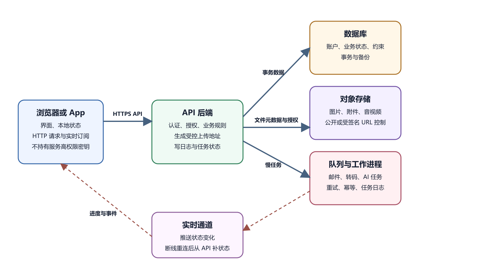

# 后端为什么存在以及 API 怎样工作

静态网站把准备好的文件交给浏览器。用户只是阅读时，这已经够用。用户要注册、预约、付款、上传文件、查询自己的订单，系统就要根据每次请求判断身份、修改数据、记录结果。负责这部分工作的程序通常叫后端。它运行在用户不能直接改动的环境中，接收请求，验证输入，执行业务规则，访问数据库或外部服务，再把结果返回给客户端。

API 是客户端和后端之间的约定。浏览器、App、小程序和命令行工具都可以按这份约定发请求。它们不需要知道后端用了什么语言，也不该知道数据库密码和支付私钥。



*API、数据库与实时连接的数据路径*

图中浏览器或 App 通过 HTTPS 访问 API。API 检查身份与权限，读写数据库和对象存储。需要即时更新时，客户端还可建立实时连接。调用外部服务所需的服务端秘密由受控后端保存，并且只按该服务的认证协议使用，不发送给无关服务。

## 后端解决四类问题

第一类是共享数据。一个预约名额不能只存在访客手机里。所有用户需要看到同一份状态，后端和数据库负责保存权威结果。

第二类是可信规则。浏览器里的 JavaScript 由用户设备执行，用户可以修改请求。名额是否可约、金额如何计算、谁能退款，都要在后端重新判断。前端可以先把按钮变灰，后端仍要在收到请求后检查。

第三类是秘密。数据库密码、邮件密钥、支付私钥和小程序 AppSecret 不能交给每个客户端。客户端可保存公开标识，例如站点名称、公开 API 地址或小程序 AppID。能代表服务端权限的值只放在受控后端或平台秘密系统。

第四类是长期工作。发送邮件、处理文件、记录审计、调用 AI 服务和执行后台任务，往往需要在用户关闭页面后继续。后端可以把慢任务写进队列，让工作进程处理，再让客户端查询任务状态。

## API 约定一次请求

一次 API 请求至少有六个部分。方法说明意图，路径说明目标，身份材料说明请求者是谁，Headers 补充格式和上下文，Body 承载输入，响应说明结果。下面是一个预约接口草案。

```text
POST /api/bookings
Authorization: Bearer [测试令牌]
Content-Type: application/json
```

```json
{
  "slot_id": "slot_2026_08_20_1500",
  "guest_count": 2
}
```

成功时可以返回预约 ID、状态和创建时间。失败时也要稳定。名额已满用 409，未登录用 401，无权操作用 403，输入缺字段用 400。不要把所有失败都写成“服务器错误”，也不要把数据库堆栈原样返回给用户。

API 文档不必一开始就做得很华丽，但要写清地址、方法、输入字段、身份要求、成功响应、错误响应和限制。前端和后端一旦靠猜，后面就会在“我以为字段叫 userId”这种地方耗时间。

## 后端不相信前端已经检查过

前端检查仍然有价值。它能让用户更快发现空字段、格式错误和超大文件。可它只改善体验，不承担最终安全。攻击者可以跳过页面，直接向 API 发请求。移动 App、小程序和自动化脚本也可能走同一后端。

预约页面显示下午三点还有一个名额。两个人同时点击提交，两个前端都以为可约。后端需要用数据库约束、带条件的原子更新或适当加锁保护名额，再在事务中创建预约记录。仅把“先查询、再写入”放进事务，不一定阻止两个请求都读到剩余名额。正确的并发控制应让一个请求成功，另一个收到已满响应，并通过并发测试确认。只靠前端按钮变灰，解决不了并发。

价格、折扣、用户 ID、角色和库存同理。请求里带了 `role: admin`，后端不能相信。请求里带了 `price: 1`，后端也不能照收。后端应从已验证身份、数据库状态和服务端配置中重新计算。

## 后端内部常见分层

小项目可以把代码写在一个文件里，责任仍可分清。入口层解析 HTTP，身份层识别用户，业务层判断规则，数据层访问数据库、对象存储和外部服务。分层的价值在排错。出错时，维护者知道该看哪一段。

登录失败先看身份层。重复预约先看业务规则和数据库约束。图片上传慢先看对象存储和文件处理。AI 总结超时先看外部服务调用、任务队列和超时设置。

管理 API 要更严格。后台列表、导出、封禁、退款和配置修改通常影响面更大。它们需要独立权限、审计日志、二次确认或更窄的网络入口。隐藏管理按钮不能算权限。后端必须检查操作者身份、目标资源和当前状态。

## 分页、超时和重试

列表接口不要一次返回所有数据。任务、订单和日志都要分页，并给出稳定排序。筛选条件要有限制，不能让用户构造任意昂贵查询。返回数量、下一页标识和排序字段都应写入约定。

超时和重试也要设计。客户端等不到响应时，并不知道后端是否已经完成。创建订单、付款、发邮件和调用 AI 都可能出现“前端失败、后端已经执行”的情况。可用幂等键、任务 ID 或状态查询减少重复写入。不要让客户端无限重试。

外部服务不稳定时，API 需要给用户清楚状态。可以返回“任务已创建，稍后查看”，也可以返回“服务暂不可用”。把等待压在一次 HTTP 请求里，常会遇到平台代理超时。慢任务进入队列，更容易记录、重试和恢复。

## API 测试要覆盖失败路径

只测成功路径不够。至少准备匿名用户、普通用户、资源所有者、无权用户和管理员。每个关键接口都测登录缺失、权限不足、输入错误、重复请求、资源不存在和外部服务失败。多端项目还要用网页、App 或小程序各测一条真实路径。

浏览器 Network 可以证明前端实际发出了什么请求。后端日志可以证明服务收到什么、判定什么、返回什么。两边用 Request ID 或操作 ID 连起来，排错会快很多。

## API 版本和维护模式

客户端不会同时更新。网页通常能较快发布，App 和小程序可能受商店审核、平台缓存和用户不升级影响。后端改字段、改错误码或删除路径前，要知道还有哪些客户端在用旧约定。日志中记录客户端类型和版本，有助于判断影响范围。权限不能由客户端自报版本决定，因为这些值可以伪造。

版本管理不一定从 `/v1` 开始，也可以通过兼容字段、响应扩展和发布窗口完成。关键是别让旧客户端突然读不到必需字段。新增字段通常安全，删除字段和改变含义风险更高。错误结构也要稳定。前端、小程序和 App 都要能根据错误码给用户明确提示。

API 进入维护模式时，仍要返回清楚状态。完全关闭服务前，先给调用方通知、替代地址和下线日期。生产中遇到严重故障，可以临时关闭高风险写入，只保留读取或状态页。维护模式本身也要测试，不能到事故时才临时写一段判断。

OpenAPI 这类接口描述文件能帮助生成文档、客户端代码和测试样例。它记录的是约定，不自动证明后端实现正确。生成代码后仍要用真实请求验证身份、权限、分页、错误和兼容。文档与实现不一致时，先用请求和日志确认实际行为，再对照已批准的接口约定判断该修代码还是文档。生产环境中正在发生的行为也可能是缺陷，不能直接改文档把它变成正确行为。

## 错误码和日志

接口失败时，后端要让调用方知道下一步该怎么做。参数错误、未登录、权限不足、资源不存在、请求太频繁和服务临时不可用，应有不同的状态码和错误码。错误信息给用户看时要短，给维护者看时要能定位。

日志不能只写一句失败。至少记录请求 ID、用户 ID、接口名、耗时、状态码和关键业务编号。不要把密码、完整 Token、身份证号、银行卡号和密钥写进日志。日志能帮人排错，也可能变成新的泄露源。

请求 ID 很有用。前端报错时带上请求 ID，后端可以沿着日志找到同一次请求。若后端调用邮件、支付、对象存储或 AI 服务，也把这个 ID 带到外部请求记录里。一个用户说“刚才点了提交”，维护者就能把这句话接到具体日志上。

错误处理还要保护系统。数据库短暂不可用时，接口可以快速失败并提示稍后重试。不要让所有请求卡住连接池。外部服务超时时，先记录任务状态，再让后台重试。用户看到的是清楚状态，系统内部保留处理入口。

## 幂等和业务编号

很多接口会被重复调用。用户连点提交，浏览器自动重试，小程序网络抖动，后台任务超时后重新执行，都会产生第二次请求。后端不能假设每个按钮只被按一次。

幂等的一种做法是给一次业务动作一个稳定编号，重试时继续使用同一个编号。创建订单、提交报名、发放权益和扣减库存，都可以按接口协议分配业务编号。后端需要原子地登记编号或用唯一约束防止重复占用，不能只靠先查再执行，因为并发请求可能同时查到“未处理”。编号还应绑定用户或租户、操作类型和请求内容，拒绝同一编号对应不同操作。已经成功就返回原结果，正在处理中就返回处理中，失败再按规则重试；外部扣款等副作用还要衔接供应商的幂等机制。

幂等不等于忽略重复请求。重复支付、重复发邮件和重复扣库存会影响真实用户。接口文档要说明哪些请求可以安全重试，哪些请求必须带业务编号。AI 写调用代码时，也要让它知道重试策略和幂等字段。
