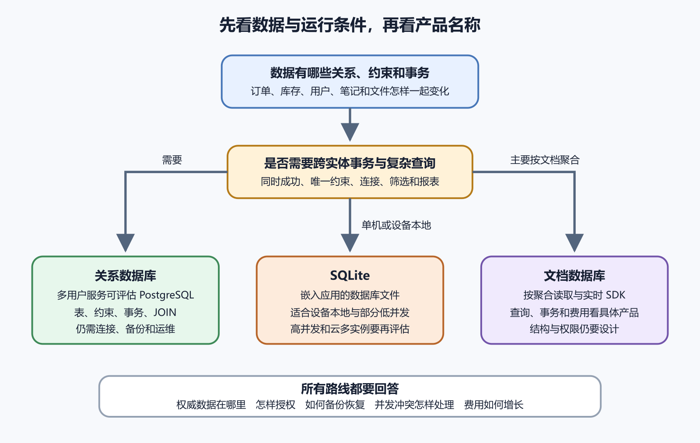

# SQL、NoSQL、PostgreSQL 与 SQLite

数据库让应用长期保存、查找和修改结构化数据。选择数据库时，产品名称排在问题之后。先看数据关系、查询方式、并发写入、离线需求、备份恢复和团队维护能力。SQL 是关系数据库常用语言。NoSQL 是一组非关系模型的统称，文档、键值、图和宽列都可能在里面。



*关系数据库、文档数据库与 SQLite 的选择路径*

图中先判断数据关系与事务，再看运行位置和写入形态。PostgreSQL 适合需要网络连接、多应用实例或并发写事务的应用。SQLite 适合数据库与应用位于同一台设备或同一台主机、写事务短小的系统。文档数据库适合以文档聚合读取并接受其查询与一致性模型的项目。

## 关系数据库把规则写进结构

关系数据库把数据组织成表、行和列。用户表的一行代表一个用户，订单表保存订单，订单项表保存商品明细。它们通过 ID 建立关系。表结构规定字段类型、是否必填和约束。数据库可拒绝缺少必要值、重复唯一值和不存在的关联。

主键唯一识别一行。显示名称会改，邮箱也可能更换，专用 ID 更稳定。外键确认引用对象存在。订单项引用订单，数据库可以阻止孤立记录。唯一约束保证某个范围不重复，例如账号邮箱唯一，或同一用户对同一活动只能预约一次。

约束位于所有写入路径之后。即使两个请求同时通过后端检查，数据库仍可阻止重复。友好错误由应用返回，最终完整性由数据库兜底。

## SQL 先学能看懂的部分

初学者先掌握建表、插入、查询、连接、聚合、更新和删除。不需要一开始就学复杂优化。下面示例只说明形状，不要求读者在生产数据库直接执行。

```sql
select orders.id, users.email
from orders
join users on users.id = orders.user_id
where orders.status = 'paid'
order by orders.created_at desc
limit 20;
```

SQL 的价值在于能表达关系。用户、订单和支付记录分表保存，查询时再连接。这样能减少重复，也让约束更清楚。重复不是永远错误。为了报表、搜索或缓存，系统可以保存冗余字段，但要知道权威来源在哪里，以及冗余何时更新。

事务保护一组变化。创建订单、扣库存和写付款状态应共同成功或共同失败。中途失败后回滚，避免只完成一半。事务不能无限拉长。长事务会占用连接和锁，拖慢其他请求。

## PostgreSQL 和 SQLite 的位置不同

PostgreSQL 是客户端服务器数据库。应用通过网络连接它。多个后端实例、后台任务和管理工具可以同时访问同一数据库。它适合动态 Web 应用、团队协作和需要较强事务能力的项目。托管 PostgreSQL 还能提供备份、监控、连接池和权限管理，但仍要自己设计表结构、索引和恢复演练。

PostgreSQL 连接不是无限资源。每个后端实例、后台任务和管理工具都可能占用连接。连接数爆掉时，应用会报错或变慢。生产常用连接池，短请求用完归还。不要让每次请求都新建长期连接。

SQLite 是嵌入式数据库，数据通常保存在一个文件里。它适合本地 App、小工具、测试、边缘环境和一些小型站点。它不是玩具，但写入并发、网络共享、备份方式和文件权限要认真设计。把 SQLite 文件放在临时磁盘上，重启或新部署后可能丢数据。把同一个文件挂给多个服务随意写，也会引发锁和损坏风险。

## NoSQL 从访问模式出发

文档数据库常把一组相关数据放在一个文档里。读取一篇文章和它的显示信息很方便，但跨文档事务、复杂连接、全局约束和报表可能更麻烦。键值数据库适合通过键快速取值。图数据库适合关系路径查询。不同产品差异很大，不能把 NoSQL 当成一个统一答案。

选择 NoSQL 前先写访问模式。用户打开首页要取什么，后台筛选要查什么，权限按什么判断，数据怎样分页，如何备份和迁移。若需求里有大量关系、唯一约束和事务，关系数据库通常更直接。

一个评论树可以存在文档数据库里，也可以存在关系数据库里。文档方案读取整棵树方便，但单条评论权限、分页和编辑历史要另设规则。关系方案查询更灵活，但递归和排序要设计。选型来自读写路径，不来自名字时髦。

## 数据类型、时间和 NULL

数据类型会影响长期维护。金额不要随便用浮点数。时间要明确时区和存储口径。用户生日、订单创建时间和活动开始时间不是同一种时间。移动 App、小程序和网页来自不同地区时，更要统一服务端时间。

NULL 表示未知、缺失或不适用，具体含义要写清。空字符串、零和 false 不是 NULL。统计时要知道 NULL 是否参与计算。把未知当零，报表会骗人。

命名也要稳定。表名、列名和索引名不要今天中文、明天拼音、后天缩写。审计字段常见 `created_at`、`updated_at`、`created_by`。删除和合规场景还可能需要 `deleted_at`、数据来源和同意记录。

## 一个库存模型

库存看起来只是一个数字，实际包含并发、审计和恢复。商品表保存基础信息，库存表保存当前可售数量，订单表保存用户下单结果，库存流水记录每次增加和扣减。下单时在事务里检查库存并扣减。两个用户同时买最后一件商品，数据库约束和事务要保证只有一个成功。

只在应用内先查询库存，再单独更新，很容易出现超卖。缓存中的库存也不能当最终依据。缓存可以让页面显示更快，真正扣减仍回到数据库事务。订单取消、支付失败和人工调整都要写流水。以后排查“为什么少了一件”，不能只看当前数字。

报表和搜索可以使用派生数据。比如商品搜索索引保存标题、标签和销量摘要。它让查询更快，但权威仍在数据库。索引更新失败时，搜索结果可能旧，订单数据仍正确。系统要有重建索引的方法，不能把搜索服务当唯一数据来源。

## 一个错误的 NoSQL 迁移

团队把关系数据库中的订单迁到文档数据库，理由是“以后更灵活”。第一版把用户资料、订单、订单项和支付记录塞进一个大文档。读取订单详情确实快了，后台按商品统计销量却变得困难。退款流程要更新多个嵌套字段，失败后状态不一致。客服按手机号查订单也需要额外索引。

问题不在文档数据库本身，出在访问模式没有写清。若订单详情是主要读取路径，文档聚合有价值。若报表、退款、客服搜索和权限审计同样重要，就要为这些路径设计索引、冗余和修复任务。迁移前先列出十个真实查询，再决定数据形状。

数据库选择一旦进入生产，很难无痛更换。先用小样本和测试流量验证读写路径，比上线后再靠“灵活”补救更可靠。

## 约束比口头约定可靠

表结构里能写的规则，尽量写进数据库。邮箱唯一、订单号唯一、金额不能为负、外键必须存在、状态只能落在允许集合里，这些都不应只靠应用代码自觉。应用会有新版本、后台脚本和临时修复，数据库约束能守住最后一道边界。

唯一约束尤其重要。注册、报名、支付回调和库存扣减都可能被重复请求触发。业务编号加唯一约束，可以让后端在并发下得到稳定结果。发现重复时返回原记录，比创建两份再人工合并可靠得多。

外键也要慎用但不要怕用。它能防止订单指向不存在的用户，评论指向不存在的文章。若系统需要高吞吐或跨库拆分，可以在应用层做一部分检查，但要补审计任务。每晚扫出孤儿记录，比完全不知道数据断在哪里要好。

约束出错时，错误提示要转成人能懂的话。数据库可以返回唯一冲突，接口要告诉用户邮箱已被使用或订单已经提交。不要把原始数据库错误直接给前端。它既难懂，也可能泄露表名和字段名。

## 事务和并发写入

事务让几次写入一起成功或一起失败。下单时创建订单、扣库存、写流水，三件事应在同一组事务里完成。中间任何一步失败，都回到事务开始前的状态。没有事务，系统会留下半张订单或少掉库存。

并发是后端项目早晚会碰到的事。两个人同时改同一条记录，后台任务和用户操作同时执行，支付回调和人工取消同时发生，都会让“先读再写”的代码出问题。数据库锁、事务隔离级别和条件更新，解决的就是这类场景。

乐观锁是一种常见办法。记录里保存版本号，更新时带上旧版本号。若版本已经变化，说明有人先改过，当前操作需要重新读取后再决定。协作编辑、库存调整和后台审核都可以用这种方式减少覆盖。

AI 生成的 SQL 常能跑通样例，却未必处理并发。让它写数据库代码时，要明确告诉它哪些动作需要事务，哪些字段有唯一约束，哪些更新必须检查影响行数。随后用两个请求同时打接口，看看结果是否仍然正确。

## 本章验收清单

能画出核心数据表或文档，说明主键、外键、唯一约束和权威来源。能解释 PostgreSQL 为什么适合多实例 Web 应用，SQLite 为什么适合嵌入和单机小系统。知道 NoSQL 要从访问模式和一致性模型判断。知道连接数、事务、时间、NULL 和备份都会影响上线。

AI 可以根据业务动作草拟表结构、约束和查询，也可以指出可能缺少索引或事务。不要把生产连接串、用户数据和备份文件交给它。真正落库前，用测试数据验证并发写入、权限、备份和恢复。下一章继续讲数据库迁移、连接、备份和恢复。
