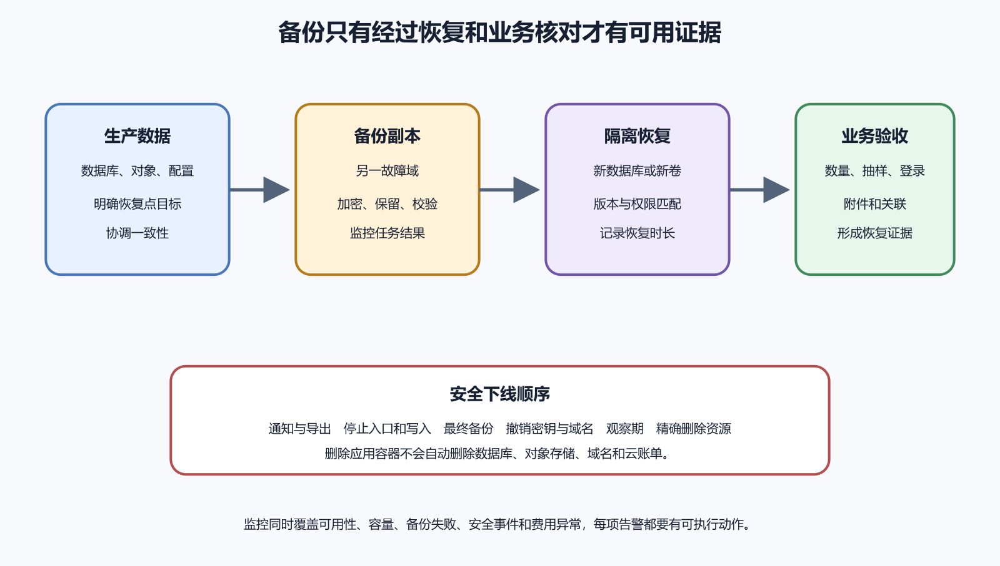

# 数据库迁移、连接、备份和恢复

数据库保存真实用户数据以后，改结构就不能像改空表。新代码、旧代码、现有数据、备份和恢复步骤必须协调。迁移记录改变结构，备份保留某个时间点，恢复演练证明事故时真的能回来。本章不提供可直接粘贴到生产的删除和恢复命令。所有示例只在本地练习库或一次性恢复环境使用。

*备份、恢复测试、监控和安全下线组成的数据保护循环*

## Schema 和迁移

Schema 在这里指表、列、类型、约束、索引、视图和权限等结构。代码从 `users.display_name` 读取，数据库删掉该列，运行时就会失败。数据库新增必填列，旧代码写入时也可能失败。结构和代码属于同一个发布关系。

迁移文件按顺序描述结构变化，让本地、测试、预览和生产执行相同步骤。它通常保存结构变化和必要数据转换，不保存全部业务数据。备份保存某个时间的数据与结构，用于恢复。只有迁移，没有备份，误删用户数据无法找回。只有备份，没有迁移记录，新版本部署难以审查。

控制台手工改表很快，也最容易丢记录。紧急修复可以先救服务，随后要补迁移和复盘。否则下一套环境会和生产不一致。

## 安全改表分阶段

增加列通常比删除列安全。假设资料表要增加 `timezone`。先增加允许为空的列，部署能读写新列且能处理空值的代码。随后分批回填旧数据，再增加默认值和约束。确认所有活跃代码已兼容后，才移除过渡逻辑。

把 `name` 改成 `display_name`，直接重命名会让旧代码失效。更稳的做法是先增加新列，代码双写或使用兼容视图，回填后逐步切读。确认旧版本、后台任务、移动 App 和小程序都不再读取旧列后，再删除旧列。

删除是高风险操作。删除列、清表、改主键和合并数据都可能影响备份、报表和旧客户端。执行前要有目标环境、影响范围、备份位置、回退办法和负责人确认。命令短，不代表风险小。

## 连接串和权限

数据库连接通常包含主机、端口、库名、用户名、密码、TLS 要求和连接池设置。它是秘密。不要写进 GitHub、截图、Issue 或 AI 对话。不同环境应使用不同连接串。预览环境不应默认连接生产数据库。

应用账号权限要窄。读写业务表的账号不应拥有删除数据库、管理用户和读取所有系统表的权限。迁移账号可以有更高权限，但只在迁移流程中使用。只读报表账号和备份账号也要分开。

超时和连接池要和平台匹配。连接太少会排队，太多会压垮数据库。Serverless 或多实例后端尤其容易瞬间创建很多连接。先看托管平台建议，再用日志和指标调整。

连接字符串轮换要分步骤。先创建新凭据，部署应用读取新值，确认新连接成功，再撤销旧值。若平台不允许新旧并存，就要准备短暂停机窗口和回滚方案。轮换记录只写变量名和版本，不写明文。

## 备份必须能恢复

备份存在，不等于能恢复。恢复演练才是验收。至少定期把备份恢复到隔离环境，确认能启动应用、读取关键数据、执行一条低风险查询，并记录耗时。恢复环境不能连接生产外部服务，避免误发邮件、推送和 Webhook。

RPO 表示最多能接受丢失多久的数据。RTO 表示希望多久恢复服务。个人作品页可以容忍较长时间，支付、订单和企业协作系统通常不能。目标越高，费用和流程越复杂。不要只买一个备份功能就以为满足业务要求。

托管数据库备份要问清几件事。备份频率、保留时间、能否按时间点恢复、恢复到原库还是新库、是否跨区域、是否加密、谁能操作、恢复是否收费。Point-in-Time Recovery 很有用，也要实际演练。

备份密钥和账号同样重要。加密备份拿不到密钥，也无法恢复。备份和生产最好不要完全依赖同一个账号。账号被删、账单失败或权限丢失时，备份入口也可能消失。

## 迁移失败怎样处理

迁移失败先固定现场。记录迁移版本、执行环境、开始时间、已完成步骤、错误和当前数据库状态。不要连续运行多条“修一下”的命令，把现场搅乱。

有些迁移可以重试，例如创建缺失索引前先检查是否已存在。有些迁移需要人工补偿，例如数据转换完成一半。所谓 down migration 也不总安全。列已删除、数据已合并、外部事件已发送后，逆向脚本可能恢复不了真实状态。

发布时把代码和迁移顺序写清。先执行兼容迁移，再部署兼容代码，最后清理旧结构。涉及移动 App、小程序和外部客户 API 时，兼容窗口要更长。用户设备不会因为服务器迁移而同步更新。

## 一个误删演练

练习环境中，先创建少量测试数据。导出备份，记录备份位置和时间。随后误删一条测试记录，停止应用写入，恢复备份到新库。把应用临时指向新库或用查询比对，确认记录回来。整个过程记录耗时、命令来源、权限和未覆盖项目。

生产事故时，不能简单用旧备份覆盖当前库。故障期间可能已有真实订单、付款和用户修改。恢复要考虑时间点、增量补偿、审计和用户通知。重大数据事故需要负责人决策。

## 时间点恢复和恢复权限

Point-in-Time Recovery 可以把数据库恢复到某个时间附近。它依赖连续日志和保留窗口。窗口之外的数据无法通过这项能力找回。恢复到新库还是覆盖原库，差别很大。初学项目优先恢复到新库，比对无误后再决定切换。

执行恢复的人需要权限，但权限过大也危险。日常开发者不应都能覆盖生产库。可以把恢复权限交给少数负责人，并要求两人确认。恢复材料要包含库名、时间点、备份来源、恢复目标和验证步骤。时间点写明时区。北京时间下午三点和 UTC 下午三点不是同一刻。

备份加密也要演练。密钥在另一个系统里，账号丢失时可能拿不到。密钥轮换后，旧备份是否还能解密要确认。只保存备份文件，不保存恢复所需版本、扩展和密钥信息，事故时仍然打不开。

## 误更新整张表

有人本想只修改一个用户的套餐，写 SQL 时漏了 `where`，整张表都变成同一套餐。发现后第一步不是立刻再写一条反向 SQL。先停止相关写入，记录当前时间和错误语句，导出受影响表的现状，再决定从备份恢复、从审计日志重放，还是按业务规则补偿。

如果有审计字段和历史表，可以找出哪些行在错误时间前后变化。如果没有，只能依赖备份与外部记录。恢复后还要检查缓存、搜索索引、报表和第三方同步。数据库改回来了，外部系统可能已经收到错误事件。

这类事故提醒我们，生产数据库需要只读默认入口、变更审批和低风险演练。能用应用后台完成的操作，不一定要直接进数据库。必须直接执行 SQL 时，先在事务中查看影响行数，确认后再提交。

## 向后兼容发布

数据库迁移经常和应用发布互相牵连。安全做法是让新旧应用都能在一段时间内工作。新增列先允许为空，旧应用继续写旧字段。新应用上线后同时写新旧字段。确认新字段有数据后，再让读取路径切到新字段。最后才清理旧字段。

改字段名也要分阶段。先新增新字段，后台回填历史数据，再让应用同时写两个字段。读路径切换后观察一段时间，确认没有旧版本客户端继续写旧字段，再删除旧字段。移动 App 和小程序尤其要留窗口，因为用户不会同时升级。

删除字段最危险。先在日志里确认无人读取，再让应用停止写入，随后把字段标为废弃。真正删除前做备份和回滚计划。若字段被报表、客服脚本、AI 任务或第三方同步使用，仓库搜索未必能发现全部依赖。

迁移脚本也要可重复执行。脚本跑到一半失败时，重新执行不应制造更多错误。给每一步记录状态，或让 SQL 本身检查对象是否存在。人工临时改库后，要把变化补回迁移文件。生产库不应变成只有某个人记得的样子。

## 数据订正记录

数据恢复之外，还有数据订正。用户资料合并、订单金额修正、权限补录、重复报名清理，都可能改变生产数据。订正不是普通编辑。它应有原因、申请人、执行人、时间、影响范围和回退办法。

订正前先导出受影响数据。哪怕只改十行，也要能说清改前是什么。订正后检查应用页面、报表、搜索索引和外部同步。很多系统事故发生在数据库已经改对，但缓存、队列或第三方系统仍保留旧状态。

后台管理页面可以降低直接操作数据库的次数。它提供校验、权限、审计和确认步骤。若某个订正动作经常发生，就把它做成后台功能。反复让人进生产库执行手写 SQL，迟早会出错。

订正记录也能帮助 AI。你可以把脱敏后的订正模板交给 AI，让它检查步骤是否遗漏。不要把真实用户数据和生产连接串交出去。AI 给出的 SQL 只能作为草稿，执行前要由负责人审查并在测试库跑过。

## 本章验收清单

能区分迁移和备份。能为新增列、改名和删除写出分阶段方案。连接串、迁移账号、应用账号和只读账号分开。备份有恢复演练记录，包含耗时和结果。RPO、RTO、PITR、加密密钥和跨账号风险有人负责。

AI 可以帮你审查迁移计划、列出备份问题、生成恢复演练清单。不要把生产连接串、备份文件、真实用户数据和密钥交给它。真正执行迁移和恢复前，由负责人确认目标环境、备份和停止条件。下一章讲文件上传、对象存储、邮件、推送和 AI API。
