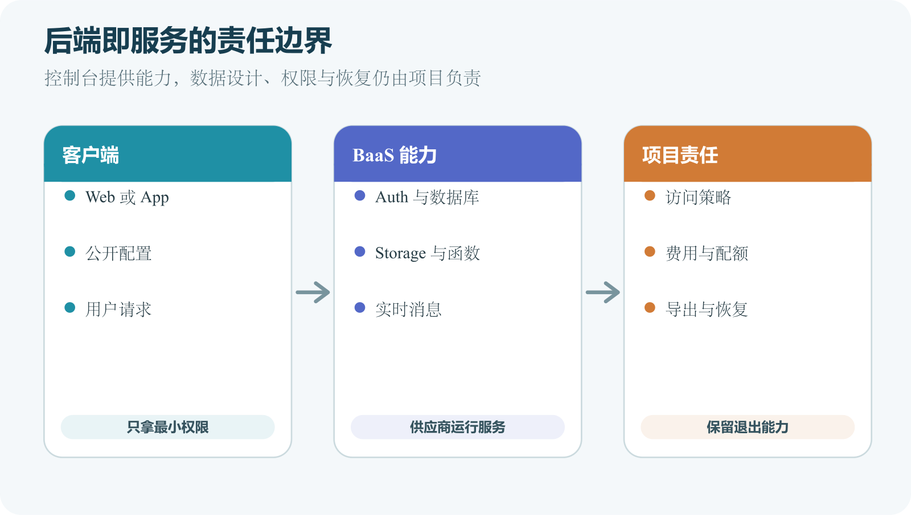

# Supabase、Firebase 与后端即服务

后端即服务常缩写为 BaaS。供应商把数据库、身份认证、文件存储、实时通信和函数等能力组合起来，通过控制台、SDK 和 API 提供。个人项目可以更快得到可用后端，仍要设计数据、权限、费用和恢复。

Supabase 与 Firebase 都属于这一类常见选择。Supabase 以 PostgreSQL 为核心，Firebase 包含 Firestore、Realtime Database、Authentication、Cloud Storage、Cloud Functions 和 Messaging 等产品。它们的能力名称相似，数据模型和安全边界并不相同。

*客户端、后端即服务能力和项目责任之间的边界*

## BaaS 替你完成什么

供应商运行数据库或存储基础设施，提供账号、网络入口、SDK、监控与部分备份。开发者不用先安装一台数据库服务器。身份服务处理登录流程和 Token，存储服务处理对象上传，实时服务推送数据变化，函数运行短后端代码。

控制台让初学者直观看表、用户和文件。生产维护仍需迁移文件、权限规则、备份验证和变更记录。BaaS 缩短起步时间，也把更多组件放到同一供应商。账号与配置错误影响会更集中。

Supabase 官方架构把 PostgreSQL、Auth、REST、Realtime、Storage、Functions 与网关连接起来。数据库是标准 PostgreSQL，表、SQL、约束、事务和扩展都位于核心。PostgREST 根据数据库 Schema 提供 REST API。

Auth 管理用户身份，并与数据库中的行级安全策略配合。Storage 保存对象，元数据与权限规则连接到数据库模型。Realtime 监听数据变化与广播，Edge Functions 处理自定义服务端逻辑。具体能力和限制按当前项目地区与计划确认。

## Firebase 的主要组件

Firebase Authentication 管理密码、联合身份和其他登录方式。Cloud Firestore 是文档数据库，数据按 Collection 与 Document 组织，提供客户端 SDK、实时监听和离线支持。

Cloud Storage for Firebase 保存用户文件，通过 Security Rules 与 Authentication 控制客户端访问。Cloud Messaging 处理跨平台消息。

Cloud Functions 或其他 Google Cloud 计算服务运行可信后端代码。不同产品有各自区域、费用和配额。

某些 BaaS 客户端配置包含项目 URL 与公开 API Key。这类 Key 用于识别项目，不授予管理员能力，真正权限由用户身份和安全规则决定。Supabase 的匿名客户端 Key 与服务角色 Key 权限不同。服务角色可以绕过部分安全规则，必须留在服务端。

Firebase Web 配置也可出现在客户端，访问仍受 Authentication、Security Rules、App Check 等控制。不能把 Google Cloud 服务账号私钥放进网页。

看到“Key”一词不要一律隐藏或公开。查官方文档确认角色、权限与可撤销方式，再用最小权限。

## 认证不等于数据权限

用户成功登录后，SDK 能得到用户 ID。数据库或存储还要检查此用户是否能访问目标记录。Supabase 常使用 PostgreSQL Row Level Security。策略可限定 `owner_id` 等于当前用户。

Firebase 使用 Security Rules 根据认证信息、路径、现有数据和新数据判断读写。控制台中默认开放规则只适合短期本地练习。生产前使用两个账号进行越权测试，并确认未登录请求失败。

假设 `notes` 表有 `owner_id`。读取策略允许已登录用户读取自己的行，插入策略要求新行 `owner_id` 与身份一致。仅有读取策略不代表写入安全。SELECT、INSERT、UPDATE 和 DELETE 分别设计。后端使用服务角色执行管理任务时，会绕过普通用户限制。管理端点必须再次认证和授权，不能把服务角色交给浏览器。

策略改变应进入迁移和审查。只在控制台临时修改，会让下一环境缺失。

## Firebase Security Rules 思路

Firestore Rule 可按文档路径和 `request.auth.uid` 判断访问；写入还要验证允许字段、类型和状态变化；只检查用户已登录会让所有用户读取全部数据；规则必须绑定资源所有者或组织成员。Cloud Storage Rules 也可验证身份、路径、文件大小和 `contentType`。Firebase 当前官方说明 Storage 默认限制访问，公开开发规则要在认证完成后收紧。

Security Rules 是服务端执行的访问控制，前端界面继续提供友好提示。两者测试重点不同。

Supabase 使用关系表、外键和 SQL JOIN。订单、库存与报表等关系明显的业务容易表达。Firestore 使用文档与子集合，常按页面读取方式设计文档。跨文档关系可能使用引用或重复数据。

迁移平台时，PostgreSQL 表可用标准工具导出，供应商附加的 Auth、Storage 和实时配置仍需单独迁移。Firestore 数据导出与查询模型属于 Google Cloud 产品，迁移到关系数据库需要重新设计结构。

## 实时监听的费用与生命周期

实时监听让页面自动更新，也会产生连接、读取和电量成本。监听范围过宽时，每次变化都可能触发大量客户端读取。页面隐藏、账号退出和组件卸载时取消不再需要的监听。重新连接后从权威数据恢复。

Supabase Realtime 与 Firestore Snapshot Listener 的计费和限制不同。正式设计按当前官方定价与文档估算。实时 UI 不等于强一致业务。库存扣减仍通过事务或服务端规则完成。

在本地使用 Supabase CLI 或 Firebase Emulator，可以测试数据库、认证和规则，减少直接操作生产。模拟器行为不一定覆盖所有云端限制、地区和计费。发布前仍使用专用测试项目验证。

本地种子数据使用虚构账号和文件，不复制真实用户库到个人电脑。记录本地工具版本、启动命令和数据重置方式。自动重置是破坏性操作，只对明确的本地测试项目执行。

## 迁移与版本控制

Supabase 数据库变更可以保存为迁移文件。官方指南展示本地创建迁移并推送到远程项目的路径。Firebase Security Rules、索引和函数配置也应存入仓库，通过受控部署更新。控制台临时更改要回写到版本配置。

生产环境避免让每位开发者随手点表结构。变更从分支、评审、测试到部署，保留记录。数据迁移与代码部署顺序按上一章的兼容策略设计。

客户端可以直接用 Supabase Storage 或 Firebase Storage SDK 上传，服务根据用户身份与规则判断。复杂业务可以先调用自有后端，取得短时授权，再上传。后端管理配额、文件状态与后处理。

无论哪种模式，客户端提交的扩展名和类型都不可信。安全扫描、随机 Key 和私有访问仍需要。公开下载 URL 可能长期有效，撤销和分享机制按产品文档设计。

## Serverless Function 的位置

函数适合秘密调用、Webhook、短任务和自定义权限。它不应变成无限时长后台 Worker。函数实例可能冷启动、并发扩展和临时重启。不要依赖内存保存唯一状态。数据库连接要使用平台推荐池或代理。每个函数新建大量 PostgreSQL 连接会耗尽上限。

日志不打印服务角色 Key 与用户 Token，错误响应不暴露堆栈。

用户登录后创建相册，数据库保存相册与照片记录，对象存储保存原图和缩略图。上传前规则验证路径属于当前用户和文件大小。新对象进入待扫描状态，后台函数生成缩略图。分享相册时数据库创建短期分享记录，后端或规则验证。不能把整个 Bucket 设为公开。

删除相册创建清理任务，逐步删除原图、缩略图和记录。失败可重试，并保留审计。Supabase 可用表、RLS、Storage 与 Function 实现，Firebase 可用 Firestore、Rules、Storage 与 Function 实现。数据模型和规则语法不同，业务状态相同。

## 一个费用失控例子

笔记页面对整个用户集合建立实时监听，每次进入页面又新增监听，没有取消。使用一段时间后读取量迅速增加。功能看起来正常，问题在客户端生命周期和查询范围。修复时限制到当前用户、分页，并在页面退出时取消。

设置预算告警和用量监控，按操作估算每位用户产生的读取、写入、存储和函数调用。免费额度只能作为当前计划条件，不能写进产品永久承诺。截至 2026 年 8 月 5 日，Firebase Cloud Storage Web 入门还说明新项目使用相关功能需要特定付费计划。封版与实际开通时都要复查。

标准 PostgreSQL 降低核心数据迁移难度，RLS、Auth 用户、实时协议和 Storage 配置仍有供应商特性。Firebase 客户端 SDK、Security Rules、Firestore 查询和函数生态也会形成依赖。

锁定本身不是错误。它换来开发速度和托管能力。决策时记录退出所需的数据导出、代码重写和停机。核心业务数据使用可导出结构，定期测试导出。不要等账号受限时才研究迁移。

## 如何选择

团队熟悉 SQL、数据关系明显、需要 PostgreSQL 工具时，Supabase 是候选。移动端需要成熟的实时、离线、推送和 Google 生态集成时，Firebase 是候选。还要比较目标地区、合规、预算、查询模型、备份、支持和团队经验。用一个小型真实功能做试验，不根据教程数量决定。

同一项目同时使用两者会增加身份、数据同步和费用复杂度。只有明确缺口时再组合。

匿名 Key 被当管理员密钥隐藏，团队却忽略 RLS 没启用。重点检查实际权限。规则只验证登录，用户能换 ID 读取他人数据。使用两账号直接测试。在控制台手工改结构，本地迁移落后。暂停继续改动，把当前结构纳入版本记录。

删除 BaaS 项目想重新开始，结果 Auth、数据库和文件一起丢失。删除前导出、解除域名和确认恢复。

## 项目、组织和环境

开发、预览和生产使用不同项目，避免测试规则和数据进入正式环境。项目名称与颜色清楚区分。组织成员按角色授权。前端开发不一定需要账单和删除项目权限。服务账号属于机器，不与个人账号共用。离职时撤销成员和个人 Token，不影响受控服务账号。

所有项目开启预算告警和审计日志。测试项目也防止泄露后产生费用。

数据库、函数和存储地区影响延迟、费用与数据驻留。部分产品创建后难以更改。让频繁通信的组件靠近。函数跨洲访问数据库，会让每个请求增加网络延迟。Firebase 不同产品可用地区未必完全一致，Supabase 项目也有区域。创建前查看当前官方列表。

选错地区的迁移要当正式数据迁移，不能只改一个下拉框。

## Supabase 的 Schema 暴露

自动 REST API 根据暴露 Schema 提供能力。不要把内部管理表和函数全部暴露给客户端角色。公开 Schema 中每张表启用和测试 RLS。没有策略时的默认行为按当前平台文档确认。数据库函数可能以调用者或定义者权限运行。高权限函数严格限制参数和执行角色。

服务角色只在后端使用，管理端点还要验证操作者权限。

为每张表列 SELECT、INSERT、UPDATE 和 DELETE。横向列未登录、所有者、他人用户和管理员。每格写允许或拒绝，并用真实客户端请求测试。只有控制台 SQL 编辑器成功不代表普通角色成功。

更新测试同时检查旧行可见性与新行内容，防止用户把 `owner_id` 改成别人。策略性能也要看索引。每次权限查询扫描大表会拖慢所有请求。

## Firebase Rule 的测试矩阵

Firestore 与 Storage 分别列路径、读取、创建、更新和删除。规则对现有数据与新数据的访问方式不同。使用 Emulator 运行允许和拒绝测试，保存规则文件与测试到仓库。生产部署后用专用账号做烟雾测试，不依赖模拟器一项证据。

规则变更可能立即影响旧 App。删除字段前确认旧客户端请求仍符合。

App Check 尝试确认请求来自合法应用实例，可降低脚本滥用。它不是用户身份，也不能代替 Security Rules。攻击者仍可能控制合法设备或滥用已登录账号。业务配额和服务端授权继续存在。

启用前观察模式和兼容设备，避免突然阻止真实用户。具体产品支持按当前 Firebase 文档。调试 Token 只用于开发，不放生产 App 和公开仓库。

## Auth 用户与业务资料

身份服务保存登录主体，业务数据库保存昵称、组织和偏好。两边通过稳定用户 ID 关联。注册成功后创建业务资料可能失败，要有补偿或首次访问修复。不要假设两个服务具有同一事务。删除账号时协调 Auth、数据库、Storage 和第三方订阅。只删身份会留下无主数据。

管理员禁用账号后，现有 Token 何时失效按平台机制处理，敏感端点可额外检查状态。

身份提供商处理验证，业务数据中的联系字段要从可信结果同步。用户不能直接把“已验证”设为真。邮箱变化可能影响登录、通知和组织邀请。旧地址是否保留审计要按隐私政策。手机号重新分配会产生风险，高价值账号不要只靠短信长期认证。

账户合并先验证两边控制权，避免攻击者把自己账号绑定到受害者资料。

## 数据导出不是完整迁移

导出 PostgreSQL 表不包含对象存储字节、Auth 供应商配置、函数秘密和域名。Firestore 导出也不等于导出 Firebase 全项目。创建组件清单，对每项选择导出方式和恢复验证。身份迁移尤其要考虑密码哈希兼容和联合登录。

下载文件时保存对象 Key、Content-Type、所有者与权限元数据。只得到一堆文件难以恢复关系。每季度抽样恢复到测试项目，确认导出工具和权限仍有效。

模拟器重置和数据库重建常用于测试，命令可能清空本地数据。运行前确认项目 ID 和端口。工具若能连接远程项目，使用明显的环境名称并限制凭据。自动脚本拒绝未知或生产目标。种子文件只含虚构数据。测试结束无需人工筛选真实信息。

CI 每次创建隔离环境，避免并行任务互相删除。

## 函数重试

数据库事件或消息触发函数可能至少执行一次。处理逻辑用事件 ID 去重。发送邮件、扣减配额和生成文件都设计幂等。函数超时后不能假设没有完成。失败进入重试或死信处理，设置最大次数和告警。无限重试会持续收费。

函数部署版本与事件时间一起记录，便于定位某版引发的问题。

付款失败、风控、误删和账号入侵都可能失去控制台。准备组织级多个恢复管理员和 MFA。核心数据有独立导出，域名由独立注册商账号管理，避免单点账号控制全部。支持工单需要项目 ID、账单和所有权证明，安全保存这些非秘密记录。

无法访问时不要创建同名影子项目并改 DNS，先固定状态和联系官方支持。

## 一个规则回归案例

团队为方便后台统计，把 Firestore 读取规则改成所有已登录用户可读。后台成功，私人笔记也被其他用户查询。测试只使用管理员账号，没有覆盖他人用户。修复后规则绑定 `ownerId`，后台改用受控服务端权限。

CI 增加四角色矩阵，任何规则变更必须通过允许和拒绝用例。事故调查使用审计和访问日志确认影响，不把“界面没有入口”当没有访问。

新表创建后忘记启用 RLS，客户端匿名 Key 可以读取所有行。前端只显示当前用户，所以开发者没发现。修复步骤先限制表暴露，启用 RLS 与所有者策略，再检查历史访问与泄露数据。数据库迁移模板加入启用 RLS 和策略测试。Schema 扫描定期报告未保护表。

匿名 Key 本身无需当泄露密钥轮换，真正问题是它被授予了过宽访问。仍按平台当前建议判断是否轮换。

## 备份与恢复分别看组件

Supabase PostgreSQL 备份不自动等于 Storage 对象和 Auth 外部提供商配置备份。Firebase Firestore 导出也不包含全部产品。为数据库、Auth、Storage、函数、规则、索引和秘密分别记录导出与重建方式。

恢复到测试项目时禁止真实邮件和推送，避免恢复数据触发事件。函数部署前先验证规则。项目级删除恢复能力按当前计划查询，不把控制台回收站当唯一备份。

Supabase 服务角色和 Firebase Admin SDK 运行在可信服务器，权限高于普通客户端。把它们封装在最小后端端点，验证调用者和参数。定时任务使用独立服务账号。日志不打印初始化配置中的私钥。密钥轮换后确认所有函数和服务已更新。

前端构建中搜索服务角色 Key 和服务账号 JSON，发现后立即撤销。

## 索引管理

Firestore 组合查询可能要求复合索引，错误会给出创建线索。索引配置进入版本控制。PostgreSQL 也从真实查询建立索引，RLS 条件字段经常需要支持。索引占存储并影响写入，删除前查看使用和查询依赖。

不同环境从同一配置构建，避免生产控制台独有索引。

实现同一私人任务清单。功能包括邮箱登录、本人任务 CRUD、图片附件和实时更新。Supabase 版本记录表、外键、RLS、Storage 策略和迁移。Firebase 版本记录文档结构、Rules、Storage Rules 和索引。

用两个账号做相同越权、断网和费用操作计数。记录开发时间、查询难度、导出与恢复。试验完成后选择更符合数据与团队的一项，安全删除另一测试项目和密钥。结果不泛化到所有应用。

## BaaS 发布检查单

确认生产项目、区域、计划和预算。客户端配置只含允许公开值。数据库与 Storage 规则经过四角色测试，函数使用最小服务账号。模拟器与生产烟雾测试均通过。迁移、规则、索引和函数在仓库版本化。导出和恢复按组件演练。

账号管理员开启 MFA，删除项目权限最少，状态页和支持入口已记录。

读者能画出所选 BaaS 的数据库、Auth、Storage、Realtime 与 Function，说明各自数据和权限。匿名客户端配置与管理员秘密分开。规则拒绝未登录和他人用户，控制台便利没有取代版本与测试。

费用、地区、备份和退出有查询日期与负责人，平台删除不会是第一次研究数据导出。

## 托管平台的默认能力也要验证

AI 可以把业务规则翻译成 RLS 或 Security Rules 草案，比较数据模型，生成模拟器测试与费用估算表。规则必须由人审查并用未登录、普通用户、他人用户和管理员测试。AI 不能批准公开数据或删除项目。

亲自核对项目地区、计划、预算告警、备份与数据导出。客户端只包含可公开配置，服务角色与服务账号私钥留在受控后端。使用两个账号测试数据库和存储规则，查看控制台外的直接 API 结果。记录平台退出方案。

下一章会比较托管、自建和平台依赖，把开发速度与长期责任放在同一张决策表中。
