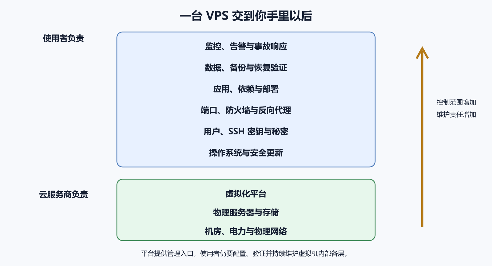

# VPS、云服务器及购买时需要看的参数

打开云服务商的购买页，读者往往先看到一排数字。两个虚拟 CPU、四吉字节内存、八十吉字节磁盘、每月若干流量。它们看起来像电脑配置，却还不能直接回答一个更重要的问题。这个规格能不能稳定运行你的项目。

VPS 是 Virtual Private Server 的缩写。它是从一台或一组物理服务器中划分出的虚拟计算机。你通常能获得一个操作系统、可登录账号、一定数量的处理器时间、内存、磁盘和网络资源。云服务器是更宽泛的商业名称，本书把可自行管理操作系统的云主机都放在这一类讨论。

买下 VPS 以后，你得到的是一间空房，水电已接好。应用、数据库、门锁、消防检查和日常清洁仍要由你安排。云服务商负责物理机器、机房和虚拟化平台，你负责虚拟机中的操作系统、账号、软件、数据和大部分网络规则。

*图 36-1　云平台与使用者的责任分界。等价说明见本章“谁负责哪一层”。*

## 先确认是否真的需要服务器

静态网页只包含 HTML、CSS、JavaScript 和图片时，GitHub Pages、Cloudflare Pages 等静态托管通常更省事。平台替你处理操作系统、Web 服务和证书。当项目必须长期运行后端进程、使用特定系统软件、保持长连接、执行定时任务，或者需要自行控制反向代理时，VPS 才开始有明显价值。

先写出项目离线时仍要运行的东西。清单为空，优先考虑托管平台。清单包含 API 进程、任务队列、定时任务、特殊二进制程序或私有网络，再继续比较 VPS。

用户通常负责这些内容。

- 选择和更新操作系统
- 管理登录账号与 SSH 密钥
- 安装并更新应用和依赖
- 配置防火墙、端口和反向代理
- 管理域名、证书和应用秘密
- 监控进程、磁盘、内存和费用
- 安排备份、恢复和安全下线

如果这些项没人负责，购买按钮先停一下。

## CPU、内存和架构

vCPU 数字只能说明分配了多少虚拟处理器线程或份额，不能完整说明性能。不同服务商、不同机型和不同代际处理器差别很大。共享型实例可能和其他用户争用资源，突发型实例可能有积分或持续性能限制。CPU 密集任务，例如视频转码、图片批处理和本地模型推理，要看持续性能和实际测试。

内存不足时，应用可能被系统杀掉，数据库可能变慢，构建可能失败。小型 Node.js API、反向代理和少量后台任务可以从较小规格开始。数据库、搜索、队列和构建工具放在同一台机器上时，内存需求会叠加。先用最小可行规格，再用监控调整，不要凭感觉一步买很大。

架构也会影响软件能否运行。常见云主机可能是 x86_64，也可能是 ARM。ARM 通常性价比不错，但某些闭源程序、旧依赖、Docker 镜像和原生扩展未必支持。购买前确认项目运行时、数据库、浏览器自动化、图片库和部署镜像是否支持目标架构。

## 磁盘看持久性和恢复

磁盘不只看容量。还要看是本地盘、云盘还是临时盘；是否会随实例删除；是否支持快照；性能是否满足数据库写入；扩容和缩容怎样做。临时磁盘适合缓存、构建中间文件和可重建数据。用户上传、数据库和唯一业务结果必须放在持久存储，并有独立备份。

数据库和上传目录不要随意放在系统盘根目录。系统日志、Docker 镜像和备份文件也会占空间。磁盘满常常比 CPU 高更危险。它可能让数据库无法写入，让日志丢失，甚至让系统无法正常启动。至少设置磁盘用量告警。

快照不是完整备份策略。要确认它恢复到哪台机器，是否能在隔离环境启动。还要看一致性、跨区域、加密和保留时间。运行中的数据库还要考虑写入一致性。正式项目需要能恢复到隔离环境，不能只看到控制台有快照按钮。

## 地区、网络和流量

地区不能只选地图上最近的点。用户在哪些网络访问，数据库和对象存储在哪里，是否涉及合规和备案，第三方 API 在哪个地区可用，都要一起看。面向中国大陆公众提供网站时，服务器位置、接入服务商、域名实名、备案和具体业务规则需要按当前官方渠道确认。

带宽和流量不是同一个数字。带宽描述瞬时速度上限，流量描述一段时间内传输了多少数据。图片、视频、下载、AI 文件处理和日志导出都会消耗流量。出站流量常常比入站更贵。CDN 可以减轻静态资源压力，但动态 API 和上传下载仍要测。

延迟也要按真实路径测。用户到 CDN、CDN 到源站、应用到数据库、应用到 AI API，都可能跨区域。首页慢不一定是服务器 CPU 问题，可能是图片太大、DNS 慢、TLS 握手多、数据库在另一地区，或第三方 API 拖住请求。

## 创建后先做验收

服务器创建成功，只说明云平台交付了一台机器。第一小时不要急着部署生产。先记录实例 ID、地区、镜像、规格、磁盘、登录方式和账单项目。设置普通管理账号和 SSH 密钥，关闭密码登录或按组织策略限制。更新系统软件，配置防火墙，只开放必要端口。

再做最小健康检查。能登录；系统时间正确；磁盘挂载符合预期；安全组和防火墙规则一致；重启后服务能恢复；监控能看到 CPU、内存、磁盘和网络；告警能发到负责人。域名和 HTTPS 可以稍后接入，但要知道证书由谁续期。

购买后第一小时的顺序可以很朴素。

1. 记录资源和账单入口。
2. 配置登录与最小权限。
3. 更新系统并重启验证。
4. 设置防火墙和必要端口。
5. 配置监控、告警和备份。
6. 部署测试服务并从公网访问。
7. 记录回滚和删除步骤。

每一步都有可见结果。没有记录，就很难交接。

## 规格调整靠证据

最低规格说明不等于推荐规格。服务商写的“一核一吉可运行网站”通常只说明能启动，不说明峰值、数据库、备份和后台任务都稳定。先用测试流量和监控观察，再调整。

性能测试要接近真实用户动作。只打开首页不能代表登录、上传、搜索和 AI 任务。测试时记录并发数、请求路径、数据量、地区、缓存状态和错误率。CPU 高、内存高、磁盘 I/O 高、连接数高对应不同修复。盲目升级规格可能掩盖索引缺失、图片过大和连接泄漏。

扩容也有边界。单台 VPS 从小升大很方便，但仍是单点。机器故障、账号锁定、磁盘误删和地区事故会一起影响服务。高可用需要负载均衡、多个实例、独立数据库、备份恢复和部署流程。第六卷会继续展开。

## 采购记录和费用

购买决策要留下记录。项目名称、服务商、地区、规格、镜像、磁盘、网络、价格、付款账户、负责人、用途、备份方式和到期或删除条件都写清。价格、免费权益和活动条款会变化，记录查询日期。

免费权益只适合当期判断。免费实例可能休眠、性能受限、流量有限、到期收费或不含备份。生产项目不要把免费层当作稳定承诺。账单告警要早于预算耗尽，负责人不只一个。

服务商托管镜像很方便，也要看维护来源。镜像里预装了 Web 面板、数据库或运行时，可能省事，也可能带来旧版本、默认账号、开放端口和不可复现配置。正式项目优先记录安装步骤和配置来源，不把“当时点了一个镜像”作为唯一文档。

## 一个报名系统的选型

一个活动报名系统需要网页、API、数据库、邮件和图片上传。若访问量小，托管前端加 BaaS 可能更稳。若需要固定后台任务和特殊导出程序，一台 VPS 可以运行 API 和 Worker，数据库仍可使用托管 PostgreSQL，对象存储使用供应商服务。这样服务器故障时，数据不和机器一起消失。

若团队决定把 API、数据库和文件都放同一台 VPS，就要接受一台机器故障会同时影响多项能力。至少做独立备份、磁盘告警、恢复演练和系统更新。报名高峰前做压力测试，检查数据库连接、邮件限流和上传大小。高峰结束后再评估是否需要继续保留规格。

## 安全组、面板和默认镜像

云控制台里的安全组和系统内部防火墙都可能影响端口。安全组允许 80 和 443，系统防火墙关闭端口，外部仍然访问不了。系统监听 3000，安全组也开放 3000，公网用户就可能直接绕过反向代理访问应用。上线前写清哪些端口对公网开放，哪些只给本机或内网使用。

Web 管理面板很方便，也会扩大攻击面。面板默认端口、默认账号、自动安装脚本和一键数据库都要审查。正式项目不要让面板管理口暴露给全网。若只是学习，可以用临时测试机，练完就删除。生产服务器尽量用可复现脚本和受控配置管理。

镜像来源也要记录。官方系统镜像、服务商应用镜像、社区镜像和自己制作的镜像，可信度不同。应用镜像可能预装旧版本和默认配置。创建后先更新系统，检查开放端口、用户列表和服务列表。以后迁移时，别人应能知道这台机器从哪个镜像来，后续改过什么。

## 备份和重建要同时准备

VPS 故障时有两条路。恢复备份，或在新机器重建服务。备份适合数据，重建适合系统和应用。应用代码、配置模板、依赖版本和部署步骤应在仓库或文档中。数据库、上传文件和用户生成内容进入备份。两条路都要演练。

只会在原机器上修，风险很高。机器无法启动、账号被锁或地区故障时，维护者需要能在新机器上恢复。记录域名切换、证书申请、环境变量、后台任务和系统服务。新机器启动后先用平台自带地址或临时域名验收，再切正式域名。

删除 VPS 前同样要走清单。确认数据已备份并可恢复，域名不再指向它，计划任务已迁移，日志已导出，账单不会继续产生磁盘或快照费用。删除机器可能不删除云盘、快照和公网 IP，费用入口要逐项检查。

## 运行时和系统版本

服务器不是买完就静止。Ubuntu、Debian、Node.js、Python、PostgreSQL、Nginx 和 OpenSSL 都有支持周期。选择镜像时先看长期支持版本，记录当前系统、运行时和数据库版本。上线后每月看一次安全更新，重大漏洞单独处理。

应用依赖也要跟系统配合。Node 版本升级可能影响构建，Python 版本变化可能影响包安装，数据库小版本升级可能改变查询计划。生产服务器上不要临时手改依赖。先在测试机或临时实例验证，再发布到正式机器。

系统更新前先确认备份和回滚办法。小版本安全更新可以按固定窗口执行，内核、数据库和运行时升级要安排更完整的测试。更新后检查服务状态、日志、端口、证书和定时任务。能把这几步写成脚本，后面的维护会轻很多。

## 本章验收清单

购买前能说明为什么需要服务器，以及托管平台为什么不够。能读懂 CPU、内存、架构、磁盘、地区、带宽、流量和快照的含义。知道临时盘和持久盘不能混淆。创建后先做登录、更新、防火墙、监控、备份和重启验收。规格调整用监控和测试，不靠感觉。

AI 可以帮你比较参数、整理采购记录和生成验收清单。不要把云账号登录、SSH 私钥、Root 密码、账单权限和生产备份交给它。真正购买前，由负责人确认价格、地区、合规、备份、告警和删除条件。第五卷到这里结束。下一卷进入 Linux 与服务器运行，开始处理已经买到的机器。
