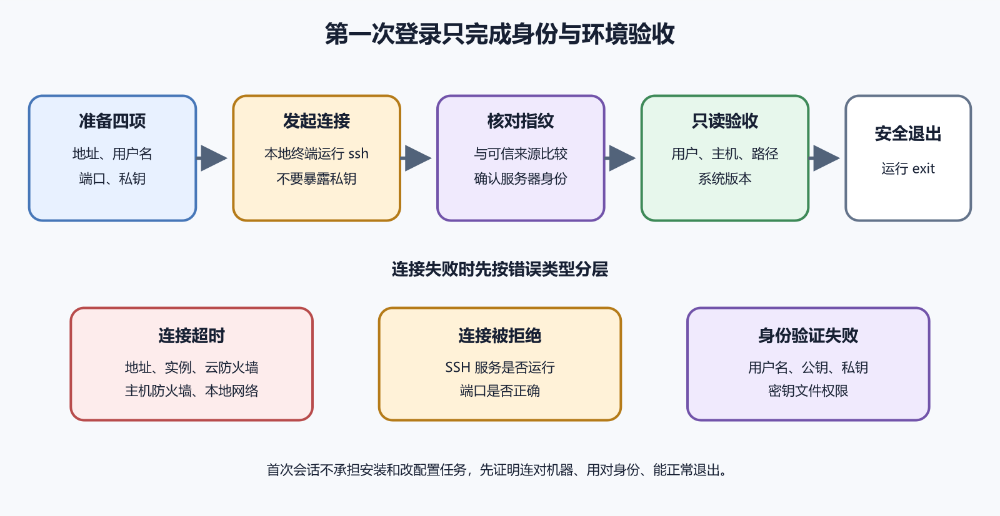

# 第一次使用 SSH 登录服务器

服务器放在远方的机房里，你看不到它的屏幕，也摸不到它的键盘。SSH 提供了一条加密的远程通道，让本地终端像接到服务器键盘一样发送命令，并把结果带回来。SSH 的英文是 Secure Shell，中文可称安全外壳协议。这里的“外壳”指接收命令的命令行环境。SSH 还能传输文件和建立安全隧道，本章只处理第一次登录需要的部分。

第一次登录的目标很小。确认你连到正确的服务器，确认身份验证成功，确认自己当前是谁，然后安全退出。安装软件和修改配置留到确认环境以后。



*图 37-1　从准备连接信息到安全退出的最小流程。等价说明见本章“第一次连接的完整路径”。*

## 连接需要四样东西

第一样是服务器地址，可以是公网 IP，也可以是已经解析到服务器的域名。第二样是登录用户名。Ubuntu 云镜像常使用 `ubuntu`，其他平台可能使用 `root`、`debian` 或创建实例时指定的名字。不要猜，查看服务商的连接说明。

第三样是认证材料。常见方式是密码或 SSH 密钥。密钥方式由一对文件组成，公钥可以放在服务器上，私钥只留在可信设备中。第四样是端口。SSH 默认使用 22。服务商或管理员可能改成其他端口，连接命令必须写明。

缺少任何一项，连接都可能失败。网络超时、拒绝连接和身份验证失败代表不同问题，不能用反复改密码解决所有错误。

公钥像可以安装到门锁里的识别片，泄露后通常不会直接让别人登录。私钥像真正的钥匙，能够证明连接者持有这套身份。私钥一旦泄露，应当撤销对应公钥并更换密钥。密钥还可以设置口令。这个口令用于保护本地私钥文件，不会发送给服务器。即使私钥文件被复制，攻击者仍要通过口令这一层。

不要把私钥放进 Git 仓库、网盘共享文件夹、截图或聊天消息。不要为了省事让多人共用一把私钥。每个人和自动化系统使用独立密钥，离开项目时才能准确撤销。

## Windows 上在哪里输入命令

Windows 10 和 Windows 11 的较新版本通常自带 OpenSSH 客户端。可以打开 Windows Terminal 或 PowerShell。下面的命令运行在你的 Windows 电脑，不是在服务器上。

先检查客户端是否存在。

```
ssh -V
```

`ssh` 是客户端程序；`-V` 让它显示版本；成功时会看到以 `OpenSSH` 开头的信息。若提示无法识别命令，先在 Windows 的可选功能中确认 OpenSSH Client 已安装。PowerShell 提示符常带有本地路径，例如 `PS C:\Users\你的名字>`；看见它说明命令仍在本地运行；连接成功后，提示符会变成服务器的用户名和主机名。

## macOS 上在哪里输入命令

打开“终端”应用。macOS 通常已经提供 `ssh` 客户端。运行以下命令检查。

```
ssh -V
```

成功时同样会显示 OpenSSH 版本。此时命令仍在 Mac 上。密钥一般位于当前用户的 `~/.ssh` 目录。本书不会把 Windows 和 macOS 的本地路径混在一起。服务器登录成功以后，两边看到的远程 Linux 环境通常相同。

Windows OpenSSH 常在 `%USERPROFILE%\.ssh` 中查找密钥。macOS 和 Linux 常在 `~/.ssh` 中查找。`~` 表示当前用户的主目录。如果服务商下载了一个私钥文件，把它保存在只有当前账号可访问的位置。文件名可能是 `server-key.pem`，名称本身没有特殊魔法，关键是内容和权限。

不要用办公文档软件打开后重新保存私钥。换行或编码被改动会让密钥失效。需要查看文件是否存在时，只看文件名和大小，不在截图中展示内容。更稳妥的方式是在本地生成密钥，只把公钥交给平台。生成命令会创建新文件，属于写操作。执行前先查看 `.ssh` 目录，避免覆盖同名密钥。

## 第一次连接的完整路径

假设服务商给出的用户名是 `ubuntu`，服务器地址是示例文档专用地址 `203.0.113.10`。实际操作时替换成自己的信息。在本地 Windows PowerShell、Windows Terminal 或 macOS 终端运行。

```
ssh ubuntu@203.0.113.10
```

`ssh` 启动客户端。`ubuntu` 是远程用户名。`@` 把用户名和地址分开。`203.0.113.10` 是远程服务器地址。若私钥不在默认位置，用 `-i` 指定文件。以下示例路径只作说明。

```
ssh -i ~/.ssh/project_server ubuntu@203.0.113.10
```

`-i` 后面是私钥路径。Windows PowerShell 中也能识别当前用户目录下的 `~`，遇到路径问题时可改用完整路径并加引号。端口不是 22 时，加入大写 `-p`。

```
ssh -p 2222 ubuntu@203.0.113.10
```

小写 `-p` 在其他工具中可能含义不同，输入时要看清。

## 第一次出现的主机确认

首次连接一个地址时，客户端通常会提示无法确认主机真实性，并显示服务器主机密钥的指纹。它在问一个重要问题。你是否确定这个地址背后就是刚创建的服务器。指纹像服务器身份的摘要。最稳妥的做法是从云平台控制台或可信渠道取得预期指纹，再与终端显示内容比较。完全一致后输入 `yes`。

客户端会把确认结果写进本地 `known_hosts` 文件；以后连接同一地址时，它会比较指纹；如果指纹突然变化，SSH 会发出醒目警告；不要习惯性忽略这个警告。合理原因包括服务器重装、IP 被重新分配或主机密钥更新。也可能是连接被拦截。先到云控制台核对实例和指纹，再决定是否移除旧记录。

连接前，在本地终端运行只读的当前目录和主机名查询，记下输出。连接成功后，再在远程服务器运行对应的只读查询。提示符、用户名、主机名和目录都会发生变化。退出 SSH 后再次查询，本地结果应当回来。这样走一遍，读者能直接看见本地电脑和远程服务器的区别。

这组对照能防止一种很常见的危险。读者从教程复制安装、移动或删除命令，却忘了自己已经退出服务器，结果在本地电脑执行；也可能以为仍在本地，实际正用服务器管理员权限改生产文件。以后每当命令会写入文件、重启服务或改变防火墙时，先看提示符并重新确认主机名。开两个窗口时，可以给窗口标题或背景加明显标记，但最终仍以命令输出和目标路径为准。

练习记录中不要只写“SSH 成功”。记下本地入口、远程主机、登录用户、连接时间、指纹核对来源和退出结果。再次连接时应使用同一受控入口，并确认主机指纹没有无故变化。这样一次登录才从偶然进入，变成可以解释和重复的访问路径。

## 成功登录以后先看提示符

登录成功后可能看到 Ubuntu 欢迎信息、系统更新数量和最后登录时间。接着出现类似下面的提示符。

```
ubuntu@web-01:~$
```

`ubuntu` 表示当前远程用户。`web-01` 是服务器主机名。`~` 表示当前位于该用户的主目录。末尾 `$` 常表示普通用户，`#` 常表示特权用户，但不能只凭符号判断权限。先运行三个只读命令。

```
whoami
hostname
pwd
```

`whoami` 显示当前用户名；`hostname` 显示服务器名称；`pwd` 显示当前目录的完整路径；预期结果应与购买记录一致；用户名不对时不要继续修改系统；主机名陌生时，回到控制台核对公网地址；当前目录通常是 `/home/ubuntu` 或对应用户的主目录。

## 再确认系统版本

下面的命令在远程 Ubuntu 服务器运行，只读取系统发布信息。

```
cat /etc/os-release
```

`cat` 把文件内容显示到终端；`/etc/os-release` 保存发行版名称和版本标识；预期会看到 `Ubuntu` 和版本信息；若与你选择的镜像不一致，先停止部署；错误镜像可能带来不同的软件源、路径和支持周期。不要运行从陌生网页复制来的“初始化脚本”来掩盖差异。镜像选错时，删除尚未承载数据的新实例并重新创建，往往比改造更可控。

完成确认后运行。

```
exit
```

它会结束远程 shell，终端回到本地提示符。也可以按 `Ctrl+D` 发送输入结束信号，但初学阶段使用 `exit` 更清楚。退出后观察提示符是否恢复成本地路径。很多误操作来自忘记自己仍在服务器上。准备运行删除、安装或编辑命令前，先看一次提示符并运行 `pwd`。

## 三类失败先分清

网络超时常显示 `Connection timed out`。这说明客户端长时间没有得到响应。先检查地址、实例运行状态、云防火墙、服务器防火墙和本地网络。密码通常还没开始验证；连接被拒绝常显示 `Connection refused`；这说明目标地址可达，但指定端口没有服务接受连接。检查 SSH 服务是否运行、端口是否正确，以及云平台是否刚完成启动。

身份验证失败常显示 `Permission denied`。这说明已经找到 SSH 服务，但用户名、密码、公钥或私钥不匹配。检查用户名和 `-i` 指向的文件，不要因为着急而不断开放更多端口。错误类别就是排查层级。超时先看网络，拒绝先看服务与端口，权限拒绝先看身份。

macOS 或 Linux 客户端可能拒绝使用权限过宽的私钥，并提示私钥文件不受保护。它是在防止同一台电脑上的其他用户读取密钥。下面命令运行在保存私钥的 macOS 或 Linux 本地终端，会修改文件权限。

```
chmod 600 ~/.ssh/project_server
```

`chmod` 修改权限。`600` 让文件所有者可读写，其他用户没有权限。执行前确认路径确实指向私钥，不能把整批项目文件都改成这个权限。Windows OpenSSH 使用 Windows 文件访问控制。不要照搬 `chmod`。若提示权限问题，在文件属性的“安全”页限制为当前账号可访问，或者按 Microsoft OpenSSH 的当前说明处理。

## 云平台控制台有什么用

许多平台提供浏览器控制台、串行控制台或恢复模式。它们用于网络或 SSH 配置损坏时救援，日常管理仍使用 SSH。第一次登录前，先找到控制台入口，但不要在不理解的情况下重置密码或重装系统。若 SSH 超时，可以在控制台确认实例是否开机。若修改 SSH 配置后无法连接，可以通过控制台恢复配置。

云控制台通常拥有很高权限。账号必须启用多因素认证，并限制团队成员权限。浏览器保持登录状态的电脑也应加密和锁屏。

`root` 是 Linux 中权限最高的账号。它能修改或删除几乎所有系统文件。普通命令输入错误，在普通用户下可能只影响自己的目录，在 root 下可能影响整台服务器。Ubuntu 常默认禁用 root 密码登录，并让初始管理员通过 `sudo` 为单条命令临时取得特权。官方用户管理文档说明了这种模型。

`sudo` 不是安全确认按钮。它只是用更高权限执行命令。每次看到 `sudo`，先读懂后面的程序、参数和目标路径。Ubuntu 的命令行入门资料也把随意运行管理员命令列为明显风险。

## 第一次登录后不要立即做的事

不要先关闭防火墙；连接问题应定位到具体规则；不要先允许 root 密码登录；它扩大了远程猜测和误操作风险；不要先改 SSH 端口并关闭当前窗口；配置错误会把自己锁在外面；不要把私钥复制到服务器；服务器只需要公钥。

不要运行来源不明的一键脚本。脚本可以安装软件、添加账号、修改防火墙和上传数据，终端里只显示一行命令并不代表影响很小。

这一组操作属于高风险变更。初学者在没有控制台救援入口时，不应把它作为第一次登录练习。正确顺序包含几个保护点。

1. 保持当前 SSH 会话不要关闭
2. 先复制配置文件作为备份
3. 在配置片段目录中做最小修改
4. 使用 `sshd -t` 检查语法
5. 重新加载 SSH 服务
6. 另开一个本地终端建立新连接
7. 新连接确认成功后再关闭旧会话

Ubuntu OpenSSH 文档明确建议在重启服务前运行配置测试，并警告配置错误可能导致服务器失去远程访问。这里没有给出修改端口或关闭密码登录的整套命令，因为具体方案取决于平台初始账号、救援入口和现有认证。第六卷后续会在权限与防火墙章节继续建立这些前提。

## 第一次登录的记录卡

连接成功后，在密码管理器或受控项目文档中记录非秘密信息。

- 平台和实例名称
- 区域与公网地址
- 操作系统和版本
- 登录用户名与端口
- 使用哪一把公钥
- 云控制台救援入口
- 最近一次成功连接日期

不要在记录卡里粘贴私钥、密码或完整访问令牌。可以记录密钥指纹，用来区分多把密钥。团队中每个人都应有独立账号或独立密钥。共享 `root` 密码看起来简单，却无法确认是谁执行了操作，也很难在成员离开时只撤销一个人的访问。

新建测试实例后，从本地终端连接。认真核对第一次主机指纹。运行 `whoami`、`hostname`、`pwd` 和 `cat /etc/os-release`。保存非秘密结果，然后运行 `exit`。再次连接时，不应重复出现首次指纹确认。若立刻出现主机密钥变化警告，先停止并核对实例是否重建或地址是否变化。

完成这组练习，你已经验证了网络入口、SSH 服务、服务器身份、用户身份和本地退出。它们是后续每项管理操作的入口条件。

## Windows 私钥路径中的空格

Windows 用户目录或文件夹名称可能含空格。命令中的路径必须用引号包住，否则 SSH 会把一个路径拆成多个参数。

```
ssh -i "C:\Users\你的名字\My Keys\server.pem" ubuntu@203.0.113.10
```

这条命令运行在本地 PowerShell。双引号只用于让路径保持完整，不会改变密钥内容。若提示找不到身份文件，先使用只读命令检查路径。

```
Get-Item -LiteralPath "C:\Users\你的名字\My Keys\server.pem"
```

成功时会显示文件信息。不要使用模糊通配符寻找私钥后自动传给 SSH，先精确确认目标。

## PowerShell 与传统命令提示符的差异

`ssh` 程序在两者中相同，路径引用和环境变量写法不同。PowerShell 的用户目录可写为 `$env:USERPROFILE`，传统命令提示符使用 `%USERPROFILE%`。本书 Windows 示例默认在 PowerShell 或 Windows Terminal 的 PowerShell 配置中运行。看到 `PS` 开头的提示符即可确认。

从网页复制命令时注意弯引号。中文排版中的 `“”` 不能代替终端需要的普通双引号。代码块会保留正确字符，仍要替换示例用户名和地址。

macOS OpenSSH 会检查私钥权限。`chmod 600` 只应作用于确切私钥文件。目录 `.ssh` 常需要只允许当前用户进入。设置了私钥口令后，可以每次输入，也可以使用系统提供的代理或钥匙串集成。具体参数会随 macOS 与 OpenSSH 版本变化，应查看当前 `man ssh` 和 Apple 说明。

任何自动保存口令的功能都依赖本机账号安全。设备没有磁盘加密、没有锁屏时，便利设置会扩大风险。

## SSH 配置文件能减少重复输入

本地 `~/.ssh/config` 可以为服务器定义一个别名。下面是教学示例。

```
Host notes-prod
    HostName 203.0.113.10
    User ubuntu
    Port 22
    IdentityFile ~/.ssh/project_server
```

保存后可以运行。

```
ssh notes-prod
```

配置文件位于本地电脑，不在远程服务器。它保存地址、用户名和私钥路径，不应包含私钥正文或密码。别名应表达项目和环境，例如 `notes-test` 与 `notes-prod`。只写 `server1` 容易在多个项目中连错。

## 防止把命令运行在错误机器

可以给生产服务器设置明显主机名和终端提示符颜色，但颜色在不同终端和日志中可能丢失。最终判断仍要使用 `hostname`、`whoami` 和 `pwd`。危险操作前形成固定停顿。

1. 读提示符
2. 运行 `hostname`
3. 运行 `whoami`
4. 运行 `pwd`
5. 复述命令会修改的绝对路径

这五步只花十几秒，能拦住很多在生产机执行测试命令的错误。

修改 SSH、防火墙或网络配置时，保留一个已连接窗口。第二个窗口用于验证新连接。旧窗口不能保证永久可用。连接可能因网络中断而关闭，所以还要有云控制台救援入口。它只是额外保护，不能替代备份。

给窗口标题标注环境。Windows Terminal 与 macOS 终端都支持标签页，避免几个相同黑色窗口之间复制错命令。在一个窗口实时查看日志，另一个窗口发起连接，能把失败时间与日志对应。完成后停止日志跟随，退出多余会话。

## known_hosts 警告怎样安全处理

服务器重装后，客户端可能显示远程主机标识已变化，并给出 `known_hosts` 中的行号。不要直接删除整个文件。先在云控制台确认实例确实重建，核对新主机指纹。确认变化合理后，只移除对应地址的旧记录。

```
ssh-keygen -R 203.0.113.10
```

这条命令在本地终端运行，会修改本地 `known_hosts`。`-R` 后是精确主机名或地址。执行前备份文件，执行后重新连接并核对新指纹。若你没有发起重装，也无法从可信渠道取得新指纹，就应停止连接并调查。警告的价值正在于阻止无条件接受变化。

OpenSSH 常从远程用户主目录下的 `.ssh/authorized_keys` 读取授权公钥。每一行通常代表一把允许登录的公钥，还可以带限制选项。目录和文件权限过宽时，SSH 可能拒绝使用它们。服务器认为其他用户能改授权列表，就无法信任其中内容。

不要用文本编辑器破坏一行公钥的结构。添加前保留原文件备份，另开窗口验证新密钥，再撤销旧密钥。云平台在创建实例时注入公钥，通常比首次登录后手工复制更稳妥。确认控制台选择的是公钥，不是私钥文件。

## ssh-copy-id 适合什么场景

`ssh-copy-id` 能把本地公钥添加到远程授权列表。它通常需要现有密码或可用登录方式。Windows 环境未必默认提供。使用前先确认目标账号和主机，避免把密钥装到错误机器。命令会修改远程授权文件，执行后检查返回信息并建立新连接。

云服务器已在创建阶段安装公钥时，不需要再运行。重复添加相同公钥会让授权列表混乱，但通常不会增加一种新身份。

密码登录依赖远程账号密码，容易遭受互联网自动猜测。密钥登录使用高强度密钥对，配合私钥口令和受控设备更适合管理员访问。关闭密码登录能缩小攻击面，前提是至少一把已验证密钥可用，sudo 权限正确，并有救援控制台。直接照抄关闭配置可能把自己锁在外面。

先新增和验证密钥，再修改认证策略。另开窗口确认，保留旧会话。团队每人使用独立密钥，不能让只有一把密钥变成单点故障。

## 修改 SSH 端口的实际作用

把 22 改成其他端口可以减少日志中的自动扫描噪声，不能替代密钥认证、防火墙和更新。攻击者仍能扫描开放端口。改端口需要同时修改 SSH 服务、云防火墙、UFW、本地配置和监控。遗漏任意一处都会连接失败。

初学者没有强烈原因时可保留 22，并通过密钥、来源限制和日志监控保护。安全收益要与维护复杂度一起评估。

Wi-Fi 切换、电脑休眠、中间网络设备超时都可能断开 SSH。普通 shell 中正在运行的前台任务也可能收到断开信号。长时间任务应使用 systemd、任务队列或可靠的终端复用工具管理。不要把生产应用依赖在一个打开的笔记本终端上。

网络不稳定时，先缩小命令范围，避免在断开前后留下半完成编辑。重要配置使用临时文件、验证和原子替换流程。Ubuntu OpenSSH 文档也提到 `tmux` 等工具能保留远程会话，但它不能取代服务管理。

## 连接慢但最终成功

可能原因包括 DNS 反查、身份方式尝试过多、网络延迟和服务器负载。使用详细模式能看到客户端停在哪一步。

```
ssh -v ubuntu@203.0.113.10
```

`-v` 输出调试信息，不修改服务器。信息中可能包含用户名、地址、密钥路径和算法协商，分享前要脱敏。可以增加到 `-vv` 或 `-vvv` 获取更多细节，但输出更长。先保存一次普通 `-v`，根据停顿位置检查网络、主机确认或认证。

SSH 还能承载 SFTP 和 SCP。上传应用前要先确定目标目录、文件所有者和覆盖风险。下面示例从本地电脑把单个测试文件复制到远程用户主目录。

```
scp test.txt ubuntu@203.0.113.10:~/
```

命令在本地运行，会在服务器写入文件。执行前确认 `test.txt` 不含秘密，目标账号和地址正确。完成后登录服务器，用 `ls -l ~/test.txt` 验证大小和所有者。正式部署更适合可追踪的发布工具、CI 产物或受控同步，不要长期靠手工拖拽覆盖生产目录。

## 一次连接失败记录怎样写

记录本地系统、终端、执行时间、目标地址、端口、用户名和完整错误类别。私钥只记录文件名或指纹，不复制内容。再记录实例是否运行、云防火墙规则、本地网络是否能访问其他地址，以及云控制台中 SSH 服务状态。

如果使用 `-v`，保留脱敏输出。说明预期结果和最后修正。例如“云防火墙只允许旧办公室地址，添加当前固定出口后连接成功”。一份完整记录能让未来的自己快速区分重复问题，也能让开发者在不接触秘密的情况下协助。

公司、学校和公共网络可能禁止外连 22 端口。服务器和密钥完全正常，本地仍会超时。在获得允许的另一条网络测试，可以区分本地限制与服务器故障。不要绕过组织网络政策，也不要把 SSH 随意搬到 443 与网站争用。

需要稳定远程管理时，使用组织批准的 VPN、跳板机或云平台控制通道。方案要记录审计和撤销方式。从手机热点能连接，只能说明服务器入口可用，不能证明办公网络配置错误。联系网络管理员核对策略。

## 域名连接与 IP 连接的区别

使用域名连接时，DNS 先把名称解析为地址。域名指向旧服务器会让你登录到错误机器。第一次迁移可以先用 IP 验证，再核对域名解析。登录后始终运行 `hostname` 和系统检查，不能只信任命令中写的域名。域名同时有 IPv4 与 IPv6 时，客户端可能选择不同地址。详细模式会显示实际连接目标。

主机指纹按名称和地址保存。更换解析后出现指纹变化，应按已知迁移记录核对，不能自动接受。

有些服务器没有公网 SSH，只允许从一台受控入口机继续连接。这台入口机常称跳板机。本地先验证跳板身份，再由 SSH 建立到目标服务器的第二段连接。目标数据库和应用可以留在私有网络，减少公网入口。

跳板机本身成为高价值资产，需要严格账号、日志、更新和高可用。个人单机项目通常无需引入。当服务器数量增加或组织要求集中审计时，再按 OpenSSH 当前文档使用 `ProxyJump` 等能力。

## 端口转发可能暴露内部服务

SSH 能把远程内部端口临时映射到本地，用于受控访问数据库或管理界面。它比永久开放公网端口安全，但使用者仍获得内部访问。隧道打开期间，本地程序可能连接到映射端口。绑定到所有本地接口还会让同一网络其他设备访问，初学者应保持本机绑定。

使用后关闭会话，确认端口不再监听。隧道权限、数据库账号和操作日志仍要管理。本书只建立概念，不给生产数据库的通用转发命令。具体配置需要管理员授权和目标服务规则。

CI 和定时任务不能人工输入口令，通常使用专用部署密钥或云平台短期身份。不能通过允许匿名登录或公开私钥解决。自动化密钥限制目标账号、来源和可执行操作。与人的管理员密钥分开，泄露时能单独撤销。

CI 秘密保存在平台秘密系统，不写进仓库。日志不打印私钥和完整连接命令中的敏感部分。部署结束后检查目标版本和服务，不能把 SSH 命令退出为零当成业务成功。

## 多因素认证放在哪一层

云平台账号应优先启用多因素认证，因为它能重建实例、改防火墙和控制密钥。SSH 也可配置额外认证，实施复杂度更高。硬件密钥、短期证书和集中身份适合团队环境。个人项目至少做到私钥口令、本机磁盘加密、独立密钥和云账号多因素。

认证层增加后要准备恢复。手机丢失、硬件密钥损坏时，恢复码必须位于独立安全位置。任何恢复通道都不能比正常登录更弱。共享邮箱和公开工单不应能重置服务器访问。

Ubuntu 欢迎信息可能显示可更新软件包和是否需要重启。它只是提示，不能替代实际 `apt update` 和版本核对。新实例也可能来自稍早镜像，创建当天就有更新。先确认 SSH 和救援入口，再按维护流程更新。更新 OpenSSH 或网络组件时保留当前会话，另开窗口验证。出现包管理错误不要继续部署应用。

记录镜像创建时间、首次更新包和重启结果。以后重建同版本实例时能预估准备时间。

## 会话审计与隐私

服务器可能记录登录时间、来源地址和执行过的特权命令。团队应说明记录范围和用途。审计能帮助事故调查，不能通过共用账号准确区分人员。独立账号和密钥是前提。日志中避免记录密码和秘密正文。终端录制若包含用户数据，设置访问与保留期限。

个人服务器也要保护来源 IP 和用户名，不把完整登录日志公开贴到论坛。

这段视频把云主机创建完成后的第一次 SSH 登录、建立非 root 管理用户、查看 Nginx 状态和设置 UFW 连在一起。只推荐 6 分 16 秒至 13 分 10 秒，后面的 Cloudflare TLS 设置不属于本章跟做范围，也不能替代源站 HTTPS。

- **视频标题**　You Need a VPS - The Foundational Setup Guide using Hetzner and Cloudflare DNS
- **作者或机构**　Jilles
- **平台**　YouTube
- **发布时间**　2025 年 10 月 28 日
- **视频时长**　17 分 1 秒
- **推荐观看区间**　6 分 16 秒至 13 分 10 秒
- **解决的问题**　识别首次 SSH 登录后的提示符变化，创建管理用户，重新登录，检查服务状态并在确认 SSH 规则后启用 UFW
- **观看前需要完成**　准备可随时重建的测试 VPS、云控制台救援入口和本地 SSH 密钥，记下实例 IP，不使用生产服务器跟做
- **观看时亲手完成**　核对主机指纹后登录，创建管理用户并重新登录，执行只读状态检查；启用防火墙前确认 SSH 规则和云控制台仍可访问
- **界面时效**　SSH、Ubuntu 与 UFW 命令截至 2026 年 8 月 6 日仍可按当前官方文档核对；Hetzner 控制台按钮可能变化，因此标记为部分符合当前界面
- **可点击链接**　[打开视频并从 6 分 16 秒开始](https://www.youtube.com/watch?v=E0tUio6ZgH8&t=376s)


*二维码 37-1　扫码后打开视频。跟做前必须保留云控制台救援入口。*
