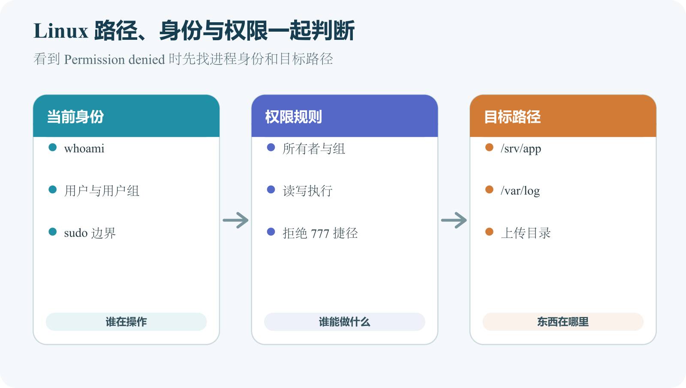

# Linux 文件、目录、用户、root、sudo 和权限

远程登录以后，服务器不会自动知道你想把项目放在哪里，也不会阻止拥有管理员权限的人误删重要文件。Linux 用目录组织内容，用用户区分身份，用权限决定谁能读、写和执行。这三个概念要一起理解。文件路径回答“东西在哪里”，用户回答“谁在操作”，权限回答“这个人能做什么”。很多部署错误都能落到其中一项。

例如，应用提示无法写入上传目录。它可能是目录不存在，也可能是服务进程使用另一个用户，还可能是目录存在但该用户没有写权限。只把权限改成所有人可写，会暂时隐藏症状，同时制造安全风险。



*Linux 中当前身份、权限规则和目标路径的联合检查方法*

## 从一棵倒置的目录树开始

Linux 文件系统从根目录 `/` 开始。斜杠既表示根，也用于分隔路径。`/var/log` 表示从根目录进入 `var`，再进入 `log`。Windows 常用盘符和反斜杠，例如 `C:\Users\HP`。Linux 通常没有这种盘符写法，路径也区分大小写。`App` 和 `app` 可以是两个不同目录。

常见目录各有大致职责。

- `/home` 保存普通用户的主目录
- `/etc` 保存系统和服务配置
- `/var` 保存经常变化的数据，例如日志
- `/tmp` 保存临时文件，内容可能被自动清理
- `/usr` 保存系统提供的程序和共享资源
- `/opt` 常用于额外安装的软件
- `/srv` 可用于服务提供的数据

这不是强制每个项目都必须放在 `/srv`。关键是选定一个清楚位置，并让配置、服务和备份都使用同一约定。

## 绝对路径与相对路径

以 `/` 开头的是绝对路径，它从文件系统根部定位；`/home/ubuntu/app` 无论当前在哪个目录，都指向同一个位置；不以 `/` 开头的是相对路径，它从当前工作目录定位；当前位于 `/home/ubuntu` 时，`app/config` 指向 `/home/ubuntu/app/config`。`.` 表示当前目录，`..` 表示上一级目录，`~` 表示当前用户的主目录。它们能缩短输入，也可能让危险命令的目标不直观。执行删除或递归修改前，优先把目标解析成绝对路径。

下面命令在远程 Ubuntu 服务器运行，都是只读检查。

```
pwd
ls
ls -la
```

`pwd` 显示当前绝对路径。`ls` 列出当前目录中未隐藏的项目。`ls -la` 还显示隐藏项、权限、所有者、大小和时间。预期会看到一行一项的目录内容。若提示没有权限，先运行 `whoami` 和 `pwd`，不要立即加 `sudo`。

## 创建练习目录

这一组命令在远程服务器的普通用户主目录运行，会创建文件和目录，不需要管理员权限。

```
cd ~
mkdir permission-lab
cd permission-lab
touch note.txt
```

`cd ~` 回到当前用户主目录。`mkdir` 创建 `permission-lab` 目录。第二个 `cd` 进入它。`touch` 在文件不存在时创建空文件。运行下面的检查。

```
pwd
ls -l
```

路径末尾应为 `/permission-lab`，列表中应出现 `note.txt`。结果不同先看提示符、当前目录和拼写。这个目录只用于练习。完成后可以在确认绝对路径后删除，但本章不要求执行递归删除命令。

## 隐藏文件没有特殊保密能力

名称以点开头的文件通常不会被普通 `ls` 显示，例如 `.env` 和 `.ssh`。这只是一种显示约定，不是加密，也不是权限控制。`.env` 可能保存秘密，仍要设置合适权限并排除在 Git 之外。`.ssh` 目录可能包含授权公钥和客户端配置，更不能因为“看不见”就忽略保护。

使用 `ls -la` 能看到隐藏项。不要在直播、截图或支持工单中随意展开秘密文件内容。

Linux 每个进程都在某个用户和组的身份下运行。你通过 SSH 登录为 `ubuntu`，应用服务可以使用另一个专用用户，例如 `notesapp`。组用于把一组用户放入共同权限集合。一个文件有所有者用户和所有者组，同时为“其他用户”定义权限。

运行下面的只读命令。

```
whoami
id
```

`whoami` 显示当前用户名。`id` 显示用户编号、主要组和附加组。若输出包含 `sudo` 组，通常表示该用户可以按系统规则使用 `sudo`，仍需通过密码或平台配置验证。不要仅凭用户名叫 `admin` 就认为它有管理员权限。系统真正依据用户编号、组和 sudo 规则。

## root 为什么危险

`root` 的用户编号通常为 0，拥有最高系统权限。它能读取普通用户不能读取的文件，能改服务和防火墙，也能删除系统所需内容。root 权限有必要存在，因为安装系统软件、修改 `/etc` 配置和管理服务需要它。风险来自权限范围太大，任何路径错误都可能造成更大后果。

Ubuntu 常让管理员以普通用户登录，再为需要的单条命令使用 `sudo`。这让普通工作保持较低权限，也为提权操作留下记录。不要运行 `sudo su` 进入长期 root shell 作为日常习惯。提示符变化很容易被忽略，后续每条命令都会带最高权限。Ubuntu 的命令行教程也专门提醒这种做法的风险。

`sudo` 会按配置以另一个身份执行后面的命令，常见情况是 root。它不会检查命令是否符合你的真实意图。例如下面的只读命令会查看 SSH 服务状态。

```
sudo systemctl status ssh
```

系统可能要求输入当前用户密码。输入时终端通常不显示圆点或星号，这是正常行为。成功后会看到服务状态，本书第 40 章会解释这些字段。看见陌生命令前缀为 `sudo` 时，先拆开阅读。确认程序、参数、路径和影响。无法解释其中一项，就不要在生产服务器执行。

## 权限字符串怎样读

`ls -l` 的一行可能类似下面内容。

```
-rw-r----- 1 notesapp web 842 Aug 5 10:20 config.ini
```

第一个字符表示类型。`-` 常表示普通文件，`d` 表示目录，`l` 表示符号链接。后面九个字符分成三组。第一组属于所有者，第二组属于组，第三组属于其他用户。每组的 `r` 表示读，`w` 表示写，`x` 表示执行。`-` 表示没有对应权限。

这个例子中，所有者 `notesapp` 可以读写，组 `web` 只能读，其他用户没有权限。GNU Coreutils 的权限说明把三类身份写为 `u`、`g`、`o`，并用 `r`、`w`、`x` 表达三种权限。

## 文件与目录的执行权限含义不同

普通文件上的 `x` 表示可尝试执行这个文件。脚本还需要正确的解释器声明和内容。目录上的 `x` 表示可以穿过或搜索这个目录。一个用户可能能读目录名称，却因为没有 `x` 而无法进入。也可能有 `x` 而没有 `r`，知道完整文件名时能访问，却不能列出目录。

这就是为什么把目录权限和文件权限一律设成相同数字经常出错。代码文件通常不需要执行权限，目录却需要 `x` 才能访问其中内容。

`r` 的数值为 4，`w` 为 2，`x` 为 1。每一组相加后形成一个数字。`7` 表示读写执行，`6` 表示读写，`5` 表示读和执行，`4` 表示只读。`640` 表示所有者读写，组只读，其他用户无权限。`755` 常用于需要所有人进入和读取、只有所有者可修改的目录。

数字只是简写。理解三组身份比记住几个常见数字更重要。看到 `777` 时应立即警惕，它给所有人读写执行权限，通常是在回避所有权问题。

## chmod 修改权限

下面命令在远程服务器的练习目录运行，会修改 `note.txt` 权限。

```
chmod 640 note.txt
ls -l note.txt
```

预期权限字符串接近 `-rw-r-----`。如果提示文件不存在，先运行 `pwd` 和 `ls -la`。不要为了找到文件而对上级目录递归改权限。也可以用符号方式表达意图。

```
chmod g+r note.txt
chmod o-rwx note.txt
```

第一条给组增加读权限。第二条移除其他用户的读写执行权限。符号方式常比数字更容易审查，因为它写出了修改对象和方向。

## chown 修改所有者

应用以 `notesapp` 用户运行，却要写入属于 `root` 的上传目录时，可能出现权限拒绝。可以评估是否应把目标目录交给应用用户。下面只是语法示例，会修改所有权，需要管理员权限。

```
sudo chown notesapp:web /srv/notes/uploads
```

`notesapp` 是新所有者，`web` 是新组，最后是精确目标目录。执行前必须确认用户、组和目录都存在，并保存原所有者记录。不要直接对 `/srv`、`/var` 或根目录递归运行 `chown`。递归修改会影响其他服务，恢复原所有权很困难。

## 递归参数为什么要单独警告

许多命令使用 `-R` 表示递归处理目录下所有内容。它会把一个小修改扩展成成千上万个文件。递归权限修改可能让秘密文件变得公开，让脚本失去执行权限，或让数据库无法启动。命令执行很快，错误影响却难以逐项恢复。

必须递归处理时，先用 `find` 或 `ls` 列出目标，确认绝对路径，备份权限记录，再把文件和目录分开处理。对生产数据目录进行这类操作应安排维护窗口。

把 Web 应用直接以 root 运行，意味着应用漏洞可能获得整台服务器权限。使用专用普通用户能缩小影响范围。专用用户只需要读取代码、读取必要配置、写入特定数据和日志位置。它不应能修改系统软件或读取其他项目的秘密。

例如，图片服务只需要写 `/srv/picture-app/uploads`。给这个目录正确所有权，比让服务拥有整个 `/srv` 的写权限更安全，也更容易排错。最小权限不是一次配置完成。添加上传、缓存或备份功能时，重新检查服务实际需要的目录和网络访问。

## 配置文件和秘密怎样分开

普通配置可以跟随项目版本，例如端口和日志级别模板。秘密包括数据库密码、API 密钥和签名材料，不应进入仓库。服务器上的秘密文件应只让服务用户和必要管理员读取。若文件属于部署用户，服务用户可能读不到。若设为所有人可读，其他本机进程可能获得秘密。

权限只是保护的一层。备份、进程环境、日志和错误页面也可能泄露秘密。不要通过 `cat` 把真实密钥显示在录屏或支持聊天中。

先抄下完整错误和目标路径。不要只记一句“Permission denied”。然后确认当前身份。

```
whoami
id
```

确认路径每一层。

```
namei -l /srv/notes/uploads/example.png
```

`namei -l` 会分层显示路径及权限。部分系统可能未预装它，缺少时用 `ls -ld` 从上级目录逐层检查。接着确认实际运行服务的用户。服务管理章节会用 `systemctl status` 和 unit 文件检查。最后才决定修改所有权、组成员或权限。

## 一个上传失败案例

网站页面能打开，上传头像时返回 500。应用日志写着无法创建 `/srv/avatar/uploads/a.png`。管理员看到目录存在，直接运行 `chmod 777`，上传立刻成功。表面上故障消失了，任何本机用户也获得了修改上传目录的能力。更完整的检查发现，服务以 `avatar` 用户运行，目录却属于部署账号。正确修复是确定该目录确实应由应用写入，把所有者或组调整给服务身份，并只授予必要权限。

这个案例说明，权限错误的答案来自身份、路径和需要的动作。扩大到所有人只是跳过了判断。

符号链接像一个保存目标路径的入口。`current` 可以指向某个具体发布目录，例如 `releases/20260805`。切换链接就能让服务使用新版本。`ls -l` 会用箭头显示链接目标。删除符号链接通常不会删除目标目录，但递归命令和某些工具对链接的处理不同，执行前要看手册。

部署中使用符号链接能帮助回滚。它也会让“当前目录里看到的文件”实际位于别处。排错时使用 `readlink -f` 确认最终路径。

## 文件被删除后磁盘为什么不一定释放

Linux 进程打开文件后，即使目录项被删除，进程仍可能持有它。一个日志文件看起来已经删除，磁盘空间却没有回来，直到写日志的进程关闭文件。这不是权限问题，却常在清理日志时出现。先找出占用文件的进程，再让服务安全重新打开日志。不要因为空间没有立即恢复就删除更多目录。

第 39 章会介绍磁盘和进程检查，第 40 章会说明怎样重启或重新加载服务。

`cp` 复制文件，`mv` 移动文件。移动到同一文件系统的另一个名称时，`mv` 也承担重命名。下面命令在远程服务器的练习目录运行，会创建副本。

```
cp note.txt note.backup.txt
ls -l
```

第一条把 `note.txt` 复制为 `note.backup.txt`。第二条应看到两个文件。若目标已经存在，普通 `cp` 可能直接覆盖，操作前先用 `ls -l` 检查。把副本改名。

```
mv note.backup.txt note.old.txt
```

执行后原名称消失，新名称出现。`mv` 跨文件系统时需要复制再删除，过程更慢，也可能因空间不足失败。生产配置修改前可以复制一份带日期的备份。备份文件仍在同一服务器，只适合快速回退，不能替代异地备份。

## 删除操作没有统一回收站

终端中的 `rm` 通常直接移除目录项，不会进入桌面回收站。文件是否能恢复取决于文件系统、覆盖情况和备份，不能把恢复当作默认能力。删除前先列出精确目标，用绝对路径确认。只删除一个文件时使用文件名，不要加入递归参数。

```
rm /home/ubuntu/permission-lab/note.old.txt
```

这条命令会删除练习文件，执行前必须确认路径和内容。若需要保留，可以先移动到明确的隔离目录，再等待确认。空目录可用 `rmdir` 删除，它在目录非空时会拒绝，适合作为更安全的检查。`rm -rf` 会递归且强制处理，风险很高，本书不把它作为日常清理方式。

服务器常使用 `nano`、`vim` 或其他终端编辑器。打开文件本身可能只读，保存会直接修改生产配置。初学者可以先用 `nano` 编辑练习文件。

```
nano note.txt
```

屏幕底部会显示快捷键，`^` 代表 `Ctrl`。保存前再次确认文件名。退出后运行 `ls -l` 和只显示非秘密内容的查看命令检查。修改系统配置时，先复制原文件，使用软件提供的语法检查器，再重新加载服务。不要因为编辑器保存成功就认为配置有效。

含秘密的文件不要全文显示在录屏中。编辑器的搜索历史和交换文件也可能留下内容，生产秘密优先使用受控配置工具。

## 新建目录时权限从哪里来

程序创建文件时会提出初始权限，系统再应用 `umask` 移除部分权限。结果因此不只由程序决定。下面命令只读取当前 shell 的 umask。

```
umask
```

输出常是四位或三位数字。它的计算容易引起误解，初学阶段先记住新文件权限受它影响。不要为了让应用能写就把 umask 调成过宽值。systemd 服务可以有自己的 `UMask` 设置。交互终端创建正常、服务创建异常时，要比较两种运行环境。

两个部署人员都要更新 `/srv/notes-api`，可以创建专用组并把人员加入组，再让项目目录归属该组。这样比把目录设为所有人可写更清楚。用户加入新组后，现有登录会话可能仍使用旧组列表。退出并重新登录，再用 `id` 检查。

目录上的 setgid 位可以让新建文件继承目录组，适合共享目录。它属于进阶权限，配置前要在测试目录验证，不能凭数字记忆直接改生产树。团队协作还要决定谁负责部署。所有人都有写权限会增加冲突，自动化发布账号加审阅流程往往更可追踪。

## ACL 为什么会让 ls 结果不完整

访问控制列表的英文是 Access Control List，常缩写为 ACL。它能为特定用户或组增加权限，超出传统所有者、组、其他用户三组模型。`ls -l` 权限末尾出现 `+` 时，说明可能存在 ACL。此时用 `getfacl` 查看完整规则。系统未安装命令时，先确认发行版软件包。

权限看似允许却仍拒绝，或权限看似拒绝却能访问时，ACL 是一个检查点。不要通过重设普通权限无意中破坏已有 ACL。本书不要求读者主动设计复杂 ACL。知道它存在，可以避免在托管服务器或多人环境中作出错误判断。

文件本身是 `644`，应用仍无法读取，原因可能在某一级目录缺少执行权限。假设文件位于 `/srv/notes/config/app.ini`。服务用户必须能穿过 `/srv`、`/srv/notes` 和 `/srv/notes/config`，最后还要能读取文件。只检查最后一个文件会漏掉上级目录。使用 `namei -l` 或逐层 `ls -ld`，能看见每一步。

不要给所有上级目录增加全局读取权限。目录只需要允许目标服务身份穿过，可以通过组和更小范围权限解决。

## 脚本无法执行的四个检查点

运行 `./deploy.sh` 收到权限拒绝时，第一项是文件有没有执行权限。第二项是首行解释器路径是否存在，例如 `#!/usr/bin/env bash`。第三项是文件换行是否从 Windows 带入不兼容字符。第四项是所在文件系统是否使用了禁止执行选项。

可以先用解释器显式运行测试脚本。

```
bash deploy.sh
```

这不要求脚本本身有执行位，但仍会执行其中所有命令。运行前必须阅读内容，确认没有真实秘密和破坏操作。不要见到权限拒绝就把整个项目递归设为可执行。图片、配置和密钥不需要执行权限。

## 服务用户没有登录 shell 也很正常

专用服务账号常被设置为不能交互登录。它仍能由 systemd 用来启动进程，也能拥有文件。这降低了账号被直接用作远程 shell 的机会。排错时不要为了方便给它设置密码并开放 SSH。需要验证服务身份能否读取文件时，可以由管理员使用受控命令临时以该用户执行只读检查。命令和目标要精确，完成后不留下额外登录能力。

服务实际环境还包括工作目录、环境变量和 systemd 限制。用自己的 SSH 用户测试成功，不代表服务用户也成功。

假设项目位于 `/srv/notes-api`。发布目录由部署账号写入，运行用户只读。上传目录由运行用户写入，环境文件由运行用户读取，其他用户无权读取。把代码、持久数据和秘密分开后，权限需求自然清楚。代码不应在运行期间被应用修改，上传数据不应随发布删除，秘密不应被 Web 服务器当静态文件发送。

如果所有内容都放在一个目录并统一 `chmod 777`，任何应用漏洞都可能改代码和秘密，部署也可能覆盖用户数据。在文档中画出每个目录的所有者、组、读写者和备份方式。新增缓存或导出目录时更新表格。

## 权限修改怎样留下回滚证据

修改前运行 `stat` 或 `ls -ld` 保存目标权限和所有者。对多个文件，导出清单到受控位置。记录为什么改、谁需要什么动作、预计影响哪些服务。修改后用目标服务身份做最小读写测试，再运行应用健康检查。出现问题时按记录恢复原所有者和权限。没有记录的大范围递归修改，很难可靠地逆推每个文件原值。

配置管理工具可以把预期权限写成代码，适合服务器增多以后使用。第一台服务器先把手工步骤写清楚，再考虑自动化。

云磁盘故障、文件系统错误或容器设置可能让挂载点变为只读。此时权限字符串看起来正常，写入仍提示只读文件系统。先记录完整错误，再查看挂载状态和内核日志。不要不断执行 `chmod` 或 `chown`，它们也无法在只读文件系统上成功写入元数据。

涉及文件系统修复时要先停止写入、备份可读数据，并按发行版和云平台恢复流程处理。它超出本书的安全手工范围，必要时请专业人员协助。

## 文件名中的空格与特殊字符

Linux 文件名可以包含空格。终端会把空格当作参数分隔，所以路径要用引号。

```
ls -l "report files/final report.txt"
```

脚本中始终正确引用变量和路径。未经引用的通配符可能匹配多个文件，甚至把以连字符开头的文件名当作选项。服务器项目优先使用简单名称，采用字母、数字、短横线和下划线。它减少命令、URL 和跨平台工具中的歧义。

一个文件名若以 `-` 开头，许多命令会把它解释为参数。可以用 `--` 表示后面都是目标，或使用带目录的路径。

```
rm -- ./-example.txt
```

这条命令会删除练习文件，执行前先用 `ls -l -- ./-example.txt` 精确检查。不要在真实目录创建此类名称作试验。认识 `--` 能帮助理解命令边界，但不能减轻删除风险。目标仍要使用绝对或明确相对路径。

## 符号链接可能失效

链接目标被移动或删除后，符号链接仍存在，却指向不存在位置。`ls -l` 会显示目标，访问时报文件不存在；发布切换前确认新目录存在、权限正确、应用产物完整；回滚链接也要确认旧目录尚未清理；备份工具对链接有不同处理；有的保存链接本身，有的跟随并复制目标；制定备份时明确选择，避免恢复后链接指向旧绝对路径。

跨服务器迁移尤其要检查绝对链接。新机器目录结构不同会使它失效。

Windows 常见 CRLF 换行，Linux 工具常使用 LF。多数现代程序能处理，shell 脚本首行若带多余回车，可能报告解释器不存在。Git 可以按项目配置换行。不要在生产服务器用批量替换处理全部文件，二进制和密钥会被破坏。

看到文件内容正常但程序解析失败时，检查编码、字节顺序标记和换行。使用能显示不可见字符的工具，只对目标文本文件转换。中文配置还要统一 UTF-8。保存后使用程序验证器读取，不能只在编辑器中看见中文就认为有效。

## 时间戳不能证明文件内容相同

`ls -l` 显示修改时间和大小。两个文件时间相同，内容仍可能不同。时间不同，也可能内容相同。比较配置可以使用 `diff`，比较二进制或发布产物可以使用 SHA-256 校验值。

```
diff -u config.old.ini config.new.ini
```

命令只读，会按行显示差异。输出可能包含秘密，分享前脱敏。校验值用于检测内容变化，不说明哪一版正确。仍要结合来源、签名和版本记录。

进程打开文件后，管理员改变路径权限或删除名称，已有文件描述符可能仍可读写。这解释了为什么收紧权限后，运行中的应用行为没有立即改变。重启服务会让它重新打开文件，但重启前要保存状态并安排窗口。

秘密泄露时只改权限不足以撤销已经读取的密钥。还要轮换凭据并调查进程和日志。权限变更验证应包括新进程，而不是只看旧会话。

## sudo 记录与命令历史的边界

sudo 日志通常记录谁在何时执行了什么程序，shell 历史记录用户输入。两者都可能因配置不同而不完整。不要把密码或令牌写在命令参数中。它可能出现在历史、进程列表和审计日志。需要输入秘密时使用程序支持的标准输入、受限环境文件或秘密管理。完成后检查临时文件和日志。

审计帮助追查，不能替代最小权限和双人复核。

## 一个权限练习的验收

在主目录创建练习目录和文件，记录初始所有者与权限。把文件设为所有者读写、组只读、其他无权。用 `ls -l` 解释每一组字符。再用符号方式移除组读权限，确认结果变化。复制文件并观察新文件权限受到 umask 影响。不要在系统目录或项目目录练习。

结束时只删除明确练习文件，运行 `pwd` 和 `ls -la` 确认。保留一页操作记录，比背诵数字更能建立判断。

删除一个文件主要取决于所在目录的写入和执行权限，不只看文件自身写权限。一个只读文件仍可能被有目录写权限的人删除。这也是共享目录容易误判的地方。保护重要文件时，要同时看文件和父目录。

目录使用 sticky bit 时，多个用户可以创建文件，通常只能删除自己的内容，`/tmp` 常使用这种设计。它属于系统维护设置，初学者只需能认出权限末尾可能出现 `t`。不要为了阻止删除给文件设置陌生不可变属性。它会让备份、更新和清理也失败，忘记后很难排查。

## 所有者不存在时会显示数字

从备份恢复或跨服务器复制文件后，`ls -l` 可能显示数字用户编号。新服务器没有对应用户名称，文件仍保留原 UID。应用服务若使用不同 UID，访问会失败。先建立正确服务账号，再按项目范围调整所有者。

容器数据卷也常遇到 UID 不一致。看到数字不能直接把目录改给当前登录用户，要先确认数据属于哪个服务。迁移文档应记录服务用户和组。恢复验收包含以实际服务身份读写。

应用能运行时，团队容易忽略配置文件变成所有人可读、上传目录变成所有人可写。这些没有立即报错，却扩大风险。把关键路径的预期权限写入巡检。每次部署后比较，发现偏差就调查是解压工具、脚本还是人工修改造成。

修复前确认正在运行进程和共享组，避免收紧后中断服务。修复后以服务身份验证，并检查其他本机用户无法访问。成功路径和拒绝路径都通过，权限验收才完整。权限问题处理完以后，把最终用户、组和模式写回部署文档。下一次发布若重新创建目录，自动化必须生成同样结果。只在现有服务器手工修好，重建时故障仍会回来。

恢复测试也要检查权限。备份内容完整，所有者和模式丢失，应用仍可能无法启动或意外公开秘密。

## 新手可以安全掌握到什么程度

现在需要会看 `pwd`、`ls -la`、`whoami`、`id`，能分清绝对路径、用户、组和三组权限。需要知道 `sudo` 提高风险，`-R` 会放大范围，`777` 通常不是合理修复。暂时不用背诵特殊权限位、访问控制列表、用户命名空间和 Linux 安全模块。遇到它们时先知道权限字符串可能不是全部原因，再查对应文档。

每次修改前记录原值，修改后用普通服务身份验证。能解释“谁需要对哪个路径做什么”，才有足够信息改变权限。
