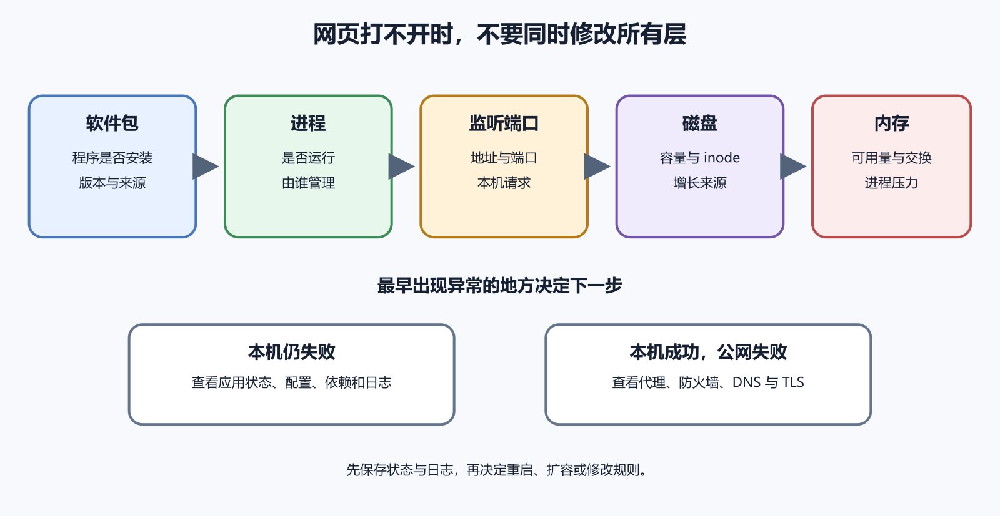

# 软件包、进程、端口、磁盘和内存

服务器出现“打不开”时，可能是软件没有安装、进程没有运行、端口没有监听、磁盘已经占满，或者内存压力终止了应用。它们都表现为一个网页失败，却位于不同层。本章建立一组只读检查。先看状态，再决定修改。初学者不需要记住几十条命令，只要能回答五个问题。

1. 需要的软件是否存在
2. 应用进程是否在运行
3. 它是否监听预期端口
4. 磁盘是否还有可用空间
5. 内存是否正在承受压力



*图 39-1　从软件包到资源的五层检查。等价说明见本章“把现象放回层级”。*

## 软件包是什么

软件包是由发行版或软件提供者整理的一组程序、配置说明和元数据。Ubuntu 使用 APT 管理软件包。APT 会处理软件来源、依赖关系、安装和更新。`apt` 不等于互联网搜索。它只从系统已经配置的软件源取得索引和包。软件名称存在于某篇教程，不代表当前 Ubuntu 版本的软件源中一定有它。

Ubuntu 官方资料建议交互使用可读性较好的 `apt`，脚本中使用接口更稳定的 `apt-get`。本书的人工操作示例使用 `apt`。

下面命令在远程 Ubuntu 服务器运行，需要管理员权限。它会下载最新软件包索引，不会直接升级已安装软件。

```
sudo apt update
```

`sudo` 提升本条命令权限。`apt` 是包管理工具。`update` 更新可用软件版本列表。成功时会看到多个软件源的获取结果，最后显示可升级包数量。若出现签名、网络或仓库错误，不要继续安装。先检查系统时间、DNS、软件源地址和第三方仓库。

下面命令会列出可升级项目，不执行升级。

```
apt list --upgradable
```

真正的 `apt upgrade` 会修改系统中的软件包，可能重启服务或改变行为。生产服务器执行前需要查看变更、备份关键数据、安排窗口并准备回滚。

## 安装软件前确认来源

标准 Ubuntu 仓库中的包由发行版流程管理，版本可能比软件官网最新版本旧，但与发行版集成和安全更新更可控。第三方仓库能提供新版本，也增加供应链、签名、兼容和升级风险。Ubuntu 官方文档专门说明了第三方软件源的影响。

遇到网页让你运行 `curl 某地址 | sudo bash` 时要停下来。这个形式会下载远程内容并立刻以管理员权限执行。网页内容今天和明天可能不同，终端历史也不会保存脚本全文。更稳妥的做法是使用项目官方仓库说明，检查下载地址和签名，先保存并阅读脚本，再在测试机验证。不了解来源时不要执行。

想确认 Nginx 软件包状态，可以运行只读命令。

```
dpkg -s nginx
```

安装成功时会看到状态、版本和架构。未安装时会显示找不到匹配包。软件包已安装并不代表服务正在运行，运行状态属于下一层。查看命令来自哪个路径，可以使用。

```
command -v nginx
```

成功时显示可执行文件路径。没有输出可能表示未安装，也可能表示它不在当前用户的命令搜索路径中。

## 进程是正在运行的程序实例

磁盘上的程序只是文件。被操作系统加载并开始执行后，才成为进程。同一个程序可以有多个进程，每个进程都有编号，称为 PID。Web 服务常有一个主进程和多个工作进程。应用也可能由 systemd、容器运行时或进程管理器启动。只运行 `ps` 看到进程名，还不能确定它是否健康。

下面命令在远程服务器运行，只读取进程列表。

```
ps aux
```

输出可能很长。可以按程序名筛选。

```
pgrep -a nginx
```

`pgrep` 查找匹配的进程。`-a` 同时显示完整命令行。没有输出表示当前没有匹配进程，但名称可能与你猜测不同。不要用 `kill -9` 作为第一步。强制终止不给程序清理连接和文件的机会。由 systemd 管理的服务应先查看服务状态，再用服务管理命令停止或重启。

## 进程存在不等于网站可用

一个 Node.js 进程显示正在运行，却可能卡在数据库连接、只监听本机地址、监听了错误端口，或者健康检查持续失败。先分开确认三件事。进程存在，端口监听，本机请求成功。三者都正常后，再检查防火墙、域名和外部网络。

这种顺序能避免盲目重启。重启可能暂时清除症状，也会丢失最接近故障时的状态和日志。

IP 地址把请求带到一台服务器，端口再把连接交给具体服务。SSH 常监听 22，HTTP 常用 80，HTTPS 常用 443。应用内部端口可以是 3000、8000 或其他值。端口只是 0 到 65535 范围内的编号。使用常见号码是一种约定，不会自动让服务获得对应能力。一个程序监听 443，也不代表它正确配置了 TLS。

Ubuntu 网络概念文档把 `sshd` 和 Web 服务作为监听网络连接的守护进程实例。

## 查看监听端口

下面命令在远程 Ubuntu 服务器运行，只读查看 TCP 监听套接字。

```
sudo ss -lntp
```

`ss` 显示网络套接字。`-l` 只看监听状态，`-n` 直接显示数字地址和端口，`-t` 只看 TCP，`-p` 显示关联进程。显示其他用户的进程信息通常需要 `sudo`。若应用应监听 3000，可以缩小输出。

```
sudo ss -lntp '( sport = :3000 )'
```

看到 `127.0.0.1:3000` 表示只接受本机连接，适合由同机 Caddy 或 Nginx 反向代理。看到 `0.0.0.0:3000` 表示所有 IPv4 接口都可接受连接，是否能从公网访问还受防火墙影响。数据库通常不应为了省事监听所有接口并向公网开放。应用和数据库在同一台机器时，优先监听本机地址。

## 在服务器内部测试应用

假设应用应在本机 3000 端口提供 HTTP。下面命令在远程服务器运行，只发出一个本机请求。

```
curl -i http://127.0.0.1:3000/health
```

`curl` 发出请求；`-i` 同时显示响应头；地址 `127.0.0.1` 表示当前服务器自己。`/health` 是示例健康检查路径，项目没有这个路径时应使用实际地址。成功时应看到 HTTP 状态行和预期正文；连接被拒绝说明没有服务在该地址端口接受连接；超时或返回 500 时查看应用日志和依赖。

本机请求成功而公网失败，故障更可能位于反向代理、防火墙、DNS 或云网络层。

## 云防火墙和主机防火墙是两道门

云平台防火墙在流量到达虚拟机前过滤连接。Ubuntu 内的 UFW 在主机上再过滤一次。任意一层拒绝，外部连接都会失败。下面命令在远程 Ubuntu 服务器运行，只读取 UFW 状态。

```
sudo ufw status verbose
```

成功时会显示是否启用和规则。不要在 SSH 会话中未经准备就启用、重置或大改防火墙。新增规则前先确保当前 SSH 端口被允许，并保留控制台救援入口。Ubuntu 官方防火墙文档提供状态、允许、拒绝和试运行方式。本书不会把关闭防火墙作为解决网络问题的长期办法。

下面命令在远程服务器运行，只读取各文件系统使用情况。

```
df -h
```

`df` 报告文件系统空间。`-h` 用较易读的单位显示。重点看挂载点 `/` 的容量、已用、可用和使用率。使用率很高时，再查看哪些顶层目录占空间。下面命令读取 `/var` 下各项估算大小，可能需要一些时间。

```
sudo du -xhd 1 /var
```

`du` 估算目录占用。`-x` 不跨到其他文件系统，`-h` 使用易读单位，`-d 1` 只展开一层。目标是精确的 `/var`。不要一看到日志大就删除整个 `/var/log`。先找增长最快的文件和写入它的服务，检查日志轮转，再使用服务支持的清理方式。

## inode 用完也会写入失败

文件系统除了存数据，还要记录文件元信息。海量小文件可能耗尽 inode，即使按容量看仍有空间，也无法创建新文件。下面命令查看 inode 使用率。

```
df -ih
```

若 `IUse%` 接近满载，寻找产生大量小文件的缓存、会话或临时目录。删除前确认这些文件可重建，并先停止继续生成它们的原因。

下面命令在远程服务器运行，只读取内存统计。

```
free -h
```

`free` 显示内存和交换空间；`-h` 使用易读单位；Linux 会把空闲内存用于缓存，因此不要只看 `free` 一列；`available` 更接近新应用可以使用的容量估计；交换空间正在使用不一定代表故障；持续增长、响应变慢和应用被终止才需要结合观察；一次快照不能说明趋势。

查看实时进程时可以运行。

```
top
```

它会持续刷新 CPU、内存和进程列表，按 `q` 退出。第一次使用先在测试机练习，不要误按交互式终止键。

## CPU 高要先找谁在用

`top` 中 CPU 排名靠前的进程是线索。记录 PID、用户和命令，再查看服务日志。短时构建或备份可能合理，长期满载需要判断负载、循环或攻击流量。服务器有两个 vCPU 时，一个单线程进程占满一个核心，工具可能显示接近 100%，整机仍有另一部分能力。不同工具的百分比口径可能不同，比较时使用同一工具。

高 CPU 与高访问量同时出现，不表示一定要扩容。先看是否有异常爬虫、无缓存查询或错误重试。DigitalOcean 的选型资料也建议根据实际工作负载和基准测试调整方案。

新应用启动时报“地址已被占用”，说明另一个进程已经监听该地址端口。运行只读检查。

```
sudo ss -lntp '( sport = :3000 )'
```

记录关联进程和 PID。再判断它是旧版本、另一个服务，还是系统需要的程序。不要直接强制杀死陌生进程。如果旧版本由 systemd 管理，使用 `systemctl stop` 停止对应服务。手工终止后，systemd 的重启策略可能马上把它拉起，端口会再次被占用。

## 把现象放回层级

命令不存在时，检查软件包和命令路径。服务未运行时，检查服务状态与日志。进程运行但本机端口未监听时，检查启动参数、绑定地址和应用日志。本机请求成功而公网失败时，检查反向代理、两层防火墙和域名。

磁盘或 inode 满时，先停止增长源，再清理可确认的内容。内存压力高时，检查进程、近期部署和资源趋势，再决定优化或扩容。这套层级比“重启试试”多花几分钟，却能保留原因和验证证据。

可以把下面几项加入每周检查，但不要把真实输出提交到公开仓库。

```
df -h
df -ih
free -h
sudo ss -lntp
```

再查看应用服务状态和最近日志。第 40 章会给出 systemd 的最小路径。记录趋势比保存一张截图更有用。至少留下日期、实例、磁盘使用率、可用内存、异常端口和处理结果。

## 卸载软件比安装更容易伤到依赖

`apt remove` 通常移除程序但保留部分配置，`apt purge` 还会移除软件包管理的配置。自动移除会清理系统判断为不再需要的依赖。这些动作会改变系统。执行前先查看模拟结果和将要删除的包，确认没有其他应用依赖。Ubuntu 软件管理教程在安全虚拟机中演示依赖与移除，适合先练习。

不要为释放少量空间随意清理陌生系统包。包名看似无关，可能是网络、启动或远程登录所需组件。卸载服务后还要检查用户数据目录、日志和自建配置。包管理器只处理它知道的文件，不会自动替你判断业务数据能否删除。

包管理器记录安装包版本，可执行程序可能报告自己的版本，正在运行的进程还可能是升级前启动的旧二进制。例如，`dpkg -s nginx` 显示磁盘上新包已经安装，Nginx 进程仍可能在使用升级前加载的代码。是否需要重新加载或重启，要看包提示和服务状态。

记录版本时同时保存软件包版本、命令输出和服务启动时间。只写“已经升级”无法证明运行实例已切换。容器中的软件更独立。主机包版本不代表容器镜像里的版本，第七卷会分开说明。

## 系统是否等待重启

内核或关键库更新后，Ubuntu 可能提示需要重启。重启会中断服务，不能在用户高峰直接执行。先查看平台是否有维护通知和控制台入口，确认应用能开机自动启动，备份已完成。安排窗口后才重启。

重启完成要重新验证 SSH、systemd 服务、监听端口、磁盘挂载、反向代理和业务请求。只看到实例状态恢复为 Running 不足以验收。如果应用没有自动启动，检查 `systemctl is-enabled`、依赖顺序和本次启动日志。

`uptime` 常显示一、五、十五分钟负载平均值。它反映等待 CPU 或不可中断资源的任务数量趋势，不等同于 CPU 使用百分比。

```
uptime
```

命令只读。输出还包含当前时间、运行时长和登录用户数。负载值要结合 CPU 核数和进程状态解释。两核服务器持续负载远高于二，可能有排队。磁盘等待也会推高负载，不能一看到数字就升级 CPU。

用 `top`、磁盘指标和日志交叉判断。短时备份峰值与持续业务拥塞的处理不同。

## 进程的用户很重要

`ps aux` 的用户列说明进程以谁的身份运行。Web 应用若意外以 root 运行，即使功能正常，也扩大了漏洞影响。进程由 systemd 管理时，查看单元的 `User` 设置；手工启动时，它继承当前 shell 身份；同一个程序名可能属于多个项目；结合 PID、用户、完整命令和工作目录识别；不要只用 `pkill node` 一次终止所有 Node.js 进程。

终止前先找所属服务。由管理器停止能让它更新状态并按正常流程清理。

进程表中可能看到 `Z` 状态，表示子进程已结束，父进程还没有读取退出结果。少量短暂僵尸不一定影响服务，持续增加说明父进程处理有问题。孤儿进程会被系统中的父级接管。它不必然是故障，后台程序可能有意这样运行。

初学者遇到这些术语时，先记录 PID、父 PID、服务和时间，再查应用日志。不要使用强制终止所有进程的脚本。

## 监听地址决定谁能连接

`127.0.0.1` 只代表本机 IPv4 回环。`::1` 是本机 IPv6 回环。`0.0.0.0` 常表示所有 IPv4 接口，`::` 常表示所有 IPv6 接口，具体双栈行为受系统设置影响。代理与应用都在同一主机时，应用监听本机地址即可。容器、独立数据库或私有网络会需要不同地址，第七卷会说明端口映射。

检查 `ss` 输出时同时看 Local Address 和 Process。只看到端口号，不看绑定地址，会误判公网暴露。公网可达还取决于两层防火墙。监听所有接口表示程序愿意接受，不表示流量一定能抵达。

DNS、某些实时协议和监控可能使用 UDP。`ss -lntp` 只看 TCP，不会显示 UDP。查看 UDP 监听可以运行。

```
sudo ss -lnup
```

`-u` 选择 UDP。UDP 没有与 TCP 相同的连接状态，测试方法也不同。不要因为 TCP 列表中没有某端口，就认定服务未运行。先确认应用协议。防火墙规则也要明确 `tcp` 或 `udp`，避免无意开放两种协议。

## 连接数会耗尽资源

每个网络连接都占用文件描述符和内存。爬虫、慢客户端或应用未正确关闭连接时，连接数可能持续增长。用 `ss` 查看状态分布，再结合代理和应用指标。大量 `TIME-WAIT` 不一定是故障，大量长期 `ESTAB` 或半开连接需要按协议判断。

不要直接把系统上限调到极大。先查是谁创建连接、是否有超时、连接池是否合理，以及上游是否恢复。资源限制保护系统，也可能暴露应用设计问题。修改限制前保存当前值并在测试环境验证。

除了 inode，用量还可能受用户配额、只读挂载和文件权限影响。云磁盘本身也可能达到供应商限制或出现故障。完整错误信息很重要。`No space left on device`、`Read-only file system` 和 `Permission denied` 指向不同方向。先运行 `df -h`、`df -ih`，再检查目标目录权限和挂载。不要用删除文件同时解决三种不同错误。

数据库写入失败时先保护数据一致性，停止非必要写入，再处理容量。释放空间后还要运行数据库官方检查。

## 删除中的日志仍占空间

一个进程持续打开日志文件时，目录项被删除，磁盘块仍可能由进程占用。`df` 看不到空间释放，`du` 又找不到对应大文件。可使用下面的只读检查寻找已删除但仍打开的文件。

```
sudo lsof +L1
```

系统未安装 `lsof` 时，不要为了事故临时添加陌生仓库。先使用已有工具和服务日志。找到进程后，让对应服务安全重新打开日志或安排重启。不要强制终止数据库等关键进程，只为立即回收空间。

应用内存随负载上升后回落，可能是正常缓存；每次请求后持续增长、长时间不回落，才更像泄漏；记录同一版本在相似负载下的曲线；单次 `free -h` 不能区分；查看进程常驻内存、应用指标和部署时间；重启会暂时归零泄漏，却会丢失根因；可以先保存堆信息或运行时诊断，再在维护窗口重启；具体方法依赖语言运行时。

为服务设置合理内存限制可以保护整机，也会让超限进程退出。必须配合告警和原因调查。

## OOM 终止留下什么线索

Linux 在严重内存不足时可能由 OOM 机制终止进程。应用日志可能突然中断，systemd 只报告被信号终止。查看本次启动的内核日志或 journal 中与内存相关的记录。命令输出可能很长，使用时间范围缩小。

确认被终止进程、当时内存和交换状态、同时运行的构建或备份任务。不要只增加重启策略，否则服务可能循环退出。修复可以是减少峰值、错开任务、限制并发、修复泄漏或扩容。选择取决于证据。

应用日志显示启动成功，浏览器连接超时。`ss` 显示应用监听 `127.0.0.1:3000`，本机 `curl` 成功。这说明软件、进程、端口和应用响应都正常。公网不应该直接访问 3000，下一步检查 Caddy 是否监听 443，以及两层防火墙是否允许 443。

如果浏览器返回 502，网络已经到达代理，检查代理上游。若完全超时，检查 DNS 和防火墙。同一个“打不开”经过分层后，下一步完全不同。保存每一层的成功证据，可以避免重复检查。

## 一个由磁盘到应用的排错案例

网站读取正常，新增记录失败；应用日志显示数据库无法扩展文件；`df -h` 显示根分区满载，`df -ih` 正常；先暂停非必要写入，找到日志或备份增长源。保存事故证据，按保留策略释放可确认空间，再验证数据库。如果只重启应用，磁盘仍满，服务可能继续失败。若直接删除数据库目录，故障会变成数据损失。

恢复后设置磁盘提前告警和日志轮转，复查备份任务是否在故障期间中断。

APT 会保存下载内容，缓存可以用官方命令管理。清理前先用 `du` 查看实际大小，不要因磁盘紧张就删除未知目录。包缓存通常可重建，数据库和上传文件不可重建。释放空间应按数据价值排序，先停止增长，再清理明确缓存。

清理会影响离线重新安装能力，也可能使回滚需要重新下载。生产事故中记录已删除内容。磁盘长期不足时扩容或调整日志和备份策略，不能每周依赖人工清缓存。

## /tmp 不能保存长期数据

临时目录可能在重启、定时任务或系统策略下清理。应用把用户上传先放入 `/tmp` 后忘记移动，文件会在某天消失。临时文件用于可重建中间结果，并设置大小和期限。重要数据写入持久目录或对象存储后，再向用户报告成功。

多个用户共享临时位置时要使用安全创建方式，防止名称冲突和符号链接攻击。应用框架通常提供临时文件 API。不要通过禁止系统清理来保留业务文件。应修正存储位置。

`ps` 和 `systemctl status` 可以看到进程启动时间。用户报告故障开始于十点，应用进程九点五十八分重启，是一条有用线索。重启时间相近不等于重启导致故障。还要查发布记录、日志和依赖状态。进程运行数月也不代表健康。内存泄漏、证书和连接可能逐渐恶化。

把启动时间、版本和最近配置变更放在同一事故时间线，能缩小范围。

## 端口扫描只能在授权范围内进行

从外部验证开放端口时，只测试自己控制并获授权的服务器。大范围扫描可能违反服务商规则或法律。个人项目通常只需用浏览器、SSH 和指定端口测试工具确认计划入口。服务器内用 `ss` 查看实际监听。外部工具显示端口 filtered，可能是防火墙丢弃。closed 常表示地址可达但没有监听。不同工具用词需查说明。

验证完成保存时间和网络来源，不公开完整管理端口信息。

`nslookup` 返回正确 IP，只证明名称解析。它没有连接 443，也没有检查证书和应用。按层使用不同工具。DNS 用解析工具，TCP 用连接或 `curl`，TLS 用浏览器或证书工具，HTTP 看状态码和正文。一个工具成功只能证明它覆盖的范围。不要用 ping 失败判断网站一定离线，很多服务器主动不回应 ICMP。

故障记录写每个测试的层和结果，避免一句“网络正常”覆盖所有网络环节。

## 资源指标也有测量成本

`top`、详细日志和监控代理都会消耗少量 CPU、内存和磁盘。低规格实例上开启高频追踪可能影响应用。平时使用轻量采样，事故时短期提高细节。记录开始和结束时间，排查后恢复正常级别。监控数据写到同一根磁盘时，故障高峰可能加速占满。重要项目把指标和日志发送到独立系统。

工具影响不表示不该监控。它要求按风险选择频率和保留。

项目内部可以维护一页清单，写服务名、预期端口、运行用户、配置位置、日志入口和健康地址。例如，Caddy 监听 80 和 443，应用监听本机 3000，PostgreSQL 只监听本机 5432。实际 `ss` 输出应与表一致。

出现新端口时先确认变更记录。表中服务消失时检查部署和启动状态。这页不包含密码和真实令牌。它是预期状态，定期与服务器实际状态比较。

## 文件描述符耗尽的现象

进程打开文件、网络连接和管道都使用文件描述符。达到限制后，应用可能报告无法打开文件或接受连接。先看完整错误、进程打开数量和 systemd 限制。连接泄漏、日志文件未关闭和上限过小都可能造成。

调大限制会延迟故障，不能修复泄漏。测试环境复现增长，找到哪类描述符持续增加。修复后监控数量和错误率，确保不会再次靠近限制。

容量充足时，数据库仍可能因大量随机读写变慢。CPU 使用不高，负载平均值和请求延迟却上升。查看云平台磁盘性能指标、I/O 等待和数据库慢查询。备份、日志压缩和用户写入同时运行会争用磁盘。

错开后台任务、优化查询或使用更合适磁盘类型。不要只增加 CPU。购买页标称性能常受卷大小、实例规格和突发额度影响，以当前官方说明和实际测量为准。

## 网络带宽满的迹象

大量下载、备份上传或攻击流量会占用网络。应用进程健康，本地请求很快，外部用户仍感到缓慢。检查平台网络图表、代理访问日志和出站费用。找出主要路径、文件类型和来源。静态大文件可以放到对象存储与 CDN，备份安排低峰并限制带宽。异常来源可在确认后限流或阻止。

限流规则要避免误伤所有用户，并保留撤销路径。

新服务器健康时保存一次脱敏的 `df`、`free`、`ss` 和服务状态。它是以后比较的起点。基线不应包含一次性 PID 作为固定预期，重点是挂载点、端口、服务用户和正常资源范围。每次重大部署后更新版本与预期端口。发现变化时先查变更记录，再判断异常。

基线帮助初学者知道“正常应该看到什么”，也帮助支持人员避免从零猜测。基线还要注明采集时间和当时负载。凌晨空闲值不能直接代表白天高峰应有范围。更换实例规格、数据库或代理后重新建立基线。保留旧记录用于比较，不把过期阈值继续当成告警依据。

任何自动巡检都要在命令失败时发出警告。脚本没有输出可能是工具自身失败，不能解释为系统没有问题。
