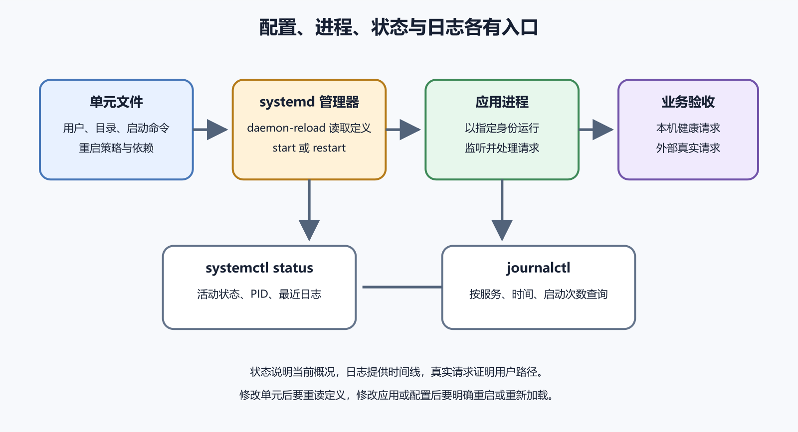

# systemd、systemctl、journalctl 和服务日志

你在 SSH 终端里运行后端，页面恢复了；终端一关，服务又消失。服务器重启后也没有自动回来。问题不是应用必须永远绑在 SSH，而是缺少一个负责进程生命周期的管理者。Ubuntu 常用 systemd 启动、停止、监视服务，并把管理器与服务输出交给 journal。

`systemctl` 用来查看和控制 systemd 的单元，`journalctl` 用来读取日志。一个管“状态和动作”，一个管“按时间留下的证据”。把两者混成“重启命令”，就会在最需要证据时反复覆盖现场。



*图 40-1　unit 描述怎样启动程序，systemd 创建和监视进程，journal 保存事件；用户可用还需额外健康与业务验证。*

## 先分清四个对象

1. **程序**是磁盘上的可执行文件与项目代码，例如 `/usr/bin/caddy` 或一个应用运行时。
2. **unit** 是 systemd 的声明，常以 `.service` 结尾，写运行用户、工作目录、启动命令和重启策略。
3. **进程**是程序实际运行后的实例，有 PID、资源占用和当前环境。
4. **日志**是管理器与程序按时间留下的事件。

修改程序文件不会自动创建新进程；修改 unit 不会自动改变正在运行的进程；`daemon-reload` 只让 systemd 重读声明，也不会重启所有服务。四个对象分开，才知道一次变更还缺哪一步。

托管平台已经负责进程生命周期时，通常不需要再引入 systemd。Docker Compose 管理容器时，也不要随手为每个容器复制一套 unit。先确认谁是唯一管理者，避免两个系统同时重启、争抢端口或各自保存一套状态。

## 状态给概况，日志给时间线

以下命令在你有权管理的练习服务器运行，`notes-api` 必须换成真实服务名：

```bash
systemctl status notes-api --no-pager
sudo journalctl -u notes-api -n 100 --no-pager
```

`status` 常显示 unit 是否加载、是否启用、当前 Active 状态、Main PID 和少量最近日志。`--no-pager` 让输出直接返回提示符；不使用时，看到底部 `(END)` 可按 `q` 退出。日志较多不等于终端卡住。

`active (running)` 说明 systemd 当前看见目标进程仍在，不证明端口对外开放、数据库可用或用户能登录。`failed` 说明启动或运行失败，也不说明 systemd 本身是根因。先保存状态与日志，再决定动作。

`journalctl -u` 按 unit 取事件。需要缩小现场时使用：

```bash
sudo journalctl -u notes-api --since "30 minutes ago" --no-pager
sudo journalctl -u notes-api -b --no-pager
sudo journalctl -u notes-api -b -1 --no-pager
```

`--since` 限定时间，`-b` 看本次系统启动，`-b -1` 看上一次启动。旧日志不存在可能意味着 journal 没有持久保存，不是服务从未失败。服务器与本地时区可能不同，事故记录要写时区；先用只读的 `timedatectl` 确认，不要为了看起来一致去改生产时钟。

复现时可在一个窗口跟随新日志：

```bash
sudo journalctl -u notes-api -f
```

另一个窗口只做一次测试请求，记录时间或 Request ID，再按 `Ctrl+C` 结束跟随。它只停止查看，不会停止服务。不要让多个环境的日志窗口长得完全一样；先记录主机名、环境和开始时间。

> **证据边界**
>
> `systemctl status` 证明管理器在某一时刻怎样理解 unit 与进程；`journalctl` 证明指定日志源留下了哪些事件。二者都不直接证明公网入口、数据库读写和关键用户流程可用。反过来，首页偶尔能打开，也不能证明服务会在主机重启后回来。

## start、restart、reload 与 enable

四个动词回答不同问题：

```bash
sudo systemctl start notes-api
sudo systemctl restart notes-api
sudo systemctl reload notes-api
sudo systemctl enable notes-api
```

`start` 启动当前服务；`restart` 停止旧进程再启动新进程，通常会有中断；`reload` 请求程序重读配置，只有程序和 unit 明确支持时才成立；`enable` 设置未来随系统启动的关系，不保证现在已运行。分别检查：

```bash
systemctl is-active notes-api
systemctl is-enabled notes-api
```

不要把 `reload` 当无中断版 `restart`。配置能否重载、哪些字段需要完整重启，由具体软件决定。先运行软件自己的配置验证器，查 `CanReload` 与官方文档。命令返回成功后仍看新日志和真实请求。

开机启用也只是配置状态。要证明主机重启后服务、网络、磁盘挂载、代理和业务都恢复，需要安排受控重启，事前确认备份、回退和云控制台入口，事后记录恢复时间。不要在生产高峰做第一次重启试验。

### 存活、就绪与业务可用

长期服务至少有三个层次。进程存活表示 PID 还在；服务就绪表示它已经完成初始化，能够接收预期请求；业务可用还要求依赖和真实操作成功。

有些程序先创建进程，再加载大型模型、连接数据库或执行缓存预热。

`Type=simple` 下 systemd 很早就可能显示 active，此时代理把流量送来仍会失败。支持 systemd 通知协议的程序可用 `Type=notify` 在真正就绪时报告，但即使如此，登录、读写和第三方调用仍需业务检查。不要为了让状态更好看随意改 Type，应按程序的官方运行方式配置。

健康地址也要控制范围。只返回固定字符串可以证明进程能响应，却发现不了数据库断开；每次健康检查执行重查询，又可能在监控高频调用下增加负载。常见做法是把存活与就绪分开，并让业务验收另走一条受控路径。具体选择取决于应用故障模式，不由 systemd 自动决定。

## 能读懂的最小 unit

下面只用于理解字段，不能原样套到未知项目：

```ini
[Unit]
Description=Notes API
After=network.target

[Service]
Type=simple
User=notes
Group=notes
WorkingDirectory=/srv/notes/current
ExecStart=/srv/notes/current/bin/notes-api
Restart=on-failure
RestartSec=5s

[Install]
WantedBy=multi-user.target
```

`User`、`Group` 决定权限；`WorkingDirectory` 决定相对路径从哪里解析；`ExecStart` 应指向明确程序；`Restart=on-failure` 允许异常退出后有限恢复。`After=network.target` 主要表达顺序，不证明数据库、DNS 或互联网已经可用，应用仍要处理依赖暂时失败。

systemd 默认不是交互式 shell。终端中能运行的管道、重定向、通配符、别名和 `export`，不能假定放进 `ExecStart` 仍有同样含义。优先用绝对程序路径和参数；复杂准备写进受版本控制、能单独测试的脚本，并明确解释器。秘密不放在命令行参数中，因为进程列表和日志可能暴露它。

管理员自建的系统 unit 常在 `/etc/systemd/system/`；软件包可能把维护的原始 unit 放在 `/usr/lib/systemd/system/` 或 `/lib/systemd/system/`。不要直接改软件包文件。先查看 systemd 实际加载的组合：

```bash
systemctl cat notes-api
systemctl show notes-api --property=User,Group,WorkingDirectory,ExecStart,Restart
```

需要小改时优先使用 drop-in，而不是复制整份上游 unit。这样升级仍能取得上游修正，也能看清本项目到底覆盖了什么。

## 一次启动失败怎样定位

假设新发布后 `notes-api` 不断退出。状态显示 `failed`，日志第一条有效错误是：

```text
Failed at step CHDIR spawning /srv/notes/current/bin/notes-api:
No such file or directory
```

这条信息先指向工作目录或发布链接，而不是数据库。维护者检查 `WorkingDirectory`，发现 `/srv/notes/current` 指向已被清理的旧目录。自动重启把同一错误写了很多遍；后续重复行不是新的根因。

安全处理是先保留状态、unit 与几行代表日志，停止故障服务，恢复正确发布链接，确认目录存在且 `notes` 用户能够进入，再验证 unit。若短时间失败触发频率限制，根因修复后才执行：

```bash
sudo systemctl reset-failed notes-api
sudo systemctl start notes-api
```

`reset-failed` 只清状态和部分计数，不会修复路径。永久关闭重启限制或把间隔调得极短，只会消耗 CPU、填满日志并打击上游。

启动后先看此次日志没有继续退出，再从主机请求健康地址，然后从公开入口完成一次真实读写。若本机健康成功、公开地址失败，转向反向代理、防火墙、域名和证书；若首页成功、保存返回 500，转向应用与数据库。检查结果决定下一层，不用重复重启碰运气。

另一个常见情况是服务一直 active，浏览器却返回 500，日志显示数据库认证失败。systemd 已完成“让进程运行”的职责，故障在应用配置或数据库身份。不断重启可能重复错误甚至锁定账号；应核对秘密来源、数据库可达和最近配置变更。

还有一种相反现场：公开请求偶尔成功，`status` 却显示主进程不断更换 PID。自动重启把短暂退出藏在用户重试之后。比较一段时间内的 PID、启动次数和第一条退出原因，检查崩溃是否来自内存、未处理异常或依赖超时。自动恢复减少中断，但持续重启本身就是需要告警和修复的故障。

一次 `SIGKILL` 或“进程被杀”也不能只归因于 systemd。可能是内核的内存不足处理、管理员动作、容器限制或 unit 资源上限。结合 journal、内核日志、资源指标和变更时间判断。直接调高内存上限可能暂时隐藏泄漏，还会把整机拖入更大风险。

## 安全变更必须带回退与用户验证

对 unit 或服务配置做生产变更前，按这个顺序：

1. 记录当前代码/制品版本、`systemctl cat`、状态、最近日志和健康结果。
2. 保存要修改的精确配置，确认旧版本、旧配置和恢复步骤可用。
3. 用程序自己的验证器检查配置；unit 可用 `systemd-analyze verify` 做静态检查。
4. 修改 unit 后执行 `daemon-reload`，它只重读声明。
5. 在批准的维护窗口重启或 reload 目标服务。
6. 依次检查 Active 状态、本次启动日志、本机健康、公开入口和关键业务。
7. 任一步失败就停止继续放量，恢复旧配置或旧制品，并重复同样的验证链。

```bash
systemd-analyze verify /etc/systemd/system/notes-api.service
sudo systemctl daemon-reload
sudo systemctl restart notes-api
```

静态验证能发现未知指令、缺失程序和部分引用问题，不能连接数据库或证明权限正确。服务状态截图也不是完整验收。变更记录至少包含命令、时间及时区、目标版本、预期、实际、修正和未验证项。

下面是一份最小变更证据，而不是命令流水账：

```text
主机与环境：production / app-01
变更对象：notes-api unit drop-in
变更前版本与健康结果：
备份或稳定配置：
静态验证：命令、退出码、警告
动作：daemon-reload + restart
新 Main PID 与启动时间：
本次启动第一条错误：无 / 具体内容
本机健康：
公开入口：
关键业务：测试账号创建并读取一条练习记录
回滚触发条件与实际状态：
仍未验证：
```

记录 Main PID 不是为了迷信数字，而是确认检查对应新进程。日志窗口从该启动时间开始，公开请求带测试标识或 Request ID，才能把四份证据连在同一次变更上。若重启以后又修改 unit，旧验证立刻过期，需要重读、重启并重新检查。

## 环境变量、日志和资源边界

SSH 里 `export API_KEY=...` 只影响当前 shell 与它启动的子进程，systemd 不自动继承。用 `Environment`、`EnvironmentFile` 或秘密管理服务时，要让来源明确、权限受限、不会进入 Git、能够轮换。环境文件变更后旧进程仍持有旧值，通常需要受控重启。

日志可能包含访问令牌、数据库地址、会话标识和个人数据。分享前保留时间、错误类型、调用位置和 Request ID，删除不必要的值。发现秘密已写入日志时，先停止继续写入并轮换秘密，再按保留与合规要求处理历史记录；删除整个 journal 既可能丢事故证据，也不能让已泄露令牌失效。

重启循环会迅速占用磁盘。先停止日志风暴或故障服务，确认调查材料与保留要求，再做精确清理。盲目扩盘只会推迟同一问题。应用同时写文件和标准输出时，也可能被保存两份；明确主要日志入口与各自保留策略。

日志级别也会影响查询。应用把全部错误都写成普通 info 时，按 error 优先级筛选会漏掉业务失败；把每个成功请求和完整对象都写入日志，又会增加磁盘与隐私风险。应保留时间、版本、错误类型、稳定请求标识和必要上下文，避免记录密码、Token 与完整用户载荷。日志是排错接口，也需要设计和测试。

### timer 与一次性任务何时相关

备份、报表或定期清理常由 `.timer` 按时触发一个 `.service`。timer 显示 active，只证明调度关系存在；最近一次实际任务可能已经失败。排查时分别查看 timer 的上次/下次时间、被触发 service 的状态与日志，再验证业务产物。例如备份进程退出码为零后，还要检查文件大小、校验和和一次恢复。

一次性服务完成后显示 `active (exited)` 可能正常；长期 API 显示 exited 则要检查 `Type`、程序是否自行后台化和 systemd 是否跟踪了错误进程。状态词必须结合 unit 的职责解释，不能用一套“active 就好、exited 就坏”的规则覆盖所有类型。

`Type=simple`、`notify`、`oneshot`，Restart 细项、timer、资源限制、依赖与用户服务都很重要，但不是理解一次普通 Web 服务故障的前置条件。只在项目真实使用时深入。特别是 `active (exited)` 对一次性服务可能正常，对长期 API 则需要检查类型、后台化方式、端口和健康请求。

## 现在可以跳过什么，继续查哪里

如果项目完全由托管平台管理进程，可以暂时跳过 systemd；若只使用一个软件包提供的稳定 unit，先学会状态、日志、重启与验收，不必自己写模板。只有需要自建长期进程、timer、资源限制或复杂依赖时，再进入完整配置。

当服务承载登录、支付、生产数据或多人共用功能时，变更还应有维护窗口、通知、独立复核与持续失败告警；个人练习服务可以简化协作流程，但仍不能省去现场记录、回退点和一次用户路径。流程强度由失败后果决定，不由命令长短决定。

unit 模板、drop-in、timer、日志容量、服务类型、重启策略、系统/用户服务和运行手册模板见[《Linux 与服务器运行手册》](../../references/linux-server.md)。本章要记住的核心只有一句：systemd 管进程生命周期，日志解释发生过什么，而用户可用必须在进程之外继续验证。
