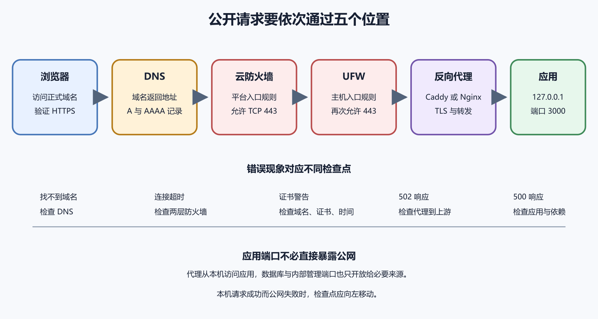

# 防火墙、Caddy、Nginx、域名与 HTTPS

应用已经在服务器的 3000 端口运行，浏览器却不应该直接访问 `http://服务器地址:3000` 作为正式入口。公开网站还需要域名、标准端口、HTTPS 和一层负责接收外部请求的软件。这层软件常称反向代理。Caddy 和 Nginx 都能承担这个角色。它们监听公开的 80 和 443 端口，把请求转发给只在本机监听的应用。

防火墙决定哪些连接允许抵达。DNS 把域名指向服务器。TLS 证书让浏览器验证域名身份并建立加密连接。四者各自负责一段，缺少一段都会表现为网站打不开。



*图 41-1　DNS、云防火墙、主机防火墙、反向代理与应用的顺序。等价说明见本章“请求经过哪些关口”。*

## 请求经过哪些关口

用户输入 `https://example.com`。DNS 先返回服务器地址。浏览器连接服务器的 443 端口。云平台防火墙检查这条连接，Ubuntu 防火墙再次检查。Caddy 或 Nginx 接受连接并完成 TLS，然后把 HTTP 请求转发到 `127.0.0.1:3000`。应用生成响应，沿原路返回。

DNS 错误时，请求去错机器。防火墙阻止时，请求到不了代理。代理配置错误时，可能返回 502。应用错误时，代理正常却收到 500。把请求经过的位置写出来，排错就有顺序。没有必要同时修改 DNS、防火墙和代理配置。

防火墙按地址、端口和协议决定网络包是否通过。它不知道 `/login` 应该交给哪个页面，也不会生成网站内容。反向代理理解 HTTP 请求，可以按域名或路径选择上游。它不应该代替应用做完整业务授权。一个安全的常见布局是，云防火墙和 UFW 只允许 SSH、HTTP、HTTPS。应用端口 3000 只监听 `127.0.0.1`，数据库端口也只允许必要来源。

“端口没有对公网开放”与“端口没有监听”是不同状态。前者由网络规则控制，后者由程序运行状态控制。

## 先查看现有规则

下面命令在远程 Ubuntu 服务器运行，只读查看 UFW 状态。

```
sudo ufw status numbered
```

`numbered` 给规则编号，方便以后准确识别。输出为 `inactive` 时表示 UFW 未启用，不代表服务器没有任何防火墙，云平台仍可能过滤流量。再到云平台控制台查看实例防火墙或安全组。记录两层规则，不要只截取其中一页。

Ubuntu 官方把 UFW 作为主机防火墙配置工具，并提供状态和规则命令。网络安全文档也把防火墙放在分层防护中。

## 启用防火墙前保护 SSH

远程修改防火墙可能让当前或下一次 SSH 连接失败。启用前必须知道实际 SSH 端口，并准备云控制台救援入口。若 SSH 使用默认端口，可以先添加明确规则。

```
sudo ufw allow 22/tcp
```

这条命令会修改防火墙。`allow` 允许连接，`22/tcp` 指 TCP 22 端口。若服务器使用其他 SSH 端口，必须替换成真实值。随后另开终端验证 SSH，再考虑启用防火墙。不要关闭旧会话。生产服务器规则变更还要记录来源范围，若管理员有固定出口地址，可限制 SSH 来源。

本章不要求读者在未知规则的现有服务器上直接运行 `ufw enable`。启用动作会改变网络行为，应在新测试实例中练习。

## Web 入口通常只需要 80 和 443

HTTP 使用 TCP 80，HTTPS 使用 TCP 443。可以为这两个端口添加规则。

```
sudo ufw allow 80/tcp
sudo ufw allow 443/tcp
```

修改后再次查看状态。

```
sudo ufw status numbered
```

预期只出现计划开放的端口。应用的 3000 端口不需要对公网开放，因为反向代理通过本机访问它。测试成功后仍要检查 IPv4 和 IPv6 规则是否符合预期。只限制 IPv4，服务却同时监听 IPv6，可能留下另一条入口。

## 为什么推荐初学者先学 Caddy

Caddy 的配置较短，能在满足条件时自动获取和续期公开证书。一个单应用站点可以用很少配置建立 HTTPS 反向代理。Nginx 使用广泛、能力成熟，资料和部署实例很多。证书通常需要配合发行版工具或其他 ACME 客户端管理。它的配置选择更多，初学者也更容易复制不理解的片段。

本书用 Caddy 讲第一次自建 HTTPS，用 Nginx 说明另一种常见路径。读者不需要在同一台服务器同时安装两者。它们默认都想使用 80 和 443，会发生端口冲突。

前置条件包括域名已解析到服务器、80 和 443 可从公网访问、应用在 `127.0.0.1:3000` 正常响应、服务器时间正确。Caddy 官方反向代理快速入门也把 DNS 与端口可达列为自动 HTTPS 的条件。

下面是 Caddyfile 的最小示例。

```
example.com {
    reverse_proxy 127.0.0.1:3000
}
```

第一行声明站点域名。`reverse_proxy` 把请求交给本机 3000 端口。真实操作必须替换域名和端口。Caddy 官方指令文档说明了上游地址和代理行为。配置文件通常位于 `/etc/caddy/Caddyfile`，实际位置取决于安装方式。

## 配置先验证再加载

下面命令在远程服务器运行，只验证指定配置，不应直接切换服务。

```
sudo caddy validate --config /etc/caddy/Caddyfile
```

成功时应明确显示配置有效。若提示解析错误，记录行号并修正。不要通过不断重启服务试探语法。验证通过后再重新加载。

```
sudo systemctl reload caddy
sudo systemctl status caddy
```

第一条让 Caddy 重读配置，第二条检查状态。Caddy 命令行文档列出了验证和重新加载能力。随后检查最近日志和 HTTPS 地址。只有状态、日志和真实请求都正确，变更才算通过。

## 自动 HTTPS 不是无条件发生

Caddy 需要证明你控制域名。公开证书机构会从互联网验证域名，验证方式依赖配置。DNS 未生效、端口被拦、域名指向旧服务器或证书签发频率受限，都会失败。证书申请失败时先查看 Caddy 日志、DNS 解析和 80、443 连通性。不要关闭 TLS 校验，也不要把浏览器证书警告当成可以忽略的显示问题。

内部测试域名、私有 IP 和本机名称不一定能取得公开信任证书。测试环境可以使用平台临时域名、内部证书或本地信任方案，不能把不受信任证书直接交给公众用户。

Nginx 配置通常在 `server` 块中声明监听端口、域名和代理目标。下面只展示关系。

```
server {
    listen 80;
    server_name example.com;

    location / {
        proxy_pass http://127.0.0.1:3000;
    }
}
```

`listen` 指定入口端口；`server_name` 选择域名；`location /` 匹配站点路径；`proxy_pass` 指向应用上游。NGINX 初学者指南说明了配置结构、代理和重新加载。`proxy_pass` 的准确行为由官方代理模块文档定义。这段配置只有 HTTP，没有证书。正式站点还要按当前 Nginx 与证书工具的官方文档添加 TLS。不要从多年以前的博客复制旧加密参数。

## Nginx 配置也要先测试

修改后先运行。

```
sudo nginx -t
```

成功时会显示语法和配置测试通过。失败时按文件和行号修正。测试通过后再重新加载服务。

```
sudo systemctl reload nginx
sudo systemctl status nginx
```

重新加载后发出真实请求并查看访问日志和错误日志。配置语法正确只证明文件能解析，不证明上游应用可达。

## 502 错误说明什么

浏览器收到 502 Bad Gateway，常表示反向代理已经接受请求，却无法从上游得到有效响应。先在服务器本机运行。

```
curl -i http://127.0.0.1:3000/health
```

失败时检查应用服务和日志。成功时再核对代理中的上游地址、端口和协议。如果应用只监听某个容器网络地址，主机上的代理可能无法使用 `127.0.0.1` 访问。第七卷会解释容器网络。不要通过把 3000 端口直接开放公网来绕过 502。那会改变系统安全边界，也没有修复代理与应用之间的错误。

在本地电脑检查域名当前解析。

```
nslookup example.com
```

Windows、macOS 都可使用相应 DNS 工具，输出格式会不同。确认返回地址是当前服务器。DNS 修改需要传播和缓存时间。电脑、路由器、运营商和公共解析器看到的结果可能暂时不同。使用多个可信解析器交叉检查，不要因为自己电脑仍看到旧地址就不断改记录。

域名同时存在 A 和 AAAA 记录时，浏览器可能优先使用 IPv6。AAAA 指向错误服务器会造成部分网络失败，而 IPv4 测试正常。

## HTTPS 的验证不能只看小锁图标

访问正式域名，确认浏览器没有证书警告。查看证书覆盖的域名、有效期和颁发者。再检查 HTTP 是否按计划跳转到 HTTPS。使用命令查看响应头。

```
curl -I https://example.com
```

`-I` 只请求响应头。成功时应看到预期状态码。若站点依赖路径和登录，还要测试真实页面和接口。证书有效只说明 TLS 身份验证和加密连接通过，不说明应用安全。输入验证、授权、秘密和更新仍由其他层负责。

反向代理终止 TLS 后，上游应用收到的连接可能是本机 HTTP。应用若不知道原始请求使用 HTTPS，可能生成错误跳转或不安全 Cookie。Caddy 和 Nginx 会按各自规则设置转发头。应用框架通常需要配置可信代理范围，才能使用这些头判断客户端地址和协议。

不能无条件信任来自任何客户端的 `X-Forwarded-For`。只有可信代理写入或清理这些头时，它们才适合用于日志与限流。具体配置要查应用框架和代理的官方文档，不能只抄一段通用头部设置。

## WebSocket 和大文件上传

实时应用可能使用 WebSocket，文件服务可能需要较大请求体和较长超时。代理默认值会影响连接升级、大小限制和等待时间。先用最小 HTTP 代理让普通接口工作，再根据实际功能增加设置。一次复制几十条“优化参数”，以后很难知道哪一条造成问题。

大文件限制要在浏览器、代理、应用和对象存储各层核对。把代理上限调大，不会自动改变应用限制，也会增加资源消耗风险。

旧站仍运行时，先把 DNS 记录的缓存时间调到适合迁移的较低值，并等待原缓存周期过去。这个动作要提前做。在新服务器上用临时域名或本地 hosts 映射验证应用、代理和证书路径。准备旧地址、数据库兼容和回滚步骤。

切换 DNS 后从不同网络检查解析、HTTPS、核心页面和接口。监控新旧服务器请求，确认用户流量逐步迁移。发现严重错误时，按已写好的回滚记录恢复 DNS 或代理。DNS 缓存意味着回滚也不会让所有用户瞬间回到旧站，因此新旧版本要能并存一段时间。

## 云防火墙可以限制 SSH 来源

网站的 80 和 443 面向公众，SSH 通常只需要管理员网络访问。云防火墙支持来源地址时，可以只允许办公室、家庭固定出口或 VPN 网段连接 SSH。家庭公网地址可能变化。规则过窄会在地址变化后阻止连接，因此要保留控制台救援入口，并记录修改方式。

移动网络和公共 Wi-Fi 的出口地址不固定，不适合直接写成永久规则。团队可以使用受控 VPN 或跳板入口，服务器增多后再评估。来源限制不能替代密钥认证。攻击者若已进入允许网段，仍要由 SSH 身份验证阻止。

每条防火墙规则记录协议、端口、来源、用途、创建日和负责人。临时规则写到期日。“允许所有 TCP”无法说明业务目的，也让未来审查困难。数据库调试完成后，删除临时公网规则，并从外部网络验证端口已关闭。

云平台和 UFW 都存在同类规则时，保持文档对应。一个层删除、另一个层保留，可能让团队误以为入口已经关闭。规则变更后检查现有 SSH、新 SSH、HTTPS 和不应开放的端口。验证包含允许与拒绝两类结果。

## UFW 删除规则前先看编号变化

`ufw status numbered` 会列出编号；删除一条后，后续编号可能重新排列；一次只删除一条，再重新获取列表；不要根据旧截图连续删除多个编号。规则删除会改变网络访问，执行前确认不是当前 SSH 入口。误删后若仍保留会话，可以立即恢复。会话已断开时要使用云控制台。

生产环境更适合把防火墙规则写入基础设施文档或自动化配置，避免控制台和主机状态长期漂移。

Caddy 会保存证书、私钥和状态数据。具体目录取决于运行用户、安装方式和环境。备份与权限策略要跟随官方安装说明。不要把 Caddy 数据目录当作普通缓存随意删除。删除后服务可能重新申请证书，触发签发频率限制或在网络条件不满足时失去 HTTPS。

迁移服务器时，域名控制和正确配置仍是核心。可以让新服务器重新签发，也可以按官方方式迁移状态，不能手工复制未知权限的私钥。证书私钥属于秘密，备份要加密并限制访问。日志和支持工单不应包含完整私钥内容。

## 证书续期失败怎样提前发现

浏览器只有证书过期后才明显报警，用户会先受影响。监控应在到期前多次提醒。检查域名仍指向正确服务器，80 和 443 可达，Caddy 或证书客户端正在运行，系统时间同步。查看最近续期日志。

更换 DNS 代理、关闭端口或迁移实例后，要立即做一次续期条件检查。现有证书仍有效数周，会掩盖未来失败。自动化成功记录也要保留。只有失败告警，没有定期成功证据，可能因监控本身停止而沉默。

某些 DNS 服务可以代理网站流量并提供 CDN、TLS 和防护。启用后，浏览器连接的是代理网络，代理再连接你的服务器。服务器日志看到的来源地址可能变成代理节点。应用要按供应商当前文档配置可信来源头，不能无条件信任客户端传来的地址。

代理侧和源站侧各有 TLS 设置。选择只加密浏览器到代理、源站仍用 HTTP，会留下未加密一段。正式站点优先让代理到源站也验证 HTTPS。排错时可分别测试公开代理地址和受控源站入口。不要为测试长期公开一个绕过代理的无限制端口。

## HSTS 不能在试验阶段随意开启

HTTP Strict Transport Security 常缩写为 HSTS。浏览器收到这个响应头后，会在一段时间内强制使用 HTTPS。它能降低降级连接风险，也会让证书或 HTTPS 配置错误更难临时绕过。包含所有子域和提交到预加载列表的影响更长。

先确保主域和所有需要的子域长期支持 HTTPS，续期监控可靠，再按当前浏览器与安全文档评估。不要从“安全头大全”复制一个超长有效期。测试环境使用独立域名，避免错误 HSTS 影响正式域或本地开发。

访问日志记录请求时间、路径、状态码、响应大小和耗时等信息。错误日志记录代理连接上游、证书和配置故障。浏览器返回 502 时，访问日志证明请求到达代理，错误日志通常指出连接上游失败。完全没有访问记录时，问题可能在 DNS、防火墙或另一台服务器。

日志格式不要记录 Cookie、Authorization 和完整查询秘密。IP 地址也可能属于个人数据，要按适用规则设置用途和保留期。为每次测试加入唯一但不含秘密的请求标识，能在浏览器、代理和应用日志之间对应。

## 反向代理超时不是越长越好

应用处理慢时，把代理超时调到几分钟可能让请求暂时不报错，也会占用更多连接和资源。先判断操作是否应该同步完成。生成大型报告适合提交任务后异步查询进度，不能让浏览器一直等待。连接上游超时、读取响应超时和发送请求超时是不同阶段。根据日志中的具体超时选择设置。

调整后要测试慢请求、断开客户端和上游故障，确认不会堆积连接。

代理常限制上传大小。用户上传大文件收到 413 时，先查看代理、应用和对象存储各层上限。把代理上限设得极大，会让攻击者或误操作更容易耗尽磁盘和带宽。限制应来自业务允许的文件类型与大小。

上传功能还要检查文件名、类型、内容、存储位置和访问权限。OWASP 的文件上传资料在安全卷会详细使用。超大文件适合让客户端直接上传到对象存储的受控地址，减少应用服务器中转。仍要验证授权和完成回调。

## 真实客户端地址与可信代理

应用用于限流和审计时，常需要原始客户端地址。代理通过标准或常见转发头传递。客户端也能自行发送同名头。应用必须只信任来自已知反向代理的连接，并按框架规则解析代理层数。配置错误可能把所有用户看成代理地址，或者允许用户伪造地址。测试时从两个不同网络请求，检查应用日志和限流行为。

使用多层 CDN、负载均衡和代理时，可信链更复杂，应跟随每个供应商与框架的官方文档。

Caddyfile 或 Nginx 配置可以设置请求头，但不适合随意写入数据库密码和第三方主密钥。配置文件常被备份、复制或展示在支持信息中。若代理必须向上游添加凭据，使用受控环境文件或秘密系统，并限制配置读取。更好的设计是让内部网络和服务身份承担认证。

检查调试日志不会把完整请求头输出。轮换凭据时重载代理，并验证旧值已撤销。

## 多个域名怎样分流

一台服务器可以让 `api.example.com` 指向 API，让 `www.example.com` 指向静态站点。反向代理按请求域名选择站点块。每个域名都要有正确 DNS 和证书。复制配置时最容易漏改上游端口或证书域名。先逐个使用临时响应验证域名匹配，再连接真实应用。默认站点不要泄露内部路径或管理界面。

多个项目共享一台主机也共享 CPU、磁盘和故障范围。任何项目高负载都可能影响其他域名，需要资源监控。

蓝绿发布同时保留旧版和新版应用，代理一次只把正式流量指向其中一个。新版通过独立端口或主机先验收，再切换入口。切换很快，回滚也快。代价是同时运行两套资源，数据库必须兼容两版。个人项目可以用两个本机端口练习，例如旧版 3000、新版 3001。防火墙都不向公网开放，由代理选择。

不要在生产数据库上用未经兼容设计的新旧版本同时写入。第 42 章会把数据库迁移纳入发布回滚。

## 一份入口故障记录

记录域名解析结果、测试网络、时间、云防火墙、UFW、代理状态、监听端口、证书和上游健康请求。按请求顺序排列。不要只贴一张浏览器错误页。浏览器错误说明用户现象，服务器证据才能定位层级。

隐去公网管理地址、令牌、Cookie 和内部头。保留状态码、时间、服务名和必要域名。修复后从外部网络重新测试 HTTPS，并确认不该开放的应用端口仍被阻止。

网站全部跳转到 HTTPS 后，仍可能需要 80 完成跳转和某些证书验证。能否关闭取决于证书方式和客户端需求。不要看到所有页面使用 443 就直接删掉 80 规则。先查 Caddy 或证书客户端当前验证方式，做一次续期测试。

保留 80 时只提供跳转或验证，不应在那里暴露独立管理页面。访问日志仍要监控异常请求。安全策略要基于真实用途，不能只按端口数字判断。

## 源站地址泄露后的影响

使用 CDN 或代理时，攻击者若知道源站 IP，可能绕过代理直接请求。源站防火墙可以只允许代理网络和管理员入口。代理网络地址范围会变化，规则要跟随官方自动更新并监控。写死旧范围可能造成网站中断。

更换源站 IP、清理 DNS 历史和限制主机头也能降低绕过。不能保证地址永远不被发现。即使流量经过 CDN，源站应用仍要做授权、输入验证和限流。

请求使用未知域名或直接 IP 时，代理仍可能返回默认页面。页面可能暴露服务器类型、项目名或内部测试站。配置一个最小默认响应，拒绝未知主机名。不要把管理界面作为默认站点。测试正式域名、服务器 IP 和随机 Host 头，确认只有计划域名进入应用。

隐藏版本号只能减少线索，软件更新和权限才是主要防护。

## TLS 版本与加密套件先用安全默认值

Caddy 等现代工具会提供维护中的安全默认值。初学者不需要复制旧教程中的长套件列表。手工固定算法会在浏览器和安全标准变化后过时。只有合规或兼容要求明确时才调整，并用当前测试工具验证。

支持过旧客户端会扩大协议范围。根据真实用户设备决定，不能为了一个未知客户端永久开启淘汰协议。每次代理大版本升级后阅读兼容说明，保留配置验证和回滚。

证书状态、证书透明度和在线状态协议属于 TLS 生态。代理和浏览器通常自动处理大部分流程。现在需要掌握的是域名匹配、有效期、受信任颁发者和自动续期。遇到浏览器具体证书错误，再按错误名称查官方资料。

不要安装来源不明的根证书来消除警告。根证书能让安装者信任其签发的连接，风险很高。测试内部证书时，只在受控设备和环境配置，正式用户入口使用公开受信任方案。

## 反向代理版本也要更新

代理直接暴露互联网，是高优先级更新组件。订阅 Caddy 或 Nginx 安全公告，使用受支持安装来源。更新前保存版本、配置和验证结果。新版本在测试机执行配置验证与真实请求，再进入生产窗口。

更新完成确认运行进程版本，而不只看磁盘包版本。检查证书、WebSocket、上传和自定义头。出现兼容问题按包管理或发布记录回滚，不能从未知网站下载旧二进制覆盖。

域名 A 记录正确，AAAA 记录仍指向已删除旧服务器。只使用 IPv4 的网络访问正常，优先 IPv6 的用户超时。排查时分别查询 A 与 AAAA，从支持 IPv6 的网络测试。修正或删除错误 AAAA 后等待缓存过期。

证书和防火墙也要同时支持计划保留的 IPv6。只改 DNS，源站没有 IPv6 监听仍会失败。“我这里能打开”不能证明全球用户路径。至少从不同网络和地址族验证。

## 一个证书域名不匹配案例

`www.example.com` 证书正常，裸域 `example.com` 显示名称不匹配。原因是代理配置和证书只包含一个名称。DNS 两个名称都指向服务器时，站点配置也要声明两者，并决定哪个跳转到哪个。修正后分别访问两种地址，查看证书覆盖名称和跳转目标。避免形成循环跳转。

子域不会自动继承所有证书。通配符证书也有验证和安全边界，按当前官方说明使用。

先确认 A 与 AAAA 解析。再从外部网络检查 80 和 443，确认应用内部端口被阻止。访问主域和子域，检查证书、跳转、状态码、页面资源、登录和 API。测试大文件与 WebSocket 等实际功能。

查看代理访问和错误日志，确认客户端地址处理正确，没有秘密。检查证书续期监控和服务开机启动。最后保存配置版本、规则清单、测试时间和回滚入口。入口验收完成后才切换正式流量。

## 一句话区分五个常见结果

域名不存在先查 DNS；连接超时先查地址和防火墙；连接被拒绝先查监听服务；证书警告先查域名、有效期和信任。收到 502 先查代理到应用，收到 500 先查应用与依赖。这组对应关系是起点，不是最终诊断。保留时间、完整错误和每层检查结果，才能确认根因。

修复一层后从用户入口重新测试，避免内部正常、外部仍失败。同一次验收要保留一个不经过浏览器缓存的请求。浏览器可能显示旧页面或缓存旧跳转，命令行响应头和代理日志能确认请求是否真正到达新服务器。

清除缓存前先记录现象，避免把有价值的错误证据一起抹掉。
