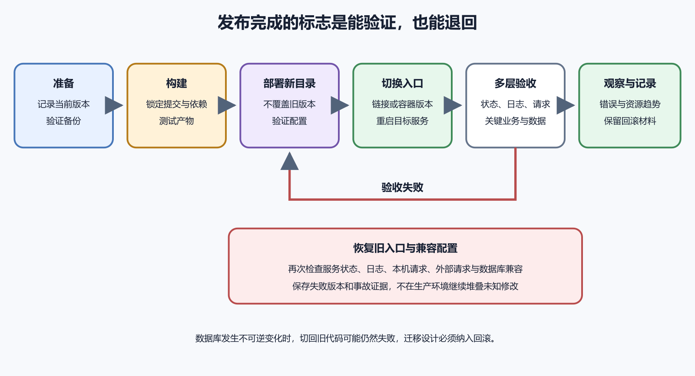

# 部署、更新、回滚、备份和恢复

第一次把应用放到服务器只是部署。几周后升级依赖、修改数据库、替换配置和恢复故障，才会检验部署方法是否可靠。一个可维护的发布至少要回答五件事。新版本从哪里来，构建在哪里完成，切换时怎样验证，失败时怎样回到旧版本，数据怎样恢复。

“把新文件覆盖上去，再重启”缺少版本边界。文件只覆盖了一半、依赖更新失败或数据库已经改变时，很难知道服务器处于哪个版本。



*图 42-1　准备、发布、验证、切换与回滚形成完整循环。等价说明见本章“发布应当是一组可逆步骤”。*

## 发布应当是一组可逆步骤

准备阶段记录当前应用版本、配置版本、数据库迁移状态和健康检查结果。确认备份存在，并知道怎样恢复。构建阶段从明确提交生成产物，验证依赖和测试。能在 CI 或本地受控环境构建时，不要让生产服务器临时承担所有编译工作。

发布阶段把新版本放到独立目录，不覆盖正在运行的版本。安装生产依赖，准备配置引用，并执行不影响用户的检查。切换阶段让服务指向新目录或新容器，然后检查服务状态、日志、本机健康地址、外部 HTTPS 和关键业务。

失败时停止扩大影响，恢复旧版本指向和兼容配置。成功后保留最近版本与回滚记录，按计划清理更旧产物。

可以使用下面的概念布局。

```
/srv/notes-api/
  releases/
    20260805-101500/
    20260728-164000/
  shared/
    uploads/
    app.env
  current -> releases/20260805-101500/
```

每次发布创建新目录；`current` 是符号链接，指向当前版本；上传文件和秘密配置放在 `shared`，不会随代码版本替换；切换 `current` 很快，也便于恢复旧版本；前提是应用、依赖和数据库迁移能与旧版本兼容；符号链接切换不是完整回滚方案。数据库已删除字段、后台任务已改变数据格式时，旧代码可能无法工作。

## 发布标识必须能追到源代码

目录时间只能说明发布发生时间。还要记录 Git 提交哈希、构建环境、依赖锁文件和操作人。应用可以在健康检查或管理页暴露非秘密版本号。故障时能确认用户实际访问哪一版，避免“我以为已经更新”的争论。

构建产物应来自干净、可复现的步骤。不要在生产目录手工改一行代码后忘记提交。紧急修复也要回到版本控制，随后重新发布正式产物。

小项目常直接在服务器 `git pull` 后安装和构建。这条路径简单，却把 Git 凭据、开发依赖和编译压力带入生产环境。更稳妥的路径是在 CI 或专用构建环境生成产物，再传到服务器。服务器只安装运行所需内容。这样能减少攻击面，也避免构建占用内存导致在线进程退出。

无论在哪构建，都要使用锁文件，记录运行时版本，并验证产物中没有 `.env`、私钥和开发测试数据。项目很小也可以先保留服务器构建，但要承认限制。发布窗口监控内存，构建失败不覆盖旧版本，下一步计划迁移到独立构建。

## 更新系统软件前先看影响

`sudo apt update` 只更新索引。`sudo apt upgrade` 会修改已安装软件，可能更新内核、库和服务。生产服务器升级前先运行可升级列表，阅读重要包的发布说明，确认是否需要重启。保存当前实例快照或可用备份，并确认数据库有独立备份。

不要把云快照当作数据库一致性保证。应用正在写数据时拍摄的磁盘快照，恢复后可能需要数据库恢复过程。以数据库官方备份工具和供应商说明为准。Ubuntu 包管理文档用于核对安装、更新和清理行为。第三方仓库会增加升级失败和依赖冲突风险。

先确认当前版本还能取得，旧依赖和配置仍在。确认磁盘有足够空间同时保存新旧版本。运行自动测试和构建。检查数据库迁移，判断它能否向后兼容。对外 API 变化要考虑旧网页缓存和旧 App 客户端。

列出需要重启的服务和可能中断时间。通知相关人员，避免有人同时改服务器。准备具体验收请求，例如打开首页、登录测试账号、创建一条临时记录、上传测试文件。只检查 `/health` 不能覆盖完整业务。

## 配置变更与代码变更分开记录

代码相同，环境变量不同，行为就可能不同。发布记录应同时包含代码版本和配置版本。配置文件可使用模板进入 Git，真实秘密保存在受控位置。变更秘密时记录密钥名称和轮换时间，不记录值；修改 Caddy 或 Nginx 配置前运行验证器；修改 systemd 单元后运行 `daemon-reload`；配置验证通过只是入口，还要发真实请求。

一次发布只包含必要变化。升级运行时、替换数据库、改反向代理和发布新业务同时进行，会让失败原因难以定位。

新增可空字段通常能让新旧代码暂时共存。立即删除旧字段会让旧代码回滚后失败。一种常用安全顺序是先扩展，再迁移数据，最后收缩。第一版新增结构并同时支持新旧格式。后台迁移已有数据。确认所有客户端升级后，再在后续版本移除旧结构。

数据库迁移文件要进入版本控制，执行状态要记录。Supabase 官方迁移资料也把本地变更、迁移文件和远程应用放在可追踪流程中。任何破坏性迁移前都要有数据库专用备份，并在相同大版本环境测试恢复。

## 健康检查应检查什么

最浅健康检查只确认进程能响应。它适合负载均衡器快速判断，不能证明数据库、存储和外部依赖正常。更深检查可以验证数据库连接和必要内部服务，但不应每秒执行昂贵查询，也不应暴露秘密和内部结构。

发布验收还需要业务操作。一个 API 返回 200，却因权限规则错误让所有用户看见他人数据，健康检查仍会通过。把快速存活检查、依赖就绪检查和人工业务验收分开，能避免一个接口承担冲突目标。

systemd 显示运行是第一项，最近日志没有重复错误是第二项，服务器本机健康请求成功是第三项。随后从公网通过正式域名和 HTTPS 发出请求，再完成关键业务操作和数据检查。这两项把服务内部状态延伸到用户结果。

监控一段时间后，错误率、响应时间和资源使用没有异常，才完成发布观察期。观察时长按项目风险决定。

## 何时应立即回滚

登录、支付、数据写入或权限出现严重错误时，优先停止扩大影响。回滚通常比在线修改多个未知点更安全。新版本无法启动、错误率显著上升、资源快速耗尽，也应按阈值回滚。阈值要在发布前写好，事故中临时争论会浪费时间。

若数据库迁移不可逆，简单切回代码可能更危险。此时需要进入维护模式，按数据恢复计划处理。回滚不是失败的耻辱。它是发布系统主动保护用户的能力。

假设 `current` 指向新版本，旧版本目录仍在。先停止应用接收新请求或进入维护窗口，再把链接切回旧目录。具体命令会修改生产入口，必须按实际路径审查。本书不提供可直接粘贴到任意服务器的递归脚本。切换后重启服务，依次检查状态、日志、本机和公网请求。确认数据库结构仍与旧代码兼容。

发布记录中写明回滚原因、起止时间、受影响功能和后续处理。不要删除失败版本和日志，先保留调查证据。

## 备份究竟是什么

备份是独立保存、可用于恢复的数据副本。服务器中另一个目录里的复制，不足以抵御整盘损坏、账号误删或勒索攻击。一个项目可能需要分别备份数据库、上传文件、配置、密钥恢复材料和部署说明。代码通常已在 Git 中，但未提交的生产修改无法从 Git 恢复。

Ubuntu 备份指南要求计划中明确备份什么、频率、位置和恢复方式，并考虑异地和冗余副本。备份计划还要写保留周期、加密、访问人和删除方式。无限保留会增加费用与隐私风险。

数据库运行时直接复制底层文件，可能得到不一致副本。使用数据库提供的逻辑导出、物理备份或托管服务快照，并遵循对应版本说明。PostgreSQL 官方文档列出 SQL 导出、文件系统级备份和持续归档等方法。小项目常从 `pg_dump` 逻辑备份开始，但恢复时间和权限对象也要测试。

SQLite 是单文件数据库，也不能在任意写入时刻随意复制。SQLite 提供在线备份接口以创建一致快照。数据库备份应与应用上传文件的时间点协调，否则记录可能引用不存在的文件，或文件没有对应记录。

## 快照、备份和复制的区别

云主机快照保存某一时刻的磁盘状态，适合重建实例。它可能包含操作系统、应用和数据，也可能遗漏附加磁盘。数据库备份理解数据库结构和事务，更适合精确恢复数据。对象存储版本控制能帮助找回被覆盖或删除的文件，但需要启用并承担额外费用。

复制把数据同步到另一位置，主要提高可用性。错误删除也可能被同步，因此复制不能替代备份。三者可以组合。不要用一个名词覆盖所有恢复需求。

至少一份副本应离开当前服务器和当前故障域。服务器磁盘和同盘备份会一起损坏。对象存储适合保存加密备份，AWS S3 官方文档描述了对象、桶、权限和版本控制等模型。使用任何供应商都要限制凭据、设置生命周期和监控费用。

备份账号最好与生产应用权限分开。应用若被攻破，不应能删除所有历史备份。下载到个人电脑可以作为额外副本，但要加密并纳入设备备份。随手放在桌面文件夹不是稳定机制。

## 恢复测试才证明备份可用

建立隔离测试环境，准备与生产兼容的软件版本。取得一份备份，验证校验值和解密能力。按书面步骤恢复数据库、文件和配置。启动应用后执行查询、登录、上传和关键业务检查。记录恢复所需时间、缺失依赖、权限问题和数据截止点。修订步骤后再次测试。

若从未恢复过，备份只能算一个希望。恢复演练会发现密码过期、脚本缺包、版本不兼容和文件未纳入等问题。

恢复点目标描述最多能接受丢失多少时间的数据。每天备份一次，最坏可能丢失接近一天的新数据。恢复时间目标描述服务最多能接受停机多久。一个备份需要两天下载和导入，就无法满足两小时恢复目标。

这两个目标决定备份频率、存储方式和自动化投入。个人实验项目可以接受更长时间，真实付费服务需要更严格方案。目标应由业务后果决定，不由工具默认值决定。

## 一次磁盘占满事故

应用开始返回 500，systemd 仍显示运行。`df -h` 发现根文件系统已满，`du` 显示错误日志快速增长。安全顺序是停止制造日志的故障来源，保存必要证据，确认可删除或压缩的日志，再释放空间。随后修复错误循环并配置日志保留。

如果直接删除数据库文件或整个日志目录，可能把可恢复故障变成数据损坏。扩盘能争取时间，但不是根因修复。恢复服务后还要验证数据库写入、上传和备份任务，因为它们可能在磁盘满期间失败。

保留当前版本、至少一个已验证旧版本和对应配置。更多历史版本可以按容量与风险策略归档。删除前列出目标目录、大小、创建时间和当前符号链接。确认没有服务、定时任务或回滚记录引用它。清理容器镜像、包缓存和日志时使用各工具的安全命令，避免递归删除宽泛目录。第七卷会专门解释 Docker 清理和数据卷风险。

发布完成后更新运行手册、依赖版本、恢复步骤和下一次待处理风险。没有记录的临时修复会成为未来事故。

## 选择怎样把产物送到服务器

可以让服务器从 Git 取得代码，可以由 CI 上传压缩产物，也可以从制品仓库下载已签名版本。每条路径都要解决身份、完整性和重复执行。服务器直接 `git pull` 简单，却可能受到工作区未提交修改、分支错误和仓库凭据影响。CI 上传能让构建统一，但上传凭据必须限制到目标目录或部署动作。

制品仓库保存每个版本与校验值，适合更正式流程。个人项目暂时不用搭复杂系统，也应至少给压缩包写版本和提交编号。传输结束后先在新目录解压和验证，不能直接覆盖 `current`。文件不完整时，旧版本仍应继续服务。

`rsync` 能高效同步文件，常用于发布。它的源路径末尾斜杠会影响目录层级，`--delete` 会删除目标中源端没有的文件。如果目标目录混有上传文件，`--delete` 可能把用户数据清掉。正式执行前使用 `--dry-run` 预览，检查源、目标和预计删除列表。

同步目标只放可重建的发布文件。上传、日志和环境配置放在独立共享目录，不让发布工具管理。本书不提供带真实路径的通用同步命令。每个项目要根据目录布局生成并审阅，先在测试目录验证。

## 发布目录的所有者要稳定

CI 或部署用户需要写新发布目录，应用运行用户通常只需读取。两者分开能防止应用在运行时修改自己的代码。发布完成后检查文件所有者、目录执行权限和秘密引用。压缩包可能保留构建机上的用户编号，解压后要按服务器策略调整。

不要对整个 `/srv` 递归改所有者。只处理本项目新目录，并保留原值记录。运行用户写入上传目录，部署用户更新代码目录。职责分开也让备份更清楚。

Node.js、Python 等项目安装生产依赖时可能因网络、锁文件、架构或编译工具失败。安装应发生在新发布目录。失败就删除或隔离这个未完成目录，当前版本继续运行。使用锁文件和固定运行时版本，避免同一个提交今天和明天得到不同依赖。原生模块还要与服务器架构和系统库匹配。

不要在失败后手工复制当前版本的 `node_modules` 到新版本。它可能与锁文件和构建产物不一致。

## 维护页什么时候有用

数据库进行不兼容迁移、无法同时写入两版时，可以短暂进入维护模式。反向代理返回清楚页面，应用停止接受写操作。维护页应是服务器本地静态文件，不能依赖正在维护的数据库。写明开始时间、预计范围和联系渠道，不公开内部错误。

进入维护前通知用户，确认后台任务暂停。退出后检查队列、定时任务和外部回调是否恢复。维护模式不能长期掩盖故障。超过预计时间要更新说明，并保留内部时间线。

个人项目为了追求零停机，可能引入负载均衡、多实例和复杂数据库兼容，增加更多故障点。先做到可预测的短暂停机、清楚通知、可靠备份和快速回滚。用户通常更能接受两分钟计划维护，难以接受数小时数据错误。

当业务确实不能中断，再使用蓝绿、滚动发布或多区域方案。每种方案都要求健康检查、会话处理和数据库兼容。技术目标来自业务后果，不能只为了看起来专业。

## 数据库迁移前怎样分类

只新增表或可空字段，通常较容易与旧代码共存。修改字段类型、设为非空、重命名和删除结构风险更高。数据回填可能耗时并锁定表。先在接近生产数据量的副本中测量时间与锁影响。迁移脚本要有明确事务行为。有些结构变更不能在普通事务中完成，失败后会留下部分状态。

标记向前迁移和回退能力。无法回退时写数据恢复步骤和维护窗口，不能用一句“必要时回滚”带过。

PostgreSQL 的 `pg_dump` 客户端版本与服务器版本存在兼容范围。恢复工具也要理解备份格式。记录数据库服务版本、备份工具版本、命令参数和退出状态。文件生成不代表导出完整，检查日志与校验值。

备份命令中的密码不要直接写在终端参数中。进程列表和 shell 历史可能暴露。使用数据库官方支持的安全认证方式。恢复测试使用隔离数据库和不同名称，避免覆盖生产。先验证结构和行数，再让测试应用连接。

## 上传文件与数据库要取得一致视图

用户上传一张图片时，应用可能先写对象存储，再写数据库记录。备份时间错开后，恢复会出现孤立文件或缺失对象。设计时为对象使用稳定标识和状态。恢复后运行一致性检查，列出数据库引用不存在对象，以及没有引用的对象。

不能仅凭文件数量相同判断一致。文件名、大小、校验值和记录关联都可能错。高风险项目需要能暂停写入或使用支持时间点恢复的组合方案。个人项目至少把数据库和上传备份时间记录在同一任务日志中。

备份往往包含完整用户数据和秘密，比在线数据库更集中。上传到对象存储前或由平台端加密，并限制读取与删除权限。加密密钥若只保存在同一台服务器，服务器丢失后备份也无法解密。密钥副本放在独立受控位置，记录恢复负责人。

密钥遗失与数据泄露是两个相反风险。访问过宽容易泄露，只有一个人知道又容易永久丢失。根据项目重要性设置双人或组织恢复。恢复演练必须包含解密过程。只验证文件能下载，仍不能证明内容可恢复。

## 校验和能发现传输损坏

备份完成后计算 SHA-256 等校验值，并与备份元数据一起保存。下载恢复时重新计算，确认文件没有在传输或存储中改变。校验值不能证明备份业务完整，也不能防止攻击者同时替换文件和校验记录。它解决的是意外损坏检测的一部分。

校验记录应位于受控日志或独立存储。文件名包含时间、环境和类型，不包含真实秘密。恢复报告写预期校验值与实际值。不同就停止导入，重新取得可靠副本。

只保留最新一份，最新备份可能已经包含误删或损坏。可以保留最近若干日、每周和每月时间点。具体数量取决于数据变化、法规、费用和恢复点目标。对象存储生命周期能自动转移或删除旧备份，规则配置错误也会提前删除。

启用生命周期前用测试前缀验证，检查时区和计算方式。重要月度备份可以设置防删除保护，仍需留出合法删除途径。定期清理过期个人数据。备份保留不能无限延长已经承诺删除的数据。

## 回滚后还要处理新版本产生的数据

新版本运行十分钟后回滚，这十分钟可能创建新字段、任务和文件。旧代码可能看不懂，不能只切换目录就结束。记录切换和回滚时间，找出期间写入。根据兼容设计保留、转换或隔离，不能静默丢弃。外部服务已经收到邮件、支付或 Webhook 时，回滚无法撤回现实动作。重试要使用幂等标识，避免重复发送。

事故记录要区分代码恢复时间和数据修复完成时间。用户可访问不代表数据已经全部正确。

蓝绿或多实例发布时，两版可能同时运行定时任务。若没有分布式锁，同一邮件或结算任务会执行两次。把 Web 进程和任务进程分开管理，切换时明确谁是唯一调度者。任务操作使用幂等键，重复触发也不会重复产生副作用。

维护窗口暂停任务后，要记录积压和恢复顺序。直接清空队列可能丢失业务。发布验收检查最近任务执行时间和结果，不只看网页。

## 回滚演练应在发布前做

在测试环境部署版本 A，再部署版本 B，故意让健康检查失败，按文档恢复 A。测量发现时间、决策时间、切换时间和业务恢复时间。记录哪一步依赖某个人记忆，哪一步缺少权限。再测试数据库已有 B 版新增数据的情况。若 A 无法读取，说明迁移兼容设计不足。

演练结束后修订脚本和清单。只有真正走过一次，回滚说明才从愿望变成操作能力。

每次生产发布保存提交编号、构建编号、产物校验值、配置变更、数据库迁移、开始与结束时间。再保存测试结果、服务状态摘要、健康请求、关键业务验收和观察期指标。日志需脱敏，秘密不进入证据包。

失败发布保存同样材料，加上回滚步骤、用户影响和遗留数据处理。证据包让未来排错能回答“什么时候变了什么”。它也帮助 AI 或开发者分析，不需要直接访问生产凭据。

## 版本号怎样避免混乱

用户看到的产品版本、Git 标签、构建编号和部署编号可以不同，但必须能够相互映射。例如产品版本为 `1.4.0`，构建记录保存完整提交哈希，部署平台再生成一次部署编号。健康页显示产品版本和短提交号。

不能只把目录命名为 `new`、`new2` 和 `final`。事故中无法判断顺序，也无法从仓库重建。版本映射进入发布证据包，回滚选择基于已验证版本，不基于文件修改时间。

旧代码可能需要旧变量名，新代码需要新变量名。安全迁移期可以同时提供两者，确认旧版退出后再删除旧值。秘密轮换包含新增、部署验证和撤销。只把服务器文件换成新值，旧凭据仍可用，泄露风险没有结束。

回滚代码时不能重新启用已泄露秘密。需要为旧代码准备兼容的新凭据或修补版本。记录变量名、适用版本和轮换状态，不记录秘密正文。

## 备份任务对生产性能的影响

数据库导出、压缩和上传会消耗 CPU、磁盘和网络。低规格服务器在用户高峰运行备份，可能让请求变慢。选择低峰时段，限制并发并监控资源。备份时间过长时，考虑数据库副本、托管快照或更合适规格。

不能因为性能影响就长期停掉备份。要调整方法和窗口。恢复点目标决定频率。每天变化很少也可能有不可替代数据，频率由可接受损失决定。

生产故障后直接在原数据库上反复恢复，会覆盖仍可调查的数据。优先创建隔离副本或新实例。保留故障时快照和日志，标明只读。恢复副本验证完整后，再决定切换应用或导出修复数据。磁盘容量不足时，不要把恢复文件放到同一满载磁盘。先准备足够独立空间。

恢复操作也会写数据，必须记录命令、版本和目标。任何覆盖动作前再次确认环境。

## 灾难恢复与普通回滚不同

普通回滚处理新版本失败，服务器和数据大体仍在。灾难恢复处理实例丢失、区域故障或账号事故，需要从外部副本重建。灾难恢复手册从创建新实例开始，包含网络、用户、软件、配置、数据、域名和验证。只保存数据库备份还不够。

每年至少在新实例走一次重建，低风险项目也可以用临时测试机演练。完成后删除测试资源并检查费用。演练会验证备份独立性。若重建必须先登录已经丢失的旧服务器，方案存在循环依赖。

计划维护提前说明影响、时间和需要用户做什么。无需公开内部地址和安全细节。发布出现故障时先给出已知影响和下一次更新时间。未经确认不要许诺具体恢复分钟数。恢复后说明已恢复的功能、仍在处理的数据和用户应检查的事项。涉及重复操作时提醒用户不要反复提交。

沟通记录与技术时间线一起保存，有助于复盘检测和响应间隔。

## 第一次发布练习的安全范围

使用没有真实用户数据的测试实例。部署一个能返回版本号和健康状态的小应用，保留两个发布目录。先切换到第二版，验证状态、日志、本机和外部请求。再故意把上游端口写错，观察 502 和代理日志。

按记录恢复旧配置与第一版，重新完成验收。最后删除测试实例前导出练习记录并检查账单资源。练习目标是走通验证与回滚，不追求复杂自动化。生产发布前能解释每一步的影响。练习完成后复核没有留下公网测试端口、临时密钥和无用快照。清理结果也写入记录。
