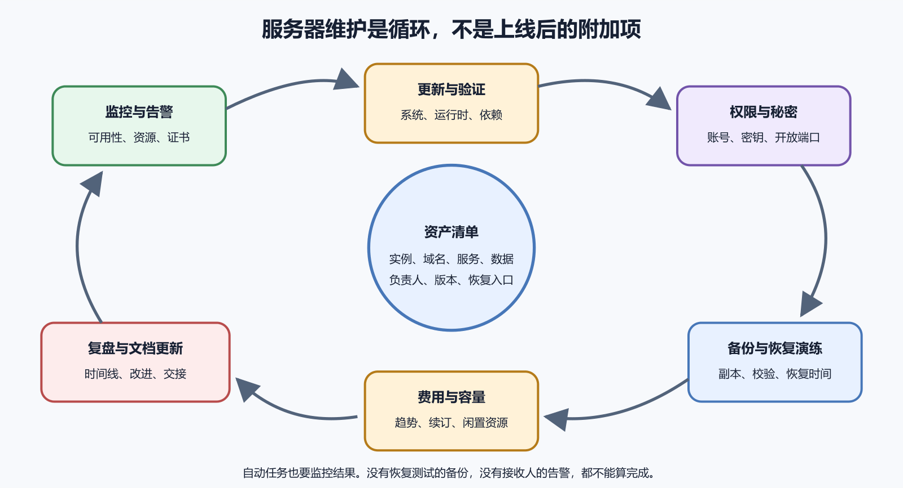

# 自建服务器增加了哪些长期责任

网站第一次上线时，服务器看起来像一件已经完成的作品。一个月以后，系统有安全更新，证书续期失败，磁盘持续增长，备份任务悄悄停止，域名和云主机还要续费。服务器更像一项长期服务；自建没有取消平台依赖；它把更多日常决定交给你。云服务商仍管理物理设施，你要管理虚拟机内部的系统和应用。AWS Lightsail 的产品介绍也把实例、防火墙、静态地址、快照等列为可管理资源。

这章不增加更多命令，而是把责任变成日历、证据和退出条件。能买服务器的人很多，能持续知道它是否安全、可恢复、费用可控，才算真正拥有它。

*图 43-1　观察、更新、备份、演练和复盘形成持续循环。等价说明见本章“责任不会自动完成”。*

## 责任不会自动完成

平台显示“实例运行中”，只能说明虚拟机开机。应用可能已经退出，磁盘可能接近满载，域名可能过期，数据库备份也可能连续失败。自动更新、自动证书和自动备份能减少操作量，仍需监控结果。自动任务失败后没有告警，就等于没人知道。

服务器责任可以分成七组。

1. 资产与账号
2. 更新与漏洞
3. 访问与秘密
4. 可用性与容量
5. 数据与恢复
6. 费用与续订
7. 事故与下线

为每组指定负责人、频率和验证证据。个人项目的负责人都是自己，也要写下来，因为几个月后的你不会记住每个临时决定。

## 资产清单是管理起点

记录每台实例的平台、账号、区域、规格、操作系统、用途、环境、公网地址、域名和负责人。再记录关联的数据库、对象存储、备份位置、监控和付款方式。不要在同一表中保存密码和私钥，只保存秘密所在的受控系统和轮换日期。

没有清单时，旧测试机可能继续收费，废弃域名可能仍指向服务器，离职成员的密钥也可能保留。每月把云账单资源与清单对照。出现名称陌生的实例或磁盘，先确认归属，不要立即删除。磁盘可能是某台实例的唯一数据副本。

安全更新会修复已知问题。长期不更新扩大风险，未经测试自动更新所有组件也可能导致兼容故障。建立固定维护窗口。先更新测试环境，查看可升级包和发布说明，备份关键数据，记录当前版本，再更新生产环境。

系统提示需要重启时，安排可接受的中断。内核和底层库更新可能只有重启后才完全生效。Ubuntu 官方包管理文档提供更新和升级命令，第三方仓库资料提醒外部来源会影响系统完整性。

## 应用依赖也会过期

Node.js、Python、数据库、反向代理和项目依赖都有支持周期。操作系统仍受支持，不代表应用运行时仍安全。每个季度检查运行时和主要依赖的支持状态。升级前阅读迁移说明，在测试环境运行自动测试和真实业务路径。

不要一次跨越多个大版本且同时改业务。拆成可验证的小步，保留旧构建和数据库兼容路径。依赖漏洞扫描能提供线索，不能自动判断业务是否受影响。修复优先级要结合暴露范围、可利用性和项目资产。

新成员加入时发放独立账号或密钥；成员离开时撤销对应访问，而不是等待下次事故再清理；定期查看 `authorized_keys`、sudo 权限和云平台成员；每一项都应能对应到当前人或自动化任务；服务账号只获得运行需要的文件和网络权限。root 只用于必要系统管理，日常登录使用普通用户和按命令提权。Ubuntu 用户与 OpenSSH 文档提供了这套基础。

密钥疑似泄露时，先撤销服务器公钥和平台访问，再生成新密钥。只改本地文件名没有任何保护作用。

## 秘密要能轮换

数据库密码、API 密钥、邮件凭据和签名材料都有生命周期。记录创建人、用途、权限范围、使用位置和最近轮换时间。轮换前确认哪些服务依赖旧值。可同时有效两把密钥时，先添加新值、部署、验证，再撤销旧值。只能单值切换时，准备维护窗口和回滚。

删除仓库中的秘密不等于从历史中消失。发生泄露时先轮换，再清理历史和日志。不要把秘密打印到 systemd 日志、CI 输出或支持截图。权限文件、备份和监控也要纳入泄露检查。

部署数据库时临时开放公网端口，排错完成后忘记关闭，是常见风险。每月对照应用架构检查云防火墙、UFW 和实际监听端口。公网通常只需要 SSH、HTTP、HTTPS。数据库、缓存和内部管理接口限制在本机或私有网络。

发现陌生监听端口时，先用 `ss` 找到进程和服务，再判断来源。不要直接终止可能属于系统或监控的进程。Ubuntu 安全文档把 OpenSSH、防火墙和其他控制放在分层体系中。单层规则正确不能替代整体检查。

## 监控要覆盖用户看见的结果

CPU、内存和磁盘是基础指标。服务进程、端口和日志是运行指标。首页、登录和关键接口是用户结果。只监控“服务器能 ping 通”会漏掉应用故障。只监控首页会漏掉磁盘增长和备份失败。最小监控至少包括外部 HTTPS 可达、服务状态、磁盘阈值、内存压力、错误率、证书有效期、备份任务结果和费用异常。

告警必须到达有人处理的渠道。发送成功不等于有人看见，定期做一次测试告警并记录响应时间。

磁盘使用率达到百分之百才告警已经太晚。根据增长速度设置提前量，例如在仍有数天处理窗口时通知。内存和 CPU 需要看持续时间。一分钟构建峰值与一小时满载意义不同。证书和域名续期要提前数周检查，支付方式失效也会导致自动续费失败。

阈值来自恢复和采购所需时间。平台扩盘需要几分钟，跨区域迁移需要几天，两者不能用同一提前量。

## 备份任务也会失败

磁盘满、凭据过期、对象存储权限变化和网络错误都可能让备份停止。任务退出码、日志和备份文件大小要被监控。一个每天生成同样大小空文件的脚本，表面上“每天都有备份”。恢复测试才能发现内容不可用。

每周抽查最近备份是否存在、大小是否合理、校验是否通过。每季度在隔离环境完成一次恢复，频率按数据重要性提高。Ubuntu 备份指南强调备份对象、频率、位置和恢复方法。

记录磁盘、数据库、上传文件和日志每周增长量。估算达到阈值的日期，提前扩容或清理。CPU 持续高时检查请求量、慢查询和后台任务。内存持续高时检查进程增长和最近版本。网络费用上升时查大文件、爬虫和缓存命中。

扩容会提高成本，也可能需要停机。购买前确认规格能否直接升级，磁盘能否缩小，实例能否跨区域迁移。DigitalOcean 当前选型资料建议按真实负载与基准判断共享或专用资源。这个原则比固定推荐某个套餐更可靠。

## 费用本身需要监控

云账单可能因出站流量、快照、闲置磁盘、静态 IP、对象存储请求和日志增加。实例月费只是其中一项；启用预算告警，按项目和环境加标签；测试资源设置到期日期，过期后先确认再删除。截至 2026 年 8 月 5 日，各平台价格、免费额度和计费条件仍会变化。本书不保存永久价格表。采购和扩容时必须重新查看官方定价页。

关机不一定停止所有收费。磁盘、IP 和备份可能继续计费。删除实例前先导出数据，删除后再检查关联资源和下一期账单。

域名注册、DNS 服务和云服务器可能来自不同账号。记录注册商、到期日、自动续费、付款方式和账号恢复渠道。自动 HTTPS 通常会续期证书，但域名解析错误、端口被关闭或服务停止都可能让续期失败。监控剩余有效期，不等到浏览器报错。

团队邮箱或手机号变化时，更新域名和云账号的恢复信息。失去账号控制会比服务器故障更难处理。中国大陆面向公众的网站还要根据服务器位置和业务性质核对备案、许可证与平台要求，并以当前主管部门和服务商官方说明为准。

## 文档要能让另一个人接手

运行手册至少写清登录入口、服务列表、配置位置、日志查询、健康检查、发布、回滚、备份和恢复。每条命令标明运行位置和预期结果。危险命令写影响与恢复方式。秘密只写引用位置，不写真实值。用新成员视角走一遍文档。若必须依赖作者记忆才能找到某个账号或目录，文档还不完整。

文档与系统同时更新。一次紧急修改完成后，补回正式配置和版本控制，否则下一次部署会覆盖它。

确认故障范围和开始时间。暂停危险发布，保存日志和当前状态。涉及秘密泄露时先撤销凭据，涉及数据破坏时停止继续写入。恢复用户服务可以通过回滚、切换备用资源或进入维护模式。不要在没有备份的生产数据库上连续尝试未知修复。

恢复后记录时间线、根因、影响、检测方式和改进行动。避免只写“人为失误”，要找到允许错误扩大或未被及时发现的系统条件。真实事故复盘的目标是改变检查、权限、测试或监控，让同类问题更难再次发生。

## 什么时候应该迁回托管平台

团队长期无法及时更新，备份没有恢复测试，告警没人处理，或者自建成本高于托管价值时，应认真评估迁移。迁回托管不是能力倒退。它是重新分配责任。数据库可以先迁到托管服务，应用仍留在 VPS。也可以把静态前端迁到 Pages，缩小服务器范围。

迁移前导出数据和配置，建立并行验证，降低 DNS 缓存时间，准备回滚。完成后不要忘记安全下线旧服务器。

先确认流量已经迁移，DNS、Webhook、定时任务和备份不再指向旧地址。观察一段时间，避免遗漏低频任务。导出需要保留的数据、日志和配置，验证副本可读。撤销旧实例持有的 API 密钥、数据库账号和 SSH 授权。

按供应商流程删除实例和附加磁盘，处理快照、静态 IP、负载均衡和监控。检查账单中是否还有关联资源。更新资产清单与运行文档。保留删除日期、执行人和数据去向，不在未知状态下留下“可能还有用”的公网服务器。

## 一个可实行的维护节奏

每周查看外部可用性、磁盘、备份结果和异常日志。高风险项目频率应更高。每月检查系统更新、账号密钥、开放端口、证书、域名、费用和容量趋势。每季度执行恢复演练，检查依赖支持周期，复核事故联系人和运行手册。

每年评估架构与供应商。项目是否仍需要 VPS，规格是否合适，数据地区和合规是否变化，退出计划是否可行。这套频率只是起点。支付、健康、生产控制等高风险系统需要更专业的值守、审计和合规安排。

“检查了备份”太模糊。完成证据可以是最近任务成功时间、文件大小、校验结果和恢复演练编号。“更新了系统”应对应升级包清单、维护时间、重启状态和业务验收。“检查了防火墙”应对应云规则、UFW 和实际监听端口的对照。

证据不需要庞大系统。个人项目用一份日期清单和脱敏命令输出就足够。关键是另一个人能重现判断。没有证据的绿色勾选很容易在自动任务悄悄失败后保持不变。

## 负责人还要有替代人

个人项目只有一个维护者时，至少把账号恢复、备份解密和下线步骤交给可信联系人，或者写入数字遗产安排。团队项目为域名、云账号、数据库和发布各设主要与替代负责人。高权限不能全部绑在离职成员个人邮箱。

定期测试替代负责人能否在不取得真实秘密正文的情况下找到授权流程。紧急时才发现恢复码在旧手机里，已经太晚。权限交接完成后撤销旧访问，并查看审计日志确认没有遗留令牌。

## 平台账号是最高风险入口之一

取得云平台管理员账号的人可以重启、删除服务器、读取快照或改防火墙。保护它的重要性不低于保护 root。启用多因素认证，保存恢复码到独立安全位置。团队使用组织成员和角色，不共享一个主密码。

API 令牌只给自动化需要的权限，设置有效期和使用范围。令牌出现在 CI 日志或聊天后立即轮换。每月查看成员、令牌和最近活动。未知登录先保护账号，再调查服务器。

Ubuntu LTS 也有标准支持期限。到期后安全更新范围会变化，继续运行需要升级或获得适用的延长支持。创建实例时记录版本与支持截止时间。提前数月在测试机演练升级，检查应用运行时、数据库和代理兼容。

不要等发行版停止支持后才处理。跨多个版本升级更复杂，旧软件源也可能下线。具体日期以 Ubuntu 当前官方生命周期页面为准，封版和每次维护都要重新核对。

## 第三方仓库要有退出路径

添加第三方仓库时记录来源、签名密钥、提供哪些包和删除方式。几年后仓库可能停止维护或改变域名。系统升级前确认它支持新发行版。一个失效仓库会让 `apt update` 报错，也可能阻止升级。能使用发行版标准包时，优先减少第三方来源。必须使用时，固定到官方说明并监控公告。

删除仓库不等于自动降级已安装包。迁移回标准包要测试配置与数据兼容。

日志太短，数周后才发现的攻击无法追查。日志太长，会增加磁盘、费用和个人数据暴露。按日志类型设期限。安全审计、应用错误、访问日志和调试日志的用途不同。禁止长期打开详细调试并记录请求正文。故障排查临时开启后写到期时间，问题结束立即恢复。

删除策略还要覆盖远程日志平台和备份，不能只清理服务器本地文件。

## 监控自身也会失效

服务器上的监控代理随服务器一起宕机时，可能无法发出告警。至少有一个外部服务从互联网检查正式地址。告警渠道的令牌会过期，群成员会变化。每月发送一次测试告警，确认实际有人收到。监控平台账单失败也可能停止服务。把监控订阅纳入费用清单。

用户报告往往早于低质量监控。保留清楚反馈渠道，并让支持信息包含时间和请求标识。

云平台状态页显示正常，某个区域、账号或实例仍可能故障。状态页显示事故，也不代表你的服务一定受影响。把供应商状态作为外部证据，与实例控制台、应用请求和日志结合。订阅与你所用区域和产品相关的通知。

发生事故时记录供应商事件编号和时间，不要把全部根因简单写成“云服务故障”。自己的单点架构和恢复准备也属于影响原因。选择多云前先评估复杂度。两套都没有维护好的服务器，比一套有恢复演练的系统更脆弱。

## 安全更新与业务发布分开

安全补丁有时紧急，业务发布则按产品节奏。把两者塞进同一次大变更，会增加失败原因。先在测试环境验证安全更新，再单独发布。若补丁要求应用升级，明确记录依赖关系。高危漏洞暴露在公网时，可能先通过防火墙、关闭功能或下线服务降低风险，再完成修复。临时缓解必须有到期任务。

不能因担心停机而无限延迟补丁。计划维护本来就是自建责任的一部分。

扫描工具会列出操作系统包、依赖或镜像中的已知漏洞。结果包含误报、不可利用项和需要紧急处理的真实问题。先确认受影响版本是否实际运行、功能是否暴露、修复版本是否可用。记录接受、缓解或升级决定。

不要把公开扫描报告原样发布，其中可能包含内部版本和地址。也不要看到扫描通过就宣称绝对安全。安全卷会继续讲输入验证、文件上传和最小权限。服务器补丁只是其中一层。

## 容量扩展也要能回退

增加 CPU 和内存通常容易，磁盘扩容常不能直接缩小。购买前确认平台行为。扩盘后还可能需要在操作系统内扩展分区和文件系统。这是高风险操作，必须按平台和文件系统官方步骤，先备份并验证目标设备。

如果增长来自失控日志，扩盘只是争取时间。先停止增长并修复轮转，再决定长期容量。从大规格降级可能需要新建小实例并迁移。架构上保留可重建部署和外部备份，能降低缩容成本。

TLS、日志、令牌有效期、定时任务和数据库记录都依赖时间。时钟偏差可能导致证书看似未生效、登录令牌立即过期。每月检查时间同步状态。不要手工把生产时间改到看起来正确，突然跳时会影响任务和日志顺序。

统一事故记录时区，服务之间使用 UTC 存储时间通常更容易比较，界面再转换为用户时区。时间同步服务失败应告警，尤其是长期离线或受限网络服务器。

## 邮件与外部 API 也会成为服务器责任

应用能运行，不表示邮件、短信、支付或 AI API 凭据仍有效。第三方配额和策略变化会让部分功能静默失败。为每项外部依赖记录官方状态页、凭据位置、限额、超时和失败行为。关键操作应有幂等与重试上限。

监控业务结果，例如每天应有的邮件数量和失败队列。只监控 HTTP 200 会漏掉后台失败。更换供应商前先导出必要数据和验证回调，不能在生产事故中临时找替代接口。

手工发布执行稳定数次后，可以把构建、上传、状态检查和健康请求自动化。脚本仍要在关键生产切换前要求明确确认。自动化输入使用精确环境和主机，不根据模糊名称猜测。输出保存版本、时间和验收结果。

先提供只读预览和测试环境。涉及删除、数据库迁移和防火墙的动作保留人工审阅。自动化减少重复输入，不会自动得到正确意图。错误脚本能更快影响更多服务器。

## 个人项目可以采用轻量值守

低风险展示站不需要二十四小时人工值班。可以设置外部可用性检查、磁盘和费用告警，每周看一次备份结果。存储真实用户数据、付费订单或关键文件后，责任立即上升。需要更频繁监控、恢复演练和清楚联系渠道。

项目暂停时不要让服务器无人管理。进入维护页、导出数据、停止收费资源或完整下线。风险来自数据后果和用户承诺，与项目是否“个人”无关。

流量迁移后保留旧服务器短期只读或不接流量，观察低频任务、Webhook 和 DNS 缓存。监控是否仍有合法请求。发现来源后更新配置和调用方，不能把所有残余访问当作攻击。观察期仍要更新安全补丁并限制入口。停止业务流量不等于没有暴露。

结束时再次导出所需日志与数据，撤销凭据，再删除资源。删除后检查域名、监控和账单。

## 维护记录模板

每条记录包含日期、服务器、执行人、变更原因、操作前状态、备份、具体变更、预期结果和实际结果。失败时写完整错误、影响、回滚和后续任务。成功也写验证证据，不用“看起来正常”结束。时间敏感资料写检索日期和官方链接。命令输出脱敏，禁止保存私钥、密码、令牌和用户正文。

这份记录同时服务于未来维护、事故复盘和与 AI 协作。上下文完整时，外部协助更容易给出安全建议。

## 责任清单要放在项目入口

清单若藏在个人笔记深处，事故时没人能找到。项目 README 或运行手册首页应链接资产、发布、恢复和联系人。公开仓库只放不敏感结构。真实地址、账号和内部网络放在受控文档。每次架构变化更新入口链接。失效链接与缺失文档也应作为维护问题处理。

让替代负责人从项目首页开始，计时找到最近备份和回滚步骤。找不到就说明入口仍需改进。

## 变更冻结适合高风险时间

报名截止、促销、考试或重要直播前，不应随意升级基础设施。提前设变更冻结期，只允许处理明确紧急问题。冻结不是停止安全响应。高危漏洞仍要评估，但需要更高审阅和回滚准备。冻结前完成容量测试、备份恢复和告警演练。期间持续监控，不增加无关功能。

窗口结束后再处理积累更新，不能让临时冻结变成永久不维护。

提供实例 ID、区域、时间、产品和错误现象。说明已完成的只读检查，以及故障是否能在控制台复现。不要发送私钥、密码、完整数据库和用户个人信息。供应商若要求临时授权，核对官方身份、权限范围和撤销方式。

保存工单编号、回复和操作。外部支持建议涉及删除或重建时，仍由你确认备份和目标。支持人员能查看平台层，不一定了解应用。把责任边界说明清楚会更快定位。

## 自建服务也要有状态说明

用户无法判断网站打不开是自己网络还是服务故障。独立状态页或公开通知渠道能提供简短说明。状态页不能与主应用完全依赖同一服务器，否则故障时一起离线。可以使用简单托管页或第三方状态服务。

只公布确认事实、影响和更新时间，不泄露内部安全细节。恢复后关闭事件并写简短复盘。个人项目可以用公告页和社交账号，核心是让用户有一个独立查询位置。

用户要求删除个人数据时，在线数据库、对象存储、日志和备份可能都有副本。删除流程要说明备份中的处理和保留期限。不能为了立刻删除某一条记录而破坏整份不可变备份。可以在恢复时应用删除清单，或按合规方案设计加密和保留。

具体要求由适用法律和业务承诺决定，需要专业意见。本书只提醒备份不是隐私义务之外的空间。下线项目前也要决定数据归还、保留和安全删除，不能直接停付账号后任其失控。

## 什么时候需要专业运维支持

服务涉及人身安全、金融资产、医疗、关键生产或大量个人数据时，个人通识不足以承担全部设计。需要专业人员评估高可用、灾难恢复、合规、入侵响应和供应链安全。合同中写清响应和责任。访问量快速增长、事故频繁或维护压缩产品时间，也说明应引入支持或迁回托管服务。

寻求专业帮助不是放弃判断。你仍要能提供资产、日志、备份和目标，核对建议是否真正完成。

每季度统计云账单、维护时间、事故时间和未完成风险。与托管替代方案比较同等功能与恢复能力。自建月费低，若需要频繁夜间处理和无法休假，人的成本很高。托管费用高，若产品需要特殊系统能力，迁移也可能损失功能。

决策写出可量化依据，并设下一次复查日期。不要因为已经投入很多时间就永远维持原方案。可迁移的数据、自动部署和独立域名让选择更自由，也是良好自建实践的结果。

## 本卷完成后的最低能力

读者应能选择一台合适测试 VPS，安全完成首次 SSH 登录，分清文件、用户和权限。遇到故障时能检查软件、进程、端口、磁盘和内存，能用 systemd 看服务与日志，能说明 DNS、防火墙、代理和 HTTPS 的顺序。

更重要的是，读者知道部署必须包含回滚，备份必须经过恢复，服务器必须有维护和下线计划。复杂高可用与内核调优可以以后学习。

自建适合愿意承担持续责任、需要明确控制，并能建立更新、监控、备份和恢复的人。它不要求成为专业运维，但要求尊重系统边界和证据。如果你的主要目标只是让网页或小应用稳定可用，托管服务往往能减少很多无关工作。如果项目确实需要服务器，先把规模保持在一台能理解的主机和少量服务，再逐步自动化。

你不需要每天盯着终端。你需要知道谁在检查、何时检查、结果在哪里，以及失败时怎样恢复。
