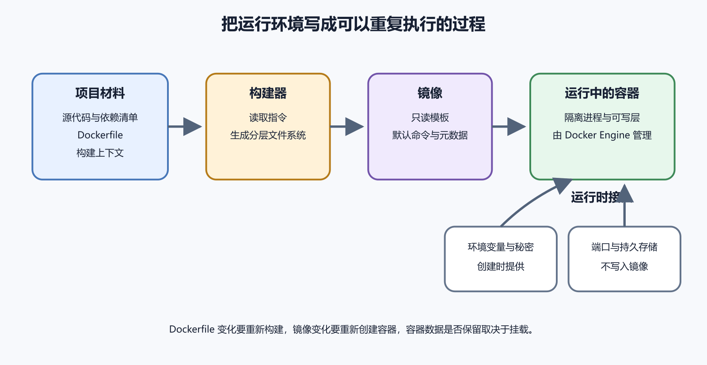

# 运行环境问题与 Docker 的基本模型

很多项目在本地能跑，上服务器就坏。原因常常来自运行环境差异。Node、Python、系统库、环境变量、端口、文件路径和启动命令都可能不同。Docker 的价值，是把一部分运行环境写成可重复的镜像，再用容器运行它。

*图 44-1　项目材料经过构建得到镜像，运行配置、端口和持久数据在创建容器时接入。等价说明见本章“四个对象”。*

## 四个对象

先分清四个对象。Dockerfile 是构建说明。镜像是构建结果。容器是镜像运行出来的进程环境。Registry 是存放和分发镜像的仓库。你写 Dockerfile，构建镜像，启动容器，需要时把镜像推到 Registry。

容器首先是隔离进程。它不是一台完整虚拟机。容器里的主进程退出，容器就停止。容器有自己的文件视图、网络视图和环境变量，但它仍共享宿主机内核。理解这一点，就不会把容器当成万能安全盒子。

Docker 客户端和服务端也要分开。你输入 `docker ps`，客户端把请求发给 Docker daemon。daemon 负责创建容器、挂载目录和管理网络。能操作 Docker 的用户，通常接近主机管理员权限。不要随便把生产机器的 Docker 权限给不可信脚本。

## 一条 run 背后发生什么

运行容器时，Docker 会先找镜像。本地没有就从 Registry 拉取。随后创建容器可写层、网络、环境变量和挂载，再启动镜像指定的主进程。你看到的容器 ID，只是这次运行实例的标识。

容器停止后，可写层还在。删除容器后，可写层通常消失。数据库、上传文件和用户生成内容不要只放在容器可写层里。要用 volume、bind mount、对象存储或外部数据库。否则一次清理容器就可能把数据带走。

镜像能重复，不代表运行结果完全相同。环境变量、挂载文件、网络、外部服务、系统时间和 CPU 架构都会影响结果。排错时要记录镜像标签、容器启动参数、环境变量来源、挂载和宿主机信息。

## Docker 解决了什么

Docker 适合解决运行环境一致性。它能把语言运行时、系统依赖、应用文件和启动命令放在一个镜像里。团队成员、CI 和服务器都用同一个镜像，环境差异会少很多。

Docker 没有自动解决架构设计。数据库连接池、权限、备份、日志、监控、网络暴露、密钥管理和数据持久化仍要自己设计。把应用装进容器，不会让不安全的配置变安全。

容器也不是恶意代码沙箱。从不可信来源拉镜像，风险接近在机器上运行陌生程序。镜像可以包含挖矿程序、后门、旧依赖和危险启动脚本。生产环境要使用可信镜像，定期更新，并限制容器权限。

## 第一次测试

第一次接触 Docker，可以运行一个最小测试容器，看它如何启动、输出日志和退出。再用 `docker ps` 看运行中的容器，用 `docker ps -a` 看已经退出的容器，用 `docker logs` 看输出。这个练习只看生命周期，不要马上挂数据库。

容器启动的是一个主进程。若你在容器里手工启动第二个服务，它不会自动变成稳定部署。正式项目应让镜像有清楚的启动命令。需要多个服务时，用 Compose 或更完整的编排方式管理。

时间和时区也会影响应用。日志时间、定时任务、证书检查和报表统计都可能受时区影响。镜像里可以设置时区，应用也可以使用统一时间策略。不要等用户说报表日期不对，才发现容器和数据库时区不一致。

## 故障发生在哪一层

Docker 项目排错先问层级。镜像能否构建。容器能否启动。端口是否映射。volume 是否挂载。应用能否连接数据库。反向代理能否访问容器。外部用户能否访问域名。每一层都有自己的日志和命令。

本地 Docker Desktop 还有资源上限。内存、CPU、文件共享目录和网络代理都可能影响容器。服务器上的 Docker Engine 又是另一套环境。不要用本地能跑证明生产一定能跑。真正上线前，至少在接近生产的环境里跑一次。

## 镜像层和容器层

镜像由多层组成。Dockerfile 中每一步常会产生一层。构建缓存就是利用这些层。前面的层没变，后面的步骤可以复用。理解层以后，你会明白为什么先复制依赖文件、安装依赖，再复制业务代码，构建会更快。

容器运行时会在镜像上加一个可写层。应用写入的临时文件、缓存和运行中改动，通常落在这一层。删除容器后，这一层也会消失。它适合临时状态，不适合权威数据。把数据库数据放在容器层，是 Docker 初学阶段最危险的误会之一。

层还会影响秘密处理。若你在构建过程中复制了 `.env`，随后又删除它，秘密仍可能留在历史层里。镜像不是普通文件夹。不能用“最后看不见”证明秘密没有进入镜像。构建上下文和 Dockerfile 都要提前排除秘密。

## 网络和名称

Docker 会给容器创建网络。单个容器可以使用默认网络，Compose 会为项目创建自己的网络。同一个 Compose 项目里的服务，可以用服务名互相访问。这个名字比容器 IP 稳定，因为容器重建后 IP 可能变化。

容器内访问 `localhost`，指的是容器自己，不是宿主机。应用在容器里连数据库时，若数据库也是容器，通常用服务名。若数据库在宿主机或云服务上，要写对应地址。很多连接失败来自把 localhost 的含义看错。

DNS 和代理也会影响容器。公司网络、本地代理、境内外 Registry、云服务器默认 DNS，都可能让拉镜像或访问外部 API 失败。排查时分清是构建阶段失败、容器启动失败，还是运行时访问外部服务失败。

## 镜像来源和最小权限

基础镜像最好来自官方或可信维护者。镜像名相似不代表来源可信。拉取前看维护者、更新时间、文档、标签和下载来源。生产项目不要从随机博客复制镜像名直接运行。

运行容器时，尽量减少权限。能不用 privileged 就不用。能只读挂载就只读挂载。能限制端口就限制端口。容器逃逸不是每天发生的普通故障，但过大的权限会让一次应用漏洞影响整台机器。

容器内 root 和宿主机 root 不是完全同一个概念，但它仍然危险。若容器挂载了宿主机敏感路径，容器内 root 可能改到宿主机文件。生产镜像能用普通用户运行，就改成普通用户。

## 本地和服务器的差异

Docker Desktop 帮你隐藏了很多细节。它在 macOS 和 Windows 上运行一个 Linux 虚拟环境，再把文件、端口和网络映射出来。服务器上的 Docker Engine 直接运行在 Linux 上。两者命令相似，性能、路径和网络细节会不同。

文件监听是常见差异。本地开发时，代码目录 bind mount 到容器，框架自动热更新。到了服务器，代码通常已经在镜像里，容器不再监听宿主机源码变化。把开发方式照搬到生产，会让镜像、挂载和发布边界变乱。

架构也是差异。你的 Mac 可能是 ARM，服务器可能是 x86。镜像如果只构建了一个平台，本地能跑，服务器可能拉不到或运行失败。多平台镜像要分别测试。不要只看构建命令成功。

## 一个环境变量风险演练

设想应用在本地容器里连测试数据库，上服务器后仍连测试库。镜像里默认 `ENV` 写了测试地址，生产运行时又没有覆盖。页面能打开，数据却写到错误环境。这个演练说明，启动成功不能证明数据写入了目标环境。

修复时先停止写入，确认哪些数据写错了环境。随后改镜像或运行配置，让默认值更安全。生产必须显式提供数据库地址，缺失时应用直接启动失败。再补启动日志，打印配置环境名称，但不打印连接串。

环境变量应进入发布验收。应用启动时显示版本、环境名和配置来源。维护者能从日志里确认它跑在 production、staging 还是 lab。不要依赖页面内容猜环境。

## 什么时候暂时不用 Docker

Docker 很有用，但不是每个练习都要立刻用。若你还不知道应用怎样手工启动、监听哪个端口、需要哪些环境变量，直接写 Dockerfile 会把问题包起来。先在普通服务器上跑通一次，再容器化，常常更容易理解。

反过来，团队协作、CI 构建、依赖复杂、多服务组合和跨机器部署，会让 Docker 的价值变明显。工具选择服务于可重复和可维护。只是为了显得专业而容器化，后面会多出镜像、卷、网络和清理问题。

## 让 AI 判断是否适合容器化

你可以把项目运行说明交给 AI，让它判断容器化需要哪些信息。启动命令，依赖安装，端口，环境变量，上传目录，数据库连接，后台任务和健康检查。若这些都说不清，Dockerfile 只能靠猜。

让 AI 输出容器化计划时，要求它先列现有运行方式，再列需要确认的问题。不要让它直接给最终 Dockerfile。比如上传文件放哪里，日志写哪里，是否有本地 SQLite，是否有定时任务。这些答案决定镜像和挂载。

AI 写的 Dockerfile 要人工看三处。有没有把秘密复制进镜像。有没有把数据放进容器层。有没有用 root 跑应用。再看启动命令是否和项目真实命令一致。能构建通过，不代表适合上线。

容器化完成后，保留一份对照表。写清本地运行命令、Docker 构建命令和容器启动参数，再补生产 Compose 配置的位置。以后排错时，能知道问题来自应用本身，还是来自容器包装。

## 本章练习

选择一个最小示例应用。先在本机或测试服务器上不用 Docker 启动，记录启动命令、端口、环境变量和日志位置。随后写一个最小 Dockerfile，让它在容器里启动。

构建镜像后运行容器。查看容器状态、日志和端口映射。停止并删除容器，再重新运行。观察哪些内容保留，哪些内容消失。这个练习能帮助你理解镜像和容器的差异。

最后故意缺少一个环境变量启动容器。让应用明确失败，并在日志里显示缺少哪个变量。生产容器宁可启动失败，也不要悄悄连到错误环境。

## 常见误区

第一个误区是把容器当成小虚拟机。容器的主进程退出，容器就停止。容器里手工启动一堆后台进程，出了问题很难管理。

第二个误区是把本地 Docker Desktop 结果当成生产证明。本地文件共享、CPU 架构、代理和资源上限都可能不同。生产前要在接近生产的 Linux 环境里验证。

第三个误区是认为镜像能跑就安全。镜像来源、运行用户、挂载权限、秘密处理和基础镜像更新都要检查。容器只是运行方式，安全仍要设计。

## 本章交付物

本章结束时，你应该有一张容器化对照表。它把本地启动方式、Dockerfile、镜像、容器启动参数、环境变量和持久目录对应起来。

还应有一份容器化前问题清单。端口是什么，数据在哪里，日志在哪里，秘密怎样给，健康检查怎样做，哪些任务不能随容器删除。问题没答完，就先别急着上线。

这张清单也能帮助你和 AI 沟通。与其让 AI 猜项目结构，不如先把这些答案填好。它生成的 Dockerfile 和 Compose 文件会更接近真实项目，后续人工修改也少。

AI 可以帮你解释 Dockerfile、容器日志和启动参数。不要把 Registry 凭据、生产环境变量、私有镜像内容和用户数据交给它。下一章继续看镜像、容器、Dockerfile 和 Registry。
