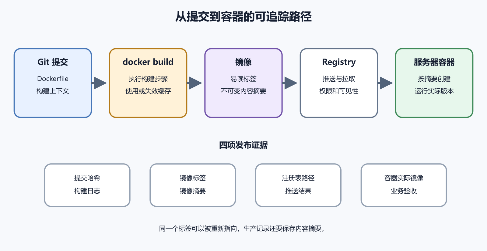

# 镜像、容器、Dockerfile 和 Registry

镜像把应用运行所需的文件组织成可分发模板。Dockerfile 记录怎样生成它，Registry 保存并分发它，容器负责把它运行起来。这条流程让一个 Git 提交能对应到一个镜像版本，再对应到服务器上实际运行的容器。任何一段使用模糊版本或手工修改，追踪都会断开。



*图 45-1　Dockerfile 和构建上下文生成镜像，镜像推送到注册表，再由服务器拉取并创建容器。等价说明见本章“从文件到运行实例”。*

## 从文件到运行实例

构建上下文是交给构建器的一组文件。通常是项目目录，包含 Dockerfile、依赖清单和源代码。Dockerfile 逐条声明构建步骤。构建器按步骤生成层，最后得到带有默认命令和其他元数据的镜像。

镜像可以保存在本地主机，也可以推送到 Registry。Registry 中文可称镜像注册表，它按仓库、标签和摘要组织镜像。服务器拉取镜像，结合环境变量、端口、卷和网络创建容器。运行配置通常由 `docker run` 参数或 Compose 文件提供。

Docker 官方把 Dockerfile 定义为构建镜像的文本指令文件。常见指令包括 `FROM`、`RUN`、`WORKDIR`、`COPY` 和 `CMD`。下面是一个简化 Node.js 应用示例。

```
FROM node:24-alpine

WORKDIR /app
COPY package.json package-lock.json ./
RUN npm ci --omit=dev

COPY . .
USER node
CMD ["node", "server.js"]
```

这是教学结构，真实项目要核对 Node.js 支持版本、原生依赖和应用文件。

## 逐行解释示例

`FROM` 选择基础镜像。基础镜像提供 Linux 用户空间、Node.js 和包管理工具。标签内容会变化时，要使用项目验证过的明确版本，并定期重建。`WORKDIR /app` 设置后续指令和默认运行目录。目录不存在时会由构建过程创建。

第一条 `COPY` 只复制依赖清单，让依赖安装层在源代码变化时仍可能使用缓存。`RUN npm ci --omit=dev` 在构建期间安装锁定的生产依赖。它不会在每次容器启动时重新安装。第二条 `COPY` 复制其余构建上下文。`.dockerignore` 应排除 `.git`、本地依赖、秘密和无关大文件。

`USER node` 让主进程使用基础镜像提供的非 root 用户。`CMD` 定义容器默认程序。

`RUN` 在构建镜像时执行，结果写入镜像层。安装软件、编译代码常发生在这里。`CMD` 在容器启动时提供默认命令。数据库连接、监听端口和业务运行发生在容器阶段。把数据库迁移放进构建阶段通常不可能，因为构建环境不应连接生产数据库。把依赖安装放到每次启动，又会让启动受网络和软件源影响。

先问动作属于制造镜像，还是运行应用，再选择位置。

## COPY 会把什么带进去

`COPY . .` 会复制构建上下文中未被忽略的内容。若项目目录含 `.env`、私钥、测试数据库或导出文件，它们可能进入镜像层。后续用 `RUN rm` 删除，也可能仍存在于之前层中。秘密一旦进入镜像，应轮换并重新设计构建上下文。建立 `.dockerignore`，明确排除秘密、Git 历史、日志、缓存和本地构建产物。构建后使用镜像检查工具或导出清单验证。

Docker 构建最佳实践也把 `.dockerignore`、减少不必要包和选择基础镜像列为关键项。

下面命令在包含 Dockerfile 的项目目录运行，会读取文件、执行构建并写入本地镜像存储。

```
docker build -t notes-api:1.0.0 .
```

`build` 启动构建。`-t` 给镜像添加名称和标签。`notes-api` 是本地仓库名，`1.0.0` 是示例标签。最后的点表示当前目录是构建上下文，不能漏掉。成功时末尾显示构建完成和镜像名称。失败时按具体步骤编号查看，是拉取基础镜像、复制文件、安装依赖还是应用构建失败。

构建成功不证明容器能运行。还要启动、查看日志和发健康请求。

## 构建缓存怎样工作

Docker 会尝试复用未变化的构建层。Dockerfile 某一步的输入变化后，从那里开始的后续层通常需要重建。先复制依赖清单再安装，能让只改业务代码时继续使用依赖层。若先 `COPY . .`，任何源文件变化都可能让依赖重装。

缓存能加快构建，也可能掩盖基础镜像和远程依赖更新。定期受控地拉取新基础镜像并无缓存重建，再运行测试。不要把 `--no-cache` 当成修复所有构建错误的默认按钮。先判断哪一层输入不符合预期。

每条会改变文件系统的构建步骤可能形成层。后续层删除文件，不一定从历史层移除内容。构建参数和环境变量也可能进入元数据、历史或日志。敏感令牌用于下载私有依赖时，采用 BuildKit 的秘密挂载等当前官方机制。

CI 不能把秘密写入 Dockerfile。构建日志要脱敏，完成后撤销短期凭据。运行时秘密也不放进镜像。由 Compose、平台或秘密服务在创建容器时提供。

## 多阶段构建解决什么

前端或编译型应用需要完整构建工具，运行阶段只需要产物。多阶段 Dockerfile 使用多个 `FROM`，从构建阶段复制结果到较小运行阶段。这样能减少最终镜像中的编译器、源代码和开发依赖。Docker 官方多阶段构建文档说明 `COPY --from` 只取所需产物。

多阶段不是越多越好。简单解释型应用若没有构建产物，一个清楚阶段可能足够。每个阶段都要固定来源并接受安全更新。最终镜像小，不表示构建阶段可以使用不可信工具。

优先使用官方或项目维护者明确支持的镜像，查看更新、架构和文档。Docker Official Images 是 Docker Hub 中经过整理的一类来源，但仍要核对标签和生命周期。完整发行版镜像兼容性较好，体积较大。Alpine 较小，使用不同 C 库，某些原生模块会遇到兼容问题。不能只看下载大小。

无发行版工具的极简镜像减少攻击面，也让现场排错工具更少。团队应在可维护性和最小内容之间选择。基础镜像包含漏洞时，应用镜像需要重新构建和部署。已有容器不会自动获得修复。

## 标签与摘要

标签是易读名称，例如 `1.0.0`、`20260805` 或 `latest`。标签可以被重新指向另一个镜像。摘要由镜像内容计算，形如 `sha256` 后的一长串值。它能不可变地标识具体内容。开发环境可以使用方便标签，生产发布至少记录拉取时的摘要。回滚时使用已验证摘要，避免同名标签内容已经变化。

Docker 官方构建、标记和发布教程说明完整镜像名由注册表主机、路径和标签组成。

Registry 是保存和分发镜像的服务，例如 Docker Hub 或组织私有注册表。Repository 是注册表中的镜像仓库路径，例如某组织下的 `notes-api`。同一仓库可以有多个标签和摘要。登录凭据允许拉取或推送镜像。生产服务器只需要拉取时，不应授予推送和删除权限。

Registry 中的公开镜像任何人都能下载。不要把含源代码或商业文件的镜像误推到公开仓库。

## 推送前给镜像完整名称

假设注册表是 Docker Hub，账号名为示例 `alice`。

```
docker tag notes-api:1.0.0 alice/notes-api:1.0.0
docker push alice/notes-api:1.0.0
```

`tag` 添加另一个引用，不复制镜像内容；`push` 把缺少的层上传到注册表；命令会改变远程注册表状态；执行前确认登录账号、目标仓库可见性和标签；成功后在注册表核对摘要与本地一致；不要在命令行参数中写密码；使用 `docker login` 的安全输入或平台凭据帮助器。

x86_64 与 ARM64 需要对应镜像内容。多架构镜像使用同一标签，根据主机选择合适清单项。基础镜像支持多架构，不代表应用中的下载二进制也支持。Dockerfile 若从固定 URL 下载 x86 文件，在 ARM 构建上会失败或运行报格式错误。

查看目标平台，使用支持多平台的依赖和构建。CI 可以为多个架构生成镜像，但每个架构都要测试。模拟运行会降低性能，不能替代真实架构验证。

## 容器不应被现场修改

进入运行容器安装包或改代码，修改只存在于该容器可写层。重建后全部丢失，也没有进入 Dockerfile 和 Git。紧急调查可以在测试副本执行只读命令。确认修复后回到源代码和 Dockerfile，构建新镜像并发布。

`docker commit` 能从容器生成镜像，但会丢失清楚构建过程，不适合作为正常生产发布。不可变发布的要点是替换容器，不是在每台服务器逐个修补。

下面命令只读取本地状态。

```
docker image ls
docker container ls --all
```

第一条列出镜像引用、ID、时间和大小。第二条列出运行与停止容器。多个标签可能指向同一镜像 ID，不能把行数当作实际磁盘副本数。镜像显示大小也不等于新增占用，因为层可共享。清理前使用 `docker system df` 查看分类占用，并确认容器和卷引用。第 49 章才执行删除。

## 镜像漏洞与更新

镜像扫描能发现已知软件漏洞，需要结合包是否存在、是否可利用和修复版本判断。更新基础标签后重新构建，不保证应用兼容。先在 CI 运行测试，在测试环境启动并完成业务验收。生产容器不会因 Registry 中出现新标签自动变化。明确拉取、重建或重建容器，再验证摘要。

保留最近可用镜像和依赖数据库兼容，才能回滚。

开放容器倡议的英文是 Open Container Initiative，简称 OCI。它维护运行时、镜像和分发规范。Docker 是常用工具链，容器生态还有 containerd、Podman 和其他实现。符合规范能提高可移植性，不表示所有命令、网络和 Compose 行为完全相同。

本书使用 Docker Engine 和 Docker Compose 作为具体路径。理解 OCI 只用于知道镜像不是某一家产品才能识别的私有压缩包。

## 最小构建验收

从干净 Git 提交构建，记录 Docker 与构建器版本。确认 `.dockerignore` 没有带入秘密。运行新镜像，检查非 root 用户、工作目录、环境变量名、监听端口和健康请求。停止并重新创建，确认无状态内容能恢复。

推送后在另一台测试环境按摘要拉取，再运行同样验收。只有本机缓存中成功，仍不能证明注册表分发路径。把提交、镜像标签、摘要和测试结果写进发布记录。

`ENTRYPOINT` 定义主要可执行程序，`CMD` 可以提供默认参数。运行容器时追加参数，常会替换 CMD 而保留 ENTRYPOINT。只有 CMD 时，运行命令更容易整体覆盖。两者的 shell 形式和 JSON 数组形式还有信号与变量解释差异。

应用镜像优先使用 exec 形式，让程序成为主进程并收到停止信号。复杂启动脚本最后使用 `exec` 交出 PID 1。不要为了灵活同时叠加多层 shell。实际运行命令可用 inspect 查看。

## ARG 与 ENV 的边界

`ARG` 提供构建时变量，只在声明后的构建阶段可用。`ENV` 写入镜像默认环境，在容器运行时仍存在。两者都不适合保存秘密。构建历史、缓存、日志或元数据可能暴露值。版本号、构建目标等非秘密可以使用 ARG。应用运行模式和非秘密默认值可以使用 ENV。

数据库密码使用构建秘密挂载或运行时秘密系统，不能通过 `--build-arg` 传入。

每条 `RUN` 常在独立构建步骤执行，上一条里的 `cd` 不会像同一交互 shell 那样影响后续指令。`WORKDIR /app` 清楚设定后续 `RUN`、`COPY`、`CMD` 等目录。多个阶段分别声明，不能假定继承自另一基础镜像。应用使用相对路径时，容器运行目录也来自 WORKDIR。构建成功但运行找不到文件，检查这里。

路径使用绝对值，避免基础镜像默认目录变化。

## ADD 与 COPY

`COPY` 只从构建上下文或阶段复制文件，行为更直接。`ADD` 还支持远程 URL 和自动解压等功能。没有使用额外能力时优先 COPY。远程下载在 `RUN` 中使用校验值验证并同层清理，来源变化才可见。复制目录时注意所有者与权限。使用 `--chown` 可以在构建中设定目标用户，前提是用户存在。

Windows 构建上下文中的可执行位和换行可能与 Linux 不同，CI 要在目标平台验证。

常见排除项包括 `.git`、本地依赖目录、编辑器缓存、测试输出、日志和真实 `.env`。不能复制一份通用模板后不检查。构建需要的锁文件、静态资源或迁移文件若被忽略，镜像会缺内容。运行 `docker build` 观察发送构建上下文大小。异常巨大时查大文件和忽略规则。

忽略只影响构建上下文，不会阻止文件进入 Git。秘密保护仍要使用 `.gitignore`、扫描和轮换。

## 固定标签与安全更新之间的平衡

固定到大版本标签能避免意外跨版，也会在重新构建时取得该标签最新补丁。固定到摘要可完全复现内容，却不会自动得到补丁。一个可控流程是生产按摘要部署，依赖更新工具提出新摘要，CI 测试后更新记录。

只写 `latest` 不知道升级范围。永远不重建固定摘要又会停留在旧漏洞。可复现和及时更新需要流程共同完成，不能靠单个标签选择解决。

```
docker image history notes-api:1.0.0
```

命令只读，显示层创建命令和大小摘要。构建参数或命令可能暴露敏感信息，分享前检查。历史能帮助发现某层突然变大、缓存顺序不合理或秘密写入命令。它不能列出每个文件。发现秘密后立即轮换，修正 Dockerfile，从干净构建器重建，并清理 Registry 与缓存中的受影响镜像。

仅删除标签不会撤销已下载副本。

## inspect 镜像元数据

```
docker image inspect notes-api:1.0.0
```

输出包含摘要、架构、用户、工作目录、入口、环境和标签。检查镜像是否按预期使用非 root 和正确端口。环境字段可能含构建时 ENV。若发现秘密，按泄露处理。镜像元数据与运行容器配置不同，容器可以覆盖命令、用户和环境。发布验收两边都查。

基础镜像、包管理缓存、开发依赖和构建产物都会增加层。多阶段构建能把构建工具留在前一阶段。一个 `RUN` 中安装后清理缓存，可避免缓存落入另一层。不能为了少几兆写成难以审计的巨大命令。镜像小能减少拉取和攻击面，不是唯一目标。缺少证书、时区数据或诊断能力会造成运行问题。

先删除明确无用内容，测量启动与分发，再决定优化。

## 软件许可证也会随镜像分发

把依赖和系统包打进镜像，分发时可能触发许可证和归属要求。商业项目要保存组件清单和许可证文本。基础镜像页面通常提供来源与许可说明，应用依赖还要各自检查。使用开源不等于没有条件。无法判断时请法务或合规人员审核。

软件物料清单的英文是 Software Bill of Materials，常缩写为 SBOM。它能帮助记录组件和响应漏洞。

扫描标签后标签变化，报告可能与生产容器不同。扫描和部署都记录摘要。严重等级只是线索。确认漏洞所在包是否在最终阶段、功能是否可达、上游修复是否存在。更新基础镜像后重新构建和测试。已经运行的旧容器不会自动修复。

扫描器数据库也有更新时间。报告写检索时间和工具版本。

## Registry 凭据最小化

开发者账号可能有推送权限，生产服务器通常只需拉取一个仓库。为自动化创建专用只读令牌。凭据存在 Docker 客户端配置或系统凭据帮助器。服务器备份和支持日志不要带走认证文件。令牌设置有效期与轮换。成员离开时撤销个人访问，检查最近推送和删除事件。

CI 推送凭据限制到发布分支和目标仓库，拉取请求构建不能随意获得生产令牌。

自己运行 Registry 要维护 TLS、认证、存储、垃圾回收、备份和可用性。Registry 故障会阻止新部署和灾难恢复。已有服务器仍能运行本地镜像，不表示重建新主机时可取得。保留异地副本和恢复测试。

个人项目通常使用成熟托管 Registry 更省维护。需要数据驻留或内网分发时再评估自建。镜像删除策略要保留生产与回滚摘要，不能按“最老标签”直接清理。

## 签名和来源证明

镜像摘要证明内容标识，不能单独证明是谁构建。签名和构建来源证明能把摘要与发布身份、流程关联。团队供应链要求较高时，使用 Registry 与 CI 支持的当前签名方案，保护签名密钥并验证策略。

签名有效也不代表镜像没有漏洞。它证明来自被信任的签名者，仍要审查构建和依赖。个人项目至少从官方组织拉取基础镜像，固定摘要并保留 CI 日志。

`RUN` 下载软件时依赖当时网络、仓库和镜像。远程内容变化会让同一 Dockerfile得到不同结果。锁定语言依赖，使用发行版包版本和校验值，保存必要制品。构建失败时不要切换到陌生镜像站绕过。

完全离线可复现成本较高。先记录哪些步骤依赖外部服务，并在 CI 缓存受信制品。生产发布不能依赖某个开发者电脑已有的未记录缓存。

## 多平台构建要分别测试

Buildx 可以生成多平台镜像。构建完成的清单包含不同架构内容，Registry 按主机选择。跨架构模拟能发现部分问题，原生模块、性能和系统调用仍需真机或真实运行环境验证。发布记录保存每个平台摘要。某一架构修复不能假定其他架构同步正确。

不需要 ARM 用户时，不必为展示能力增加多平台流程。

本地主机、Registry 和发布记录都可能保存镜像引用。删除本地标签不会删除远程，删除远程也不会停止已有容器。确认当前生产容器摘要、最近回滚摘要和 Registry 拉取能力。再删除精确旧镜像。

磁盘紧急时优先清构建缓存和可重新拉取镜像，卷单独处理。删除报告写对象、摘要、释放空间和恢复来源。

## 阅读陌生 Dockerfile 的顺序

拿到别人的项目时，先看 `FROM`。它决定基础系统、运行时和可能的安全维护来源。再看 `WORKDIR` 与 `COPY`，确认哪些本地文件进入镜像，是否把 `.env`、密钥或整个项目目录无选择地复制进去。接着区分构建阶段与运行阶段；所有 `RUN` 都发生在构建时，适合安装依赖和生成产物；`CMD` 与 `ENTRYPOINT` 决定容器启动后运行什么。若最终命令只是一个临时脚本，脚本退出后容器也会退出。

然后看用户与权限。Dockerfile 没有 `USER` 时，进程常以 root 身份运行。再看开放端口、健康检查和写入目录，判断 Compose 需要哪些端口、卷与只读设置。最后检查构建上下文。运行 `docker build .` 时，句点所指目录可能整体发送给构建器。`.dockerignore` 应排除版本库、依赖缓存、构建产物、测试数据和秘密文件。排除后仍需确认应用真正需要的文件没有一起消失。

读完以后，用一句话写出镜像的输入、构建产物、启动命令、运行用户、网络入口和持久数据位置。六项中有一项说不清，就先在测试环境验证，不直接发布。构建成功以后，使用新镜像启动一次干净容器。检查启动日志、健康、版本页面与退出信号。已有容器能运行，不能证明从零构建出的镜像完整。
