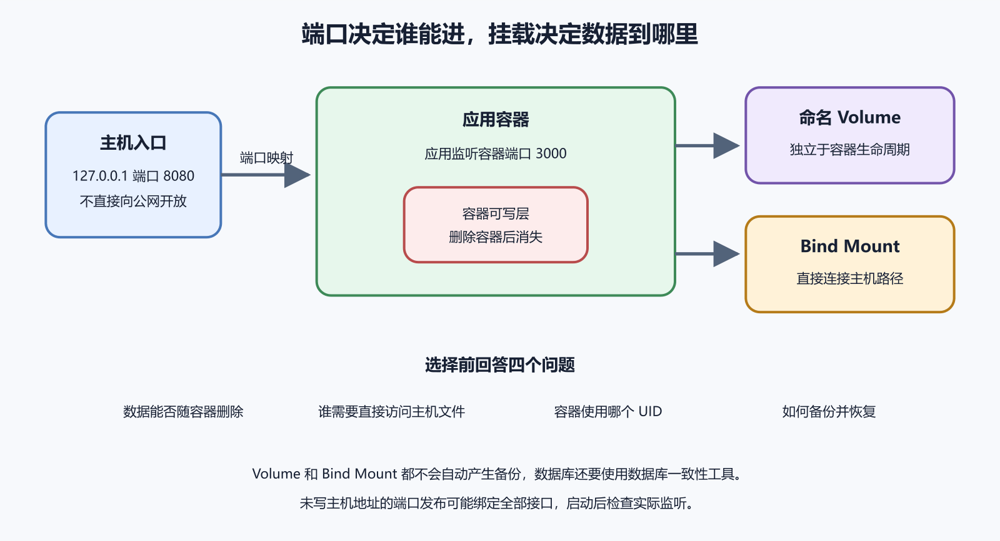

# 端口映射、Volume、Bind Mount 和数据持久化

容器里有自己的网络和文件系统。应用在容器里监听端口，不代表外部能访问。数据写进容器可写层，也不代表容器删除后还在。端口映射和挂载，是 Docker 项目最容易让人误判的两件事。

*图 46-1　主机端口决定访问入口，Volume 与 Bind Mount 决定数据写到哪里；二者都不自动形成备份。等价说明见本章“上线前检查”。*

## 端口映射

容器内端口是应用在容器里监听的位置。主机端口是宿主机对外开放的位置。`8080:80` 的意思是访问主机 8080，转到容器 80。方向不要记反。若主机端口已经被占用，容器启动会失败。

省略主机地址时，端口可能绑定到所有网卡。开发环境方便，生产环境危险。只想让反向代理访问容器时，可以绑定到本机地址。数据库、管理后台和内部 API 不应直接映射到公网。

`EXPOSE` 只是镜像里的说明，不会自动发布端口。真正对外发布，要靠 `docker run -p`、Compose 的 ports 或编排平台配置。看到 Dockerfile 里写了 EXPOSE，仍要检查运行参数。

## Volume 和容器可写层

容器可写层适合临时文件，不适合权威数据。删除容器后，可写层通常一起消失。数据库、上传文件、队列状态和用户内容要放到 volume、bind mount、对象存储或外部服务里。

命名 volume 由 Docker 管理位置。它适合数据库数据目录、缓存目录和应用持久目录。你用名字引用它，不必关心宿主机实际路径。迁移时要导出和恢复，不要假设复制某个隐藏目录就万事大吉。

数据库备份要使用数据库工具。PostgreSQL 用 `pg_dump` 或物理备份方案，MySQL 用对应工具。直接复制正在写入的数据目录，可能得到不一致数据。volume 保存数据位置，备份证明数据能恢复，二者不是一回事。

## Bind Mount

Bind mount 直接把宿主机路径挂进容器。开发时很方便，改本地文件容器里立刻可见。生产中要谨慎。宿主机路径错了，可能挂进空目录。挂载会遮住镜像里的原内容，让应用找不到文件。

路径权限会跨过容器边界。容器里的用户 ID 和宿主机文件所有者要能对应。应用写不了上传目录、Nginx 读不到静态文件、日志无法落盘，很多都来自 UID、GID 和目录权限不匹配。

Docker Desktop 的文件共享也会影响 bind mount。macOS 和 Windows 上，容器访问宿主机文件可能比 Linux 慢。文件监听、热更新和大量小文件构建会受影响。本地开发能忍，生产服务器不要依赖桌面文件共享特性。

## 迁移和删除

迁移 volume 前，先停写。数据库停服务或进入只读，文件上传暂停。导出数据，记录 volume 名称、镜像版本、数据库版本和校验方式。在新环境恢复后，用应用或数据库工具验证。只看容器能启动还不够。

卷清理是高风险操作。按 Docker 当前文档，`docker volume prune` 默认删除没有任何容器引用的匿名卷；加 `--all` 才会把符合条件的命名卷也纳入。容器停止后若仍保留引用，卷不符合这项清理条件；删除容器后，原本重要的卷则可能变成未引用。清理前要列出卷、容器引用、归属和备份，不能把“未引用”当成“无价值”。

可以用一个演练理解挂载错误。原本要把 `/data/uploads` 挂进容器，却指定了另一个空目录。若挂载方式允许创建该目录，容器启动后应用看不到旧文件，还可能把新上传写到错误位置。此时先停写，找出两边数据，再核对引用与合并方案；不要把新数据直接覆盖掉。

## 上线前检查

上线前至少检查四件事。主机端口是否只暴露给需要的入口。持久数据是否离开容器可写层。挂载路径是否存在且权限正确。备份是否能恢复。端口和数据看起来是 Docker 基础，其实决定了服务能不能安全运行。

## 网络内外的测试

端口问题要从不同位置测试。容器内测试应用监听。宿主机测试端口映射。另一台机器测试公网访问。反向代理测试后端转发。每个位置的结果都不同，能帮助你判断问题卡在哪一层。

若宿主机能访问容器，公网不能访问，通常看防火墙、安全组和代理。若容器内应用都访问不了，先看应用启动、监听地址和日志。若公网能访问开发端口，说明入口过宽，要马上收紧。

随机主机端口适合临时测试。生产项目应使用固定入口，由反向代理管理域名和 HTTPS。让 Docker 随机分配端口，再手工改代理配置，很容易在容器重建后失效。

## 只读挂载和最小写入

不是每个挂载都需要写权限。配置文件、证书公钥、静态资源和只读数据，可以用只读挂载。这样应用被攻破后，也不容易修改这些文件。需要写入的目录单独挂载，权限范围更清楚。

容器根文件系统也可以设为只读，但这要求应用把临时文件、缓存和日志写到指定位置。初学阶段不必急着开启。先把持久数据和临时数据分开，再考虑更严格的只读策略。

挂载秘密文件时，注意权限和生命周期。秘密文件不应进入镜像，也不应进入公开 volume。容器重建后，秘密仍要能被正确挂载。秘密轮换时，要知道哪些容器需要重启或 reload。

## 备份卷的窗口

备份 volume 时，写入状态很重要。文件型数据可以暂停上传后打包。数据库应使用数据库自己的备份工具，或进入一致的备份模式。边写边复制目录，得到的数据可能看起来完整，恢复后才发现损坏。

恢复卷时也要记录目标。恢复到原卷会覆盖当前数据，风险高。优先恢复到新卷或隔离环境，验证后再决定切换。恢复后看应用、权限、文件数量、数据库校验和关键业务路径。

卷标签可以帮助归属。给卷标记项目、环境和用途，清理时更容易判断。没有标签也没有文档的卷，删除前要格外谨慎。它可能就是某个旧版本数据库。

## 数据库容器的边界

用容器跑数据库适合开发、测试和小项目。生产中也有人这样做，但要把备份、升级、监控、磁盘、权限和恢复想清楚。数据库容器停了，数据不应丢。数据库镜像升级，数据目录不一定自动兼容。

数据库容器的 volume 要独立命名，不能依赖匿名卷。Compose 项目名变化会影响默认卷名。若误创建新卷，数据库会像全新安装一样启动。看到数据消失时，先查旧卷是否还在，不要立刻导入旧备份覆盖新写入。

数据库端口通常不需要暴露到公网。应用容器在内部网络访问数据库，维护者通过 SSH 隧道、堡垒机或受控内网访问。直接把数据库端口映射到公网，会让数据库暴露给全网扫描。

## 上传文件的持久化

上传文件可以放对象存储，也可以先放服务器磁盘。若放在容器项目里，必须明确挂载位置和备份方式。用户上传目录和应用代码目录不要混在一起。发布新版本时，不应覆盖用户上传内容。

图片缩略图、导出文件和临时转码文件要分清。缩略图可以重建，原始上传更重要。导出文件可能有过期时间，临时文件可以清理。每类文件的保留策略不同，备份和清理也不同。

容器化以后，路径常会变。应用里写 `/app/uploads`，宿主机实际保存到某个 volume。文档要同时写容器路径和宿主机或 volume 名称。只有其中一个，维护者恢复时会迷路。

## 让 AI 审挂载方案

挂载方案适合让 AI 做风险检查。你可以给它脱敏后的 Compose volumes 配置、应用需要读写的目录和数据类型。让它区分持久数据和临时数据，再判断只读挂载、写入权限和备份需求。

AI 常会忽略数据一致性。它可能只说“把目录挂出来”，没有说明如何备份、恢复和迁移。你要追问备份窗口、数据库工具、停写方式和恢复验证。挂载解决存放位置，不自动解决数据安全。

端口映射也可以让 AI 检查。要求它列出对公网开放的端口、只给本机访问的端口、容器内部通信端口和反向代理入口。只要有数据库端口映射到所有网卡，就要重新审视。

挂载和端口最终要用命令验证。容器内写文件，宿主机或 volume 能看到。容器删除重建后，数据仍在。外部只能访问允许端口。验证结果写进部署文档。

## 本章练习

运行一个测试容器，把容器 80 端口映射到主机 8080。先从宿主机访问，再从另一台机器访问。随后把端口绑定到本机地址，只允许本机访问。比较两次结果。

再创建一个命名 volume，把容器里的数据目录挂上去。写入一个测试文件，删除容器，重新创建容器并挂同一个 volume。确认文件还在。然后把同样操作放到容器可写层里做一次，观察删除容器后的差异。

最后练习 bind mount。把宿主机一个练习目录挂进容器，修改宿主机文件，看容器内变化。再故意挂一个空目录，观察镜像原内容被遮住的现象。练习结束后删除测试容器和测试卷。

## 常见误区

第一个误区是把 EXPOSE 当成发布端口。它只是说明。真正发布要看运行参数、Compose ports 或平台配置。外部访问失败时，先查实际端口映射。

第二个误区是把 volume 当备份。volume 只是持久位置。数据库仍要用数据库工具备份，文件仍要有复制和恢复策略。能挂载，不代表能恢复。

第三个误区是清理卷前只看是否被使用。未被容器引用的卷，可能仍是回滚、迁移或此前已删除容器的数据库需要的数据。卷删除前要确认归属和备份。

## 本章交付物

本章结束时，你应该有一份端口表。主机端口、容器端口、绑定地址、访问来源和反向代理关系都写清。看到一个端口，就知道它为什么开放。

还应有一份数据位置表。数据库卷、上传目录、临时目录、备份位置和恢复方式分别写清。Docker 项目最怕数据位置只有容器自己知道。

数据位置表要跟备份演练相连。表里写了哪个卷保存数据库，就要能找到对应备份和恢复记录。否则它只是目录说明，还没有变成可靠的数据保护。

AI 可以帮你解释端口映射、volume 和 bind mount 的差异，也可以整理迁移步骤。不要把生产挂载路径、备份文件、数据库内容和密钥交给它。下一章进入 Docker Compose 与多容器应用。
