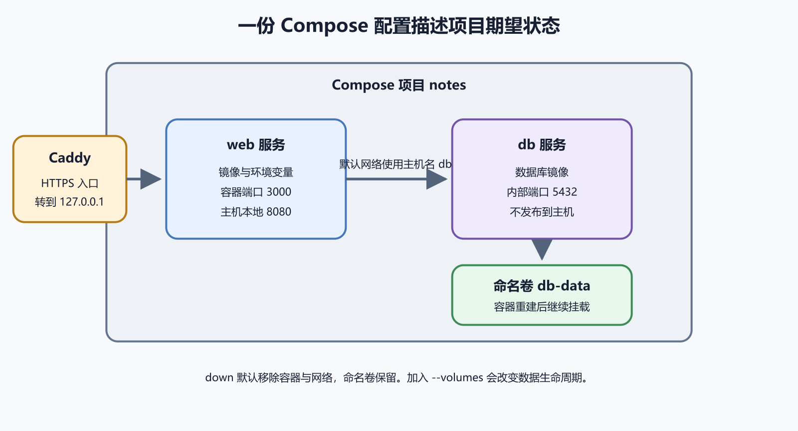

# Docker Compose 与多容器应用

一个项目有 Web 应用、数据库和缓存时，连续输入几条很长的 `docker run` 很快会失控。端口、卷、环境变量和网络分散在命令历史里，下一次重建很难完全相同。Docker Compose 用一个 YAML 配置描述一组服务、网络和卷。`docker compose` 命令按这份配置创建和管理项目。

Compose 适合单机开发、测试和个人服务器部署。它不会把一台主机自动变成多机集群。



*图 47-1　Compose 项目用服务、内部网络和命名卷组织 Web 与数据库。等价说明见本章“一份最小 compose.yaml”。*

## 一份最小 compose.yaml

下面示例包含应用和 PostgreSQL，只用于说明结构。真实密码不能直接写入文件。

```
services:
  web:
    image: example/notes-api:1.0.0
    ports:
      - "127.0.0.1:8080:3000"
    environment:
      DATABASE_HOST: db
    depends_on:
      - db

  db:
    image: postgres:18
    volumes:
      - db-data:/var/lib/postgresql/data

volumes:
  db-data:
```

`services` 下每个名称是一项服务。`web` 和 `db` 也是默认网络中的可解析名称。顶层 `volumes` 声明命名卷。`db` 把它挂到数据库数据目录。数据库镜像还需要密码等配置，示例故意省略，不能直接启动生产系统。

## YAML 对缩进敏感

YAML 使用空格表达层级。Tab、缩进错位和冒号位置错误都会改变或破坏配置。编辑后先运行。

```
docker compose config
```

命令在 `compose.yaml` 所在目录运行，会解析、合并并展示 Docker 实际采用的配置。Docker 当前快速入门也建议用它检查变量替换和多文件结果。输出可能包含展开后的秘密，不能直接贴到公开工单。检查服务、端口、卷和镜像后再启动。

服务是配置中的期望定义，例如 `web`。容器是这项服务的一次运行实例，例如 `notes-web-1`。项目把同一份 Compose 配置创建的容器、网络和卷放在命名空间中。项目名通常来自目录或显式 `name`。在不同目录复制同一文件，可能创建两个项目和两套卷。生产操作前运行 `docker compose ls` 和 `docker compose ps` 确认对象。

明确项目名能减少目录改名导致的资源重复。名称写入运行手册。

## up 做了什么

```
docker compose up -d
```

`up` 根据配置创建或更新网络、卷和容器，并启动服务。`-d` 让它在后台运行。需要构建的服务可能执行构建，需要远程镜像的服务可能拉取。配置变化时，Compose 会判断是否重建容器。成功输出不等于应用可用。随后运行 `docker compose ps`、查看日志并发真实请求。

第一次可不加 `-d` 在前台观察，但 `Ctrl+C` 会停止服务。生产服务器通常后台运行并单独查看日志。

```
docker compose ps --all
```

它列出项目容器、服务、状态和发布端口。`--all` 包含已退出容器。Docker CLI 参考明确说明默认只显示运行容器。状态 Up 表示主进程仍运行。若配置健康检查，可能显示 healthy、unhealthy 或 starting。

Exited 后的数字是进程退出码。零常表示正常完成，长期服务退出为零也意味着它已经不再提供请求。端口列要检查主机绑定地址，避免数据库意外显示 `0.0.0.0`。

## logs 查看标准输出

```
docker compose logs --tail 100 web
```

命令查看 `web` 服务最近一百行日志。加入 `-f` 实时跟随，按 `Ctrl+C` 只停止查看，不停止容器。服务没有输出时，可能应用写入文件、日志驱动不支持读取，或者进程尚未启动。第 48 章会展开。日志可能包含用户数据和令牌，分享前脱敏。生产默认不要打印全部环境变量。

```
docker compose exec web sh
```

它在已运行的 `web` 容器中启动 `sh`。镜像若没有 shell 会失败，极简镜像没有调试工具是正常情况。进入后命令运行在容器里，不在主机。先运行 `pwd`、`id` 和 `cat /etc/os-release` 识别环境。使用 `exec` 做只读检查，不能把现场安装软件和改配置当作正式修复。退出 shell 不会停止主容器。

## 服务名承担内部 DNS

同一 Compose 默认网络中，`web` 可以使用主机名 `db` 连接数据库容器端口。无需知道动态 IP。数据库不写 `ports` 时，主机和公网无法通过主机端口直接连接，`web` 仍能通过内部网络访问。这降低了暴露面。需要在主机做维护时，可以临时使用 `docker compose exec db` 运行数据库工具，或者设计受控入口。

多个 Compose 项目默认网络分开。同名 `db` 不会自动互相发现。

简单 `depends_on` 控制容器创建与启动顺序。数据库进程启动后还需要初始化，Web 可能太早连接而失败。应用应实现有限重试。Compose 也能结合健康检查和条件等待，字段行为要跟随当前规范。Docker 快速入门用 Redis 展示了启动竞争，并通过健康检查改善。

不要用固定睡眠十秒作为唯一方案。不同机器和数据量启动时间不同。

## 环境变量从哪里来

Compose 可在文件中写非秘密变量，也可从 `.env`、shell 或 `env_file` 读取。不同来源有覆盖顺序。运行 `docker compose config` 查看最终结果，但输出可能展开秘密。生产秘密文件限制权限，并排除 Git。环境变量变化后，仅 `docker compose restart` 可能不会重建容器配置。使用 `up -d` 按新配置重建，并验收。

变量名相同不代表值适用于所有环境。测试和生产文件分开，路径与项目名明显区分。

Compose 能以文件方式把 secret 提供给容器。它比直接放环境变量更适合某些应用，但在单机本地实现中仍要保护源文件。不能因为配置键叫 `secrets` 就认为内容已由硬件加密或自动轮换。查看当前 Compose 实现和部署环境说明。

真实秘密不写进 compose.yaml。记录来源、容器内目标、权限和轮换步骤。应用应支持从文件读取，不能把秘密再次打印到日志。

## stop、start 与 down

```
docker compose stop
docker compose start
```

`stop` 停止现有容器但保留它们。`start` 再启动已创建的容器。

```
docker compose down
```

`down` 停止并移除项目容器和网络。默认不会删除命名卷。Docker 官方参考列出具体删除范围。加入 `--volumes` 会删除配置声明的命名卷和匿名卷，可能造成数据库丢失。不能把它写进普通停止脚本。

## restart 不会应用所有新配置

`docker compose restart` 重启现有容器。它不会根据新镜像或变更后的环境重新创建。更新镜像、端口、卷或环境时使用 `docker compose up -d`，让 Compose 比较配置并重建需要的服务。执行前先运行 `config`，记录当前镜像摘要和卷。执行后看 `ps` 的创建时间、镜像与健康。

重启能暂时恢复内存泄漏，不能代替根因修复。

开发常把源代码 Bind Mount 到容器、打开调试端口、输出详细日志。生产应把代码放进镜像，限制端口，使用非 root 用户和日志保留。Docker 官方生产 Compose 指南建议使用额外覆盖文件表达这些差异。

多文件合并会出现替换与追加规则。每次用 `docker compose config` 检查最终内容，不凭文件名猜。生产文件仍进入版本控制，秘密使用受控来源。只在服务器手改会产生漂移。

## profiles 只用于可选服务

Compose profile 可以让调试工具或一次性服务按需启用。没有 profile 的核心服务通常默认启动。不要把生产数据库放在一个容易忘记启用的 profile 中。可选管理界面启用时也要限制端口和账号。

运行命令记录启用了哪些 profile。另一个管理员只运行普通 `up` 时，结果可能不同。小项目没有可选组合时不用 profiles，保持配置直接。

启动前运行 `config`，确认无意外公开秘密。`up -d` 后用 `ps --all` 检查容器、端口和健康。查看 Web 与数据库最近日志。从主机请求 Web，再在 Web 容器内通过服务名测试数据库连接。创建一条测试数据，执行 `down` 后再 `up -d`，确认命名卷数据保留。不要加入 `--volumes`。

重启主机后验证 Docker 与项目恢复策略。最后检查备份和恢复到新卷。

## 视频跟做卡　从 Compose 文件到重建

这段视频用较完整的示例解释为什么需要 Compose，并展示从多条容器命令整理出 Compose 文件。只观看两个操作区间即可，正文中的数据卷、日志、健康检查和 `down -v` 风险仍要另外完成。

- **视频标题**　Ultimate Docker Compose Tutorial
- **作者或机构**　TechWorld with Nana
- **平台**　YouTube
- **发布时间**　2024 年 1 月 11 日
- **视频时长**　1 小时 3 分 14 秒
- **推荐观看区间**　11 分 58 秒至 27 分 18 秒，以及 40 分 36 秒至 46 分 41 秒
- **解决的问题**　把多条 `docker run` 命令改写成 Compose 文件，创建服务，区分 up、down、start 与 stop，并使用变量和 Compose secrets
- **观看前需要完成**　安装当前 Docker Desktop 或 Docker Engine 与 Compose 插件，准备作者示例或本书的无状态练习项目
- **观看时亲手完成**　先运行 `docker compose config`，再执行 build、`up -d`、ps 与 logs；修改非秘密配置后用 `up -d` 重建，最后用不带 `-v` 的 down 停止
- **界面时效**　截至 2026 年 8 月 6 日，推荐区间采用的 `docker compose` 插件流程仍符合当前 Docker 文档；镜像标签、变量与 secrets 行为以当前 Compose 规范为准
- **可点击链接**　[打开视频并从 11 分 58 秒开始](https://www.youtube.com/watch?v=SXwC9fSwct8&t=718s)


*Docker Compose 视频链接二维码*

*二维码 47-1　扫码后打开视频。停止练习时不要添加 `-v`。*

## build 与 image 字段

服务写 `build` 时，Compose 从指定上下文构建镜像。写 `image` 时，通常拉取或使用已有镜像。两者可以同时存在，构建结果使用 image 名称标记。拉取策略和构建行为受命令与当前 Compose 版本影响。

生产配置优先明确镜像摘要，由 CI 构建。开发配置可以本地 build。这样服务器不需要源代码和编译工具。运行 `docker compose images` 记录项目实际镜像。不能只看 YAML 中的标签。

Compose 的 `command` 会覆盖镜像默认 CMD，`entrypoint` 会覆盖入口。调试时改成 shell，忘记恢复会让应用不启动。覆盖适合向通用镜像传参数，不应复制整段复杂启动脚本。基础镜像更新后入口行为可能变化。

使用 `docker compose config` 查看最终值，再 inspect 运行容器的 Path 和 Args。一次性迁移使用独立 service 或 `run`，不要永久改 Web 服务命令。

## docker compose run 是一次性任务

```
docker compose run --rm web npm test
```

它基于 `web` 服务配置创建新的一次性容器，执行 `npm test`，退出后删除容器。默认端口行为和依赖启动与 `up` 不完全相同，按当前 CLI 文档确认。任务可能连接项目数据库并修改数据。生产迁移命令先在副本验证，记录退出码。`--rm` 只删除任务容器，不删除命名卷。

测试任务不应持有生产秘密，除非有明确授权和最小权限。

`exec` 在现有运行容器中执行命令，看到当前可写层和进程环境。容器未运行时不能用；`run` 创建新容器，使用服务定义和挂载，但拥有独立可写层；它不等于进入正在服务用户的容器；排查当前实例使用 exec；执行一次性任务使用 run；发布测试可从镜像创建独立服务。

命令是否会访问同一 Volume 必须看配置，不能凭工具名称判断数据影响。

## 配置合并容易出现列表追加

生产覆盖文件只写差异，Compose 会按字段类型合并。某些列表追加，某些字段替换，特殊标签还能重置。端口或卷若意外追加，生产可能同时保留开发绑定。每次合并后查看完整 `config`。使用 `-f` 时文件顺序影响结果。运行手册保存准确命令，不能让管理员自行猜顺序。

配置复杂到难以审阅时，生成一份独立生产文件可能更安全，代价是保持同步。

Compose 中 Bind Mount 的相对路径通常相对配置项目目录解析。换工作目录或使用多个 `-f` 文件时容易误解。生产挂载优先使用明确绝对路径，或者把项目目录固定并写入服务单元。执行前 `pwd`，运行 `config` 查看解析后路径。目标不存在时让部署失败。

不要从任意目录运行一条复制来的 Compose 命令，它可能创建新项目和新卷。

## env_file 路径与内容

`env_file` 把文件中的变量传给容器。它与用于 Compose 自身变量替换的 `.env` 职责不完全相同。同名变量的覆盖顺序要查当前文档并用最小测试验证。不要认为修改任意一个文件都会生效。生产环境文件使用绝对受控路径或固定项目位置，权限只给管理员和需要的部署流程。

应用启动时检查必需变量，缺少就明确失败，不能使用危险默认密码。

Compose 还能声明 configs，把配置内容提供给服务。具体实现和权限行为受平台影响。单机项目使用只读 Bind Mount 也能清楚工作。选择一种团队能理解、能备份和能轮换的方式。

配置中含秘密时不要放入普通 config。将非秘密配置和秘密拆开。容器内配置目标不要位于静态 Web 根目录，避免被应用公开。

## 外部网络与外部卷

声明 `external: true` 表示 Compose 只引用已存在资源，不负责创建和删除。这适合多个项目共享反向代理网络或数据库卷，也让生命周期责任脱离当前仓库。部署前确认资源存在、名称正确、负责人和备份清楚。新服务器重建时要先创建外部资源。

`down` 不删除外部资源。下线项目仍要由资产清单处理，不要以为 Compose 已清理全部。

一种单机布局是 Caddy 在独立 Compose 项目，多个应用加入同一外部网络。Caddy 通过服务别名访问上游。共享网络让应用彼此更容易可达，隔离减弱。使用独立网络连接代理与每个应用，可减少横向访问。

代理更新会影响所有站点，发布和回滚要独立安排。证书数据有自己的 Volume 和备份。初学者项目少时，主机 Caddy 转本机端口更容易理解。不要为了少写端口提前搭复杂共享网络。

## Compose 文件中的资源限制

可以为服务设置 CPU 与内存限制，具体字段在不同 Compose 与编排模式中曾有差异。必须按当前 Compose Specification 核对。运行后 inspect 容器和 `docker stats`，确认限制真的应用。只写 YAML 不算验证。

限制保护主机，也会造成 OOM 和性能下降。先测峰值，留出系统与数据库余量。所有服务限制总和不能超过主机能力，仍要监控实际合计。

单机 Compose 可用 `restart` 配置容器重启策略。`deploy.restart_policy` 主要属于更广泛的部署规范，是否由当前本地 Compose采用要验证。不要从 Swarm 或 Kubernetes 教程复制字段，看到配置解析通过就认为生效。

运行后 inspect `HostConfig.RestartPolicy`，测试进程失败与主机重启。管理员明确 stop 后的行为也要记录，避免维护后服务没有回来。

## healthcheck 的依赖条件

数据库健康检查必须使用镜像已有客户端，并在合理时间返回。检查中不要写真实密码到命令行。Web 的 `depends_on` 可以等待数据库 healthy，应用仍要在运行期间重连。健康失败不会自动说明根因。查看检查输出、数据库日志和资源。

故意让数据库不可用，再恢复，验证整组服务能自行回到正常。

Compose Watch 可以在源文件变化时同步、重启或重建，官方快速入门展示了当前用法。它提高本地反馈速度，不适合作为生产发布。生产代码应固定在镜像并由版本控制触发部署。

文件同步规则要排除秘密和大目录。依赖清单变化通常需要重建，不能只同步代码。团队记录最低 Compose 版本，旧版本可能不支持当前字段。

## Compose 版本与旧命令

当前主路径是 `docker compose`，它是 Docker CLI 插件。旧教程可能使用带连字符的 `docker-compose` 独立程序。命令名称、规范和行为已发展，不能把旧二进制与新文档混用。运行 `docker compose version` 记录环境。Compose 文件顶层旧 `version` 字段在当前规范中的作用也已变化。以当前官方文档和 `config` 警告为准。

封版前重新验证界面和命令，视频也只选择当前插件流程。

服务器重启后可依赖容器 restart 策略，也可以由 systemd 管理 Compose 项目入口。两者不能设计成互相争抢。使用 systemd 时，单元要固定工作目录、Compose 文件、项目名和 Docker 依赖。启动与停止命令经过测试。

数据库停止顺序和超时要保留，不使用强制 kill。日志分别查看 Docker daemon、Compose 容器和 systemd。个人项目先使用容器 restart 策略并完成重启测试。需要统一启动顺序时再引入单元。

## 一次配置未生效案例

管理员修改 `.env` 中日志级别，运行 `docker compose restart web`。应用仍显示旧值。原因是 restart 使用现有容器创建时环境，没有按新配置重建。运行脱敏 `config` 确认新值，再 `up -d web`。inspect 新容器确认环境和创建时间，随后查看日志。不能把修改宿主文件等同于容器环境自动变化。

运行手册明确哪些变更需要 reload、restart 或 recreate。

先运行 `docker compose config` 查看展开后的配置，确认服务名、端口、挂载路径和环境变量来源符合预期。输出可能包含秘密，保存或分享前要脱敏。随后运行 `docker compose up -d`，再用 `docker compose ps` 查看容器是否重建、健康状态是否恢复。只运行 `restart` 不能应用所有配置变化。

接着查看目标容器的创建时间、镜像摘要和挂载，确认运行的确实是新配置。最后从容器外完成一次真实请求，并检查数据是否仍在预定 Volume 或 Bind Mount 中。配置文件写对、容器重建和业务可用是三项独立结果，任何一项不符都先停在当前步骤查日志。

## 一次目录改名案例

团队把服务器项目目录从 `notes` 改成 `notes-prod`，未固定项目名。下一次 up 创建了新网络和新卷。应用连接到空数据库，旧资源仍以原项目前缀存在。先停止新项目，盘点 `docker compose ls`、卷和标签。恢复时固定 `name` 或 `-p` 为原项目名，确认旧卷后再启动。不要在不清楚时删任何卷。

此后把项目名写进配置和运行手册，迁移前预览最终资源名。

这次练习不接触生产数据；新建独立练习目录，把 `compose.yaml`、示例 `.env` 和说明文件放在一起；先运行 `docker compose config`。成功时应输出合并后的标准配置，变量已经替换，服务名称与卷名称清楚可见。若命令报告 YAML 错误，先看行号附近的缩进和冒号后空格。若变量为空，检查当前目录、`.env` 文件名和变量拼写。不要在输出中分享真实密码。

运行 `docker compose up -d` 后，用 `docker compose ps` 查看所有服务。预期状态由服务类型决定。长期运行的 Web 与数据库应为 `Up`，一次性初始化任务可能正常退出。看到 `Exited` 时先读它自己的日志，不能一律当成失败或成功。在浏览器或 `curl` 中访问发布端口，再向应用写入一条测试数据。运行 `docker compose down`，确认容器和默认网络消失。重新 `up -d` 后，测试数据仍在，说明命名卷路径至少通过了第一次生命周期验证。

修改一个环境变量，再比较 `restart` 与 `up -d` 的结果。前者通常不会重建容器，后者会根据配置差异更新。使用 `inspect` 或应用版本页确认新值真正生效。练习结束前先列出卷。若数据不需要保留，再用精确项目范围清理。不要把 `down -v` 形成习惯，因为在生产项目中它会把命名卷一起移除。

## 把 Compose 配置交给别人时

> 拿你的项目试一下
>
> 在项目目录运行只读的 `docker compose config --services` 和 `docker compose ps`，记下服务名、状态和公开端口。再查看 Compose 文件中的 Volume 定义，指出数据库或上传文件实际保存在哪里。容器为 Up 只证明相应进程仍在运行。还需要从容器外访问公开入口，完成一次读写，并在重建后确认测试数据仍在，才能逐步证明网络、应用与持久化符合预期。

仓库中提交 `compose.yaml`、无秘密的示例环境文件和运行说明。说明中写清需要创建的目录、端口、最低资源、启动命令、健康检查、备份和回滚。真实 `.env` 不进入 Git。接手者复制示例文件并在自己的环境填值。必填值缺失时，配置最好直接报错，避免应用带着空密码或错误地址启动。

发布记录保存最终配置的脱敏结果和镜像摘要。只保存源 Compose 文件不够，因为环境变量、覆盖文件和命令行参数都可能改变最终结果。如果接手者无法根据说明在空主机上复现，项目仍依赖原管理员脑中的隐含步骤。把这次失败作为文档缺口修复。
