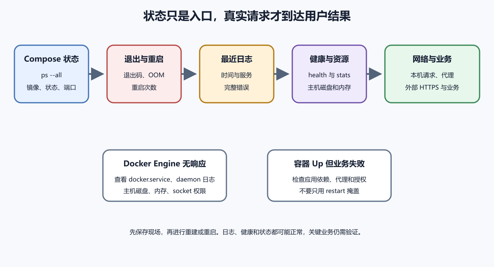

# 容器状态、日志、健康检查和重启策略

容器显示 Up，只能证明主进程还没有退出。应用可能无法连接数据库，健康检查可能持续失败，日志可能快速占满磁盘。判断容器服务要依次看状态、退出原因、日志、健康检查、端口、资源和真实请求。重启是恢复动作之一，不能代替原因调查。



*图 48-1　从 Compose 状态到应用请求的排查顺序。等价说明见本章“第一步先看全体状态”。*

## 第一步先看全体状态

在 `compose.yaml` 所在目录运行。

```
docker compose ps --all
```

记录服务名、容器名、镜像、状态、健康和端口。`--all` 让已经退出的容器也出现。容器反复显示 Restarting，说明重启策略正在循环。Exited 表示主进程已经结束。Dead 或 Removing 表示 Docker 还在处理异常状态。

不要马上运行 `up` 覆盖现场。先保存当前状态和最近日志。

## 查看单个容器详细信息

```
docker inspect 容器名
```

输出是较长 JSON，包含镜像、命令、环境、挂载、网络、健康和重启计数。它可能包含秘密环境变量，不能原样公开。只取状态字段可以使用格式化参数，但语法容易受 PowerShell 引号影响。初学者先保存完整脱敏输出，在编辑器中查 `State`、`Health` 和 `Mounts`。

比较配置中的期望与 inspect 的实际结果。旧容器没有重建时，可能仍使用旧环境和日志设置。

进程正常完成常返回 0。非零值表示程序报告失败，具体含义由应用定义。137 常见于收到强制终止信号，也可能与内存不足相关，不能只凭数字下结论。143 常与正常终止信号相关，仍要看停止原因和日志。

查看容器状态中的 ExitCode、OOMKilled 和 Error，再查主机内核日志。应用主动退出与 Docker 杀死是不同方向。记录最后开始、结束时间和重启次数，能与部署或资源峰值对应。

## docker logs 能看到什么

Docker 默认把容器主进程的标准输出和标准错误交给日志驱动。`docker logs` 展示这些流。

```
docker compose logs --tail 200 --timestamps web
```

`--tail 200` 限制最近两百行，`--timestamps` 显示时间，`web` 限定服务。实时复现时加入 `-f`。完成后按 `Ctrl+C` 停止查看，容器继续运行。日志时间可能为 UTC，事故记录写时区。分享前移除令牌、Cookie、用户数据和内部地址。

应用可能把日志写到容器内部文件。日志驱动也可能发送到远程系统，并关闭本地双重读取。先查看镜像和应用文档，再 inspect 容器的日志驱动。不要在容器内到处搜索并公开文件。官方 Nginx 镜像把访问和错误日志连接到标准输出与标准错误，Docker 文档用它说明容器日志模式。

自建应用优先向标准流写日志，由 Docker 或平台收集。需要文件日志时声明持久位置和轮转。

## 日志会占满 Docker 主机

默认 `json-file` 驱动在没有配置轮转时可能持续增长。Docker 官方建议在一般场景考虑会自动轮转的 `local` 驱动，并明确默认行为可能耗尽磁盘。查看当前默认驱动。

```
docker info --format '{{.LoggingDriver}}'
```

PowerShell 单引号通常可用，遇到格式问题可从 `docker info` 完整输出查找。修改守护进程默认日志配置只影响之后新建的容器，已有容器要重建。操作 Docker 服务会影响整台主机，先备份配置并安排窗口。

容器显示 `running`，说明容器的主进程仍在运行。健康状态通过，说明预先写好的检查命令得到了预期结果。用户能否使用，还要继续检查代理、网络、权限、数据库和真实操作。看到 `running` 以后直接宣布网站正常，会漏掉后面这些部分。

例如 Web 容器的主进程正常，`/health` 也返回 200，但保存笔记仍然失败，因为健康检查没有访问数据库。反过来，业务页面可以暂时打开，容器却显示 `unhealthy`，原因可能是健康检查使用了错误路径。此时不能简单删除健康检查，也不能只重启容器。先看检查命令、失败历史、应用日志和依赖服务，再判断检查有误还是业务正在退化。

练习时先记录正常结果，包括 `docker compose ps`、健康历史、关键请求和一次数据写入。随后只在隔离练习环境停止一个依赖服务，观察容器状态、健康检查和页面错误怎样变化，再启动依赖并重新测试。不要在生产数据库、真实订单或用户文件上制造故障。

## 健康检查回答什么

健康检查是容器内周期执行的命令，用退出状态报告 healthy 或 unhealthy。它可以请求本机健康接口，也可以检查关键进程。Dockerfile 支持 `HEALTHCHECK`。Compose 也能覆盖或定义。Dockerfile 参考给出当前语义。

健康检查不负责自动修复业务。Docker Engine 的普通重启策略依据主进程退出，不一定因 unhealthy 自动重启。编排平台可能根据健康状态采取动作，行为要查当前工具文档。

假设镜像中有 `wget`，应用在容器 3000 端口提供 `/health`。

```
services:
  web:
    image: example/notes-api:1.0.0
    healthcheck:
      test: ["CMD", "wget", "-q", "--spider", "http://127.0.0.1:3000/health"]
      interval: 30s
      timeout: 5s
      retries: 3
      start_period: 20s
```

镜像没有 `wget` 时检查会失败，不能为健康检查假定工具存在。可以让应用镜像提供专用检查命令。`start_period` 给启动留时间，`retries` 避免一次抖动立即判定。具体频率要避免给数据库造成负载。

## 健康接口不要暴露秘密

公开 `/health` 可以只返回简短状态和通用版本。不要返回数据库密码、内部主机、完整依赖错误和用户数据。存活检查只确认进程响应。就绪检查可以确认必要依赖，不能执行昂贵全表查询。真实业务验收仍要独立完成。健康为绿色时，授权错误和数据问题仍可能存在。

外部监控通过正式 HTTPS 请求，能覆盖 DNS、代理和容器之外的层。

`docker inspect` 的 `State.Health` 会保存最近检查结果和输出。输出长度有限，应用还应在自己的日志中记录必要原因。检查连续超时还是明确非零退出。超时可能来自应用卡住、检查工具 DNS 问题或检查本身太慢。在容器内手工运行同一检查命令，确认路径与权限。手工成功而周期失败时，比较环境和时间。

不要把重试次数无限调高来隐藏 unhealthy。先修复根因。

## restart 策略的四种常见选择

- `no` 表示不自动重启，是默认值
- `on-failure` 在进程失败退出时重启，可选最大次数
- `always` 只要容器停止就尝试重启，包括 Docker 服务重启后
- `unless-stopped` 与 always 接近，但管理员明确停止后，Docker 重启不会自动把它拉起

Docker 官方自动启动文档给出这些策略和细节。

数据库密码错误时，应用启动、连接失败并退出。`always` 会形成循环，日志快速增长，数据库收到大量失败认证。先停止故障服务，保存日志，修正秘密并重建容器。验证后再恢复策略。长期服务需要自动恢复，也需要持续重启告警。只看到最后一次容器 Up，可能漏掉之前数百次失败。

一次性迁移任务正常退出后不应自动无限重启，策略要按服务性质选择。

## 容器启动顺序与健康依赖

Compose 可以让 Web 在数据库健康后再启动，当前快速入门提供相关示例。这能改善初次启动竞争，不能替代应用运行中的重连。数据库之后重启，Web 仍要处理连接中断。

健康检查路径、依赖条件和应用重试共同设计。固定睡眠只隐藏不同机器速度差异。故障恢复测试包括单独重启数据库，观察 Web 是否恢复。

```
docker stats
```

它持续显示 CPU、内存、网络和块 I/O，按 `Ctrl+C` 退出。指标是当前快照和变化，不能替代长期监控。内存接近限制时查看 OOM 状态和主机内存。CPU 高时对应访问日志和进程。网络高时检查下载与备份。

容器资源总量来自同一主机。每个容器看似不高，合计仍可能耗尽 VPS。设置限制前测真实峰值。过小限制会制造退出，过大则无法保护其他服务。

## 容器内看不到主机全部状态

容器进程视图被隔离。容器内 `free`、磁盘和网络输出可能受命名空间和控制组影响。排错要同时看容器与主机。主机磁盘满会影响所有容器，单个应用日志只显示写入失败。Docker daemon 日志在 Ubuntu 上可通过 systemd journal 查看。Docker 官方守护进程日志页给出 `journalctl -xu docker.service` 等入口。

先判断是单容器、Docker Engine，还是整台主机故障。

```
docker compose exec web sh
```

适合查看当前进程、文件和网络。它不会创建新容器，修改会留在当前可写层，重建后消失。生产调查使用只读命令。不要在运行容器安装编辑器、改依赖或手工删除数据。镜像没有 shell 时，可以使用调试镜像加入同一网络或命名空间，操作复杂，需要明确权限。本书不把它作为初学路径。

修复回到 Dockerfile、配置和版本控制。

## 一次 502 排查

浏览器返回 502，Caddy 正常。`docker compose ps` 显示 web Restarting。日志显示环境变量缺少。检查 `docker compose config` 发现服务器 `.env` 中变量名拼错。修正秘密文件后运行 `docker compose up -d web` 重建服务。再检查状态、日志、本机代理上游和正式 HTTPS。

没有必要开放容器端口公网，也不需要重启整台服务器。

容器主进程运行，健康检查持续超时。手工请求业务接口正常，检查命令使用了镜像中不存在的 `curl`。这属于检查实现错误。选择镜像已有工具、加入专用二进制，或让应用提供可执行检查。修正 Dockerfile，构建新镜像并重建容器。不要删除健康检查来让状态变绿。

健康系统本身也要测试，故意让应用失败，确认它能变为 unhealthy。

## 日常检查清单

查看 `docker compose ps --all`、持续重启、unhealthy 和异常端口。查看最近错误日志、日志驱动和主机磁盘。监控容器与主机 CPU、内存和网络。从外部正式地址发请求，检查证书和关键业务。确认备份任务与恢复演练。

状态、日志、健康和请求四者共同通过，才能说明服务正常。

容器已经创建但主进程尚未成功启动时，可能停在 Created。原因包括命令错误、挂载失败、网络或运行时问题。查看 inspect 的 Error 和 daemon 日志。应用标准输出可能还没有产生，所以 `docker logs` 为空。

不要反复 start。先修复创建配置，通常由 Compose 重建容器。保留创建错误和配置，删除旧容器前确认没有独有可写层数据。

## paused 与 stopped 不同

pause 暂停容器进程执行，内存和容器仍存在。stop 发送终止信号并让主进程退出。暂停数据库可能让客户端超时和堆积连接，不适合普通维护。大多数应用发布使用优雅停止。看到 Paused 状态时查谁执行、为什么以及多久。恢复使用 unpause，之后验证时间敏感任务。

不要把 pause 当作数据库一致性备份方法，仍按数据库官方流程。

```
docker compose top web
```

命令只读，列出服务容器内的进程。可以确认启动脚本、工作进程和实际用户。进程列表的命令参数可能包含秘密，分享前脱敏。发现数据库密码在参数中，要改认证方式并轮换。主进程不是预期程序时，检查 entrypoint、command 和镜像摘要。

## events 帮助观察生命周期

Docker Engine 会产生创建、启动、停止、退出、健康变化等事件。短期观察可以运行 `docker events` 或 Compose 事件命令。输出持续进行，按 `Ctrl+C` 停止。记录开始时间和过滤范围，避免海量输出。事件能说明何时发生，不能解释应用为什么失败。与日志、发布记录和主机指标结合。

长期监控使用合适采集系统，不靠一个打开的终端。

容器日志来自应用标准流。daemon 日志来自 Docker Engine 本身，记录存储、网络、拉取和运行时错误。所有容器同时无法启动、Engine 连接失败或网络创建报错时，查看 daemon 和 systemd 状态。

单个应用 500 时优先看该容器和依赖，不能因为使用 Docker 就从 daemon 开始。两类日志有不同时间和保留策略，事故记录标明来源。

## 健康检查的 start_interval

Dockerfile 和 Compose 的健康字段会随版本增加能力。较新版本可能支持启动阶段不同检查间隔。使用前确认 Engine 与 Compose 最低版本，旧服务器可能忽略或拒绝字段。配置兼容性进入部署前 `config` 和测试机验证。不能让开发机新版本字段直接进入旧生产机。

只用基本 interval、timeout、retries 和 start_period 已能覆盖大多数小项目。

容器以非 root 用户运行时，健康命令也通常使用同一用户。它必须能执行工具和访问本机接口。为了健康检查给容器 root 或额外能力会扩大风险。提供一个普通用户可执行的专用检查程序。检查写临时文件时使用明确 tmpfs，避免污染持久卷。

健康输出不要包含秘密，因为 inspect 可能显示最近结果。

## 深层健康检查可能扩大故障

每十秒对数据库执行复杂查询，许多容器副本会形成额外负载。依赖变慢时，检查本身进一步压垮它。使用轻量连接或常量查询，设置短超时。业务正确性通过独立合成监控低频测试。外部 API 不应成为容器存活的唯一条件，第三方故障会让所有容器被判不健康。

区分本服务能否运行与完整业务是否可用。

Docker 重启策略有自身行为，应用也可能内部重试。两层同时快速重试会造成流量洪峰。为数据库和外部服务使用指数退避、随机抖动和最大次数。容器级持续重启要告警。故障恢复后避免所有副本同一秒连接。多容器环境尤其要考虑惊群。

简单个人项目至少设置连接超时和有限重试，不写无限紧循环。

## 内存限制与 OOM

容器没有限制时，可以消耗主机大部分内存。有限制时，达到上限可能由内核终止。`docker stats` 显示当前使用与限制。inspect 查看配置，主机日志确认 OOM。增加限制前检查应用泄漏和构建任务。数据库需要缓存，过低限制会持续抖动。

限制总和与主机余量一起规划，Docker daemon、系统和代理也需要内存。

CPU 限制可以防止一个容器占满主机。达到配额时进程被节流，不一定退出。用户看到响应变慢，日志没有错误。结合容器 CPU、节流指标和请求延迟判断。后台任务可以限制并错开高峰。Web 服务需要保留突发能力。

不要把性能问题全部交给更高限制，先查循环、查询和异常流量。

## 磁盘写入与容器层

应用把缓存和临时文件持续写容器层，`docker system df` 会看到容器可写空间增长。找出路径，判断应放 tmpfs、Volume、外部存储或设置清理。日志优先标准输出与驱动轮转。删除容器会释放可写层，也会删除其中唯一数据。更新前先确认内容可重建。

应用设计让运行容器接近无状态，更新和扩容更容易。

容器内访问 `db` 失败，先查服务是否同网和 DNS。名称解析成功但连接拒绝，再查数据库监听与健康。主机访问发布端口失败，查 `docker ps` 端口、主机绑定和容器应用监听。外部失败再查防火墙和代理。一个容器能访问，另一个不能，比较网络成员、DNS 和应用身份。

不要通过使用容器 IP 固定修复，重建后会再次变化。

## 日志限额在 Compose 中声明

可以为服务设置 logging 驱动和选项，让配置与应用一起版本化。字段和值按当前 Compose 参考核对。修改后需要重建容器，inspect 确认。旧容器不会自动采用。轮转限制根据流量和调查周期选择。过小会丢失事故证据，过大可能占满磁盘。

远程日志发送失败时的阻塞或丢弃行为也要测试。

应用因数据库错误每秒打印堆栈，默认 json-file 没有轮转。数小时后主机磁盘满，所有容器写入失败。先停止错误循环，保存代表日志和时间线。确认后按 Docker 官方方式处理日志，不直接乱删内部文件。

修复数据库配置，设置日志轮转和磁盘提前告警，重建容器使新配置生效。事故还要检查数据库、Volume 和备份任务在满盘期间是否失败。

## 一次重启掩盖故障案例

Web 容器每天内存增长，凌晨被 OOM 后由 always 重启。白天用户只感觉偶尔退出，状态检查总是 Up。查看重启次数和主机内核日志才能发现。保存内存曲线，在测试环境定位泄漏。临时重启策略保持可用，仍设置高频重启告警和修复期限。

自动恢复提高可用性，也可能把长期缺陷藏起来。

第一分钟先记录时间、用户看到的现象和最近变更。不要马上重启，因为退出状态和短暂日志可能随重建消失。第二步运行 `docker compose ps`，同时看期望服务是否都存在、当前状态、健康和端口。某个服务缺失时，检查 Compose profile、服务名和最终配置。

第三步只读取故障时间附近的日志。Web 报数据库连接拒绝，就去核对数据库状态与网络。数据库日志显示密码错误，再检查应用凭据来源。不要因为 Web 日志最容易看到，就只在 Web 容器中找答案。

第四步看 `inspect`。核对镜像摘要、创建时间、重启次数、退出码、健康历史、挂载和网络。创建时间晚于故障开始，说明自动重建或人工操作已经改变现场。第五步从最靠近应用的位置测试。先在容器内访问自己的健康接口，再从同网络服务访问，接着从主机访问发布端口，最后从公网经过代理访问。在哪一步首次失败，故障就大致位于那一步与上一步之间。

第六步查看主机资源和 Docker daemon。所有容器同时异常，更像主机磁盘、内存、网络或守护进程问题。只有单个服务异常，更像镜像、配置、依赖或数据问题。得到证据后才选择重启、重建或回滚。操作完成要重复同一组检查，确认状态和用户功能都恢复。只看到容器变成绿色不能结束事故。

## 日志内容也有安全边界

日志可能包含邮箱、访问令牌、请求正文和内部地址。排错需要足够上下文，但不能把完整生产日志随意贴到公开论坛或 AI 对话。分享前保留时间、错误类型、调用位置和关联编号，移除令牌、Cookie、密码、个人数据和完整数据库内容。替换值要保持格式特征，例如把主机名改为 `db.example.internal`，方便别人理解结构。

日志保留周期同时受调查需求、存储成本和隐私规则影响。应用应在写出前避免秘密，不能只依赖事后清洗。建立一个人工制造的测试错误，确认日志确实包含服务名、时间和关联编号。真正事故发生后再发现所有日志都没有时间，会增加按时间对应多个服务事件的难度。
