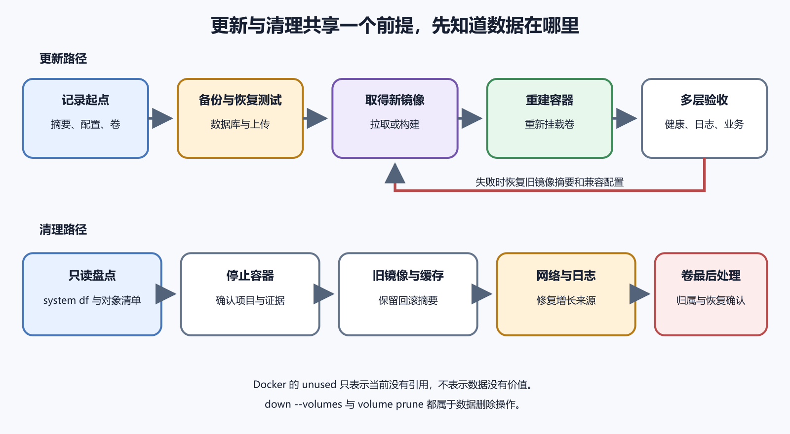

# 更新、回滚、清理与数据丢失风险

Docker 让更新看起来很轻。拉新镜像，重新启动，旧容器删掉。真正的风险在数据、配置和版本关系里。镜像可以重新拉，容器可以重新建，数据库、上传文件和迁移状态不能随便重来。

*图 49-1　更新先记录数据与回滚起点，清理最后处理卷；停止容器本身不会让卷失去引用。等价说明见本章“清理空间”。*

## 更新前先列清单

更新前先写四项。当前镜像和标签，新镜像和标签，持久数据在哪里，回滚用哪一版。若有数据库迁移，再写迁移是否可逆，旧版本能否读取新数据。这个清单比命令本身重要。

构建型服务更新时，先构建新镜像并给出明确标签。不要用同一个 `latest` 反复覆盖生产。服务器拉取后，确认镜像 ID 或摘要符合发布记录。随后重新创建容器，检查健康和日志。

使用 Compose 时，`up -d` 会按配置应用变化。它可能重建容器，也可能复用已有容器。改了环境变量、挂载、端口、镜像和启动命令后，都要确认实际容器是否更新。用状态、日志和应用版本接口验证。

## 回滚镜像

回滚镜像相对简单。把 Compose 或部署配置改回上一版标签，重新 up，确认健康。难点在数据。新版本如果写了新字段、执行了迁移或改变文件结构，旧版本可能无法工作。

数据库镜像不要跨大版本直接替换。PostgreSQL、MySQL、Redis 等数据服务都有自己的升级和降级规则。数据库容器不是普通无状态应用。升级前读官方迁移说明，在测试环境跑过，准备备份和停写窗口。

迁移任务只应运行一次。用一次性容器跑迁移时，要记录执行版本和结果。容器失败后重新运行，脚本要能判断已经完成哪些步骤。重复扣款和重复发送通知这类事故，Docker 替你防不住。

## 清理空间

清理从观察开始。`docker system df` 能看镜像、容器、卷和构建缓存占用。先确认是谁占空间，再决定清理。不要一上来就运行 prune 命令。自动清理脚本更要谨慎，尤其不要定时删除卷。

镜像清理相对安全，但也要保留回滚所需版本。构建缓存可以清理，代价是下一次构建变慢。已停止容器可以清理，前提是日志和状态不再需要。卷清理风险最高。卷里可能是数据库、上传文件或旧版本数据。

匿名资源和 orphan 容器常来自改服务名、改项目目录和中断部署。它们会占空间，也可能保存仍有价值的数据。清理前先看名称、标签、创建时间、大小和挂载关系。不能判断归属时，先备份再删。

## 数据删除后的验收

删除之后也要验收。确认应用能启动，数据库能读写，上传文件仍在，回滚所需镜像还在，备份没有被删。云盘、快照、对象存储和 Registry 费用也要看。删了容器，不一定删了卷。删了机器，也不一定删了快照。

空间告警发生时，先止损，再调查。可以临时扩大磁盘、清理明确无用缓存、压缩日志或停止异常写入。不要在紧急时删除不认识的卷。磁盘事故里，最贵的错误往往来自慌乱清理。

更新报告可以很短。版本、时间、执行人、变更内容、数据影响、验证结果、回滚办法和遗留问题。报告不是形式。下次出事时，它会告诉你上一轮到底动了什么。

## 更新 Docker Engine

Docker Engine 本身也要更新。更新前看发行说明和系统包变更，确认当前容器、Compose 插件、日志驱动和存储驱动没有已知兼容问题。生产机器上更新 Docker，影响的是所有容器，不是单个应用。

更新前记录当前 Docker 版本、Compose 版本、运行中的容器、镜像和卷。确认备份可用。选择低流量窗口。更新后检查 daemon 状态、容器是否自动恢复、网络是否正常、日志是否还在写、健康检查是否恢复。

Docker Desktop 和服务器 Docker Engine 也要分开。桌面更新可能影响本地开发，不代表生产也要同步。服务器更新按运维节奏走。看到本地提示新版本，不要把它当成生产升级指令。

## 镜像拉取和回滚缓存

发布前可以先拉取新镜像，不立即切换。这样能提前发现 Registry 权限、网络和标签错误。拉取成功后，再在发布窗口重建容器。若镜像很大，这一步还能减少停机时间。

回滚也依赖镜像可用。旧镜像若被 Registry 清理，服务器本地也被清理，就很难快速回到上一版。保留策略里要写明当前版本、上一稳定版本和最近几个发布版本。清理镜像时先确认回滚窗口已经结束。

镜像摘要能防止标签漂移。同一个标签被覆盖后，服务器拉到的内容可能变化。关键发布记录可以写标签和摘要。排查时，摘要能证明线上跑的具体镜像。

## 定时清理为什么危险

定时清理看起来很勤快，实际很危险。若维护时删除了数据库容器，它可能继续删掉失去引用的匿名卷；也可能在回滚窗口内删掉旧镜像，或删除还没分析完的失败容器。清理应有归属判断和保留策略。

可以自动清理明确低风险的构建缓存和过旧无标签镜像，但要限制范围，并输出报告。卷、备份、数据库目录和上传文件不要交给简单定时脚本。需要自动化时，先做只读报告模式，运行一段时间确认结果，再开启删除。

清理后要看业务。服务能否启动，数据是否还在，日志是否正常，磁盘是否真的下降，告警是否恢复。只看命令执行成功，不代表清理安全。

## 一次清理风险演练

假设服务器磁盘告警后，维护者先删除了一个准备迁移的数据库容器，随后执行 `docker volume prune`。原来由该容器引用的匿名卷此时可能符合清理条件，旧数据就无法再挂回。仅停止容器并不会自动解除它对卷的引用；危险发生在容器被删除、引用消失以后。若使用 `docker volume prune --all`，未引用的命名卷也会进入清理范围。

这里的“未使用”只表示当前没有容器引用，不表示业务不需要。维护窗口、回滚准备和迁移中间态都可能留下需要保留的未引用资源。清理前看卷名、容器引用、创建时间、大小和项目归属；拿不准就先备份并验证可恢复性。

清理报告要写删除了什么。镜像、容器、卷、缓存各多少，释放了多少空间。若以后出现数据缺失，报告能帮助判断清理是否相关。没有报告的清理，出了问题只能猜。

## 数据写入中的更新

更新时用户可能仍在写数据。订单提交、文件上传、表单保存和后台任务执行，都可能跨过发布时刻。无状态 Web 容器容易滚动更新，带本地状态的服务就要更谨慎。

更新前可以短暂关闭写入、进入只读模式，或让负载均衡停止把新请求发给旧容器。小项目没有复杂平台，也可以用维护页和队列暂停。目标是让新旧版本不要同时用不同规则写同一份数据。

后台任务要特别处理。旧版本 Worker 正在处理任务，新版本已经开始消费同一个队列，可能出现重复处理或状态不一致。发布前看队列是否支持幂等，任务是否能安全重试，Worker 是否需要先停再切。

## 让 AI 审清理命令

Docker 清理命令交给 AI 审查很有必要。把 `docker system df` 的脱敏结果、镜像列表、容器列表和卷列表给它，让它先生成只读分析。要求它标出哪些可以清理，哪些必须保留，哪些归属不明。

让 AI 生成删除命令时，必须让它按风险分组。清理构建缓存一组，删除停止容器一组，删除旧镜像一组，卷操作单独一组。卷操作默认不执行，除非已经备份并确认归属。

清理前做一次人工确认。当前生产容器使用哪些镜像。上一版回滚镜像是否还在。数据库和上传文件在哪些卷里。备份是否可恢复。确认完再执行低风险清理。

清理后把结果发回给 AI 也有用。它可以帮你写清理报告和后续告警建议。报告里写释放空间、删除对象和未处理对象。下一次磁盘告警时，不用从头猜起。

## 常见误区

第一个误区是认为容器删了等于服务下线完整。卷、网络、镜像、快照、对象存储和域名可能仍在。下线要按资源清单逐项检查。

第二个误区是数据库镜像像 Web 镜像一样随便回滚。数据目录有版本规则。数据库升级和降级要看官方说明、备份和测试恢复。

第三个误区是自动 prune 没风险。构建缓存和旧镜像可以较安全地清，卷和未归属资源不能交给简单脚本。清理越自动，边界越要清楚。
