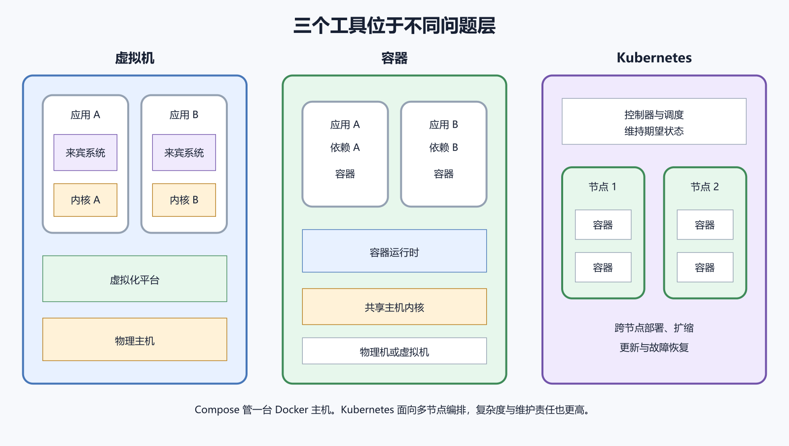

# Docker、虚拟机和 Kubernetes 的边界

Docker、虚拟机和 Kubernetes 经常被放在同一张技术清单里。它们解决的问题层级不同。虚拟机分配一套虚拟硬件并运行完整来宾操作系统。容器共享主机内核，隔离应用进程和文件系统。Kubernetes 管理一组机器上的容器化工作负载。

个人项目有一台 VPS 和几个服务时，Docker Compose 往往够用。为了“以后可能扩展”提前搭 Kubernetes，会增加控制面、网络、存储、权限和升级责任。

*图 50-1　虚拟机隔离操作系统，容器打包应用，Kubernetes 编排多节点工作负载。等价说明见本章“三者分别回答什么问题”。*

## 三者分别回答什么问题

虚拟机回答怎样在物理基础设施上运行多个相对独立的操作系统。容器回答怎样把应用和依赖组织成可重复运行的隔离进程。Compose 回答怎样在一台 Docker 主机上声明和管理多个关联容器。

Kubernetes 回答怎样在一组节点上维持工作负载期望状态，并提供调度、服务发现、滚动更新和自愈等能力。它们可以叠加。云服务器本身是虚拟机，里面运行 Docker 容器；Kubernetes 节点也常是虚拟机并使用符合 OCI 的容器运行时。

每台虚拟机拥有自己的内核和操作系统用户空间。可以在同一物理主机运行不同操作系统和内核版本。代价是每台都要占用更多磁盘与内存，启动与更新完整系统。云平台负责虚拟化层，用户仍维护来宾系统。

需要强操作系统边界、不同内核、传统软件或完整桌面时，虚拟机更合适。一台 VPS 就是你最常接触的虚拟机。Docker 不会取代它，容器仍需要主机。

## 容器为什么更轻

容器不为每个应用启动独立内核。镜像主要包含用户空间文件和应用依赖，容器是主机上的隔离进程。Kubernetes 官方概览也说明，容器与虚拟机类似地拥有文件系统、CPU、内存和进程空间，但共享操作系统。

共享内核让启动和分发更快，也意味着内核漏洞和主机配置属于共同边界。容器隔离不等于虚拟机同级隔离，更不能等于绝对安全。Docker 安全文档把内核、daemon、容器配置和加固能力都列入审查。

OCI 维护镜像、运行时和分发规范。符合规范的工具可以共享很多镜像和运行概念。Docker Engine 提供友好的构建、网络、存储和命令行体验。containerd、CRI-O、Podman 等工具服务不同场景。

命令、Compose 支持、网络和守护进程模型仍有差异。不能看到 OCI 就认为替换工具零成本。本书选择 Docker 是为了具体、资料完整和个人项目常用，不要求读者同时学习多个容器工具。

## Compose 的合适边界

Compose 适合本地开发、自动测试、演示和单服务器多容器应用。配置容易进入 Git，启动与日志入口统一。单台服务器故障时，所有 Compose 服务一起不可用。Compose 不会自动把容器迁到另一台空闲机器。

可以通过备份、快速重建、外部数据库和监控提高恢复能力。对许多个人服务，短时恢复比多机高可用更经济。单机资源、维护窗口和恢复时间已经满足需求时，不需要升级到集群。

Kubernetes 使用声明式对象描述工作负载和服务。调度器选择节点，控制器不断把实际状态拉回期望状态。它能滚动更新、副本扩缩、服务发现、配置与秘密挂载，并在容器或节点失败时重新调度。这些能力面向多节点和持续运行的系统，背后也有更多对象、网络、存储、身份、证书、版本和监控。

## Kubernetes 不提供什么

它不会自动修复应用逻辑，不会替你设计数据库一致性，也不会保证有多个副本就绝不宕机。错误健康检查会让平台不断杀死正常容器。错误资源限制会制造重启。错误发布可以同时推到所有副本。有状态数据库需要持久卷、备份、拓扑和升级设计。把 Compose 文件转换成 Kubernetes YAML 不能完成这些判断。

云服务商可以管理控制面，仍要由用户负责节点或计算、工作负载、网络策略、权限、秘密、镜像和数据。版本升级、API 弃用和插件兼容需要计划。账单包含节点、负载均衡、磁盘、流量和日志。小项目的空闲集群也会产生固定成本。

托管减少某些层，不能让 Kubernetes 变成无需学习的按钮。

## 什么时候真的需要编排

服务需要跨多台机器运行，单机故障无法满足恢复目标，是一个信号。团队频繁发布多个服务，需要滚动更新、自动扩缩和统一策略，是另一个信号。已有人员能维护集群、监控和安全，业务价值足以覆盖复杂度，才具备采用条件。

访问量大不自动等于需要 Kubernetes。一个优化良好的单体应用可以在少量机器服务大量用户。

先让应用有可靠镜像、健康检查、非 root 用户、日志和明确资源需求。让数据库备份与恢复独立于容器。让配置、秘密和发布版本可追踪。在单机 Compose 中完成更新、回滚、主机重建和监控。把有状态与无状态边界写清楚。这些能力能直接迁移到任何编排平台。跳过它们，集群只会把不清楚的问题复制更多份。

## 虚拟机快照与容器镜像

虚拟机快照保存一台机器某时刻的磁盘或内存状态，包含操作系统和运行环境。容器镜像来自构建说明，应该可重复生成，不包含运行中的卷数据。快照适合整机回退与灾难恢复的一部分，镜像适合发布应用版本。两者都不能代替数据库一致性备份。

把镜像 Registry 当作数据备份，会漏掉用户数据。把整机快照当作应用版本，会难以审查差异。

不同租户、未知代码和高敏感工作负载需要更强边界。虚拟机、沙箱运行时和专用主机可能组合使用。容器使用非 root、只读文件系统、最小能力、受限网络和只读挂载，能减少风险。给容器 `--privileged`、挂主机根目录或 Docker socket，会显著削弱隔离。不能因为它运行在容器里就放心执行未知代码。

## 本地 Docker Desktop 与生产集群

Docker Desktop 用虚拟机提供本地开发体验。它的文件共享、网络名称和资源限制与 Linux 生产主机有差异。本地 Compose 成功是必要测试，仍要在类似生产的 Linux 环境验证镜像架构、权限、端口和卷。

Kubernetes 本地工具能练习对象，不代表拥有生产集群运维能力。证书、升级、存储和故障域在单机模拟中看不完整。学习环境要明确它能证明什么，也明确未覆盖什么。

假设一个个人记账应用有 Web、PostgreSQL 和每日备份，用户不到十人，目标是故障后两小时内恢复。可以先评估一台 VPS 加 Compose、异地备份和重建演练能否达到这个目标。若演练未达标，再调整方案。直接采用 Kubernetes 会增加集群、入口、存储和升级工作。

若另一个团队有数十服务、多个发布团队、全天候业务和跨节点容量需求，托管 Kubernetes 的统一调度与滚动更新可能值得投入。选择差异来自恢复目标、服务数量、团队和成本。

## 将来学习 Kubernetes 的起点

Kubernetes 官方基础教程覆盖部署、查看、扩缩、更新与调试。完成本书后若真实项目出现多节点需求，可以从 Pod、Deployment、Service、ConfigMap、Secret 和持久卷开始。不要一开始安装大量插件。先在安全练习环境理解控制器怎样维持期望状态，再讨论生产架构。

## 一张决策清单

只需要隔离一套完整操作系统，选择虚拟机。需要可重复打包应用，使用容器。一台主机运行多个关联容器，使用 Compose。需要跨多节点调度和自动维持副本，再评估 Kubernetes。无论选择哪项，都要管理数据、秘密、更新、日志、监控、备份和恢复。工具改变责任位置，不会删除责任。

应用也可以直接由 systemd 运行，不使用容器。容器增加镜像和隔离层，便于重建。虚拟机再增加独立内核，隔离更强、资源更多。同一工具不必覆盖全部服务。主机 Caddy 用系统包，应用用 Compose，数据库用托管服务，是合理组合。关键是每项生命周期只有一个明确管理者。

## 容器与虚拟机不是互斥选择

云 VPS 是虚拟机，里面运行容器。虚拟机提供云平台与租户边界，容器提供应用打包与进程边界。高风险租户可以每个虚拟机只运行一组容器，减少共享。开发电脑用 Docker Desktop 也经过 Linux 虚拟机。

两层都有资源限制和日志。排错时要知道故障在容器、来宾系统还是云平台。快照、镜像和 Volume 分别备份不同层，不能互相代替。

Compose `up` 根据配置创建当前主机对象，运行后主要由 restart 策略维持。Kubernetes 控制器持续比较期望副本与实际对象，节点故障时可在其他节点重新创建 Pod。重新创建只恢复镜像和声明配置。有状态数据必须位于可在新节点挂载或恢复的存储。

期望状态写错时，控制器会持续把错误重新应用。自动化放大正确，也放大错误。

## Pod 不是永久虚拟机

Kubernetes 中 Pod 是运行一个或多个紧密相关容器的调度单位。它可以被替换，名称和地址可能变化。应用仍要无状态或把状态外置，使用 Service 发现，而不是依赖 Pod IP。这与 Compose 中不要依赖容器 IP 的原则相同。

Kubernetes Service 为一组 Pod 提供稳定访问入口，Ingress 或 Gateway 再处理外部 HTTP 流量。这与单机 Docker 网络服务名加 Caddy 有相似目的，具体实现和责任更复杂。云负载均衡器、集群网络和 DNS 都会增加成本与故障层。

## 自动扩缩需要可靠指标

Kubernetes 能按 CPU 或自定义指标调整副本。应用必须支持多副本，状态不能只放本地容器。数据库连接、会话、队列和第三方配额会随副本增加。扩容 Web 可能把数据库先压垮。错误指标会来回扩缩，造成启动风暴和费用。单机项目可以先手工扩规格，复杂度更低。

两个副本若在同一节点，节点故障时一起离线。跨节点但共享同一不可用数据库，也无法服务。高可用要识别故障域，包括节点、区域、网络、存储、DNS 和身份。Kubernetes 提供调度工具，架构仍由团队设计。先根据恢复目标决定需要抵御哪些故障，不用副本数字代替。

## 有状态服务增加最多复杂度

无状态 Web 容器可从镜像重建。数据库需要稳定存储、身份、顺序、备份和一致性。Kubernetes StatefulSet 和持久卷能表达部分需求，不会自动成为可靠数据库运营方案。小团队可使用托管数据库，把集群留给无状态应用。仍要管理网络、凭据、备份与出口。

在 Compose 中先完成数据库恢复，迁移到集群后才能验证存储方案。Kubernetes 版本和 API 有支持窗口。控制面、节点、网络与存储插件需要兼容升级。对象字段可能弃用，旧清单在新版本失效。托管服务会提醒或安排升级，用户仍要处理工作负载兼容。

## 集群权限与秘密

Kubernetes 使用角色权限控制谁能读取、修改和执行工作负载。集群管理员权限能影响所有命名空间。Secret 对象的名字不保证底层加密和最小读取。要配置静态加密、访问控制和外部秘密流程。CI 凭据限制到特定命名空间和部署动作，不能给每个项目 cluster-admin。

Pod 网络默认可达范围取决于集群与网络插件。要限制服务通信，需要支持并配置 NetworkPolicy。写了策略也要验证插件执行。DNS、监控和外部 API 仍需必要流量。错误策略会中断应用，过宽策略失去隔离价值。Compose 单机也要用网络分组和数据库身份，原则相通。

## Kubernetes 日志会分散

Pod 被替换后，本地日志可能消失。多节点需要集中采集、关联工作负载、Pod、容器和请求标识。集群事件、容器日志、节点日志和云负载均衡日志属于不同来源。没有统一监控时，自动重建会带走现场。单机 Docker 已经需要轮转与磁盘监控，集群只会放大这项工作。

托管 Kubernetes 可能对控制面、节点、负载均衡、公网 IP、磁盘、快照、出站和日志分别计费。为了高可用常需多节点和多区域资源，空闲容量也产生费用。价格与免费权益按采购日官方资料核对，本书不提供永久数字。

## 先用托管容器平台也可以

一些平台接受 Dockerfile 或镜像，替你管理主机、证书、扩缩和日志入口。它位于 Compose 与自管 Kubernetes 之间。平台限制端口、持久磁盘、后台任务和区域，需要核对。费用可能按实例或使用量。

应用保持标准镜像、环境变量和外部数据，迁移会更容易。不需要为了运行容器就自己维护集群。

为每个服务使用明确镜像摘要、非 root 用户、健康检查和资源需求。应用日志写标准流。把持久状态放外部数据库或有备份的卷，去掉对主机固定路径和容器 IP 的依赖。环境配置与秘密分开，数据库迁移可重复。这些准备本身会改善当前 Compose 部署，即使最终不迁移也有价值。

## 不应采用 Kubernetes 的信号

团队没有人愿意负责升级和告警，只想通过一次安装结束运维，是明显信号。项目只有一个低流量应用，故障可接受，主要问题是不会备份数据库，Kubernetes 不会解决。预算只能承担一台小服务器，却计划在同一台上运行单节点集群，收益有限。

先修复发布、监控和恢复，再评估真实多节点需求。

多个团队频繁部署，服务数量增加，单机容量和维护窗口无法满足。需要跨节点调度与统一策略。业务已有明确可用性目标、容量模型、值守团队和预算。托管集群能减少控制面维护。应用已经无状态化，数据库和存储有成熟方案。团队完成过集群升级与灾难演练。

这些条件不自动给出答案，但值得做正式方案比较。

## 一个边界错误演练

假设团队把 SQLite 文件放在 Pod 本地目录，再扩容到三个副本。每个副本会看到自己的数据库；请求落到不同副本时，用户读写的可能不是同一份数据。编排完成扩容，并不能使本地数据库自动共享。应改用能协调多副本访问的数据库服务，或重新设计数据层。

同样错误在 Docker Compose 横向启动多个 Web 容器也会发生。工具没有办法猜出本地文件的业务语义。先画数据所有权，再扩副本。

选择单机 Compose 不等于随意。仍要固定镜像、限制端口、备份卷、监控日志、测试回滚和更新主机。简单架构的优势是更容易让一个人看懂所有路径。把这份可理解性用于建立可靠流程。当指标证明单机不足，再增加节点或平台。每次只解决一个真实瓶颈。能清楚说明为什么不用 Kubernetes，也是一项成熟工程判断。
