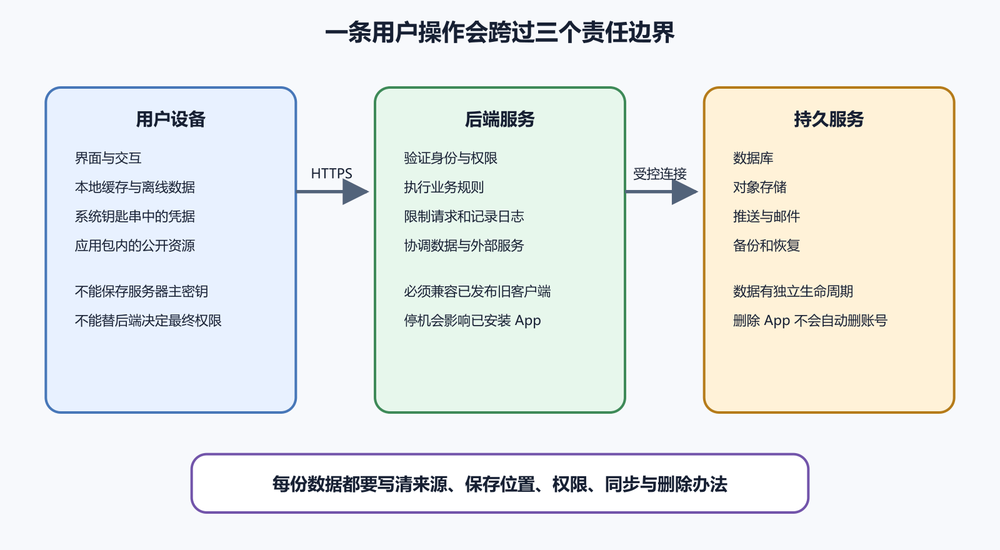

# App 客户端、后端和本地数据

手机 App 安装在用户设备上，却很少独自完成全部工作。天气 App 要向服务器取得预报，记账 App 可能把账目同步到云端，聊天 App 需要后端转发消息。即使一个 App 能离线打开，它也可能在联网后登录、上传、备份和接收推送。

理解 App 的第一步，是把“一个应用”拆成用户设备中的客户端、互联网上的后端和长期保存数据的服务。三者可以由同一家公司维护，也可能分别使用 Flutter、托管后端、对象存储和推送平台。用户看到一个图标，维护者面对的是一个跨越多个系统的过程。

*图 51-1　客户端处理设备交互，后端执行权限和业务规则，持久服务保存共享数据。等价说明见本章“先给每份数据找位置”。*

## 客户端是用户手里的程序

客户端是安装在手机、平板或电脑上的应用程序。它绘制页面，接收触摸，调用相机、定位和通知等系统能力，也能在设备上保存少量状态。Flutter 项目会把 Dart 代码、资源和平台工程构建成 Android 或 iOS 应用。Flutter 的架构文档把框架、引擎与平台嵌入层分开。对本书读者来说，最重要的结论是 Flutter 页面仍运行在具体操作系统里，权限、签名、后台执行和商店规则仍由 Android 或 Apple 平台决定。

客户端处在用户控制的设备中。熟悉技术的用户能够检查应用包、网络请求和本地文件，也可能修改运行环境。放进客户端的服务器主密钥无法靠“把按钮藏起来”保护。一句话结论

> 客户端可以帮助用户发起操作，最终权限必须由后端重新判断。

例如管理页面只对店主显示。攻击者仍可能绕过页面，直接发送“删除商品”的请求。后端必须从登录身份判断这个人是否真是店主，并拒绝普通用户。界面隐藏属于使用体验，后端鉴权才是安全边界。

## 后端是联网后的共同裁判

后端运行在服务器或托管平台。它接收请求，确认身份，执行规则，访问数据库，再返回客户端能理解的响应。一个预约 App 中，客户端可以让用户选择十点。后端还要检查这个时段是否被别人占用、用户是否有预约资格、操作是否重复。两个用户同时点击时，只有服务器和数据库能看到共同状态。

后端也负责保护第三方服务凭据。邮件发送密钥、支付服务秘密、数据库管理员口令和 AI 服务密钥应保存在服务器的秘密管理中。客户端只向自己的后端请求必要功能。后端并不一定是一台自己维护的 VPS。它可以是托管函数、Supabase、Firebase 或其他平台服务。位置变化不会消除责任。开发者仍要知道谁能读数据、怎样备份、如何删除账号以及平台故障时怎么办。

把 App 数据按来源和生命周期分类，比争论“SQLite 还是云数据库”更有用。第一类是可重新生成的数据。图片缩略图、搜索结果缓存和临时下载文件可以在需要时重建。它们适合本地缓存，空间不足时允许清理。

第二类是设备偏好。主题颜色、上次打开的标签和文字大小通常只影响当前设备。它们可以只在本地保存，也可以在登录后同步。第三类是敏感凭据。短期访问令牌需要使用系统提供的受保护存储，不能以明文写进普通配置文件。服务器主密钥不应下发到设备。

第四类是用户原始数据。笔记正文、订单、聊天记录和上传照片若需要跨设备使用，应有明确的服务器保存、同步、备份和删除办法。本地副本可以提高速度，却不能在没有验证时被叫作云备份。第五类是应用自带资源。图标、默认模板和离线说明随应用包发布。更新应用可能替换它们，用户数据不能混在这个区域等待升级保留。

一个简单表格就能暴露遗漏。

| 数据 | 主要位置 | 能否重建 | 谁可读取 | 删除时机 |
| --- | --- | --- | --- | --- |
| 首页图片缓存 | 用户设备 | 可以 | 当前 App | 空间紧张或过期 |
| 登录令牌 | 系统安全存储 | 可以重新登录 | 当前 App | 退出登录或失效 |
| 用户笔记 | 后端数据库和设备副本 | 不一定 | 用户与授权服务 | 用户删除或保留期结束 |
| 照片原文件 | 对象存储 | 不一定 | 授权下载接口 | 用户删除并完成延迟清理 |
| 应用图标 | 应用包 | 可以重新构建 | 所有人 | 随版本替换 |

表格中的“删除”不能只写一个按钮。还要考虑本地副本、服务器主库、对象存储、搜索索引、备份和日志。各副本可以有不同保留期，但必须向用户如实说明。

## 本地数据库不等于后端数据库

SQLite 常被 App 用作设备内数据库。它适合结构化保存离线内容、缓存和待同步操作。PostgreSQL 等服务器数据库保存多个用户共享的权威状态。两者都能使用 SQL，不代表能相互替代。手机可能关机、丢失或长期离线。服务器不能把某一台手机的 SQLite 当作所有用户共同数据库。反过来，每次滚动页面都请求远程数据库，也会让弱网体验变差。

常见设计是在本地立即显示缓存，后台向后端同步。同步成功后更新本地状态，失败则保留重试信息。Flutter 的离线优先指南也把本地与远程数据源、读取策略和同步过程分开讨论。

缓存有可能过期。页面应让用户知道内容来自何时，并提供重试。把旧缓存显示成“刚刚同步”会制造错误信任。

## 用购物清单理解离线同步

小林在地铁里把“牛奶”加入购物清单。手机没有网络，App 先把操作写入本地数据库，并显示“等待同步”。恢复网络后，客户端向后端发送新增操作。后端确认登录身份，把项目写入共享清单并返回服务器生成的标识与更新时间。客户端把本地临时记录替换为已同步记录。

如果家人在另一台手机同时删除了清单，后端不能假装新增一定成功。它可以返回冲突，要求客户端刷新并让用户选择。冲突处理属于产品规则，没有一个通用库能自动猜出正确结果。若 App 在发送成功后、收到响应前退出，重启后可能再次发送。后端可使用幂等键识别同一次操作，避免重复生成两盒牛奶。幂等的意思是同一个操作重复提交，最终效果仍保持一次。

这个案例包含四种状态。尚未同步、正在发送、已经确认和同步失败。只显示一个转圈图标，用户无法判断关闭 App 会不会丢数据。

用户输入邮箱和密码后，后端验证信息并发出一个短期令牌。客户端以后携带令牌请求数据。令牌像有期限的通行证，不等于密码，也不应永久有效。后端每次根据令牌识别用户，再检查这次操作权限。客户端把 `userRole` 改成 `admin`，不应改变服务器判断。

退出登录要清除设备令牌。密码修改、账号冻结或令牌泄露时，服务器还需要让旧令牌失效。只有客户端删掉本地字符串，不能阻止另一台已经复制令牌的设备继续使用。高风险操作

> 不要把真实 API 密钥、签名私钥、服务账号 JSON 或数据库管理员密码放进 Flutter 资源、Dart 常量和公开 Git 仓库。应用发布后，这些内容可能被提取。

## 权限请求发生在需要它的时候

相机、麦克风、照片、定位和通知由操作系统授权。App 要先说明某个功能为什么需要权限，再在用户执行该功能时请求。一个只用于扫描收据的记账 App，可以在用户点击“扫描”后请求相机。首次启动就同时索要相机、定位、通讯录和麦克风，会让用户无法把权限与功能联系起来。

用户拒绝后，App 应保持其他功能可用，并说明怎样再次授权。反复弹窗或把拒绝当成崩溃，都不是合理处理。商店隐私披露还要覆盖第三方 SDK。分析、广告、崩溃报告和推送库可能向外发送设备或使用数据。Google Play 数据安全表单和 Apple App Privacy 都明确要求开发者考虑第三方代码的数据实践。

后端通常不能直接唤醒每一台手机。客户端先向系统推送服务取得设备令牌，再把令牌登记到自己的后端。后端需要通知时，把消息交给平台推送服务。推送令牌可能变化，也可能因用户卸载而失效。它不能当永久设备身份。后端应处理无效令牌，并避免在通知正文放敏感信息，因为锁屏可能直接显示。

点击通知后，App 仍要重新向后端请求并检查权限。推送内容说“订单已完成”，不代表客户端可以不验证就展示任何订单详情。中国大陆使用注意

> 不同设备厂商、网络和系统服务可能影响推送到达率。产品要允许用户在 App 内重新查看消息，不能把推送当作唯一记录。

## App 删除、退出登录和注销账号不同

删除 App 通常只移除设备中的程序和大部分本地数据。服务器账号、订阅、云端文件和备份不一定随之删除。退出登录表示这台设备不再持有当前会话，不代表删除账号。注销账号则是业务和数据生命周期动作，要处理共享内容、账单记录、法律保留和可恢复期。

界面必须使用准确词语。把“退出登录”按钮写成“删除所有数据”，用户会形成错误预期。本地离线队列也要纳入退出设计。若还有未同步笔记，直接退出并清除本地库可能丢失唯一副本。App 可以先提示用户同步、导出或明确放弃。

请求失败至少有四种原因。设备无网、域名或 TLS 问题、服务器返回错误、请求超时。界面不应全部显示“密码错误”。已经缓存的只读内容可以继续展示，并标记最后同步时间。需要服务器确认的付款、预约和删除操作，不能在不确定结果时宣称成功。

超时尤其需要小心；客户端没有收到响应，不代表后端没有完成操作；重新付款或重复下单前要查询状态，后端也要支持幂等；错误信息同时服务两类人；用户需要知道现在能做什么，例如检查网络或稍后重试。维护者需要关联编号、接口、时间和版本，以便在服务器日志找到对应请求。界面不应把堆栈和内部数据库错误直接展示给用户。

## 发布前画一张数据地图

为每个主要功能画出设备、后端和存储；箭头写传输内容，方框写保存期限和访问者；登录、上传、删除和推送至少各走一遍。以头像上传为例，客户端选择照片并压缩，通过后端签发的短期权限上传对象存储。数据库保存对象标识；其他用户请求头像时，后端依据可见性返回受控地址；删除头像要清数据库引用、对象文件和缓存。

若图上出现“App 直接使用对象存储管理员密钥”，设计需要停下来。若找不到用户删除后的对象清理路径，隐私说明也无法准确填写。AI 可以根据代码和网络请求整理候选数据流，也可以列出依赖包可能涉及的权限。你必须亲自核对真实构建、后台配置、第三方 SDK 文档和商店问卷。AI 看不到平台账号中的完整设置时，不能替你作最终披露。

## 最小验收清单

- 无网启动时，用户能区分缓存内容和最新内容。
- 同一操作重复提交时，不会产生无法解释的重复数据。
- 普通用户无法通过修改客户端请求获得管理员权限。
- 退出登录后，本地敏感令牌被移除，服务器端失效策略明确。
- 拒绝非核心权限后，其他功能仍能使用。
- 删除账号与删除 App 的结果在界面和隐私政策中一致。
- 后端不可用时，界面不把未知结果显示为成功。
- 日志能够用时间和关联编号定位请求，又不记录密码和令牌。

完成这张地图以后，Flutter 只是客户端的实现工具。下一章再进入项目结构、依赖和构建模式。

用户按 Home 键离开 App，不代表进程会一直活着。Android 和 iOS 都可能在内存紧张、后台时间结束或系统策略触发时终止进程。因此，重要操作不能只保存在一个内存变量。用户已经输入一半的长表单，可以定期保存草稿。上传任务需要记录可恢复状态。页面恢复时要从本地或服务器重新读取，不能假定上一个对象仍在。

也不能把 `dispose` 或某个退出回调当成可靠保存时机。系统强制终止、设备断电和程序崩溃时，回调可能没有机会完成。测试时打开一个编辑页面，输入内容后把 App 放到后台，再使用系统开发选项模拟进程被杀。重新打开后检查草稿、导航和登录状态。只测试正常返回桌面，覆盖不到真实生命周期。

## 本地保存工具怎样选择

简单偏好可以使用平台偏好存储，例如主题、是否看过引导页。它适合少量键值，不适合大量结构化业务数据。需要查询、排序和事务的离线记录适合 SQLite 或建立在它之上的 Flutter 数据库库。用户选择的导出文件属于文件系统，生命周期由保存位置和系统权限决定。

令牌和私密小数据使用 Keychain、Android Keystore 支持的安全存储。安全存储降低普通文件被直接读取的风险，仍不能抵御设备完全失陷、应用逻辑泄露或用户主动解锁后的所有攻击。

选型时写数据量、查询方式、是否加密、备份需求和删除办法。因为某个包下载量高就把所有内容塞进去，后续迁移会更困难。

App 1.0 在设备上建立 `notes` 表，2.0 增加 `archived_at` 字段。新安装用户会直接得到最新结构，旧用户需要从旧 schema 迁移。迁移要按每个已发布版本顺序测试。使用旧版本创建真实测试数据，再安装新版本覆盖升级。确认记录数量、特殊字符、附件关系和同步状态。

迁移失败不能先删库重建。对缓存库可以重新拉取，对用户唯一数据则可能造成永久丢失。数据库升级前可以创建受控备份或使用事务，具体方案按数据量和平台限制设计。把 schema version 与 App build 记录到诊断信息。看到 `no such column` 时能判断是哪一次迁移漏跑。

## 时间和时区会制造隐蔽错误

用户在上海创建下午三点的提醒，服务器运行在 UTC，家人在伦敦查看。系统要区分一个绝对时刻和一个当地日历时间。日志与服务器时间通常保存带时区的标准时间，显示时转换到用户时区。生日、每月账单日等日历概念不一定能简单转换成 UTC 瞬间。

设备时间可能不准确。涉及优惠到期、签名或权限时，后端使用受控服务器时间判断，客户端倒计时只作显示。夏令时切换会让某些当地时间重复或不存在。预约和提醒产品要在目标地区测试，不能把一天硬编码为永远 24 小时。

用户选择照片后，客户端先检查类型、大小和必要权限。文件扩展名不能证明真实内容，后端还要验证格式和限制。大文件上传应显示进度、取消和失败重试。弱网中断后，可以根据服务能力分片或续传。重试不能生成多个无人引用的对象。

上传完成后，后端把对象标识写入业务记录。若对象成功上传、数据库写入失败，需要后台清理孤立文件。若数据库先写、文件后失败，页面要显示未完成状态。下载地址尽量使用短期受控 URL。把对象存储桶永久公开，会让页面上看不到失去访问控制意义。

## 深层链接把外部输入带进 App

邮件、网页和通知可以打开 App 内某个页面，这类地址常称为 deep link，也就是深层链接。客户端收到 `app.example.com/orders/123` 后，不能只凭路径显示订单 123。它要登录并向后端请求，后端确认当前用户有权限。链接参数可能缺失、过期或被修改。App 应安全回到首页或错误页，不能因为一个外部 URL 崩溃。

测试冷启动、后台已开和登录失效三种状态。只在开发时从已登录首页点击，可能漏掉初始化次序问题。

手机离线修改笔记标题，平板同时删除该笔记。两台设备恢复网络后，系统必须决定删除优先、修改恢复，还是提示用户。按最后时间覆盖最简单，却可能受设备时钟错误影响，也可能静默丢字。使用服务器版本号可以发现客户端基于旧版本编辑。

多人同时编辑文本可能需要更复杂的合并算法，本书不展开。个人项目至少要识别冲突并保留双方副本，避免无提示覆盖。在产品说明中告诉用户同步粒度。自动同步图标绿色时，它应对应服务器已经确认，不能只表示客户端已经放进队列。

## 导出是用户可验证的退路

云同步和服务器备份都由维护者控制。允许用户导出自己的笔记、账目或项目，可以降低平台停运和账号争议造成的风险。导出格式使用常见、可读、带版本说明的结构。文本数据可以用 CSV、JSON 或 Markdown，附件使用清楚目录和索引。选择取决于数据关系，不能只追求单文件。

导出后做一次重新导入或独立打开测试。按钮生成了文件，不代表文件完整。删除账号前可以提示导出，但不能把导出设计成故意复杂的阻碍。导出内容含个人数据，应提醒用户安全保存。

客户端为一次请求生成随机关联编号，通过请求头发送。后端在入口、数据库和外部服务日志中保留同一编号。用户反馈晚上八点同步失败时，维护者用时间、build 和关联编号找到请求。没有编号时，只能在大量相似日志中猜。

编号不能包含邮箱或身份证。日志记录接口、耗时、状态和错误类别，不记录密码、完整令牌和笔记正文。客户端显示给用户的错误代码可以是短编号，真正内部堆栈留在受控日志。两者通过关联编号连接。

## 一个完整的相册数据案例

用户拍摄照片后，原图暂存在设备应用目录。客户端生成预览，向后端申请短期上传权限，再把原图送到对象存储。后端确认上传并在数据库建立照片记录。其他设备先取得缩略图，点开时再请求原图。缓存可以清理，原图和数据库记录属于持久数据。

用户删除照片后，后端先让记录对其他设备不可见，再排队删除对象与派生缩略图。备份按政策到期。各设备同步删除状态并清本地缓存。若上传中 App 被系统回收，重开后读取上传任务。若对象已存在但数据库没有记录，后台清理任务处理孤立对象。这个案例把进程生命周期、对象存储、同步和删除连在一起。

用户有十万条订单时，后端不应一次返回全部内容。客户端先请求一页，滚动到接近底部时再取下一页。分页响应要包含稳定的继续依据。只使用页码时，用户滚动期间新增或删除记录，可能产生重复与遗漏。基于排序字段和唯一标识的 cursor 更适合持续变化的数据。

页面显示加载中、已经到底和加载失败三种状态。失败重试只请求缺失页，不清空用户已经看到的内容。搜索和筛选条件变化时，旧请求可能晚到。客户端要丢弃与当前条件不符的响应，避免用户搜索“苹果”却突然看到上一轮“香蕉”的结果。

## 慢网络与无网络不是同一种状态

无网络可以由系统快速判断，慢网络则可能连接存在却迟迟没有响应。按钮需要防止用户连续提交，页面也要允许取消或离开。读取请求可以超时重试，写入请求先确认是否可能已经在服务器完成。重试策略按请求类型区分。

弱网测试可以在开发工具中限制带宽与延迟。真实地铁、电梯和跨地区网络仍有不同断连方式，正式测试加入目标用户环境。加载动画超过合理时间后显示文字说明与重试入口。永远转圈会让用户无法判断是等待还是卡死。

数据库加密可以降低设备文件被离线复制后的泄露风险。它不能阻止已经登录的应用按正常权限读取，也不能修复后端越权。加密密钥不能与密文并排写在同一普通文件。可以使用系统安全存储保护密钥，再设计设备换机、用户退出和密钥丢失的结果。

启用加密会增加迁移、备份和故障恢复难度。先列出要防的攻击、数据敏感度和可接受恢复方式，再选择方案。宣传“本地加密”时说明保护范围。设备解锁、截图、剪贴板和导出文件可能仍暴露内容。

## 删除任务也会失败和重试

用户删除云端照片后，数据库记录、对象文件、缩略图、缓存和搜索索引可能由多个后台任务处理。界面可以先隐藏内容，后端记录删除状态，再让任务逐项清理。某一步失败时保留重试与审计，不能因首页看不到就认为所有副本已经消失。

备份通常按保留周期到期，难以从历史介质立即抹除。隐私政策应说明这一边界，并限制备份访问与恢复使用。删除任务完成后做抽样验证。检查对象地址失效、跨设备同步、导出结果与账号权限。

同步状态不能只用红绿颜色表示。图标配文字，例如“等待同步”“正在上传”“需要重新登录”。屏幕阅读器要读出状态变化，但频繁进度不能不断打断。关键失败和完成可以通知，逐字节变化留给可视进度条。

按钮禁用时说明原因。弱网下不能提交，用户需要知道数据是否已保存在本机。字体放大与小屏幕测试同步提示。被截断的“未同步”可能只剩“同步”，意思正好相反。

## 一次数据地图审查练习

任选应用中的一个完整功能，不要从整个产品开始。画用户点击、设备本地、后端入口、数据库和第三方服务。在每条箭头旁写数据名称，在每个存储旁写保留与删除。给失败箭头补上超时、重试和用户提示。

再让另一位不了解实现的人解释这张图。若他无法回答“手机丢了数据还在不在”和“后端停了按钮会怎样”，说明图还缺关键事实。把最终图与隐私政策、测试用例和日志字段比较。四者说法不一致时，回到真实运行检查。
