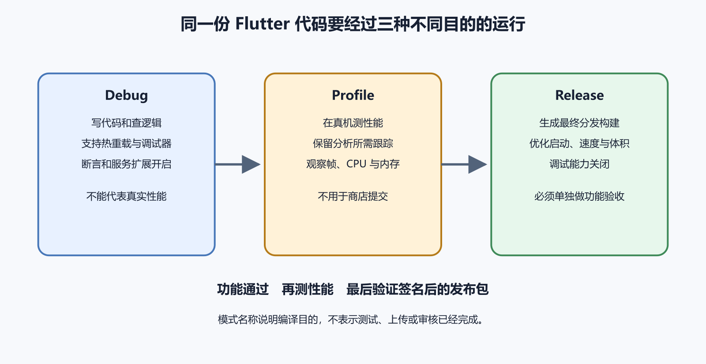

# Flutter 项目、依赖、Debug、Profile 和 Release

Flutter 让一套 Dart 代码构建多个平台的客户端。它降低了重复写界面的成本，没有抹掉平台差异。Android 仍有 Gradle、包名、签名和权限。iOS 仍有 Xcode、Bundle ID、证书和 Profile。非专业开发者不必先学完整框架，但要看得懂项目入口、依赖清单、平台目录和构建模式。

“本地能跑”只证明开发环境里的某次运行。发布前还要确认 Release 包、真机、后端环境、权限、日志和商店资料。Flutter 最容易让人误判的一点，是把跨平台开发误读成跨平台发布。



*图 52-1　Debug 用来开发，Profile 用来观察性能，Release 才接近用户拿到的构建。等价说明见本章“三种构建模式回答不同问题”。*

## 先确认拿到的是完整项目

Flutter 项目根目录通常有 `pubspec.yaml`、`lib`、`test`、`android` 和 `ios`。不同目标还可能有 `web`、`macos`、`windows` 与 `linux`。`lib/main.dart` 常是入口。`pubspec.yaml` 声明项目名称、版本、Dart 环境、依赖、资源和字体。`pubspec.lock` 记录依赖解析出的具体版本。平台目录保存原生工程和构建设置。

只有 APK、AAB 或 IPA 时，你拿到的是构建产物，不能可靠恢复完整源码。只有 `lib` 而没有 `pubspec.yaml` 和平台目录，也不是可直接发布的项目。先在项目根目录做最小诊断。

```text
flutter --version
flutter doctor -v
flutter pub get
flutter analyze
```

前两条看 Flutter 版本和平台工具状态。后两条解析依赖并做静态分析。若系统找不到 `flutter`，先检查 SDK 安装与 PATH。若 `doctor` 报 Android toolchain 或 Xcode 缺失，就按目标平台补工具。Windows 可以准备 Android 发布，不能在本机完成 iOS Archive。

## pubspec 是项目总清单

一个简化的 `pubspec.yaml` 会包含这些字段。

```yaml
name: pocket_notes
version: 1.2.0+17

environment:
  sdk: ^3.5.0

dependencies:
  flutter:
    sdk: flutter
  http: ^1.2.0

flutter:
  assets:
    - assets/images/
```

`version` 前半段通常展示给用户，后半段常进入平台构建号。Android 的 versionCode 和 iOS 的 build 都要求不断增加。发布前要确认项目配置、商店记录和应用内“关于”页面使用同一个版本事实。

依赖不是装饰。HTTP、登录、数据库、相机、地图、推送、广告、分析和崩溃报告包都会进入产品责任。升级依赖前，阅读 changelog，确认最低系统版本、权限、隐私说明和原生配置是否变化。`pubspec.lock` 应随应用一起进入版本控制，让团队和 CI 使用相同解析结果。应用项目不要随手删除锁文件来“解决冲突”。

依赖还要看维护状态。一个包下载量很高，不保证适合当前项目。先看最近发布时间、支持的 Flutter 与 Dart 版本、开放问题、许可证、平台支持和迁移说明。登录、支付、推送、广告和数据库包尤其要谨慎，因为它们会连接账号、权限、隐私和后端状态。项目已经接近发布时，临时换核心依赖通常比修一个具体问题风险更大。

锁文件冲突要认真看。两个人分别升级依赖后，Git 可能提示 `pubspec.lock` 冲突。不要盲目保留一边。先确认 `pubspec.yaml` 中想要的依赖范围，再重新解析，运行分析和测试，记录最终锁定版本。否则本地、CI 和商店包可能使用不同依赖。

资源和字体也参与发布。图片会影响包体，字体可能有许可证要求。本地化文案、权限说明、隐私入口和商店截图要与实际功能相互匹配。一个按钮文案改了，审核说明和截图可能也要跟着改。

## 平台目录不是普通缓存

`android` 和 `ios` 目录里有应用身份、权限、签名、构建脚本和原生插件配置。AI 生成代码时，常会建议“删掉平台目录再重新生成”。这对练习项目也许可行，对准备发布的应用很危险。包名、Bundle ID、图标、权限说明、Deep Link、推送、登录回调和签名设置可能都在里面。

如果平台目录已经混乱，先备份并查看差异，再决定是否重建。重建后逐项恢复身份字段、权限、插件配置和商店依赖。不要用新建项目的默认包名覆盖已有应用。微信小程序项目也有类似问题。AppID、project 配置、服务器域名和隐私接口配置不能当作可随意再生的临时文件。

原生插件跨过平台边界。Dart 代码调用相机，最终仍要落到 Android Manifest、iOS Info.plist、系统权限弹窗和商店披露。插件升级后，源代码看起来没改，最终包的权限、SDK 或最低系统要求也可能变化。发布前要检查最终构建，而不只看 Dart 文件。

## 三种构建模式回答不同问题

Debug 面向开发。它保留调试能力，热重载方便，性能和安全状态不代表真实发布。Profile 接近 Release 的性能，适合用 DevTools 观察帧率、内存、网络和 CPU。Release 关闭调试能力并使用发布优化，才接近用户拿到的构建。

这三种模式要分别在真机上跑。模拟器能发现很多界面和接口问题，却覆盖不了相机、通知、后台、蓝牙、厂商系统、电量策略和商店分发签名。最低支持系统、低内存设备、弱网和深色模式都要选代表机型验证。

Release 构建常暴露新问题。调试日志被移除后，页面时序改变。混淆或优化后，反射、序列化和原生插件可能失败。后台任务、网络安全配置、签名证书、通知权限和第三方登录在 Release 签名下才表现真实。每次只说“Debug 没问题”，对发布几乎不够。

一份发布前证据至少包括下面几项。

- Flutter 版本、Dart 版本和构建机器。
- Git 提交、依赖锁文件状态和本次差异范围。
- Android AAB 或 iOS Archive 的版本、构建号和校验值。
- Release 真机安装、启动、登录、核心读写、退出和重开记录。
- 权限拒绝、弱网、离线和后端错误的表现。
- 目标后端环境、API 版本和关联日志。
- 符号文件、混淆映射和崩溃报告入口。

## clean 只能清构建缓存

`flutter clean` 删除构建产物和部分缓存，适合解决旧产物干扰、原生构建状态错乱或依赖变更后仍引用旧文件的问题。它不会修复包名填错、签名密钥丢失、权限说明缺失、后端地址错误和商店政策问题。

更稳的顺序是先保存当前 Git 状态，再运行 `flutter clean`，然后重新 `pub get`、构建并对比错误是否变化。若 clean 以后问题消失，要把原因记录下来，例如缓存了旧插件、原生工程未刷新、构建目录残留。只留下“clean 一下就好”，下次还会迷路。

多环境构建也要明确。开发、测试和生产后端不能靠手改源码切换。可以使用构建参数、配置文件或 CI 环境变量，但发布记录必须写清这一包连接哪个后端。把测试包提交审核、把生产密钥放进前端、让内部测试误连正式支付，都会把小失误放大成真实事故。

## 多环境配置要可追溯

同一个 Flutter 项目经常需要开发、测试、预发布和生产环境。它们可能有不同 API 域名、支付沙箱、推送主题、登录回调、分析项目和错误监控入口。用一份 Dart 文件手工改地址，短期看快，长期会让每个包都带着疑问。这个包连的是哪套后端，谁改过，何时改的，是否和商店资料一致。

更稳的做法是把环境作为构建输入，并把输入写进发布记录。可以用 `--dart-define`、配置文件、构建脚本或 CI 变量，具体方案随项目复杂度选择。无论使用哪一种，Release 包里不能包含其他环境的高权限秘密。前端只应拿到它完成请求所需的公开配置。

环境名称也要谨慎。`prod`、`production`、`release`、`online` 混用时，人会选错。发布说明里直接写后端域名、数据库项目名的脱敏标识、支付模式和推送项目，比只写“正式环境”更可靠。审核和内部测试使用测试环境时，要确认测试数据、隐私政策和审核说明也指向这套环境。

功能开关属于环境配置的一部分。它可以限制新功能影响范围，也可能让审核人员看不到需要审核的功能。每个开关记录默认值、负责人、适用版本和撤销办法。不要让某个开发者本机控制生产功能是否开启。

Flutter SDK 本身也要纳入版本管理。团队成员、CI 和构建文档应使用同一大版本，升级前查看 Flutter、Dart、Gradle、Kotlin、CocoaPods 和 Xcode 的兼容要求。SDK 升级可能改变生成的原生工程、默认目标系统、编译警告和插件行为。临近发布时，不要把 SDK 大升级和业务功能合在一个候选包里。

如果必须升级，先在单独分支完成工具升级，保留依赖锁变化，运行分析、测试和两平台真机构建。通过后再合入功能分支。这样出问题时能判断是业务改动造成，还是工具链变化造成。AI 可以总结升级日志，但要用真实构建结果验证。

把 Flutter 项目交给 AI 前，先给它明确边界。允许它查看 `pubspec.yaml`、错误日志、目录结构和相关代码片段，不要提供签名口令、服务账号文件、生产 API 密钥和真实用户数据。让它先解释当前构建失败属于依赖、平台目录、签名、权限还是后端环境，再提出改动。这样能减少“为了能跑而乱改发布身份”的风险。

## 测试按风险分层

单元测试检查纯函数和业务规则。Widget 测试看页面状态变化。集成测试走登录、读写、同步和权限。人工测试覆盖设备能力、商店安装、升级、弱网和审核账号。四类测试互相补位，不能互相冒充。

性能问题先用 Profile 和 DevTools 看证据。列表卡顿时，记录设备、构建模式、页面、数据量和操作步骤，再看帧时间、重建范围、图片解码、网络等待和数据库查询。不要先把所有组件拆碎，也不要只凭肉眼说“感觉快了”。

可访问性也要进入 Release 验证。文字缩放、屏幕阅读器、颜色对比、横竖屏、键盘焦点和系统返回都可能影响真实用户，也可能进入平台自动检查。无障碍不只是公益项，它常常能暴露页面结构和状态管理的粗糙处。

## 构建前看一次 Git 差异

发布前的最后一面镜子是 Git 差异。先看新增、删除和修改文件。任务只是改登录页，却出现包名、签名、权限、锁文件、CI 和数据库迁移，就要逐项解释。自动格式化成百上千行时，先分开提交，否则很难审查真实变化。

静态分析警告也不要一键忽略。过时 API、未处理的 Future、空值风险、未使用权限和平台目录冲突，都可能在 Release 中变成线上故障。可以分级处理，但要记录哪些会阻止发布，哪些可带着风险进入测试。

日志要经过筛选。开发日志可以帮助排查，生产日志不能输出密码、完整令牌、身份证、支付信息和用户正文。崩溃 SDK、后端日志和 AI 分析服务都是数据接收方。发送前脱敏，保留期和访问权限要写清楚。

## 发布环境说明

每个准备交给别人构建或审核的 Flutter 项目，都应有一页发布环境说明。

```text
项目名称：
目标平台：
Flutter / Dart 版本：
源码提交：
构建命令：
后端环境：
版本号 / 构建号：
签名负责人：
权限与隐私入口：
符号文件保存位置：
已验证设备：
尚未覆盖场景：
```

这页说明不存放密钥。它让接手的人知道该从哪里复现，也让 AI 在协助排错时少猜。下一章进入 Android 包名、AAB、版本代码和签名。那里开始，应用身份就不能随手改了。
