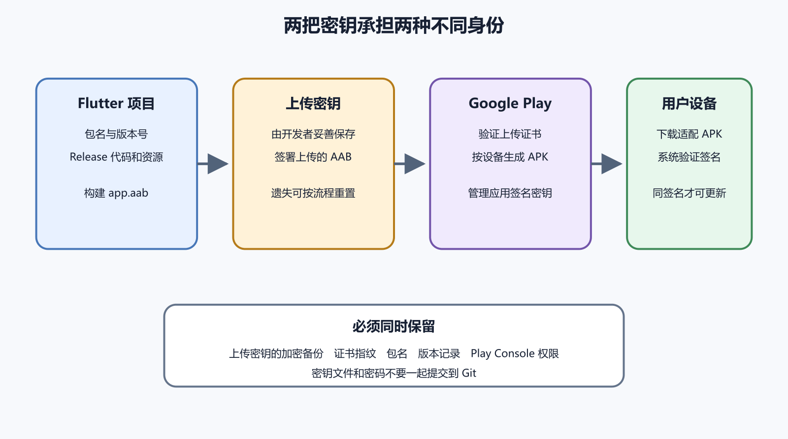

# APK、AAB、包名、版本号和 Android 签名

Android 发布最容易被一个词骗住。很多人说“打个包”，像是把项目压缩一下就能交给用户。真实发布至少包含应用身份、构建产物、版本递增、签名连续性、目标系统要求和商店政策。任何一项混乱，都会让上传、安装或后续更新失败。

APK 可以直接安装到设备。AAB 是交给 Google Play 等平台处理的应用包，平台再按设备生成合适安装内容。调试 APK 能装上，不代表 AAB 会被商店接受，也不代表用户将来能从旧版平滑升级。



*图 53-1　包名决定应用身份，版本代码决定升级顺序，签名决定谁有权更新。等价说明见本章“发布身份卡”。*

## 包名是应用的长期身份

包名常见形态像 `com.example.notes`。它和展示名称不同，是 Android 和商店识别应用的稳定身份。用户看到的名称可以改，图标可以改，包名一旦连接到商店记录和已安装用户，就不能当普通文案调整。

准备发布前先确认三处。Flutter 或 Gradle 配置里的 applicationId，商店控制台的应用记录，第三方服务登记的包名。登录、地图、推送、支付和深层链接经常把包名与签名证书指纹一起校验。包名写错时，最安全的处理是回到身份卡核对，不要为了让一次上传通过随手换新包名。

同一设备不能把两个同包名、不同签名来源的应用当作同一个可升级应用。用户本机装过调试包，再安装正式包，可能需要先卸载。测试时要记录安装来源，避免把签名问题误判成系统问题。

## versionName 和 versionCode

`versionName` 通常展示给用户，例如 `1.2.0`。`versionCode` 是 Android 用于判断升级顺序的整数。每个要上传到商店的新构建都应使用更高 versionCode。重命名 AAB 文件、改 Release notes、重新压缩，都不能让已用过的 versionCode 再次可用。

版本代码最好由团队统一分配。单人项目也要写下规则，避免 Android、iOS 和后端发布记录对不上。常见做法是让 CI 或发布负责人递增构建号，并把源码提交、制品校验值和上传轨道写入发布记录。

不要只测试全新安装。真实用户更常遇到升级安装。至少准备一个旧版，写入一组无敏感测试数据，再通过正式签名的新包升级。升级后确认旧数据可读，新数据可写，登录状态和本地文件仍符合预期。涉及数据库 schema、文件目录、权限或登录方式变化时，要扩大升级矩阵。

| 场景 | 要回答的问题 |
| --- | --- |
| 全新安装 | 空数据、首次授权和登录是否正常 |
| 同签名升级 | 旧数据和会话是否兼容 |
| 降级尝试 | 用户误装旧包时是否被阻止 |
| 调试包混入 | 是否能识别签名来源冲突 |
| 弱网启动 | 首次同步失败时是否有清楚状态 |

## 签名证明谁能更新

Android 应用必须签名。签名不是给用户看的水印，它证明这个包来自有权更新该应用的人。第一次发布后，后续版本要保持签名关系连续，否则设备和商店都可能拒绝升级。

Keystore 是保存私钥的容器。它的文件、别名和口令都要被保护。遗失后，不能靠“再生成一个”自然接上旧应用。使用 Play 应用签名时，还要区分上传密钥和平台最终分发使用的应用签名证书。第三方登录、地图和推送需要哪个证书指纹，要按服务文档和控制台字段确认。

密钥文件不要进入 Git，不要发到聊天窗口，不要贴给 AI。团队可以使用秘密管理工具或受控 CI 保存签名材料，并限制谁能触发 Release 构建。发布记录只写证书指纹、负责人和保存位置，不写口令。

签名资产需要交接方案。外包交付时，只给一个能安装的 APK 不够。客户要知道应用记录属于谁，Play 应用签名是否启用，上传密钥由谁持有，密钥丢失时走哪条恢复流程。密钥可以由组织控制的密码管理和 CI 保存，不等于要把口令明文发给所有人。

个人项目也要避免“只有一台电脑能发版”。电脑损坏、系统重装、硬盘加密密码遗失，都可能让下一次更新卡住。至少保存受控备份、证书指纹、生成日期、负责人和恢复步骤。备份是否可用，要用干净环境做一次 Release 构建验证。

## 签名配置使用秘密引用

Flutter Android 项目常通过 Gradle 读取签名配置。示意如下，字段名要按实际项目确认。

```properties
storeFile=/secure/path/release.keystore
storePassword=从秘密管理读取
keyAlias=release
keyPassword=从秘密管理读取
```

源代码中只应出现对安全位置或环境变量的引用。CI 构建时，签名材料由平台秘密注入，构建结束后不能留在日志和制品目录里。若必须本机手工构建，先确认电脑磁盘、备份、共享目录和屏幕录制不会暴露密钥。

检查证书指纹时，用同一来源生成并记录 SHA 变体。不要把调试证书、上传证书和应用签名证书混写成“Android 签名”。每接入一个第三方服务，都写清服务要求的是哪张证书。

## APK 和 AAB 的用途

APK 适合本地安装、企业内部分发或特定侧载场景。AAB 适合交给 Google Play 处理设备拆分、优化和商店分发。面向普通公众时，商店分发能提供更新通道、签名托管、崩溃入口和政策流程。侧载 APK 会把版本传播、更新提醒、来源可信和安全支持责任更多放回发布者身上。

内部测试不要用调试 APK 代替商店安装。商店处理后的包可能使用不同签名证书，按设备拆分资源，并触发真实权限、登录和推送条件。第 54 章会讲 Google Play 内部测试。本章只要记住，AAB 被构建出来，只是进入商店流程前的一份材料。

发布交接包至少保存这些内容。

```text
包名：
versionName：
versionCode：
构建提交：
构建命令：
AAB / APK 校验值：
签名证书指纹：
目标 API：
最低系统版本：
符号和混淆映射：
测试设备与结果：
```

这份清单不保存密钥。它回答“这到底是哪一个包”，也让以后追溯崩溃、投诉和商店反馈时有起点。

## 目标 API 是发布要求的一部分

minSdk、compileSdk 和 targetSdk 经常被混在一起。minSdk 表示应用声称支持的最低 Android 版本。compileSdk 是编译时使用的平台 API。targetSdk 告诉系统应用按哪个行为级别适配，也会受到商店政策要求影响。

提高 targetSdk 可能改变权限、通知、后台执行、照片访问、存储和安全限制。它不是单纯改一个数字。每次提高后，要在目标系统和旧系统上验证权限请求、后台任务、文件选择、通知、登录回调和第三方 SDK。若商店提示目标 API 不足，先查发布当天官方要求，再安排代码与测试。

Release 包不能保持 debuggable。调试开关、测试后端、绕过证书校验、详细日志和测试账号都要在发布构建中检查。网络安全配置也要看。为了临时通过接口测试而关闭 TLS 校验，若进入正式包，会让用户数据暴露在更大的风险里。

## 上传失败先读错误所属层

Android 上传错误通常落在四层。第一层是应用身份，例如包名不匹配、应用记录选错、versionCode 已使用。第二层是签名，例如上传证书与控制台记录不一致，或第三方服务只登记了调试证书。第三层是构建内容，例如缺少图标、Manifest 权限冲突、原生库格式不符合要求。第四层是政策任务，例如目标 API、数据安全、广告声明和内容分级。

先把错误放到层里，再决定动作。versionCode 已使用时，提高版本代码并重新构建。包名不匹配时，核对打开的是不是正确应用，不要修改已发布应用身份来迁就一次上传。签名不匹配时，查 keystore、上传证书和 Play 应用签名设置。政策任务缺失时，回到真实功能和表单，不要删除代码里仍在使用的权限来让提示消失。

截图错误时保留完整页面、应用名称、包名、versionCode、上传时间和错误详情。只复制最后一句，常会漏掉前面指出的具体文件或能力。交给 AI 帮忙分析时，先遮掉账号邮箱、路径中的个人信息和任何密钥。AI 可以解释错误结构，不能替你决定更换应用身份或重置密钥。

如果同一 AAB 在本地能安装，商店仍拒绝，不要急着怀疑商店。商店检查的是另一组条件，包括应用记录、签名、目标 API、设备目录、政策表单和分发轨道。本地侧载只证明设备接受了这个包。

## Native library 和包体

Flutter 应用可能包含原生库。Android 设备有不同架构，常见如 arm64-v8a 和 armeabi-v7a。某些商店或系统要求也会涉及原生库格式、页面大小和调试符号。不要在不理解影响时删除某个 ABI 目录来缩小包体。先看用户设备分布、插件支持和商店提示。

包体优化从资源和依赖开始。删除未用图片、压缩大图、拆分可下载资源、检查字体授权和体积。不要为了少几 MB 牺牲可更新性、可访问性或崩溃可读性。符号文件和混淆映射也许不进入用户包，却要保存给排错使用。

设备目录变化也要观察。提高最低系统、删除某个 ABI、声明只支持特定硬件功能，都会让一部分设备看不到更新。应用仍在商店中，不代表所有旧用户都能继续升级。发布前比较旧版和新版的设备支持范围，若影响真实用户，要准备说明和数据导出办法。

包体变大也不是单纯下载慢。弱网用户可能安装失败，低存储设备可能无法更新，首次启动解压和初始化也会变慢。图片、视频、模型文件和字体适合单独审查。能远程下载的资源，要有版本、校验和离线失败提示，不能让首页永远等一个大文件。

把商店错误交给 AI 分析时，也要提供足够上下文。包名、versionCode、目标 API、签名类型、上传轨道、错误原文和最近改动通常比一张模糊截图更有用。密钥文件、控制台完整账号、服务账号 JSON 和付款资料不应提供。AI 的回答应回到可验证动作，例如提高版本代码、检查证书指纹、更新目标 API 或补齐表单。

## 发布身份卡

Android 发布前，把下面这张身份卡填完。

```text
应用名称：
包名：
商店应用记录：
versionName / versionCode：
minSdk / compileSdk / targetSdk：
签名方式：
上传证书指纹：
应用签名证书指纹：
构建提交：
后端环境：
AAB 校验值：
符号文件位置：
升级测试来源：
```

如果某项答不上来，不要先上传碰运气。AI 可以读取配置、比对版本字段、整理升级测试表，也可以解释商店错误。授权人员仍要控制签名资产、开发者账号、发布范围和生产确认。下一章进入 Google Play 内部测试，那里会把这张身份卡放到真实轨道里验证。
