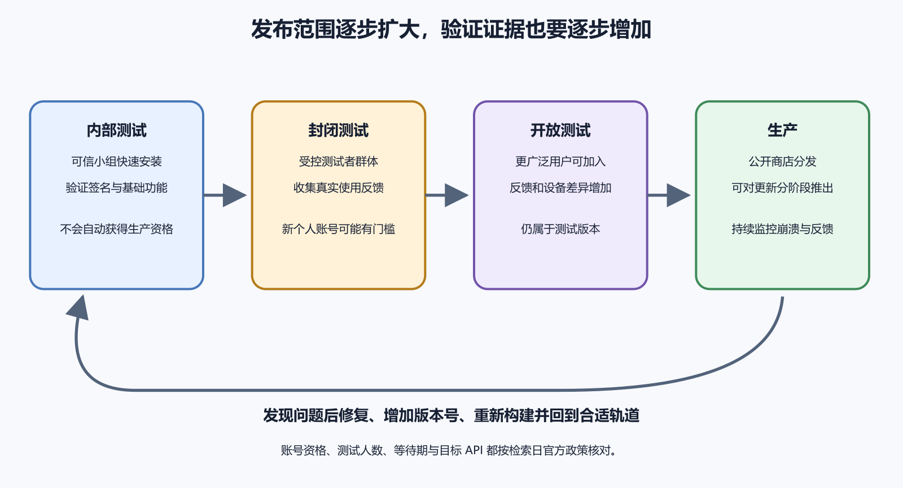

# Google Play 内部测试与发布流程

生成 AAB 只是准备好了发布材料。Google Play 还要确认这是哪个开发者、哪个应用、哪个版本和哪条分发轨道，再把平台处理后的安装包交给符合条件的账号与设备。第一次发布的目标不应是“尽快点到 Production”，而是让一名受控测试者从 Google Play 安装正确 build，完成核心流程，并从旧版安全升级。

## 一个模型，身份、制品、轨道、用户与政策

Play Console 开发者账号代表发布主体，其中可以管理多个应用。应用由包名长期识别；AAB 还带 versionName、versionCode 和签名关系。轨道决定谁可以取得版本，测试者的 Google 账号、国家/地区和设备条件决定他是否在范围内。政策与内容表单再决定某个版本能否向更广人群推进。

这五层不要混成“上传”。

1. **身份**　开发者主体、应用记录、固定包名和权限责任。
2. **制品**　AAB、版本代码、上传证书与 Play 应用签名。
3. **轨道**　内部、封闭、开放或生产，各有不同影响范围。
4. **用户证据**　目标账号与真机实际安装、启动、升级和完成业务。
5. **政策边界**　账号资格、目标 API、数据披露、内容、地区和审核要求。

创建应用记录不等于公开，AAB 上传完成不等于测试者可安装，内部测试通过也不等于生产资格或产品质量已经成立。每一个控制台状态只推进一层。



*图 54-1　轨道逐步扩大影响范围；发现问题后使用更高 versionCode 发布新制品，而不是覆盖旧版本。*

## 先固定应用身份

创建记录前确认开发者主体、默认语言、应用名、应用或游戏、免费或付费、包名和联系邮箱。商店展示名称可以修改，包名一旦与发布记录连接，就不能当普通文字随意更换。包含广告、购买、健康、金融、儿童或用户生成内容时，还会增加相应披露和审核责任。

账号权限按职责分配。上传 AAB 的人不一定需要管理付款、用户或删除应用；不要共享同一个 Google 密码。AI 可以整理字段、检查项目配置和准备草稿，不能替账号持有人决定法律主体、市场、价格，也不能替授权人员执行最终公开发布。

签名包含两个容易混淆的角色。上传证书用于证明提交者有权上传，Play 应用签名证书用于平台最终分发。登录、地图、推送等第三方服务要求证书指纹时，要确认所需的是哪一张。随机创建新密钥不能修复既有应用的签名连续性，密钥遗失应走平台的受控恢复流程。

至少建立一张发布身份卡。

```text
开发者主体：
应用名称 / 包名：
versionName / versionCode：
上传证书指纹：
Play 应用签名证书指纹：
目标 API / 最低系统：
轨道与测试者：
后端环境：
AAB 校验和：
```

真实密钥、口令和服务账号文件不写进这张卡，也不贴给 AI。

## 内部测试回答什么

内部测试适合可信的小团队快速检查第一条商店分发通道。它主要回答这些问题。

- Play 是否接受并处理这个 AAB。
- 名单中的账号是否能加入并找到应用。
- Play 为目标设备生成的安装包是否能安装和升级。
- 正式分发签名下，登录、地图、推送等集成是否仍工作。
- Release 构建能否完成一条核心用户路径。

它不能证明应用符合所有生产政策，不能覆盖所有设备、语言和网络，也不会自动满足某类账号的生产准入条件。内部测试者都是熟悉项目的人时，还可能绕过新用户才会遇到的说明和权限问题。

> **证据边界**
>
> “Release 已发布到内部测试”证明平台接受了这次轨道变更；“测试者安装成功”只证明该账号、设备和时刻的分发与安装成立；“核心流程通过”也只覆盖实际执行的步骤。生产发布仍需政策、商店资料、后端容量、支持与授权人的独立确认。

## 一次最小内部测试路径

界面会变化，下面按对象写，不依赖按钮位置。

1. 在 Play Console 打开正确应用，复核包名与开发者主体。
2. 选择 Internal testing，建立受控测试者列表。记录测试者实际使用的 Google 账号。
3. 创建 Release，上传签名 AAB；保存包名、versionCode、签名和目标 API 的处理结果。
4. 写 Release name 与可执行的测试任务，处理错误并理解警告。
5. 最终确认轨道、制品、测试者范围，由授权人员发布到内部测试。
6. 测试者用名单中的账号打开加入链接，从 Google Play 安装，不使用本地调试包代替。
7. 在真机“关于”页面记录 versionName/versionCode，完成首次启动、登录、核心读写、关闭重开和退出登录。
8. 保留一个旧 build，通过 Play 更新到新 build，确认旧数据、登录状态和关键设置兼容。
9. 记录问题、修复版本和再次验证；每个修复使用更高 versionCode。

Release notes 不写“修复若干问题”，而要告诉测试者该触碰什么。例如从 1.1.0 升级到 1.2.0，确认旧记录仍在；离线新增一条练习记录后恢复网络；拒绝一次通知权限，核心功能仍可使用。已知限制也应写出，避免把预期未完成误报成新回归。

### 升级比首次安装更接近真实发布

首次安装只处理空状态，真实用户更新时却带着旧数据库、缓存、登录凭据、文件和系统权限。新版本如果迁移失败，可能启动即崩溃；后端若只兼容新客户端，仍在分发中的旧版会同时坏掉。因此内部测试至少保留一个旧 build，通过 Play 完成升级，而不是卸载后重装来获得干净结果。

升级前记录旧 versionCode 和一组无敏感测试数据；升级后确认应用显示新 versionCode、旧数据仍可读取、新写入可再次打开，必要时检查登出与重新登录。若应用修改本地 schema、文件位置、深链或认证方式，应为这些变化设计专项任务。卸载会删除很多现场，只能作为“全新用户”对照，不能替代升级验证。

签名连续性也在升级中被真实检查。本地调试包与 Play 分发包可能使用不同证书，调试安装成功不能证明商店更新成立。第三方平台的证书指纹若只登记了开发机证书，Release 中的登录、地图或推送可能失败，所以必须在 Play 取得的 build 上重走集成。

## “找不到应用”按边界排查

测试者无权访问或看不到应用时，先检查浏览器与 Play 商店 App 是否登录同一个、且在名单中的 Google 账号。再确认 Release 已真正进入目标轨道，不是草稿、处理中或等待补充任务；邀请链接也要属于正确应用和正确分发方式，Internal app sharing 与 Internal testing 不是同一通道。

然后查看国家/地区与设备支持。最低系统版本、ABI、屏幕或硬件功能可能让设备不兼容；设备上已有同包名但不同签名来源的安装，也可能阻断升级。控制台仍在处理时，记录开始时间，不要反复上传同一 versionCode。

测试者收到旧版时，比较账号是否 opt-in、当前轨道、设备上的 versionCode、发布处理状态和 Play 缓存。不要先上传一个内容相同的新版本来掩盖资格或范围问题。证据至少包含账号的脱敏标识、设备、Android 版本、安装来源、时间、预期 build 和实际 build。

多人测试时，不要求每个人机械重复所有步骤。可以按设备和风险分工。一组覆盖首次安装与账号，一组覆盖弱网、后台恢复和权限拒绝，一组专门从旧版升级。所有人使用同一反馈模板，至少写设备、系统、versionCode、时间、最短步骤、预期、实际和截图。这样既能合并结果，也能知道哪些场景根本没人执行。

## 上传错误要回到身份字段

- **versionCode 已使用**　在项目中提高 versionCode 后重新构建；重命名 AAB 文件没有作用。
- **包名不匹配**　确认打开的是正确 Play 应用和正确构建配置；不要修改已发布应用身份来迁就上传。
- **签名不匹配**　核对上传证书与控制台记录；遗失时按官方流程恢复。
- **目标 API 不足**　升级项目设置，并重新测试通知、后台执行、照片、存储和权限等行为变化。
- **权限或政策警告**　回到真实功能、SDK 和数据流；删除披露文字不能改变应用实际收集。

AAB 被接受只能说明满足当时的静态和轨道门槛，不能证明行为兼容。设备目录也只是平台根据声明和构建得出的可安装判断，不替代真机使用。

## 易变规则必须停留在发布当天

测试人数、持续时间、适用账号、生产访问问卷、目标 API、审核资料和控制台入口都会变化。旧原稿曾记录过某类新个人账号的“12 名测试者、连续 14 天”样例，也记录过特定日期的目标 API 要求。这些数字可以帮助理解政策会影响排期，却不能作为当前发布依据。

> **政策时效**
>
> 真正执行时，以账号自己的 Play Console Dashboard 与发布当天的官方帮助为准，记录核对日期、适用账号、要求和负责人。不要根据本书、旧视频或 AI 记忆安排硬性发布日期。

封闭测试用于在受控范围扩大设备和场景，开放测试用于更广招募，生产面向公众。它们不是每个项目都必须机械走完的直线；应由账号资格、故障影响和测试资源决定。满足人数或天数也不等于做过有效测试。生产访问申请应引用真实的任务、设备、反馈、修复 build 和验证结果，不生成夸张故事或购买虚假测试者。

## 数据披露与商店资料来自产品事实

Data safety、广告、内容分级、目标受众、健康、金融等回答不能让 AI 根据应用名称猜。先列出每种数据是否离开设备、由应用还是 SDK 接收、用于什么目的、是否关联身份、怎样加密以及用户能否删除。SDK 版本和远程开关也会改变事实。

开发者确认权限与 SDK，产品负责人确认功能和受众，运营确认广告与用户内容，法务或主体负责人确认隐私与地区责任，再由有权限的人提交。Dashboard 的绿色勾选只说明表单已提交或条件满足，不证明答案准确。新增功能或 SDK 后要回到相关表单更新。

商店名称、说明、图标、截图、联系邮箱和隐私政策应与当前 Release 一致，不含真实用户数据。审核需要登录时提供受限测试账号与进入步骤，不能交出生产管理员账号。选择国家、价格、订阅和购买还会带来支付、税务、退款和支持责任，不应默认首日全球开放。

Play 的自动预发布报告可以在一组设备上发现启动崩溃、ANR、可访问性或基本交互问题，具体能力以当前控制台为准。需要验证码、外部硬件、复杂账号或长业务链的流程，它可能无法进入。自动报告没有错误，只能说明它执行到的路径未观察到对应问题；仍要在代表性真机上复现重要结论。

报告使用的测试环境与账号必须隔离生产个人数据，自动操作产生的记录要有清理方式。发现截图或日志含私人信息时，先限制访问并修正测试数据，不把报告随意转发给 AI 或公开 Issue。

## 生产发布由人确认，并继续观察

最终页面至少复核五件事。轨道是否正确；包名、versionCode、签名和支持设备是否正确；测试者或国家范围是否意外扩大；数据披露与商店资料是否对应当前功能；审核通过后何时真正公开。rollout 会改变外部用户能取得的版本，应由账号授权人员明确确认。

商店只负责客户端分发。上线会把真实流量带到后端，所以发布前还要确认容量、备份、监控、旧客户端兼容和支持渠道。审核通过不会替你扩容数据库，也不会证明登录与同步正常。

发布后记录实际可用时间，观察崩溃、ANR、登录/API 错误和反馈。严重问题按影响限制继续分发，修复后以更高 versionCode 发布，并保持后端兼容已安装版本。普通故障不要删除整个 Play 应用；应用记录、包名、签名链和用户更新通道都是长期资产。

一次可信交接可以写成下面这种表述。内部轨道 build 17 已由三个测试账号在两类设备安装；从 build 16 升级后旧记录保留，登录与离线恢复通过；平板横屏、生产准入和付费流程未验证。它比“Play 发布成功”更能指导下一步。

内部测试记录还应和后端版本对应。若 App build 17 在测试期间依赖 Preview API，生产审核通过后却连接另一套旧接口，先前结果不能直接外推。记录环境标识、API 版本和测试账号；发布前用即将公开的组合重跑核心流程。客户端与后端可以独立更新，兼容窗口和回退策略必须由双方共同说明。

## 现在可以跳过什么，继续查哪里

如果只需要验证第一条分发链，现在可以跳过开放测试、定价、managed publishing、Android vitals 深入分析和完整生产申请；先把包名、签名、versionCode、测试账号与一次真机升级做对。准备扩大范围时，再按当日控制台逐项补齐政策和内容责任。

涉及支付、健康、金融、儿童、敏感权限或大量既有用户时，内部测试范围和独立评审都应加强，并为后端兼容、数据恢复和用户沟通设停止点、记录负责人。纯离线、无敏感数据的个人工具可以从较小测试组开始，但商店身份、签名连续性和升级证据仍不能省略。

控制台操作、错误对照、资料清单、证据模板与视频入口见[《Android / Google Play 发布清单》](../../references/mobile-release.md)。主线判断始终不变。先确认发布的是谁的哪一个应用和哪一个 build，再确认它通过哪条轨道到达哪个真实用户，以及这份证据尚未证明什么。
