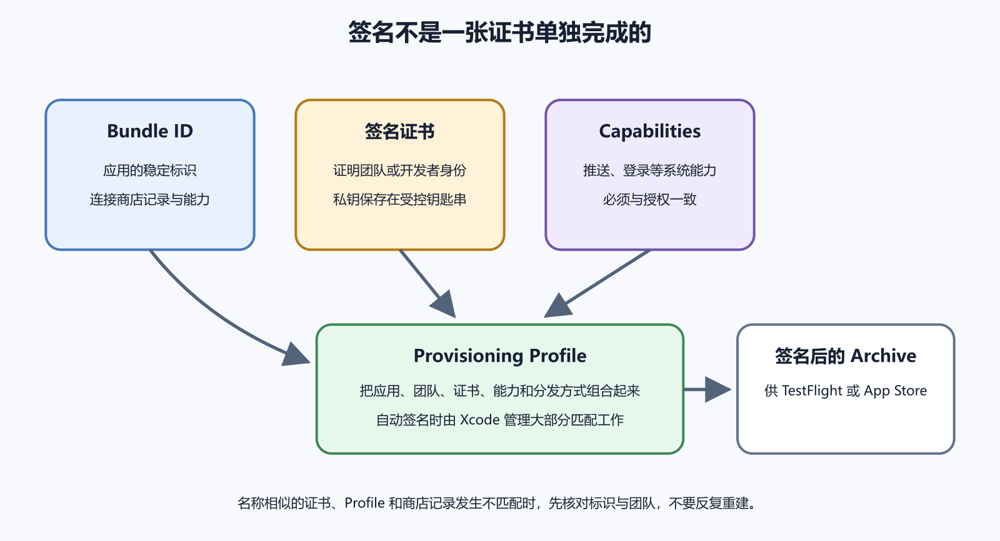

# iOS、macOS、Xcode、证书和 Provisioning Profile

Apple 平台发布常被签名问题卡住。报错里会出现 Xcode、Apple Account、Developer Program、Bundle ID、certificate、identifier、entitlement 和 provisioning profile。这些词一起描述一组关系。账号代表谁有资格发布，Bundle ID 表示哪个应用，证书证明谁签了包，Profile 把应用、证书、设备、权限和分发方式连起来。

Flutter 可以生成 iOS 和 macOS 目标，最后仍要进入 Xcode 与 Apple 的签名系统。非专业开发者不必背完每个按钮，但要能判断报错卡在身份、权限、设备、证书还是分发方式。



*图 55-1　Bundle ID、证书、能力和分发方式共同决定一个 Profile 是否可用；设备名单只适用于需要登记设备的分发类型。等价说明见本章“Provisioning Profile 连接多项条件”。*

## Apple Account 与开发者会员

Apple Account 只是登录身份。要发布到 App Store、TestFlight 或使用某些能力，通常还需要加入 Apple Developer Program，并在团队中拥有合适角色。个人账号、公司团队账号和客户主体不能混用。应用属于哪个主体，会影响合同、税务、隐私、支付、转让和后续维护。

团队权限要按职责分配。写代码的人未必需要管理付款和合同。负责截图的人未必能提交审核。不要共享同一个 Apple Account。共享账号会让二步验证、审计和离职交接都变得混乱。AI 可以帮你整理字段和排查报错，不能替主体负责人决定账号归属。

发布前写一张 Apple 身份卡。

```text
主体 / Team：
Apple Account 登录身份：
Bundle ID：
应用名称：
平台：
版本号 / 构建号：
签名管理方式：
分发方式：
需要的能力：
App Store Connect 角色：
```

真实密码、私钥、证书导出文件和 App 专用密码不写进这张卡。

## Xcode 是构建与签名中心

Flutter 的 iOS 项目最终会打开 `ios/Runner.xcworkspace`。如果使用 CocoaPods，通常打开 workspace，而不是只打开 project。Xcode 负责调用编译工具、连接原生依赖、处理图标和启动图、读取 Info.plist、选择 Team、生成 Archive，并把构建交给 App Store Connect 或导出到本地。

Xcode 的 Runner、Target、Scheme 和 Configuration 容易混淆。Runner 常是应用目标。Target 决定要构建哪一份产品。Scheme 决定一次构建运行哪些目标。Configuration 区分 Debug、Release 等配置。签名问题发生时，先确认你正在构建的目标和配置是不是准备发布的那个。

平台目录不宜随手重建。Bundle ID、URL Scheme、Associated Domains、Push、Keychain Sharing、隐私权限说明和原生插件设置都可能在 `ios` 或 `macos` 目录中。若 AI 建议重建平台目录，先看 Git 差异，再逐项恢复身份与能力。

## Bundle ID 是应用标识

Bundle ID 常见形态像 `com.example.notes`。它和 App Store Connect 应用记录、推送、登录、通用链接、Keychain、In-App Purchase 等能力相连。展示名称可以改，Bundle ID 不能当作普通文案随意替换。既有应用改错 Bundle ID，可能变成另一个应用，无法更新老用户。

开发、测试和生产可以使用不同 Bundle ID，但要写清楚。测试包误用生产 Bundle ID，可能污染推送、登录回调和分析数据。生产包误用测试 Bundle ID，会在上传或审核阶段失败，也可能连接错误后端。

版本号和构建号也要对应。用户看到的版本号可以是 `1.2.0`。构建号用于区分同一版本下多次上传。App Store Connect 对构建号有递增要求。每次重新上传修复包，都要提高构建号，并保存源码提交和 Archive。

## Provisioning Profile 连接多项条件

Provisioning Profile 可以理解为一张受控通行文件。它说明某个应用标识、某个团队、某些证书、某些设备或分发方式，以及某些能力能否一起使用。开发调试、Ad Hoc、TestFlight、App Store 和企业分发涉及的 Profile 条件不同。

常见报错可以按关系排查。

| 报错方向 | 先查 |
| --- | --- |
| No profiles found | Team、Bundle ID、分发方式是否匹配 |
| Signing certificate missing | 本机或 CI 是否有对应证书和私钥 |
| Entitlement mismatch | Profile 是否包含推送、iCloud、Associated Domains 等能力 |
| Device not included | 调试或 Ad Hoc 设备 UDID 是否登记 |
| Bundle identifier conflict | 是否已有应用或能力占用该标识 |

先让 Xcode 自动管理签名通常更省事。它会根据 Team 和 Bundle ID 生成或更新开发所需配置。准备交给 CI、客户团队或企业流程时，再把证书、Profile、角色和过期时间记录清楚。自动签名也要核对身份字段。Xcode 选错 Team 时，自动生成的东西仍然错。

CI 上的签名问题要单独看。开发者本机能 Archive，不代表远程构建机器也有证书私钥、Profile、钥匙串权限和正确 Xcode 版本。CI 应使用最小权限的凭据，并把证书安装、Profile 选择、构建号递增和 Archive 保存写成可审计步骤。日志不能输出私钥路径、口令和完整配置内容。

如果客户或公司要求可重复构建，先在一台干净 Mac 上从源码、依赖锁和受控秘密生成同样的 Archive。这个验证能发现本机隐藏状态，例如钥匙串里残留旧证书、Xcode 自动选择了个人 Team、Pod 缓存掩盖了依赖缺失。发布不能只依赖某台开发机的好运气。

## 权限说明写在 Info.plist

相机、相册、定位、麦克风和蓝牙等敏感访问，通常需要在 Info.plist 中填写对应的用途说明；推送通知走用户授权请求与相应能力配置，不能笼统当作一条 Info.plist 用途说明。文案要解释具体功能，不要写“需要权限以正常使用”。审核人员会把文案、实际调用和隐私政策一起看。

Entitlements 则描述更高层的平台能力，例如 iCloud、Associated Domains、Push、Keychain Sharing、Sign in with Apple 等。添加能力可能需要在开发者后台启用，也可能改变 Profile。代码里引入一个插件，不代表 Apple 后台配置自动完成。

CocoaPods 故障先看依赖关系。Flutter 插件若带 iOS 原生代码，`pod install`、Podfile、最低 iOS 版本和 Xcode 版本都可能影响构建。清理 Pods 前保存错误和 Git 状态。不要把删除 `Pods` 当作所有问题的答案。

## 设备、证书和过期时间

真机调试和 Ad Hoc 分发常涉及设备登记。设备数量、类型和用途受 Apple 当前规则约束，发布当天查官方页面。测试人员换手机后，旧 Profile 可能不包含新设备。TestFlight 和 App Store 分发走另一条路径，用户不需要提前登记设备。

证书和 Profile 会过期。过期前要检查开发机、CI、客户团队和应急构建机器是否仍能 Archive。证书轮换不要安排在发布当天。提前做一次干净环境构建，确认私钥、Profile 和权限仍能配合。

Mac 本身也要可恢复。证书私钥存在登录钥匙串里，电脑丢失或迁移不当会让团队突然不能签名。使用受控密码管理、加密备份和最小权限。离职交接时，移除账号权限，确认 CI 和签名资产由组织继续持有。

## 中国大陆使用注意

面向中国大陆用户时，Apple 平台发布还要考虑主体、网络、备案、隐私、支付、推送和用户支持。应用商店审核通过，不代表所有地区网络、登录、地图、支付和消息都稳定。第三方服务若在某些网络环境下不可用，审核和用户都可能看到空白页或超时。

测试时至少用一台不连公司网络的真机走完整流程。登录、验证码、图片上传、支付沙箱、推送、隐私政策和客服入口都要能访问。若应用同时提供微信登录、小程序入口或公众号服务，后端账号绑定和注销路径要一致。不要让 iOS 账号、微信账号和自有账号各自删除一半数据。

法规和平台规则会变化，本书不写固定办理结论。发布前查当日官方主管部门、Apple、支付服务商和云服务商说明，并把核对日期写进发布记录。高风险业务请合格专业人士审查。

## macOS 多一层分发判断

macOS 应用可能走 Mac App Store，也可能在网站上直接下载。两条路径都会涉及签名，但后续要求不同。Mac App Store 更接近 iOS 的 App Store Connect 流程。站外分发通常还要考虑 Developer ID、notarization、公证票据、Gatekeeper 提示、更新器、下载校验和用户卸载。

Flutter macOS 项目也会进入 Xcode 签名。应用沙盒、文件访问、网络访问、菜单栏、自动启动和辅助功能权限都可能需要额外配置。用户在 macOS 上看到的权限弹窗和系统设置入口，与 iOS 不完全相同。不要把 iOS 审核经验直接套到 macOS。

站外分发时，下载页本身也成为发布面。用户需要知道版本、发布日期、校验值、最低系统、安装方法和隐私政策。自动更新器要签名并保护更新源，不能让任何人替换下载包。崩溃符号和发布记录同样要保存。

是否要先进 Mac App Store，取决于目标用户、付费方式、沙盒限制、审核成本和更新节奏。个人工具若只给少量用户测试，可以先用受控 TestFlight 或签名的内部包。面向公众下载时，公证、更新和撤回方案要提前准备。

## Archive 前的真机清单

Archive 前至少走一次真机 Release 验证。

- 正确 Team、Bundle ID、版本号和构建号。
- Release 配置连接即将使用的后端环境。
- Info.plist 权限文案与功能一致。
- 推送、登录、深层链接和通用链接在正式签名下可用。
- 从旧版本升级后，本地数据、Keychain 和文件仍可读。
- 拒绝权限、断网、后台恢复和退出登录表现清楚。
- 崩溃符号文件、Archive 和源码提交能互相对应。

开发构建能跑，不能替代 Archive 前验证。Xcode 连接真机运行的包、TestFlight 包和 App Store 包可能使用不同签名与分发路径。每条路径都要留下证据。

## 一个团队交接情境

用一个交接情境检查资产是否齐全。外包团队完成 Flutter 应用后，只交付源码和 IPA。客户或许能安装当前包，却没有开发者团队权限、证书私钥、Bundle ID 控制权和 App Store Connect 角色。以后需要修复崩溃时，客户就无法独立上传新构建，也不知道旧包使用哪个提交生成。

可交接的版本应包含源码提交、依赖锁文件、Bundle ID、Team、签名方式、Profile 说明、Archive 记录、构建号、后端环境、商店账号角色和未覆盖风险。密钥不随意打包发送，但责任和恢复路径要写清楚。

签名专题的边界很朴素。你不用亲自成为 Apple 平台专家，却要能回答这是谁的账号、哪一个应用、哪张证书、哪种分发方式、哪些能力、哪台设备或哪条商店路径。下一章进入 Archive、TestFlight 和 App Store Connect。
