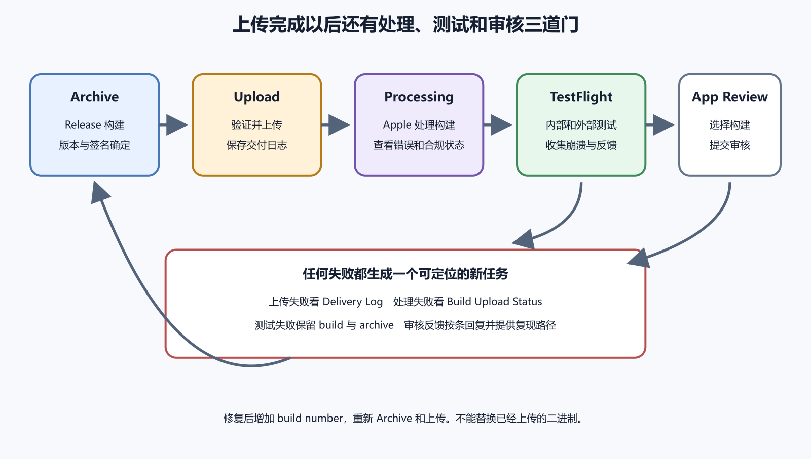

# Archive、TestFlight 与 App Store Connect

Xcode 显示 Archive succeeded 时，应用还没有进入 TestFlight。Archive 是 Mac 上的发布归档。上传后，App Store Connect 还要接收、处理，并把构建关联到正确应用。之后才能选择内部或外部测试，最后提交 App Review。

这条路径上每个系统都有独立状态。把上传完成、处理完成、可供测试和审核通过混成一句话，会让等待和失败无法定位。发布者要能回答当前卡在哪一层，手里有什么证据，下一步该由谁处理。



*图 56-1　Archive 经过上传与处理后进入 TestFlight，经过测试的构建再提交 App Review。等价说明见本章“从 Archive 到审核的路径”。*

## App Store Connect 先要有应用记录

App Store Connect 管理应用资料、构建、TestFlight、审核、销售和角色。它不是 Xcode 项目。首次上传前要创建应用记录，通常至少选择平台、应用名称、主要语言、Bundle ID 和 SKU。Bundle ID 必须与 Archive 完全一致。SKU 只是开发者内部识别值，不会成为 Bundle ID 或商店版本号。

创建记录需要合适角色。按钮不可见时，先检查当前用户在团队和应用中的权限。不要共享 Account Holder 密码来绕过角色问题。协议、财务、销售和应用管理属于不同责任，越早分清，后面越少混乱。

冻结候选代码后，记录 Git 提交、Flutter 版本、依赖锁、Version 和 Build。完成 Release 真机测试，再用 Xcode 生成 Archive。Organizer 中核对应用名、Bundle ID、版本、构建号、Team 和创建时间。这个 Archive 是一次不可修改的发布证据，不要在发现问题后手工改包。

## 从 Archive 到审核的路径

一次候选构建通常经过这些门。

1. Xcode 生成 Archive。
2. Organizer 验证签名、entitlements 和包内容。
3. Xcode、Transporter 或受控自动化把构建上传。
4. App Store Connect 处理构建。
5. 处理完成后，构建进入可选择列表。
6. 补齐 Export Compliance、隐私或缺失资料。
7. 把构建加入内部 TestFlight 组并完成测试。
8. 需要外部测试时，提交 Beta App Review。
9. 选择经过验证的 build，补齐商店版本资料。
10. 将版本加入 submission 并提交 App Review。

每一步只证明自己完成。上传成功只说明文件到达 Apple。Processing 完成只说明平台能读取构建。TestFlight 可安装只说明指定测试者在某个设备上取得了 build。审核通过以后，还要确认发布方式、地区、生产后端和真实用户入口。

## 上传方式怎样选

Xcode Organizer 是个人项目最直观的入口。它把 Archive、签名验证和上传放在同一流程里。Flutter 也可以运行 `flutter build ipa` 生成归档和安装包。Transporter 适合由独立人员上传已有包。App Store Connect API 与命令行适合受控自动化，需要 API Key、角色限制和审计。

第一次发布不必同时学习全部上传方式。先用 Organizer 跑通手工路径，保存上传记录和交付日志。手工路径稳定以后，再把命令行或 CI 接上来。自动化不应掩盖签名、角色和审核资料的责任边界。

上传失败时看第一条具体错误。常见原因包括 Bundle ID 不匹配、build number 已使用、图标缺失、entitlement 与 Profile 不一致、嵌入 Framework 架构不合规、使用不受支持的构建工具。不要从论坛复制脚本去删除签名或改 archive。回到源项目修复，再产生新 Archive。

一个小案例能说明状态判断的价值。团队上传 build 18 后，Xcode 显示传输完成，但 App Store Connect 标记 Failed。详情指出某个嵌入 Framework 带有不支持架构。正确处理是保存 Delivery Log，回到 Flutter 插件和 iOS 原生依赖，升级或替换问题库，然后生成 build 19 的新 Archive。不要直接打开 archive 删除文件，也不要重复上传 build 18 期望平台放过。

修好以后，旧失败记录仍然有用。它说明 build 18 没有进入测试，后续反馈不能归到它身上。build 19 若处理完成，再加入内部组，并把测试报告绑定到 build 19。这个分层记录能防止“我明明上传过”变成团队记忆里的模糊一团。

## 状态名称要对应页面

iOS 发布会连续出现多个很像完成的状态。Archive 成功在 Xcode。Upload 成功在上传工具。Processing、Failed 和 Complete 属于构建处理。Ready to Submit、Waiting for Review、In Review、Rejected 和 Approved 属于版本审核。Testing、Expired 等状态属于 TestFlight。

状态用英文保留，是为了让读者能在控制台直接找到。中文解释帮助理解，不另造界面上不存在的新名字。截图时要包含页面标题、状态、版本和 build。只说“Apple 那边红了”，无法判断是上传文件失败、缺合规资料，还是版本被审核退回。

处理完成后构建没有出现，先确认打开的是正确团队和正确应用，再比较 Bundle ID、Version 和 Build。邮件可能延迟，控制台状态更直接。超过官方建议的异常等待时间后，再联系支持，并提交交付日志、时间、App ID 和 build。不要提交私钥、账号密码和无关用户数据。

## 内部测试和外部测试

内部测试者是获得相应应用访问权的 App Store Connect 用户。它适合开发、测试和产品团队快速验证候选 build。测试者安装 TestFlight App，接受邀请后安装构建。给测试组添加 build 时，What to Test 要写本次变更、重点步骤、已知限制和反馈方式。

外部测试面向客户、受邀用户或更大范围。它可能需要 Beta App Review，也要准备测试版描述、联系方式、测试账号和必要说明。公开链接方便招募，也可能被转发。测试环境不能暴露真实敏感数据。测试账号只给最小权限，测试结束后撤销访问并清理数据。

人数、窗口、公开链接条件和审核规则会变。执行前打开当前 Apple 官方帮助和自己的账号页面核对。不要把书里的旧数字、视频截图或 AI 记忆写进排期。可靠依据是发布记录中写明核对日期、账号条件、负责人和实际决定。

## TestFlight 反馈要带 build

测试者反馈必须绑定版本、构建、设备、系统、发生时间和最短步骤。一条有用反馈可以这样写。

```text
版本与构建　1.2.0 (18)
设备与系统　iPhone 15，iOS 19.1
操作步骤　登录后打开共享清单并添加图片
实际结果　选择图片后回到首页
预期结果　显示裁剪页面
发生时间　2026 年 8 月 5 日 20 点 15 分
```

截图不要包含密码、身份号码、真实订单和个人聊天。崩溃需要保留对应 Archive 和 dSYM。符号文件把地址还原为可读函数，必须与同一个 build 匹配。只保存 IPA 不足以替代完整 Archive、符号和源码提交。

同一版本号下可能上传多个 build。测试反馈只写 `1.2.0`，无法判断问题属于 build 17 还是 build 18。发布记录要把每个 build 的上传时间、处理结果、测试组、设备、核心结果和未解决问题分开写。

## Export Compliance 先调查加密用途

应用使用 HTTPS、系统加密、VPN、自研密码或第三方加密库时，可能需要回答出口合规问题。要求取决于应用能力与适用规则。开发者先列出应用和 SDK 使用的加密功能，再查官方指南，必要时咨询组织合规人员。不能看到 HTTPS 就随便选择，也不能为了跳过提示隐藏加密。

符合特定条件的应用可能通过 Info.plist 中的声明减少重复询问。具体键和值以 Apple 当前文档和真实情况为准。回答应与 build 一起记录。功能、SDK 或地区策略变化后重新评估。

审核账号也要提前准备。账号应能进入审核需要的功能，使用合成数据，不拥有生产管理员权限。审核期间保持服务器、验证码、第三方服务和测试账号可用。若功能依赖蓝牙设备、订阅沙箱、地区或特殊资料，要在审核说明中写清准备步骤。

## 版本资料和 build 分开

版本页面保存描述、关键词、截图、推广文本、支持 URL、隐私政策和审核信息。Build 区域选择一个已上传二进制。修改描述不会改变二进制，选择新 build 也不会自动更新截图。提交前同时核对。默认语言修好了，其他本地化语言仍可能保留旧承诺。

发布方式也要有人确认。自动发布、手动发布、分阶段发布等选项以当前 App Store Connect 为准。手动发布便于安排监控和客服，但需要关注批准后的窗口。分阶段发布只控制自动更新节奏，用户仍可能手动下载。它不能替代后端兼容和客户端修复。

发布时间要跟人和后端一起安排。商店审核通过只是客户端分发条件成熟，生产系统还要有人看登录、支付、同步、崩溃、反馈和客服。重大版本不要安排在团队无人值守的夜里，也不要卡在节假日前最后一小时。若依赖后端变更，先确认数据库迁移、开关、监控和回退窗口。

地区和价格也会影响发布判断。某些功能只在特定国家可用，审核人员却可能从另一地区进入。订阅、付费下载和应用内购买涉及协议、税务和退款。免费应用先公开，后续再加付费功能，也要提前考虑账号主体和用户承诺。发布按钮不是技术按钮，背后还有支持和经营责任。

App Store 没有传统意义上的二进制回滚。坏 build 到达用户设备后，不能把旧 build 原地推回去。可以暂停分阶段发布，阻止更多自动更新。可以用后端开关关闭问题功能，前提是开关已经设计好。客户端缺陷通常要提交更高版本的新 build。

## 提交前做一次双人核对

提交审核前，最好让两个人按不同角度看同一个候选。第一人看二进制。Bundle ID、Version、Build、签名、后端环境、核心流程、升级测试、符号文件和 Archive 是否一致。第二人看商店资料。截图、描述、隐私政策、审核账号、联系信息、价格地区、发布方式和测试说明是否对应当前 build。

小团队也可以由同一人在两个时间段完成，但要使用清单，不靠记忆。最常见的低级错误，是开发者上传了 build 18，运营提交页面仍选择 build 17。另一种是截图展示了新功能，所选 build 里还没有入口。双人核对能把这类错误拦在审核前。

核对结果写成短记录。

```text
二进制核对人：
商店资料核对人：
所选 build：
对应测试报告：
仍未覆盖：
提交窗口：
值班联系人：
```

这不是大型流程。它只是让最后一次点击有证据。

## 审核反馈按事实回复

被拒绝不等于账号失败。先读取具体 guideline、截图、设备和复现步骤。能复现时修正应用，提高 build，重新 Archive、测试和提交。元数据问题可以修改说明或截图，但不能用元数据掩盖真实行为。

无法复现时，提供版本、测试账号、操作视频或日志，说明差异和进入路径。不要只回复“我的手机正常”。若认为审核误解，引用实际功能和当前指南，给出可验证步骤。Resolution Center 沟通要保留上下文。上传新 build 后，明确旧问题在哪个 build 修复，并确保新 build 已加入版本。

一个常见退回案例是蓝牙应用没有演示模式。审核人员没有硬件，只能看到连接失败。团队增加受控演示模式，使用合成设备数据，审核说明写清入口和差别。新 build 先在内部组验证，再提交外部测试或审核。演示模式帮助审核进入功能，不能伪造实际硬件兼容性。

## 发布记录

每个上传 build 保存下面这些事实。

```text
源码提交：
Archive 路径：
Xcode / Flutter 版本：
Bundle ID：
Version / Build：
上传时间与处理结果：
TestFlight 组：
审核账号：
商店资料版本：
Export Compliance 回答：
符号文件位置：
已验证设备：
未覆盖场景：
提交审核时间：
```

AI 可以帮助整理上传错误、生成测试任务、归纳审核反馈。账号持有人仍要选择 build、控制测试范围并执行最终提交。API Key、签名证书、测试账号和交付日志在交给外部工具前要脱敏与限权。

> **跟做视频**
>
> 中文主入口见[视频跟做索引里的 iOS 上架全流程和 TestFlight 与测试分发](../frontmatter/videos.md)。先把视频当作界面地图，看清 Apple Developer、Xcode、App Store Connect、Archive、上传和测试组之间的顺序。真正提交前仍以自己的账号页面和 Apple 当前帮助为准。

这一章的掌握边界很清楚。你需要能区分 Archive、Upload、Processing、TestFlight 和 App Review，知道 build number 怎样递增，能建立内部组、写测试任务、查上传失败，并把经过验证的 build 加入 submission。自动化、Xcode Cloud 和复杂多平台 bundle 可以等手工路径稳定后再学。
