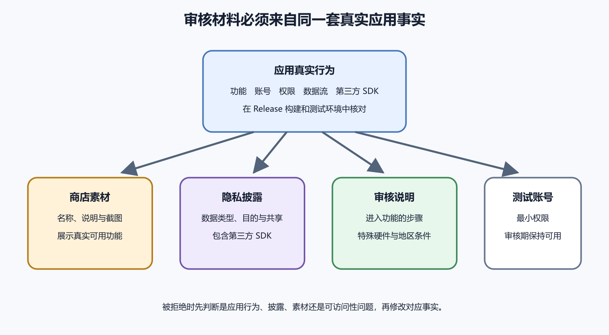

# 商店素材、权限、隐私政策和审核反馈

应用商店审核会同时看用户会看到什么、应用会做什么、数据怎样流动、开发者怎样承担责任。代码质量很重要，提交材料还要让截图、描述、权限弹窗、隐私政策、SDK 行为和审核账号彼此一致。

发布前最有用的工具是一张事实表。每个功能写清用户动作、系统权限、数据类型、接收方、保存期限、删除路径、商店披露和测试入口。表格难填，往往说明产品本身还没想清楚。



*图 57-1　素材、权限、数据披露和审核说明都回到同一组产品事实。等价说明见本章“建立审核事实表”。*

## 建立审核事实表

先列主要功能，再为每个功能回答这些问题。

| 项目 | 要写清的事实 |
| --- | --- |
| 用户动作 | 用户在哪里触发，是否可选择 |
| 系统权限 | 相机、照片、定位、通知等 |
| 数据类型 | 文本、照片、位置、设备信息、付款信息 |
| 接收者 | 自有后端、平台能力、第三方 SDK |
| 用途 | 完成功能、分析、崩溃、广告、风控 |
| 保存 | 本地、服务器、第三方服务和期限 |
| 删除 | 用户怎样撤回、删除或导出 |
| 审核入口 | 测试账号、页面路径和特殊条件 |

这张表同时服务 Android、iOS 和微信小程序。小程序没有传统商店截图流程，却有类目、资质、隐私保护指引、页面路径、体验版和审核版。合法服务器域名、AppID、成员权限和前端实际调用，也要与表中事实一致。

表格不追求一次写得漂亮。它追求能被代码、后台、控制台和真机测试验证。AI 可以根据项目文件和依赖清单整理候选项，但最终要由了解产品的人核对真实业务和数据来源。

## 截图展示任务

截图应该展示用户能完成的任务，而不是把所有按钮排成橱窗。一个记账 App 可以展示添加收据、查看月度汇总、导出账单。截图中的金额、头像、聊天和订单应使用合成数据。不要截取真实用户信息，也不要展示还未发布的承诺。

截图、描述和实际 build 要一致。若描述写“支持离线同步”，审核和用户会期待断网后能保存并恢复。若截图展示订阅权益，应用内购买和退款说明也要跟上。多语言资料要一起查，中文改了，英文仍可能保留旧功能。

商店文案尽量写可验证的能力。少写“安全可靠、智能高效”，多写用户能做什么、数据在哪里处理、失败时有什么退路。涉及健康、金融、法律、儿童、VPN、新闻或用户生成内容时，截图和描述还可能触发额外资质与政策要求。

## 权限从用户动作出发

权限请求应贴近用户动作。相机用于扫描收据，就在用户点击扫描时请求，并说明原因。通知用于提醒待办，就在用户开启提醒时请求。启动时索要一堆权限，会让用户和审核人员都看不出必要性。

拒绝权限后，应用要给出清楚状态。核心功能若不依赖该权限，应继续可用。必须依赖时，解释为什么需要，以及如何到系统设置中重新授权。不要把权限拒绝写成网络错误，也不要因为拒绝就崩溃。

权限文案、实际调用和商店披露要相互匹配。写“照片仅用于本地裁剪”，却上传到服务器识别，就是事实冲突。选择照片时，优先考虑平台提供的选择器，减少广泛存储权限。后台定位、通讯录、无障碍、VPN、短信和健康数据等敏感能力，使用前先查发布当天平台规则。

## 隐私政策不能替代码撒谎

隐私政策至少让普通用户知道收集什么、为什么收集、与谁共享、保存多久、怎样保护、如何访问或删除，以及如何联系开发者。政策页面要公开可访问，移动端可读，审核期间保持在线。只放一个需要登录的云文档链接，审核人员和用户都可能打不开。

政策不是免责声明。写“可能收集任何信息”不能替代具体说明，也不能让不必要收集变得合理。应用内应有容易找到的隐私入口。账号删除、导出、撤回同意和联系渠道要能从界面或说明中走到。

面向中国大陆用户时，还要评估网站与 App 备案、个人信息保护、数据出境、未成年人、算法推荐和内容治理等要求。平台表单不是法律合规的全部。高风险业务应请合格专业人士审查，并记录依据日期。

## Data safety 与 App Privacy

Google Play Data safety 要求开发者声明应用和第三方 SDK 的数据收集、分享与安全做法。责任在开发者。先导出依赖清单，逐个查看登录、推送、分析、广告、地图、支付和崩溃 SDK 的数据说明。再核对后台是否启用可选收集。

“收集”不只指写入自有数据库。SDK 把数据发给第三方，也可能需要披露。传输是否只为实时处理、是否与用户关联、是否用于广告或跟踪，都要按当前规则判断。表单提交成功只说明填完了，不证明答案准确。

App Store Connect 的 App Privacy 问卷也要覆盖自有代码和第三方合作方代码的数据实践。数据类型、用途、是否关联用户、是否用于跟踪，都应来自事实表。应用版本、SDK 或远程配置改变后，问卷和隐私政策要一起复核。

小程序的隐私保护指引同理。前端调用手机号、位置、相册、剪贴板、订阅消息或第三方插件时，要能对应到指引、用户授权和真实用途。开发工具里能运行，不代表审核版和线上版的隐私披露已经成立。

## 第三方 SDK 是最容易漏的一层

团队常知道自己写了哪些 API，却忘记 SDK 也在收集和发送数据。为每个 SDK 记录版本、用途、数据类型、发送域名、隐私文档、是否可关闭、升级日期和负责人。删除 SDK 后，还要确认原生项目、清单、权限和最终包中已经移除。

SDK 更新可能改变数据行为。依赖升级审查不能只看编译是否通过，还要看权限、隐私说明、目标系统要求和商店政策。封版前查官方页面，不依赖两年前教程。

最终包里的 SDK 才算数。源代码里删掉一个库，原生工程、构建缓存或插件依赖仍可能把它带进包。Android 看合并后的 manifest、依赖树和最终 AAB。iOS 看链接的 framework、隐私清单、entitlements 和 Archive 内容。小程序看实际上传版本、插件配置、接口调用和体验版网络请求。审核依据的是运行事实，不是开发者心里的计划。

广告和分析 SDK 要格外谨慎。它们可能收集设备标识、粗略位置、使用事件、崩溃信息和广告互动。即使团队无人手工查看，也可能由第三方接收并保留。是否用于跟踪、与用户关联到什么程度、用户能否关闭，都要按当前平台定义回答。

内容分级也要回到功能事实。工具类 App 如果内置浏览器、社区、AI 内容或用户上传，也可能涉及用户生成内容。目标受众涉及儿童时，广告、数据、设计和监护责任都会增加。不要为了扩大曝光随意勾选儿童年龄段。

可访问性也会影响审核和真实使用。文字缩放后按钮是否被遮挡，屏幕阅读器是否能读出表单，颜色对比是否足够，横竖屏和系统返回是否正常，这些问题会让审核人员无法进入功能，也会让用户无法完成付款、删除账号或撤回授权。Release 包要用真实设备检查，而不是只看设计稿。

素材也要做版本管理。图标、截图、商店描述、隐私政策、审核说明和客服模板，都应对应一个源码提交或构建号。运营单独改了描述，开发者单独换了 build，最终很容易出现“资料说有，包里没有”的情况。每次提交前，把素材版本和所选 build 放在同一张清单里。

小程序素材也会变旧。页面路径调整后，审核说明里的入口可能失效。类目变更后，旧资质可能不够。隐私接口升级后，旧指引可能不再覆盖实际调用。体验版测试要按即将提审的代码版本重走，不使用上次通过的截图替代。

## 审核测试账号使用最小权限

需要登录的应用要提供专用审核账号。它能访问审核所需功能，使用合成数据，不拥有生产管理员权限。账号在审核期间保持有效，不要求验证码发到开发者个人手机。若有二步验证，提供审核能执行的受控路径或说明。

审核说明包含本次版本重点、进入步骤、测试账号、特殊条件和联系方式。涉及硬件、地区、订阅、支付沙箱或外部服务时，提前写清准备步骤。审核人员进首页后找不到功能，可能认为应用不完整。

一个简短说明可以这样写。

```text
本版本增加收据扫描

进入步骤
1. 使用测试账号登录
2. 打开记账页
3. 点击添加并选择扫描收据
4. 使用样例图片完成识别

说明
相机权限只在第三步请求
识别使用测试服务器
```

不要写内部项目代号。不要假定审核人员看过上一版沟通。

## 付款、订阅和账号删除

涉及付款和订阅时，商店会关心用户在哪里购买、如何恢复、如何取消、价格怎样展示、试用怎样结束。应用内说明要与真实结算一致。不能在商店外引导用户绕过平台规则，也不能把测试价格、沙箱环境和正式价格混在同一份截图里。

恢复购买是移动端常见漏项。用户换手机、重装应用或登录同一账号后，应能恢复已经购买的权益。恢复动作失败时，要说明下一步。后端保存权益时，还要处理退款、订阅过期、家庭共享、跨平台账号绑定和重复购买。前端显示会员，不代表后端可以跳过校验。

账号删除也会被审核关注。入口要能从应用内找到，说明删除后哪些数据会删除、哪些因账务或安全需要保留、多久完成。删除请求发出后，旧令牌、推送令牌、离线队列、对象存储、第三方分析和客服系统都要纳入处理。若提供恢复期，界面要说明恢复条件。

小程序若使用微信支付、订阅消息、客服、广告或插件，也要把平台能力与自有后端分清。支付密钥留在后端，订单状态由后端和平台回调共同确认。不要让小程序前端决定付款是否成功。

## 被拒绝后先分类

审核反馈可能指向应用行为、崩溃、元数据、隐私、账号访问、付款、内容或政策。先保存原文和截图，再确认对应版本。应用崩溃时，用反馈设备、系统、build 和步骤复现。元数据不准确时，更新说明、截图和所有语言版本。隐私披露不一致时，回到数据流和 SDK。

无法复现时，回复具体证据。提供进入步骤、测试账号、短视频、服务状态和日志范围，礼貌询问缺少的信息。不要只说“我们这里正常”。修改完成后重新走 Release 测试，并用更高版本或 build 提交。

微信小程序审核反馈也按同样方法分类。先确认 AppID、代码版本、体验版或审核版、页面路径、服务器域名、类目资质和隐私指引。开发版正常，不代表审核环境可达。一次性验证码、办公室内网、夜间关闭的测试后端都会让审核无法进入。

## 哪些变化会触发重新审查

发布后材料也会变旧。新增登录方式、支付、广告、推送、地图、AI 识别、用户上传、分享、第三方 SDK 或小程序插件，都可能改变权限和数据披露。改变后端地区、对象存储、日志保留、客服系统和分析平台，也可能改变隐私事实。只改前端页面，也可能让截图和说明失真。

建立一个小规则。每次版本评审问四件事。有没有新增系统权限。有没有新增数据接收者。有没有改变用户承诺。有没有改变审核进入路径。四个问题任何一个答案为是，就回到事实表、隐私政策、商店表单和审核说明。

政策本身也会变化。平台更新 SDK 要求、目标 API、儿童保护、账号删除、隐私标签和内容分级时，旧版本也可能需要处理。把核对日期写进发布记录，能说明当时依据。真正执行时仍以当前平台页面为准。

## 提交材料的最终证据包

提交前保存这些材料。

```text
源码提交：
构建号 / 小程序代码版本：
商店或平台应用身份：
截图与描述版本：
权限事实表：
SDK 清单：
隐私政策或隐私保护指引：
测试账号：
审核说明：
已验证设备：
尚未覆盖场景：
发布当天政策核对日期：
```

这份包不要保存真实密钥和生产管理员密码。它的作用是把审核材料和真实 build 绑在一起。几个月后被问到某个版本为什么这样披露时，团队能回到当时的证据，而不是翻聊天记录猜。

商店与隐私专题的边界也很清楚。你不需要背下所有政策条款，但要能证明截图、描述、权限、SDK、数据披露、审核账号和实际代码说的是同一个产品。每次新增 SDK、支付、广告、推送、用户内容、小程序能力或敏感权限，都要回到事实表重查。
