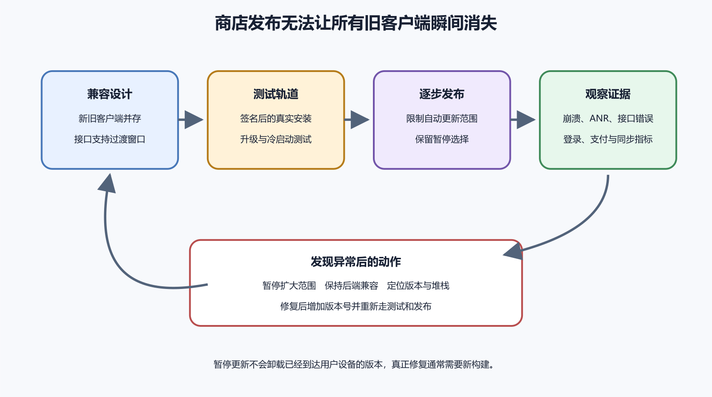

# App 更新、崩溃日志和后端停机

网页部署后，维护者可以把服务器立即切回旧版本。App 已经下载到用户设备以后，商店没有一个按钮能把所有安装瞬间换回去。用户可能关闭自动更新、长期离线，或继续使用数年前的客户端。所以 App 发布要同时考虑新客户端、旧客户端、新后端和旧数据。

真正的止损能力来自兼容设计、逐步发布、监控、后端开关和快速修复。它不来自“先发了再说”。移动端事故里，最常见的痛感是客户端已经散出去了，服务端还在变，用户设备上保留着旧数据。

*图 58-1　新版本先经过真实安装测试与逐步发布，异常时暂停扩大、保持后端兼容并发布修复。等价说明见本章“更新前先设计兼容窗口”。*

## 更新前先设计兼容窗口

假设 2.0 客户端把用户姓名字段从 `name` 改成 `displayName`，后端同一天删除旧字段。仍使用 1.9 的用户会突然无法读取资料。安全顺序是后端先同时接受和返回新旧字段，再发布 2.0 客户端并逐步覆盖。观察旧版本比例下降后，后端停止写旧字段。最后经过公告和期限，才删除兼容代码。

数据库变化也要按可兼容顺序处理。先新增可空字段或新表，让新旧程序都能运行。数据回填完成后再切读路径。直接重命名或删除旧字段，可能让旧客户端和回滚版本一起失效。兼容窗口有成本，因此要记录最低支持版本和结束时间。无限期支持所有旧版本也不现实。

App Version 面向商店和用户。API 版本面向客户端与后端约定。两者不必一一对应。一个 2.1 App 可能仍调用 `/v1` API，只增加本地界面。另一个 2.1.1 修复可能需要后端新增可选字段。后端日志应同时记录平台、App Version、Build 和 API 版本，便于判断错误是否集中在某次构建。

## 逐步发布控制影响范围

Google Play 和 App Store 都提供某种逐步发布能力，具体名称、比例、暂停期限和入口会变化。执行前查发布当天官方页面。逐步发布只能减少新增影响，不能让已经更新的用户自动回到旧版。用户也可能手动下载新版本，所以它不是严格实验隔离。

逐步发布前先定义观察指标。下载量没有多大用处。至少看启动崩溃、ANR、登录成功率、核心 API 错误、同步失败、支付异常和用户反馈。扩大比例要有人确认。平台不知道你的业务指标是否异常，只会提供有限的分发控制和基础报告。

严重问题出现后，先暂停继续扩大，保护尚未更新的用户。已经更新的用户仍需要解决办法。若问题来自可安全关闭的新功能，可以用后端开关临时关闭。开关要有权限、审计、默认值和失效时间。若问题发生在启动路径，通常需要修复代码、提高版本或 build、重新测试并提交。

## 崩溃、ANR 和业务错误

崩溃表示进程异常终止。Android ANR 表示主线程长时间无法响应。业务错误则是 App 仍运行，但登录、支付、同步或展示结果出错。三类问题需要不同证据。

崩溃看异常、线程和符号化堆栈。ANR 看主线程在等什么，是否被数据库、网络、锁或大量计算阻塞。业务错误要连接客户端日志、请求关联编号、后端日志和用户操作步骤。第三方崩溃 SDK、Android vitals、App Store Connect、后端监控和客服反馈的统计口径可能不同，要互相校验。

Release 构建会优化或移除调试信息。原始崩溃报告可能只看到内存地址。符号化使用与该 build 匹配的符号文件，把地址还原为函数和行索引。iOS 要保留 Archive 与 dSYM。Android 原生压缩、R8 混淆和 Flutter Dart 混淆也可能产生对应映射或符号目录。

如果 Flutter 使用 `--obfuscate` 和 `--split-debug-info`，必须安全保留本次生成的符号目录，并关联版本、build、平台和架构。丢失后，线上堆栈可能无法还原。符号文件属于发布证据，也可能暴露代码结构，要按内部资产保护。

## 一个升级后启动崩溃演练

假设记账 App 2.0 修改本地 SQLite schema，开发者只测试了卸载后的干净安装，没有从 1.9 升级。旧用户首次启动时，迁移脚本按错误顺序执行，读取缺失列并崩溃；新用户数据库直接创建为最新结构，测试设备都正常。

在这个演练里，第一批用户的启动崩溃率上升。团队暂停扩大，保持后端兼容，修复迁移顺序并准备 2.0.1。再用 1.7、1.8、1.9 的测试数据库副本分别验证升级。干净安装和升级安装必须分开测试，本地数据 schema 也是发布接口。

排查时先确认平台、App Version、Build、设备型号、系统版本和发生时间。再看异常类型、触发线程和符号化堆栈。对比受影响与正常设备，判断是否集中在某厂商、系统版本、低内存设备或语言环境。回到对应 Git 提交和 Archive，按用户步骤复现，再验证修复。

## 后端停机会放大客户端问题

后端不可用时，读取缓存可以显示旧内容，但要标明最后同步时间。需要服务器确认的操作不能显示永久成功。客户端请求超时，结果可能未知。后端可能已经创建订单，只是响应没有到达。重试前先查询状态，或使用幂等键避免重复付款、重复下单和重复上传。

错误提示要给用户行动建议。“服务暂时不可用，已保存到本机，恢复网络后同步”比“未知错误 500”有用。若本地没有保存，不能承诺不会丢失。维护者需要状态页、告警和关联编号。App 可以显示短编号供客服查询，不暴露内部主机名、SQL 和堆栈。

事故沟通要说用户关心的事。哪些功能受影响，已提交的数据是否安全，用户现在能不能继续操作，是否需要重新登录，是否需要更新，何时再检查。不要把内部错误码当成公告正文。面向维护者的技术细节可以放在状态页或复盘里，面向用户的说明要可执行。

如果事故涉及付款、隐私、数据丢失或安全风险，沟通要更谨慎。先确认事实，再说明已知范围和下一次更新时间。不要过早承诺“完全无影响”。也不要因为害怕承担责任而沉默。客户端已经在用户设备上，用户需要知道自己该暂停使用、更新版本，还是等待服务恢复。

离线队列要限制大小、重试间隔和保留期。认证失效时让用户重新登录，参数错误让用户修正，服务器临时不可用时退避重试。退出登录或注销账号时，尚未同步的唯一数据要提示导出或放弃，不能静默清除。

## 修复以后还要做数据补偿

客户端崩溃修好了，不代表用户数据已经恢复。事故期间可能产生重复订单、半成功上传、同步队列卡住、推送漏发、会员状态错误和本地缓存污染。修复版本发布后，要查看哪些用户受到影响，哪些记录需要补偿，哪些操作需要用户确认。

数据补偿先从证据开始。使用版本、build、时间、接口、关联编号和后端日志找出受影响范围。能自动修复的，先在备份或测试副本验证脚本，再小范围执行。需要用户选择的，给出清楚说明和支持入口。不要把所有用户数据恢复到事故前备份，除非你能确认事故期间没有真实写入需要保留。

补偿也要留下记录。谁批准，处理哪些记录，使用什么脚本，能否回退，如何验证。App 事故常常跨客户端、本地数据和后端数据库。只看商店里的新版本号，看不到这些尾巴。

小程序发布后也会遇到类似问题。线上版回退或重新发布，不能撤销已经写入后端的订单、文件和消息。体验版验证要覆盖旧线上版与新后端的兼容，尤其是登录态、支付回调、订阅消息和合法域名变化。

## 后端接口下线要看活跃版本

删除旧 API 前，先看最近一段时间的客户端版本分布和请求量。统计可能受隐私选择影响，仍是证据之一。通知仍在使用旧版本的用户，给出升级期限。对无法升级的旧设备，说明最低系统要求和数据导出办法。

到期后先让旧接口返回可理解的升级错误，观察影响，再删除实现。若旧接口涉及安全漏洞，可以缩短窗口，并使用后端保护减少风险。决策要记录影响、替代路径和恢复计划。

最低支持版本也要由后端和客服知道。客户端弹出强制升级页时，后端最好返回明确的最低 build、升级原因和可继续访问的安全功能。客服要知道哪些系统版本已经不能更新，用户如何导出数据，是否有网页或小程序临时入口。否则用户只会看到一个无法关闭的页面，支持团队也不知道怎样解释。

强制升级不能只比较版本字符串。`1.10` 和 `1.9` 用普通文字排序可能得出错误结果。使用整数 build 或规范版本比较。不同平台的版本号也不要混算。Android versionCode、iOS build、小程序代码版本和后端 API 版本要各自清楚，再在发布记录中说明对应关系。

网络协议变化也要先于客户端发布。更换域名、证书链、TLS 要求或证书固定策略前，确认仍支持的 Android 与 iOS 版本都能连接。旧设备信任库、企业代理、IPv6、移动网络和中国大陆网络环境都可能带来差异。只在办公室 Wi-Fi 成功不够。

## 一次后端停机演练

在测试环境准备最终 Release 安装包。保持 App 已登录，并有一份同步成功的数据。第一阶段阻断网络。打开 App，确认缓存可读，最后同步时间准确。新增一条允许离线的记录，确认显示待同步。

第二阶段恢复网络，但让测试 API 返回服务不可用。App 应退避重试，不把服务错误写成密码错误，也不制造重复数据。第三阶段恢复 API。待同步记录只出现一次，状态变为已同步。第四阶段让登录令牌失效。App 提示重新登录，成功后继续可恢复任务，不把队列发到错误账号。

演练记录设备、build、开始结束时间、预期和实际结果。不要在生产环境随意关闭真实服务。发布前写基线，发布后按相同口径比较。

| 指标 | 发布前基线 | 暂停条件 | 证据位置 |
| --- | --- | --- | --- |
| 启动崩溃率 | 最近稳定版本 | 高于基线 | 平台报告或崩溃 SDK |
| 登录成功率 | 后端统计 | 连续下降 | API 指标与日志 |
| 同步失败率 | 客户端与后端 | 集中在新 build | 关联编号与队列状态 |
| 用户反馈 | 最近七天 | 同类严重反馈增加 | 商店和客服 |
| 数据迁移错误 | 测试为零 | 任一不可恢复错误 | 崩溃与数据库日志 |

阈值要按用户量和风险设置。用户很少时，一个严重数据丢失也不能因百分比低而忽略。

## 发布后四种动作

指标稳定、反馈可解释时，可以继续扩大。数据不足但没有严重信号时，保持比例。新增崩溃、数据错误或核心功能失败时，暂停扩大并处理已更新用户。客户端缺陷需要修复版本时，重新构建、测试、提交，再进入逐步发布。

每个生产版本都要能追溯。主分支保持可重建。每个版本打标签，保存依赖锁、构建环境、签名记录、制品校验值、符号文件和商店提交资料。后端变更保留兼容与回滚。数据库迁移先在恢复出的副本验证。功能开关记录默认值、负责人和撤销办法。

版本下线也要给数据出口。有些旧设备可能无法升级到新最低系统版本。强制升级页面要保留商店入口、支持渠道和必要说明。若某地区商店不可访问，用户需要替代方案。后端返回最低版本时，使用明确 build 或规范版本比较，不要把 `1.10` 按字符串排在 `1.9` 前面或后面。

## App 更新专题的掌握边界

读者不必掌握所有商店控制台细节，但要记住几件事。App 发出去以后无法像网页那样瞬间回滚。旧客户端、旧本地数据和新后端要有兼容窗口。崩溃、ANR 和业务错误要分别收集证据。符号文件必须和 build 对应。逐步发布要配合指标、暂停条件和人来确认。
