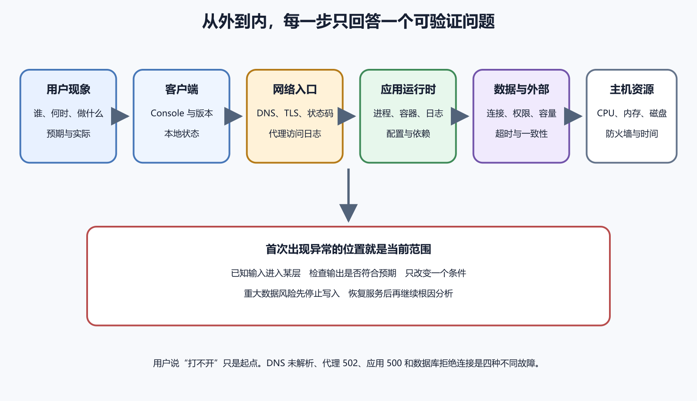

# 从现象到故障层级的统一判断方法

“网站打不开”“App 卡住”“部署失败”都是现象，不是原因。同一句“打不开”，可能来自用户设备断网、DNS 没解析、TLS 证书错误、反向代理找不到上游、容器退出、数据库拒绝连接或磁盘已满。统一排错方法的价值，在于先把问题放到正确层级，再使用对应证据；它不要求你记住每个工具的所有命令，只要求每一步能回答一个明确问题。

*图 59-1　从客户端、网络入口、应用、数据到主机逐层检查，首次出现异常的边界决定下一步。等价说明见本章“把系统画成输入和输出”。*

## 先判断是否需要止损

排错前先看用户和数据是否仍在受伤。若程序不断写坏数据库、重复扣款、公开秘密或删除文件，首要动作是停止相关写入、关闭功能或隔离流量。Google SRE 的排错方法把故障分级与恢复服务放在深入根因分析之前，同时强调保存日志等证据。停止写入会影响可用性，却可能保护不可恢复数据，继续运行只为了观察更多日志，代价可能更大。

一般页面错位、单个测试账号失败或非核心按钮失效，可以在保留现场后正常排查。严重度来自影响范围、数据完整性、安全和可用替代，不来自错误文字有多长。一个便于新手使用的判断顺序是先问数据会不会继续受损，再问秘密是否暴露，然后看影响多少用户、核心功能是否还能使用、是否有安全的临时替代。只要前两项回答为“会”，就应先控制影响，再讨论完整修复。

高风险操作

> 不要在生产事故中先运行清库、重装系统、删除卷、关闭防火墙或清空日志。它们会扩大影响，也会破坏证据。

## 把问题报告变成事实

一份有用起点包含谁受影响、何时发生、执行了什么、预期什么、实际看到什么，以及是否能重复。“用户登录失败”还不够，需要知道所有用户还是一个账号、网页还是 App、哪个版本、密码登录还是第三方登录、发生时间和状态码。这样记录的作用是让接手的人能在不猜背景的情况下找到同一批证据，并非要求维护者填写繁重文书。

时间应使用带时区格式。用户说晚上八点，服务器日志使用 UTC，维护者需要转换到同一时间轴；否则同一次请求会在记录中相差八小时。截图要保留地址栏、状态和时间等必要上下文，并先遮住邮箱、订单、令牌和个人数据。原始错误文字应同时复制为文本，避免只剩一张裁剪图片，无法搜索也无法准确转交。

GitHub Issue 与模板适合把预期、实际、步骤、环境和日志固定下来。模板字段按项目裁剪，不能变成长表格阻止用户反馈。对于正在扩大的事故，还要单独维护一条时间线，记录何时发现、何时止损、谁改了什么以及验证结果。问题报告描述“问题长什么样”，时间线描述“处置过程中发生了什么”，两者不能相互替代。

不知道正常结果，就无法判断哪一层异常。一个健康请求应经过域名解析、TLS、反向代理、应用、数据库，再返回预期状态与内容。记录最近一次正常时间、正常版本、健康检查、响应时间和关键资源，再让新故障与基线比较。若网站首页一直需要三秒，今天三点二秒不一定是事故；若通常两百毫秒，突然三秒就值得查。

基线不能只写“绿色”，因为不同监控面板对绿色的定义可能不同。应写具体 URL、状态码、服务状态、版本、时间和必要的业务结果。例如健康接口返回 200 只能说明进程可以回答，未必说明用户能登录或保存数据；核心路径至少还要有一个不破坏生产数据的业务检查。

## 把系统画成输入和输出

每个组件都接收输入并产生输出。浏览器向代理发送 HTTP 请求，代理向应用转发，应用向数据库查询。给某层一个已知输入，再检查输出是否符合预期，就能把模糊的“系统坏了”拆成可验证的边界。浏览器请求失败时，可以先用同一 URL 检查 DNS 和状态码；代理返回 502，说明请求已经到代理，问题更靠近上游应用。

应用健康但业务接口返回 500，应继续检查请求数据、权限与数据库。数据库查询正常，则问题可能落在应用解析或外部服务。首次从正常变成异常的位置就是当前排查范围，不要从用户页面直接跳到数据库，也不要因过去出过 DNS 问题就先改 DNS。历史经验用于提出假设，当前证据才决定检查方向。

第一层是用户设备，检查其他网站能否打开、系统时间是否准确、应用版本和本地缓存怎样；只有一台设备失败时，先比较设备差异。第二层是 DNS 与网络，检查域名是否解析到预期地址、端口是否可达、TLS 证书是否匹配且有效。第三层是反向代理，查看访问日志有没有收到请求、返回什么状态、上游地址和耗时怎样。Caddy 与 NGINX 都能记录入口请求，但字段与配置不同。

第四层是应用运行时，确认 systemd 服务、Docker 容器或平台实例是否运行，版本与配置是否正确，运行日志是否出现同一请求。第五层是数据库和外部服务，检查连接、认证、权限、容量、锁、超时与配额。第六层是主机，关注磁盘、内存、CPU、时间、文件权限和防火墙。所有服务同时异常时，主机或共同依赖更值得优先检查；只有一个接口异常时，则应先留在应用与数据边界。

层级不是必须从第一层走到第六层的固定流程。已知构建阶段失败时直接看 Build Log，不需要检查生产 DNS；明确只有一台手机失败时，也不必先重启服务器。顺序由现象、影响范围和已有证据决定，图中的层级帮助维护者避免遗漏，不要求机械地逐项执行。

## 范围缩小比猜根因更可靠

比较维度可以快速缩小问题。以下问题不用一次全部回答，选择最能区分正常与异常的两三项即可。

- 一个用户还是所有用户
- 一台设备还是所有设备
- 一个地区还是全球
- 一个浏览器还是全部客户端
- 新版本还是旧版本
- 一个接口还是整个服务
- 读取失败还是写入失败
- 首次安装还是升级安装

若只有新 App build 失败，后端全局故障的可能性会下降。若网页和 App 同时在同一分钟失败，共同 API、域名或数据库更值得先查。相关仍然不等于因果，新版本发布和云平台波动同时发生时，需要实验与日志判断，不能凭时间接近就认定其中一个是根因。

复现是用确定步骤稳定得到同一问题，因此要记录前置账号、数据、设备、版本和网络。第一次复现不要边操作边修，先保存原始错误、请求和日志区间，建立未经修改的基线。问题只在某个用户出现时，应使用脱敏副本或测试账号模拟，不能随意进入用户真实账号修改。

无法稳定复现也能继续排查。记录发生频率与分布，增加安全的日志与关联编号，等待下一次证据，不要编造一个看起来相似的问题当成同一根因。Flutter 官方 Bug report 指南强调环境信息、日志和最小复现，这套材料同样适合内部故障。如果故障低频但损失很大，应优先改进检测与保护措施，不能因为“暂时复现不了”就关闭问题。

## 假设必须能被证伪

“网络有问题”太宽。更好的假设是“反向代理无法连接 127.0.0.1 的 3000 端口，所以返回 502”。这个假设预测三个可观察结果，代理能收到请求，应用端口连接失败，应用日志没有同一请求。检查结果不符时，假设就被削弱，维护者应更新判断，而不是寻找理由保住最初猜测。

先列两三个常见且与证据一致的假设，优先考虑最近变化、共同依赖和首次失败边界，同时保留其他可能。不要一次列二十个理论，每个实验都有时间、风险和解释成本，短列表更容易记录，也更容易让接手者知道哪些方向已经排除。

怀疑环境变量错误，就只修正该变量并重建服务，不要同时升级依赖、换端口、关闭 TLS 和重启数据库。实验前写清假设、动作、预期和回退，实验后记录实际结果。只改一个条件的目的，是让结果能够解释；若同时改了四项，即使恢复也不知道哪一项真正有效，更不知道哪一项引入了新的隐患。

结果支持假设，不等于已经证明唯一根因，修复后还要用原步骤和相邻场景验证。生产实验优先采用只读和低风险方式，需要修改时先在测试环境验证，或限制到一台实例和一个测试账号。可能造成数据变化的实验必须先准备回退与备份，并明确谁有权批准。

## 最近改动是线索，不是结论

查看代码提交、配置、依赖、证书、DNS、平台策略、数据量和流量。没有代码发布，证书到期、密钥轮换、磁盘增长或外部服务策略变化仍会制造故障。建立变更时间线后，故障首次发生在某项变更之前，这项变更就不可能是起因；发生在变更之后，也只表示它可能相关。

Git bisect 可以在有稳定自动测试时二分定位首次坏提交。没有稳定复现时，机械标记 good 与 bad 会产生错误结论。`git blame` 用于理解某行何时、为何变化，不用于责怪提交者，代码经过重构后，显示的人也未必是设计者。排错记录应讨论系统条件和验证证据，避免把“谁提交的”误当作“为什么出错”。

代理有访问日志，应用没有请求日志，说明请求可能没到应用，也可能是应用日志配置失效。应用日志和数据库都没有记录，问题可能发生在客户端、DNS 或代理层；所有层都没有日志，还要考虑时间范围、权限、时区或日志采集本身是否查错。空白不是结论，它只是一个需要验证的观察结果。

可以制造一个不会改动真实数据的测试请求，观察它应该在哪些日志出现，用来验证日志通道是否工作。日志可能轮转，也可能在容器重建后消失，因此应在事故前设置保留时间与磁盘限制，在事故中及时导出相关区间。若为了排错临时提高日志详细度，要限定持续时间，并防止密码、令牌与用户正文进入日志。

## 一个 502 故障的完整判断

用户访问 `https://notes.example.com` 看到 502。DNS 正常，TLS 有效，Caddy 访问日志记录请求并返回 502，这说明用户到代理的路径可以工作。检查上游配置发现目标是 `127.0.0.1:3000`，运行 `ss -lntp` 却没有进程监听 3000。此时问题范围已经从整条互联网链路缩到代理与应用之间。

`systemctl status notes` 显示服务失败，`journalctl -u notes --since` 的第一条有效错误是读取环境文件时权限被拒绝。维护者修正该文件的所有者和最小读取权限，再启动服务。本机访问 3000 返回健康，公网返回 200，登录和写入测试也通过，才构成完整验证。只重启 Caddy 可能仍然得到 502，直接把 3000 端口开放到公网则既没有修复应用启动，又扩大了攻击面。

页面每十次约有一次保存超时，应用进程和代理都正常，数据库日志却在同一关联编号附近显示等待锁。范围由此缩小到某类写入与并发，维护者使用两个测试会话同时修改同一记录，稳定复现了等待。这个实验比“数据库偶尔很慢”更具体，因为它说明触发条件与并发写入有关。

开发者检查事务，发现请求在调用外部邮件服务期间一直持有数据库锁。修复方案把外部调用移到事务提交之后，并加入可安全重试的后台任务。复测相同并发后锁等待消失，还要继续验证邮件失败不会回滚已完成保存，也不会导致重复发送。增加数据库密码权限无法解决这种问题，真正指出事务边界的是同一关联编号下的日志时间线和可重复并发。

## 建立一张可交接的排错记录

个人项目也应保留简洁的排错记录。每轮至少写发生时间、现象与范围、当前假设、使用的证据、执行动作、预期结果、实际结果和下一步。记录不要求成为长篇报告，但要让第二天的自己或临时接手的人知道为什么做过某项操作，避免在压力下反复重启、重复改配置。

例如“14 时 20 分重启了服务”信息不足。更有用的写法是“在 `2026-08-06T14:20:00+08:00`，假设应用因环境文件权限失败而退出。先保存此前二十分钟的 journal，再修正文件所有者并启动。预期 3000 端口恢复监听。实际端口已监听，公网健康接口 200，待验证登录和保存”。RFC 3339 时间戳用数值偏移明确瞬间，避免 CST 这类多义缩写。跨地区安排工作时还可记录 IANA 时区名，例如 `Asia/Shanghai`，它能说明夏令时等地区规则。这段记录把事实、推断、动作和未完成验证分开，也清楚说明了修改位置与结果。

有些检查没有发现异常，也要记下来。“DNS 正常”“磁盘还有 60% 可用”“旧版本同样失败”都能排除方向。不要只记录成功修复的最后一步，否则复盘时会误以为之前的比较和排除没有价值。涉及生产配置时还要附变更编号或 Diff，秘密只记录名称和版本，不复制真实值。

一个人也可以暂时分三个角色思考，第一项负责止损与恢复，第二项收集证据和验证假设，第三项记录时间线并对外沟通。多人团队应指定一位事故协调者，避免每个人同时修改生产。所有操作写清时间、执行者和结果，口头讨论形成决定后也要补到公共记录中。

Google SRE 的事故管理案例强调清楚角色、沟通和状态交接。对外更新应说明已知影响、正在做什么和下一次更新时间，不要把未经验证的根因猜测写成定论。恢复服务后也不要立即清现场，应先保存版本、日志、指标和改动，再安排深入的根因分析。

## 问题消失以后先别急着结案

故障消失以后，最容易犯的错误是立即把最后一次操作认定为根因和修复。页面刷新成功，可能来自缓存过期；服务重启后恢复，可能只是暂时释放了资源；切换网络后正常，也可能恰好避开一次短暂故障。若排错过程中同时改过配置、清过缓存、重启服务和更换账号，最后结果更难归因。

记录这次成功使用的版本、环境、账号、输入和时间。随后重新执行原来的失败步骤，确认问题再次没有出现；再检查一个相邻的正常功能，防止修好一处又碰坏另一处。条件允许时，从干净会话、重启后的服务或新构建产物再验证一次。结果不能重复时，如实记录“现象暂时消失，原因尚未确认”，继续保留日志和监控。

恢复能力还要另行验证。代码回滚成功，不表示数据库、上传文件和外部邮件已经回到原状态；备份任务显示完成，也不表示文件可以读取。高风险系统应在隔离位置做恢复测试，并记录恢复后的查询、文件数量、权限和应用行为。一次能运行的修复，加上可重复的验收和可执行的恢复，才足以支持更高风险的决定。

第一层使用原始复现步骤，确认问题不再出现。第二层测试相邻功能，例如修复登录失败时，注册、退出、令牌刷新和权限也要检查。第三层在真实发布环境验证，因为测试配置正常，不代表生产域名、签名、数据量或网络也正常。每层都要写预期和实际结果，不要用“看起来好了”代替证据。

验证还需要足够的观察窗口。服务刚重启后的五分钟正常，不足以证明内存泄漏已经修复；只测试一次保存成功，也不足以说明间歇性锁等待消失。观察多长时间应根据原问题的发生频率决定，并与修复前基线比较。如果只能先恢复服务而未找到根因，要明确标记“已缓解”，不能写成“已解决”。

## 复盘把一次事故变成维护能力

复盘记录影响、时间线、检测方式、直接原因、放大因素、恢复过程和行动项。“管理员粗心”无法预防重复，更具体的系统缺口可能是环境文件权限没有部署检查、健康检查只看进程、回滚没有自动验证。区分直接触发条件与放大因素也很重要，错误权限可能让服务无法启动，而监控缺失使这个问题直到用户投诉才被发现。

行动项应写负责人、期限和可验证的完成条件。例如“部署后自动请求健康接口，并在非 200 时停止切换流量”，比“加强监控”更能验收。Google SRE 的 Postmortem Culture 资料强调从事故中学习和持续跟进。复盘的目标是让相同触发条件下的系统更早发现、更少受损、更容易恢复，不能停留在寻找一个承担全部责任的人。

两个检查都安全时，优先选择能排除更多范围且更快得到结果的一项。网页和 App 同时失败时，先请求共同 API 往往比重装某一台手机更有信息价值；代理已经返回 502 时，先确认上游端口是否监听，比逐条检查浏览器 CSS 更接近失败边界。这个原则不会保证第一次就找到原因，却能减少无关操作。

检查成本还包括风险、时间和现场破坏。读取状态与限定时间日志通常成本较低，重启会改变进程状态，回滚会切换版本，恢复数据库可能覆盖数据。先做低风险、高区分度的检查；高风险实验需要更强证据、备份、批准和回退。若止损要求立即关闭写入，安全与数据保护仍然优先于信息收集。

排错也需要停止条件。证据不足时可以暂停修改，补充监控或等待下一次安全复现；问题已缓解但根因未明时明确标记状态并安排后续；连续三轮实验都没有改变判断时，应请另一位维护者审阅问题定义和证据。继续重复同一重启或缓存清理，只会消耗时间并让现场更难解释。

修复过的故障最好转成自动回归测试或监控规则。测试重现原触发条件，规则观察用户能够感知的结果，并在注释中引用事故或 Issue 编号。若问题无法自动化，至少把复现和验证加入发布清单，说明何时可以移除。这样做能把一次判断固化为系统能力，同时避免维护清单永久膨胀。

## AI 在排错中的合适位置

AI 可以整理长日志、解释状态码、提出假设和生成实验清单。提供环境、版本、预期、实际和已经尝试的动作，答案才会具体；同时要求它明确区分事实、推断和待验证项，并让每个建议说明风险、执行位置、预期结果与回退。若建议无法说明会看到什么结果，它就还不是一个可验证实验。

不要把生产秘密、完整用户数据和未脱敏日志上传，也不要允许 AI 在没有审批时执行清库、开放防火墙和重置证书。可以先让 AI 处理脱敏后的短日志和配置 Diff，由人确认范围后再执行只读检查。AI 声称找到根因以后，仍要用单变量实验、原始步骤和相邻功能完成验证。

- 已判断是否需要先止损
- 问题报告包含时间、环境、预期和实际
- 已知最后正常基线
- 能指出异常首次出现的层
- 假设能预测可观察结果
- 每次实验只改变一个条件
- 生产修改有回退并保存证据
- 修复经过原步骤、相邻功能和发布环境验证
- 重大事故形成时间线与行动项

这套方法适用于网页、服务器、Docker 和 App。具体日志入口会变，按层缩小与证据验证的逻辑保持稳定。
