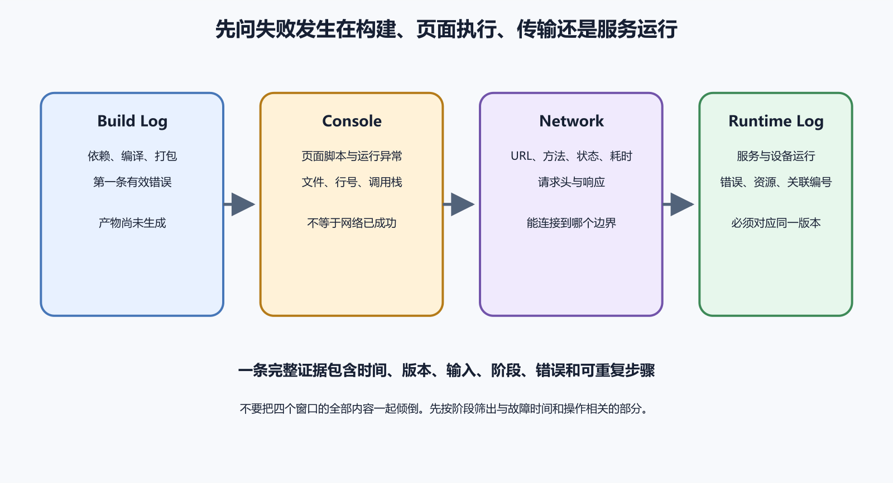

# Console、Network、Build Log 和 Runtime Log

同一个“页面坏了”，证据可能在四个地方。Console 看浏览器或前端运行时错误。Network 看请求有没有发出、返回什么。Build Log 看部署时是否构建成功。Runtime Log 看服务器实际处理请求时发生了什么。把四类日志混在一起，就会出现很荒唐的排查。前端构建失败，却去查数据库。API 返回 500，却一直刷新浏览器缓存。

*图 60-1　Build Log 发生在部署阶段，Console 与 Network 发生在用户设备，Runtime Log 发生在服务端。等价说明见本章“四类证据回答四种问题”。*

## 四类证据回答四种问题

Build Log 回答“这一版有没有成功构建和部署”。它包含依赖安装、构建命令、输出目录、环境变量缺失和平台错误。部署失败时，用户看到的可能仍是旧版本。

Console 回答“前端代码在用户设备上有没有报错”。常见错误包括 JavaScript 异常、资源加载失败、跨域拦截、未处理 Promise 和浏览器兼容问题。它不能证明服务器内部发生了什么。

Network 回答“请求有没有发出，发给谁，返回什么”。状态码、请求 URL、方法、响应体、Headers、耗时和缓存状态都在这里。它是前端与后端之间最重要的桥。

Runtime Log 回答“服务器收到请求后做了什么”。应用异常、数据库错误、第三方 API 超时、权限拒绝和内部告警都可能在这里。它应能通过请求编号和 Network 证据对应起来。

## 保存完整构建上下文

部署失败时先保存 Build Log，不要只复制最后一行。构建日志前面常有真正的原因，例如 Node 版本不匹配、依赖安装失败、环境变量缺失、输出目录写错、构建命令在错误目录运行。最后一行只负责告诉你失败了。

构建上下文至少包括提交号、分支、平台、构建命令、输出目录、运行时版本、环境变量名称和失败时间。不要把环境变量的值贴出来。密钥、令牌和数据库连接串要遮掉。

若平台显示部署成功，仍要确认访问的是哪一次部署。Preview 和 Production 可能不同。自定义域名可能还指向旧项目。CDN 可能缓存旧文件。用户说“我看不到新版本”，先问他打开的是哪个地址，而不是立刻重新部署。

构建成功也要看产物是否正确。静态网站要确认 output directory 指向真实构建目录。前端应用要确认环境变量在构建时已经注入。后端应用要确认启动命令、运行时版本和健康检查。平台显示绿色，只说明它按自己的标准完成了一次任务，不能替你验证业务入口。

如果构建日志里出现依赖弃用、漏洞提示或目标版本警告，不一定立刻阻止发布，但要记录。今天只是警告，下一次平台升级可能变成错误。把这些提醒收进维护清单，比事故当天再读一千行日志轻松。

## Console 先保留现场

清空 Console 之前先截图或复制完整错误。红色错误不一定都是根因，黄色警告也不一定无关。先看第一条错误和触发动作。若错误在点击按钮后出现，它比页面加载时的第三方图标警告更接近问题。

Console 报错要带浏览器、系统、页面地址、时间和操作步骤。压缩后的前端文件可能只显示短变量名。若有 source map，才能更容易对应源码。生产 source map 是否公开，需要安全评估。公开过多源码结构可能增加攻击者信息，完全没有 source map 又会让排错困难。

不要把内部堆栈直接发到公开 Issue。它可能包含路径、接口、用户数据和令牌片段。给 AI 分析时，也要先脱敏。错误类型、调用栈形状和相关代码片段通常够用。

## Network 看请求事实

Network 面板先看请求是否出现。没有请求，问题可能在前端事件、表单校验、按钮禁用或 JavaScript 报错。请求出现但状态码异常，再看服务器和权限。请求发到错误域名，通常是环境配置或部署变量。请求成功但页面没变，可能是前端状态更新、缓存或数据格式。

状态码先按类别理解。2xx 通常表示请求被处理。3xx 指重定向。4xx 多为客户端请求、身份或权限问题。5xx 多为服务器处理失败。它们只是方向，不能机械套结论。401 与 403 要区分登录和授权。404 可能是路径错，也可能是路由没部署。429 表示限流，客户端应退避。

Headers 能定位身份、缓存和跨域。Authorization、Cookie、Set-Cookie、Cache-Control、ETag、Content-Type、Location、CORS 相关字段都值得看。不要公开完整 Cookie 和 Authorization。保存 HAR 文件前先清理敏感信息。

请求体和响应体也要看，但要分场景。表单保存失败时，请求体能说明前端到底发了哪些字段。权限问题时，响应体可能给出业务错误码。生产数据里可能有姓名、地址、订单、聊天和令牌，截图前先换测试账号。给 AI 看时，保留字段名和错误结构，真实值用占位符替换。

跨域错误尤其容易误导。浏览器 Console 报 CORS，不代表服务器完全没收到请求。预检请求、响应头、凭据模式和重定向都可能参与。先看 Network 里 OPTIONS 和真实请求各自返回什么，再去改后端。盲目允许所有来源，会把安全问题带进生产。

## 缓存会让旧内容像发布失败

浏览器缓存、Service Worker、CDN 和应用内部缓存都可能让旧内容继续出现。构建产物已经更新，不代表每个用户马上拿到新文件。判断缓存问题时，比较无痕窗口、强制刷新、不同网络、文件哈希和响应 Headers。

Service Worker 尤其容易让人误判。它可以拦截请求并返回旧资源。PWA 更新策略若设计不清，用户会继续运行旧前端，向新后端发送旧格式请求。排查时看 Application 面板中的 Service Worker 状态、缓存名称和资源版本。

缓存清理只是诊断动作，不是长期方案。真正方案是合理的文件指纹、缓存策略、版本兼容和更新提示。不要让用户每次发布后都手工清缓存。

## Runtime Log 要能对应请求

服务器日志不要只写“error”。至少记录请求方法、路径、状态类别、耗时、关联编号和脱敏用户标识。前端 Network 中能看到请求编号，后端日志中也能搜索到同一个编号，排查就会快很多。

日志级别不是情绪词。Debug 用于开发或短期诊断，Info 记录正常关键事件，Warn 表示可恢复异常，Error 表示请求或任务失败。生产环境长期开 Debug，可能带来费用、隐私和性能问题。事故临时提高日志级别后，要记录撤销时间。

多实例运行时要先确认是哪一台处理请求。平台可能有多个容器、多个区域或多条旧部署。只看一个实例日志，可能刚好看不到失败。日志系统应支持按时间、请求编号、版本和实例过滤。

## 一个保存按钮没反应的例子

用户点击保存按钮，页面没有变化。Console 没有新错误。Network 面板没有 POST 请求。前端继续排查，发现按钮处于 disabled 状态，因为表单校验认为日期为空。日期组件在某浏览器下返回格式不同。根因在前端状态，不在后端。

另一个用户也说保存没反应。这次 Network 出现 POST 请求，返回 500。响应体有请求编号。后端 Runtime Log 中同一编号显示数据库唯一约束冲突。页面没有正确展示错误。这里有两个问题。后端需要处理重复提交，前端需要把错误变成用户能理解的提示。

同一句用户反馈，对应两条不同路径。四类日志让你少凭感觉。

再看一个构建日志案例。开发者修改了环境变量名称，本地 `.env` 已更新，部署平台仍保留旧名称。Build Log 显示变量缺失，平台没有生成新前端包。用户访问生产域名时，看到的仍是上一版。正确处理是更新平台变量，重新部署，并在页面版本信息中确认新提交。反复清浏览器缓存没有用，因为新包从未产生。

运行日志也可能揭示另一种情况。部署成功，Network 返回 200，页面却显示空列表。后端日志显示请求到了错误数据库项目。这里的故障在环境配置，生产前端连到了测试库。证据路径从 Network 的请求编号一路追到后端环境。

## 前后端各说成功时怎么办

有时前端说保存成功，后端也返回 200，用户却看不到新数据。先看返回体里有没有新记录 ID，再看前端是否把响应写入状态。随后刷新页面，确认后端再次读取时是否返回同一条记录。若刷新后消失，问题可能在数据库写入、事务或读写库延迟。若刷新后存在，问题可能在前端状态或缓存。

还有一种情况相反。后端日志显示处理成功，浏览器 Network 却超时。可能是响应太慢、代理超时、客户端先断开，或网络中间层中断。后端已经完成的操作不能因为客户端超时就随意重试。付款、下单和删除要先查询状态，再决定补发。

跨域、缓存和重定向也会让“成功”变得模糊。请求返回 302 到登录页，前端代码把 HTML 当 JSON 解析失败。CDN 返回旧 JSON，后端日志根本没收到请求。Service Worker 返回缓存，Network 看起来成功，却没有访问服务器。此时要同时看响应体、Headers 和服务端是否有同一请求编号。

## 生产日志的保留和删除

日志要有保留期。保留太短，事故调查找不到证据。保留太长，费用和隐私风险增加。登录、付款、删除、上传和管理员操作日志通常比普通访问日志更重要。保留策略要写清时间、访问人、脱敏方式和删除办法。

临时导出的日志也要处理。发给开发者、供应商或 AI 前要脱敏。排查结束后，临时文件从共享目录、工单附件和个人电脑里清理。很多泄露发生在事故调查期间，到处复制的日志包比生产系统本身更难追踪。

## 请求编号怎样设计

请求编号可以由前端生成，也可以由代理或后端生成。关键是同一次用户动作在各层使用同一个编号。浏览器 Network 里能看到，后端日志能搜索到，数据库慢查询或外部 API 调用也能间接对应。没有编号时，排查只能靠时间和路径猜。

编号不应包含用户身份、手机号、订单金额和业务秘密。它只是定位用的随机标识。错误页面可以显示短编号，例如 `ERR-7K2Q9`。用户把它发给客服，客服再到日志系统查完整请求。这样用户不用看见堆栈，维护者也能找到证据。

如果系统还没有请求编号，先从后端入口加起。每个请求进入时生成一个 ID，写入响应头和日志。前端收到错误时展示这个 ID。后续再让代理、队列和外部调用一起携带。不要等整个观测系统完美以后才开始做，先让最常见的故障能对上。

## HAR 文件和过滤器

HAR 文件会保存请求列表、URL、Headers、状态、耗时和部分响应。它适合交给开发者复现网络问题，也可能包含 Cookie、令牌、邮箱、订单号和用户数据。导出前最好重新登录测试账号，避免带出真实用户信息。公开分享前做脱敏。

控制台过滤器可能隐藏真正错误。只看 Fetch/XHR 会漏掉脚本、图片、字体和预检请求。只看 Error 会漏掉警告中的跨域线索。排查早期先保留完整视图，等方向明确后再过滤。

[第 19 章的 DevTools 视频提示](019-浏览器开发者工具-状态码和网络请求.md)已经给出 B 站主入口和练习任务。本章不重复推荐另一段内容相近的视频。把注意力放在四类证据之间的关系上。Build Log 说明部署，Console 说明前端运行，Network 说明请求边界，Runtime Log 说明服务端处理。
